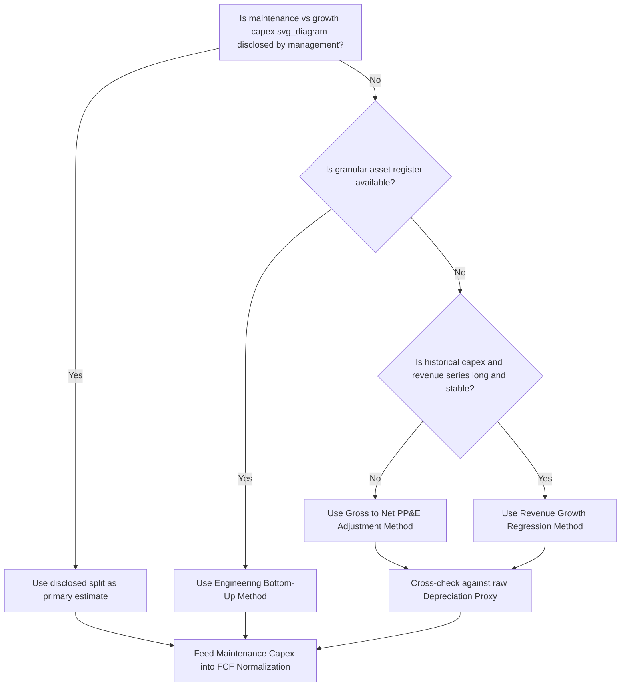

## Maintenance Capex Estimation Techniques

### Conceptual Overview

Maintenance capex (also called sustaining or replacement capex) is the portion of total capital expenditure required to keep existing assets operating at their current productive capacity, as distinct from growth capex, which expands capacity or output. Separating the two is essential for calculating normalized free cash flow, understanding true reinvestment needs, and assessing whether a company's reported capex is sustainable relative to its depreciation and asset base.

The core difficulty is that companies rarely disclose a clean maintenance/growth split in financial statements, so analysts must estimate it using proxy techniques. Each technique carries different assumptions and biases, and results can diverge significantly, so triangulating across multiple methods is standard practice.

### Why the Distinction Matters

- **Free cash flow normalization**: Growth capex is discretionary and can be deferred without immediately impairing operations; maintenance capex generally cannot be deferred indefinitely without asset degradation, so treating all capex identically overstates or understates "true" distributable cash flow depending on the growth phase of the business.
- **Valuation**: In a DCF, terminal-value capex assumptions typically converge toward maintenance-capex-like behavior (capex ≈ depreciation) since a mature company is assumed to no longer be adding net capacity.
- **Credit analysis**: Lenders and rating agencies use maintenance capex estimates to assess whether a company can service debt after covering the capex required simply to stay in business.

### Estimation Technique 1: Depreciation as a Proxy

The simplest approach assumes:

$$\text{Maintenance Capex} \approx \text{Depreciation Expense}$$

**Rationale**: Depreciation represents the accounting allocation of historical asset cost over useful life, so in a steady-state business (no growth, no inflation, replacing assets at the same cost as they were originally purchased), capex to replace worn-out assets should roughly equal the depreciation being recognized.

**Limitations**:

- Depreciation is based on historical cost, while replacement capex is based on current (often inflated) replacement cost, so this proxy systematically understates true maintenance capex during inflationary periods.
- Depreciation schedules (straight-line, accelerated) may not track the actual physical wear or replacement timing of assets.
- **[Inference]** This method works best as a rough floor estimate or first-pass sanity check, not a precision tool, particularly for capital-intensive industries with long asset lives where replacement cost inflation compounds over decades.

### Estimation Technique 2: The "Old Capex" or Vintage/Aged-Asset Method

Developed and popularized in equity research (notably by analysts like Aswath Damodaran), this method scales depreciation by the ratio of gross to net PP&E, capturing embedded replacement-cost inflation:

$$\text{Maintenance Capex} = \text{Depreciation} \times \frac{\text{Gross PP\&E}}{\text{Net PP\&E}}$$

**Rationale**: Gross PP&E reflects historical cost of all assets still on the books; Net PP&E is gross minus accumulated depreciation. The ratio approximates how "old" the asset base is — a higher ratio (more accumulated depreciation relative to gross) implies assets are older and closer to replacement, and adjusts the depreciation figure upward to proxy for the higher replacement cost of aging assets.

**Limitations**:

- Assumes uniform inflation and useful-life assumptions across the whole asset base, which may not hold for companies with mixed asset types (e.g., long-lived buildings vs. short-lived equipment).
- Sensitive to M&A activity, which resets gross PP&E through purchase accounting and can distort the ratio.

### Estimation Technique 3: Revenue Growth Decomposition (Capex Split by Growth Rate)

This method uses the historical relationship between capex and revenue growth to infer what portion of capex is tied to growth versus maintenance, often via regression or a simple two-point estimate:

$$\text{Capex}_t = \alpha + \beta \times (\text{Revenue Growth}_t)$$

Where $\alpha$ (the intercept) is interpreted as the maintenance capex level (capex that would occur even at zero revenue growth), and $\beta$ captures the incremental capex associated with each percentage point of growth.

**Application**: Regress historical capex (as % of revenue or in absolute terms) against historical revenue growth rates across several years or peer companies; the model's implied capex at 0% growth is the maintenance capex estimate.

**Limitations**:

- Requires a sufficiently long and stable historical data series; noisy or cyclical capex patterns (large discrete projects) distort the regression.
- Assumes a linear relationship between growth and capex, which conflicts with the lumpy, threshold-driven capex behavior described in capacity-utilization-based models.
- **[Inference]** Best suited to industries with more continuous, smaller-ticket capex (retail, restaurants, distribution) rather than industries with large discrete capacity additions (semiconductors, utilities).

### Estimation Technique 4: Management Disclosure and Segmented Guidance

Many capital-intensive companies (utilities, telecoms, oil & gas, airlines, miners) explicitly disclose a maintenance/sustaining vs. growth/expansionary capex split in earnings materials, investor presentations, or MD&A sections of filings, since this distinction is materially relevant to their investors.

**Application**: Use disclosed figures directly when available and use the analyst's own estimation techniques primarily to sanity-check, extend, or bridge periods where disclosure is unavailable (e.g., forecast years beyond current guidance).

**Limitations**:

- Company-defined categories are not standardized across firms or audited under a single consistent definition, so cross-company comparability requires care.
- **[Unverified]** Management incentives may bias the disclosed split (e.g., under-classifying capex as "maintenance" to make underlying earnings appear more resilient, or over-classifying as "growth" to justify capex to investors as value-accretive) — this is a judgment risk analysts should be alert to rather than a documented universal pattern.

### Estimation Technique 5: Engineering / Asset-Life Bottom-Up Method

For asset-heavy industries with well-defined useful lives (fleets, pipelines, plants), maintenance capex can be built bottom-up from an asset register:

$$\text{Maintenance Capex}_t = \sum_{i} \frac{\text{Replacement Cost}_i}{\text{Useful Life}_i}$$

Summed across each asset class $i$ (vehicles, machinery, buildings, IT infrastructure), using current replacement cost rather than historical cost.

**Application**: Most rigorous method, commonly used internally by corporate finance/FP&A teams and in infrastructure/project finance modeling, since it directly ties to a maintained fixed-asset register and replacement schedule.

**Limitations**:

- Requires granular internal data (asset register, replacement cost estimates, remaining useful life by asset) generally unavailable to external analysts.
- Time-intensive to build and maintain relative to the top-down proxy methods.

### Comparison of Methods

| Method | Data Required | Precision | Best Fit |
| --- | --- | --- | --- |
| Depreciation proxy | Income statement only | Low | Quick screens, low-inflation environments |
| Gross/Net PP&E adjustment | Balance sheet + income statement | Medium | General equity research, cross-sectional comparisons |
| Revenue growth regression | Historical capex + revenue series | Medium | Continuous, smaller-ticket capex industries |
| Management disclosure | Company filings/guidance | High (if available) | Utilities, telecom, energy, transport |
| Engineering bottom-up | Internal asset register | Highest | Internal FP&A, infrastructure/project finance |

### Worked Example: Gross/Net PP&E Method

Assume:

- Depreciation expense: $120 million
- Gross PP&E: $2,400 million
- Net PP&E: $960 million

$$\text{Maintenance Capex} = 120 \times \frac{2400}{960} = 120 \times 2.5 = \$300\text{ million}$$

If the company's total reported capex for the year was $450 million, the implied growth capex is:

$$\text{Growth Capex} = 450 - 300 = \$150\text{ million}$$

**Key Points**

- The gross/net ratio of 2.5x indicates the asset base is significantly depreciated, implying meaningful replacement-cost inflation embedded in the maintenance capex estimate versus the raw depreciation figure.
- This split ($300M maintenance / $150M growth) can then feed into a normalized FCF calculation or a forward capex model where growth capex is separately linked to capacity/demand triggers.

### Application in Financial Modeling

**Historical normalization**: Apply one or more of the above methods across 3–5 historical years to establish a maintenance capex trend line, checking for consistency and stability.

**Forecast period**:

- Maintenance capex is typically projected to grow with the existing (not incremental) asset base — often approximated as growing in line with inflation or with the depreciation of the current asset base — since it reflects like-for-like replacement, not new capacity.
- Growth capex is projected separately, ideally using the capacity-utilization/demand-driven framework, and the two streams are summed for total capex.

**Terminal value / long-run assumptions**: In perpetuity or terminal-year DCF assumptions, it is common practice to set:

$$\text{Capex}_{\text{terminal}} \approx \text{Depreciation}_{\text{terminal}}$$

reflecting the assumption that a mature company reinvests only enough to sustain, not expand, its asset base. **[Inference]** Some practitioners instead grow terminal capex slightly above depreciation to reflect ongoing modest replacement-cost inflation, though the depreciation-parity convention remains the more common simplifying assumption in standard DCF templates.

### Common Pitfalls

- Using the raw depreciation-as-proxy method in inflationary or long-asset-life industries without adjustment, materially understating true reinvestment needs.
- Applying a single blended capex-to-revenue ratio without separating maintenance and growth components, which produces distorted forecasts during periods of capacity expansion or contraction.
- Ignoring M&A-driven distortions to the gross/net PP&E ratio (acquired assets are recorded at fair value, not historical cost, resetting the ratio in ways unrelated to organic asset aging).
- Treating company-disclosed maintenance/growth splits as objectively audited figures rather than management-defined categorizations that may vary in definition year to year or company to company.

### Diagram: Maintenance Capex Estimation Decision Flow (svg_diagram)

### Related Topics

- Free cash flow normalization and its use in valuation multiples
- Growth capex modeling via capacity utilization triggers
- Depreciation methodology selection and its effect on gross/net PP&E ratios
- Replacement cost estimation and inflation adjustment techniques
- Asset register management and useful-life assumption setting
- Terminal value construction in DCF models
- Credit analysis use of maintenance capex in debt service coverage ratios
- Cross-company comparability adjustments for M&A-driven PP&E distortions