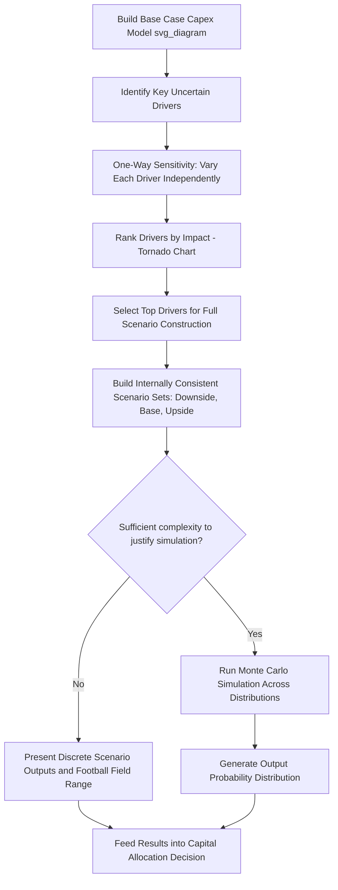

## Scenario and Sensitivity Analysis for Capex Plans

### Conceptual Overview

Capex plans are built on forward-looking assumptions — demand growth, commodity prices, financing costs, regulatory approvals, construction timelines — each of which carries meaningful uncertainty. Scenario and sensitivity analysis are the two primary techniques used to stress-test a capex plan against that uncertainty, revealing not just a single "expected" outcome but a range of plausible outcomes and the specific drivers that matter most.

The two techniques are related but distinct in method and purpose:

- **Sensitivity analysis** isolates one variable at a time, holding all others constant, to measure the impact of that variable alone on an output (e.g., NPV, FCF, capex spend). It answers: "how much does the output change per unit change in this one input?"
- **Scenario analysis** changes multiple variables simultaneously in internally consistent combinations (e.g., a "recession scenario" that lowers demand growth, raises financing costs, and delays regulatory approval together) to answer: "what does the output look like under this coherent alternative world?"

Both are essential because capex decisions are typically large, irreversible, and made years before their outcomes are known, making the cost of a wrong assumption high relative to smaller, more reversible operating decisions.

### Why Capex Plans Require Both Techniques

- **Irreversibility**: Once capital is committed to a plant, pipeline, or fleet, it cannot generally be redeployed without significant loss, so understanding downside scenarios before committing capital is more valuable than for reversible spending decisions.
- **Long lead times**: Capex decisions are often made 2–10 years before the asset generates full value, during which demand, pricing, and financing conditions can shift substantially.
- **Threshold/trigger dynamics**: As covered in capacity-utilization-driven capex modeling, small changes in growth assumptions can shift the *timing* of a capex trigger by a full year or more, making the plan highly sensitive near threshold points specifically.
- **Capital allocation competition**: Most companies have more candidate capex projects than available capital; sensitivity/scenario outputs (e.g., NPV distributions, breakeven points) are used to rank and prioritize among competing projects.

### Sensitivity Analysis Techniques

**1. One-way (single-variable) sensitivity**

Vary one input across a defined range while holding all others at base case, and observe the output.

$$\Delta \text{Output} = f(\text{Base Case} + \Delta \text{Input}_i) - f(\text{Base Case})$$

Typical variables tested for capex plans: revenue growth rate, unit capex cost ($/unit of capacity), construction lead time, discount rate (WACC), commodity/input cost inflation, utilization threshold assumption.

**Output presentation**: Often shown as a **tornado chart**, ranking variables by the magnitude of their impact on the output (e.g., NPV), from largest swing at top to smallest at bottom, making it visually clear which 2–3 assumptions actually drive the result.

**2. Two-way (data table) sensitivity**

Vary two inputs simultaneously across a grid, typically implemented in spreadsheet models via a two-variable data table, producing a matrix of output values.

Common pairings for capex analysis: revenue growth rate × discount rate; unit capex cost × capacity utilization threshold; construction lead time × demand growth rate.

**Worked Example — Two-Way Sensitivity Table (NPV, $M)**

| Growth Rate ↓ / Discount Rate → | 8% | 10% | 12% |
| --- | --- | --- | --- |
| 4% | 145 | 98 | 62 |
| 6% | 210 | 152 | 105 |
| 8% | 288 | 218 | 158 |

**Key Points**

- Reading across a row shows sensitivity to discount rate at a fixed growth assumption; reading down a column shows sensitivity to growth at a fixed discount rate.
- The breakeven point (NPV = 0) can often be located by interpolation within or near the grid, informing management of the "worst combination" the project can tolerate before value destruction.

**3. Breakeven / goal-seek analysis**

Solve for the specific value of one input that makes the output equal a target threshold (commonly NPV = 0, or IRR = WACC).

$$\text{Solve for } x \text{ such that } NPV(x) = 0$$

**Application**: Answers a distinct and often more decision-relevant question than a fixed sensitivity range — e.g., "how far can utilization growth fall short of forecast before this capacity expansion destroys value?" — directly identifying the margin of safety in the plan.

**4. Elasticity / percentage sensitivity**

Expresses sensitivity as an elasticity coefficient — the percentage change in output per percentage change in input — allowing comparison of impact magnitude across variables measured in different units:

$$E = \frac{\% \Delta \text{Output}}{\% \Delta \text{Input}}$$

### Scenario Analysis Techniques

**1. Discrete scenario sets (Base / Upside / Downside)**

The most common approach: construct 3 (sometimes 5) internally consistent narrative scenarios, each with a full, coherent set of assumption changes rather than a single isolated variable.

| Driver | Downside | Base | Upside |
| --- | --- | --- | --- |
| Demand growth | 2% | 6% | 10% |
| Unit capex cost | +15% (input cost inflation) | Base | -5% (scale/learning curve) |
| Construction lead time | +6 months (permitting delay) | Base | On schedule |
| Financing cost (WACC) | +150 bps | Base | -50 bps |
| Utilization threshold breach timing | Delayed 1 year (demand shortfall) | Base | Accelerated 1 year |

**Rationale for internal consistency**: A downside demand scenario often correlates with looser capital markets and lower financing costs in some macro regimes, or with tighter credit and higher financing costs in others — the scenario architect must decide which correlated combination is being modeled and hold it consistent across all variables, rather than arbitrarily mixing best-case and worst-case values for different drivers within the same scenario.

**2. Monte Carlo simulation**

Rather than a small number of discrete scenarios, assign probability distributions to key uncertain inputs (e.g., demand growth ~ Normal($\mu=6\%$, $\sigma=2\%$), unit capex cost ~ Triangular(min, mode, max)) and run thousands of iterations, each drawing random values from the specified distributions, to produce a full probability distribution of the output (e.g., NPV) rather than discrete point estimates.

**Output**: Typically presented as a histogram or cumulative distribution function of NPV, allowing statements like "there is an 80% probability NPV exceeds $50M" rather than a single deterministic figure.

**[Inference]** Monte Carlo approaches are more common in larger, more sophisticated capital planning functions (e.g., oil & gas, mining, utilities, project finance) given the modeling complexity and specialized software (e.g., @RISK, Crystal Ball, or custom Python/R simulations) typically required, relative to simpler discrete scenario approaches used more broadly.

**3. Real options framing**

Frames capex decisions as options rather than fixed commitments — the option to delay, expand, contract, or abandon a project as new information arrives. This reframes scenario analysis around decision points and flexibility value rather than a single static go/no-go decision at time zero.

**[Inference]** This is a more advanced and less universally adopted technique than discrete scenarios or Monte Carlo, most commonly applied in industries with staged capital deployment (e.g., mining exploration-to-production phases, pharmaceutical plant buildout tied to drug approval stages, phased data center buildouts) where management genuinely retains meaningful decision flexibility at defined checkpoints.

### Structuring a Sensitivity/Scenario Model in Practice

**Separate the assumption layer from the calculation layer**: Best-practice financial models isolate all key drivers (growth rates, cost assumptions, thresholds) in a dedicated inputs/assumptions section or sheet, referenced by formula throughout the rest of the model, rather than hardcoding values inside calculation cells. This allows a single input change to flow through consistently for both one-way sensitivities and full scenario switches.

**Use a scenario switch/selector**: A common spreadsheet pattern uses a single input cell (e.g., a dropdown or index number selecting "1 = Downside, 2 = Base, 3 = Upside") combined with lookup functions (`CHOOSE`, `INDEX/MATCH`) to pull the correct full set of assumptions for each scenario, ensuring internal consistency is enforced structurally rather than manually.

**Automate one-way tables with data tables or driver loops**: Spreadsheet data tables (or, in code-based models, a simple loop over a parameter range) recalculate the full model for each input value and store outputs in a table without manually re-entering values.

**Document assumption sources and rationale**: Because scenario analysis outputs are only as credible as the assumptions behind them, each scenario's key drivers should be traceable to a stated rationale (e.g., "downside growth of 2% based on the trailing 10-year low in comparable market") rather than presented as unexplained numbers.

### Interpreting and Communicating Results

- **Tornado charts** for one-way sensitivities communicate *which* assumptions matter most, guiding where additional diligence or hedging effort should be focused.
- **Scenario tables/football fields** (a range bar showing base/downside/upside outputs side by side) communicate the *range* of plausible outcomes for a go/no-go or capital allocation decision.
- **Probability-weighted expected value**, where feasible, combines scenario outputs with assigned probabilities:

$$E[\text{NPV}] = \sum_{i} P_i \times \text{NPV}_i$$

**[Inference]** Assigning explicit probabilities to discrete scenarios is inherently subjective and should be treated as a communication and prioritization aid rather than a precise statistical estimate, particularly for capex decisions with limited historical analogues.

### Common Pitfalls

- Treating sensitivity analysis (one variable at a time) as sufficient on its own — it does not capture correlated, compounding effects across variables the way scenario analysis does, and can understate true downside risk when several adverse factors move together.
- Building scenarios that mix inconsistent assumption combinations (e.g., pairing worst-case demand with best-case financing costs) without an explicit macro or business rationale for that pairing.
- Over-relying on a narrow band of scenarios (e.g., only ±10% around base case) that fails to capture genuine tail risk relevant to large, irreversible capex commitments.
- Failing to re-link scenario outputs back to the capacity-utilization/trigger-timing logic — a downside demand scenario should shift *when* a capacity threshold is breached, not just the magnitude of capex in a fixed year, since the trigger-based nature of capex means timing shifts are often the dominant driver of value differences across scenarios.
- Presenting Monte Carlo or scenario outputs with false precision (e.g., "NPV is $142.37M") when the underlying input uncertainty does not support that level of specificity.

### Diagram: Scenario vs. Sensitivity Analysis Workflow (svg_diagram)

### Related Topics

- Capacity-utilization-driven capex trigger modeling
- Maintenance vs. growth capex estimation techniques
- Monte Carlo simulation methods and distribution selection
- Real options valuation for staged capital projects
- Capital rationing and project ranking frameworks
- WACC estimation and its role as a discount rate driver
- Tornado chart and football field chart construction
- Probability-weighted decision analysis in capital budgeting