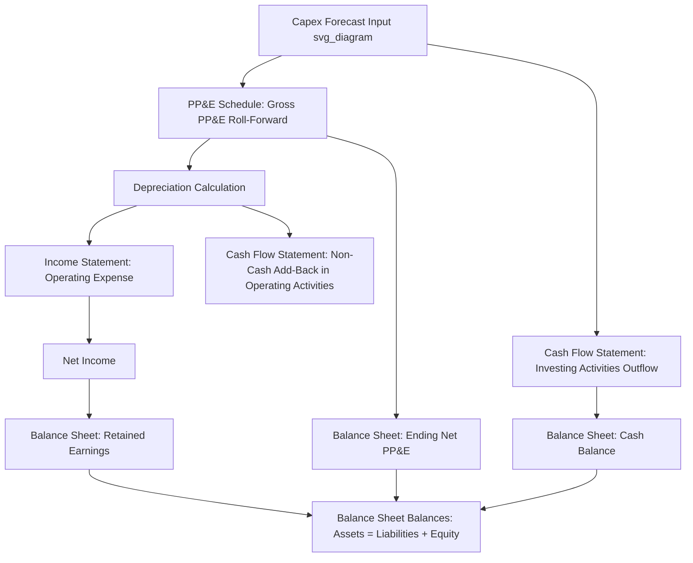

## Integrating Capex into Three-Statement Models

### Conceptual Overview

A three-statement model links the income statement, balance sheet, and cash flow statement into a single dynamic system in which a change in one statement automatically propagates to the others. Capex is one of the most structurally important links in this system: it flows through all three statements simultaneously — reducing cash on the balance sheet, building the PP&E balance, and generating depreciation that reduces net income on the income statement in future periods — and if modeled incorrectly, is one of the most common sources of balance sheet imbalance ("the model doesn't balance") in practice.

Correctly integrating capex requires building a supporting PP&E (property, plant & equipment) schedule that connects the capex assumption (however it was derived — percent-of-revenue, utilization-driven, or maintenance/growth split) to depreciation, the cash flow statement, and the balance sheet in a consistent, circularly-linked structure.

### The Three Statement Linkages

**1. Cash Flow Statement (Investing Activities)**

Capex appears as a cash outflow in the investing activities section:

$$\text{Cash Flow from Investing} = -\text{Capex} + \text{Asset Disposals/Proceeds} - \text{Other Investing Items}$$

This is the direct, immediate cash impact of the capex decision.

**2. Balance Sheet (PP&E, Net)**

Capex increases gross PP&E; depreciation reduces net PP&E over time. The PP&E roll-forward is:

$$\text{Ending Net PP\&E}_t = \text{Beginning Net PP\&E}_t + \text{Capex}_t - \text{Depreciation}_t - \text{Disposals}_t (\text{net of accumulated depreciation})$$

The cash balance on the balance sheet is reduced by the same capex amount that flowed through the cash flow statement, which is what keeps the balance sheet in balance.

**3. Income Statement (Depreciation Expense)**

Capex does not hit the income statement directly (it is a capitalized cost, not an expense). Instead, it generates depreciation expense in current and future periods according to the chosen depreciation method and useful life assumption, which flows through operating expenses (COGS or SG&A, depending on asset type) and reduces net income.

### The PP&E Schedule (Supporting Schedule)

The PP&E schedule is the standard mechanism used to manage this linkage cleanly, typically built as follows:

| Line Item | Formula / Source |
| --- | --- |
| Beginning Gross PP&E | Prior period ending gross PP&E |
| (+) Capex | From capex forecast (revenue-driven, utilization-driven, or maintenance/growth split) |
| (–) Disposals (gross) | From asset retirement/disposal schedule, if modeled |
| Ending Gross PP&E | Beginning + Capex – Disposals |
| Beginning Accumulated Depreciation | Prior period ending accumulated depreciation |
| (+) Depreciation Expense | Straight-line, declining balance, or units-of-production method |
| (–) Accumulated Depreciation on Disposals | Removed when an asset is disposed |
| Ending Accumulated Depreciation | Beginning + Depreciation – Disposals' accumulated depreciation |
| Ending Net PP&E | Ending Gross PP&E – Ending Accumulated Depreciation |

This schedule is built once, then referenced by all three statements: the capex line feeds the cash flow statement, the depreciation line feeds the income statement, and the ending net PP&E line feeds the balance sheet.

### Depreciation Method Selection

**Straight-line**: Most common in financial modeling for its simplicity and predictability:

$$\text{Annual Depreciation} = \frac{\text{Depreciable Cost}}{\text{Useful Life}}$$

**Declining balance (accelerated)**: Front-loads depreciation expense; less common in standard operating models but relevant for tax-basis modeling (e.g., MACRS in the U.S.) where book and tax depreciation are tracked separately:

$$\text{Depreciation}_t = \text{Net Book Value}_{t-1} \times \text{Depreciation Rate}$$

**Units-of-production**: Ties depreciation to actual usage/output rather than time, more precise for asset-intensive industries (mining equipment, manufacturing lines) where wear correlates with utilization rather than calendar time:

$$\text{Depreciation}_t = \frac{\text{Depreciable Cost}}{\text{Total Estimated Units}} \times \text{Units Produced}_t$$

**[Inference]** Most general-purpose corporate models default to straight-line for simplicity and because it is the most common method used for book (GAAP/IFRS) financial reporting, reserving units-of-production or accelerated methods for specialized asset-heavy or tax-focused models.

### Book vs. Tax Depreciation (Deferred Taxes)

When book depreciation (used for the income statement shown to investors) differs from tax depreciation (used to calculate actual cash taxes paid, often accelerated under rules like MACRS), a **deferred tax liability** is created, which must also be modeled to keep the three statements consistent:

$$\text{Deferred Tax Liability Change} = (\text{Tax Depreciation} - \text{Book Depreciation}) \times \text{Tax Rate}$$

This deferred tax adjustment appears as a non-cash add-back in the cash flow statement (operating activities) and as a balance sheet liability, ensuring cash taxes paid (lower, due to higher tax depreciation) versus book tax expense (higher, based on lower book depreciation) are correctly reconciled.

### Handling the Capex–Depreciation Circularity

A structural modeling challenge: depreciation for new capex added in the current period sometimes depends on assumptions (e.g., mid-year convention) that reference the capex amount itself, and in more complex models, depreciation can affect net income, which affects retained earnings, which affects the balance sheet, which in some setups affects financing needs and interest expense (via a cash flow sweep or revolver), which circles back to the income statement — creating true circularity.

**Common approaches to manage circularity**:

- **Mid-year/half-year convention**: Assume new capex is placed in service at the midpoint of the period, so it only accrues half a year of depreciation in its first year — a standard simplifying convention that avoids needing to model exact in-service dates.
- **Circularity switch**: A common spreadsheet pattern uses an `IF` statement tied to a manual toggle cell (e.g., `IF(circularity_switch=1, actual_formula, 0)`) that can be flipped to break circular reference errors during model construction, then re-enabled once the model is stable, combined with enabling iterative calculation in the spreadsheet settings.
- **Iterative calculation settings**: Most spreadsheet software (e.g., enabling iterative calculation with a defined maximum iteration count and change threshold) can resolve genuine circular references algorithmically, though this requires care to ensure the model converges rather than oscillates or errors.

**[Inference]** In code-based models (Python, R), circularity is more commonly resolved by explicit iterative solvers or by restructuring the calculation into a sequential, non-circular flow (e.g., calculating financing needs based on prior-period cash balances rather than current-period ones) rather than relying on spreadsheet-style iterative recalculation.

### Worked Example: Flowing Capex Through the Three Statements

Assume Year 1 assumptions:

- Beginning Net PP&E: $500M
- Capex (from utilization-driven forecast): $80M
- Depreciation (straight-line, 10-year average useful life on gross base): $60M
- No disposals

**PP&E Schedule**:

$$\text{Ending Net PP\&E} = 500 + 80 - 60 = \$520\text{M}$$

**Cash Flow Statement**:

- Investing activities: –$80M (capex outflow)
- Operating activities: +$60M (depreciation added back as a non-cash expense)

**Income Statement**:

- Depreciation expense of $60M reduces EBIT (and downstream, net income) relative to a no-capex scenario.

**Balance Sheet**:

- Net PP&E increases by $20M ($80M capex minus $60M depreciation)
- Cash decreases by $80M (the full capex outflow) net of financing/operating cash flow effects elsewhere in the model
- Retained earnings decreases by the net income impact of the $60M depreciation expense (net of tax effects)

**Key Points**

- Capex ($80M) and depreciation ($60M) are different figures with different statement destinations — capex hits cash/investing and the balance sheet directly; depreciation hits the income statement and is added back as non-cash in the operating section of the cash flow statement.
- The balance sheet balances because the net PP&E increase (+$20M) combined with the cash decrease (–$80M) and the depreciation-driven retained earnings decrease are all internally consistent outputs of the same underlying capex and depreciation assumptions.

### Debugging Balance Sheet Imbalances Related to Capex

Common sources of a model not balancing, specifically traceable to capex/PP&E integration:

- Capex flowing to the cash flow statement but not to the PP&E schedule (or vice versa) — the two must reference the same source figure.
- Depreciation calculated in the PP&E schedule but not linked to (or double-counted in) the income statement's operating expense line.
- Disposals removing gross PP&E without correspondingly removing the associated accumulated depreciation, distorting the net PP&E calculation.
- Capex timing mismatches — e.g., capex recorded in the cash flow statement in the period cash is spent, while the PP&E schedule assumes assets are placed in service (and start depreciating) in a different period, without the model explicitly reconciling construction-in-progress (CIP) versus in-service assets.

### Construction-in-Progress (CIP) Modeling

For capex with meaningful construction lead time (as discussed in capacity-driven capex modeling), a **CIP schedule** separates cash spent on assets not yet placed in service from assets actively in service and depreciating:

$$\text{Ending CIP}_t = \text{Beginning CIP}_t + \text{Capex Spend}_t - \text{Transfers to In-Service PP\&E}_t$$

CIP itself does not depreciate; depreciation only begins once an asset transfers from CIP to in-service gross PP&E. This distinction matters for multi-year capex projects (large plants, infrastructure) where cash outflows precede any depreciation or capacity benefit by several periods.

### Integration Checklist

**Key Points**

- Confirm the capex figure used in the cash flow statement matches the capex figure used as the input to the PP&E schedule (single source of truth).
- Confirm depreciation calculated in the PP&E schedule is the same figure flowing to both the income statement (as an expense) and the cash flow statement (as a non-cash add-back).
- Confirm disposals (if modeled) reduce gross PP&E, accumulated depreciation, and generate any associated gain/loss on the income statement consistently.
- Confirm deferred tax adjustments are included if book and tax depreciation diverge.
- Confirm CIP is used (rather than immediate in-service treatment) for any capex with meaningful construction lead time.
- Confirm the balance sheet balances (Assets = Liabilities + Equity) after all capex/depreciation linkages are built — this is the ultimate integration check.

### Diagram: Capex Flow Through the Three Statements (svg_diagram)

### Related Topics

- Capacity-utilization-driven capex trigger modeling
- Maintenance capex estimation techniques
- Construction-in-progress (CIP) accounting and multi-period capex projects
- Deferred tax liability modeling from book/tax depreciation differences
- Circular reference management in financial models
- Depreciation method selection (straight-line, declining balance, units-of-production)
- Cash flow sweep and revolver mechanics in fully integrated models
- Scenario and sensitivity analysis for capex plans