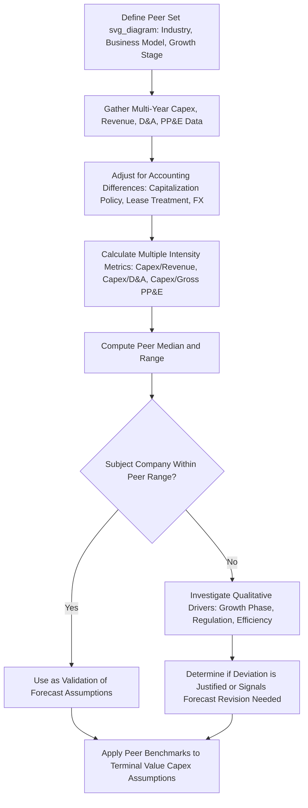

## Capex Intensity Benchmarking Against Peers

### Conceptual Overview

Capex intensity benchmarking compares a company's capital spending relative to its scale (typically revenue, but also assets or output) against a peer set, to assess whether its investment level is unusually high, low, or in line with industry norms. This benchmarking serves multiple purposes: validating the reasonableness of a company's own forward capex forecast, identifying competitive positioning (under- or over-investment relative to rivals), and informing valuation judgments about sustainable free cash flow generation.

Because capital intensity varies enormously across industries — a software company may spend under 3% of revenue on capex while a telecom or utility may spend 15–25% — benchmarking is only meaningful within a carefully selected peer group of companies with genuinely comparable business models, asset bases, and growth stages.

### Core Benchmarking Metrics

**1. Capex-to-Revenue Ratio**

The most common and simplest intensity metric:

$$\text{Capex Intensity} = \frac{\text{Capex}}{\text{Revenue}}$$

Used for quick cross-sectional comparison, though it can be distorted by short-term revenue volatility (a temporary revenue dip inflates the ratio even with unchanged capex spend).

**2. Capex-to-Depreciation Ratio**

Compares current investment to the pace of asset consumption:

$$\text{Capex-to-D\&A} = \frac{\text{Capex}}{\text{Depreciation \& Amortization}}$$

A ratio persistently above 1.0x suggests net capacity expansion (growth capex present); a ratio at or below 1.0x suggests the company is merely maintaining (or under-maintaining) its existing asset base. This ratio is often more informative than capex-to-revenue for distinguishing growth-phase from mature-phase capital allocation.

**3. Capex-to-Total Assets (or Capex-to-Gross PP&E)**

Normalizes capex by the asset base rather than revenue, useful for comparing companies with different revenue-to-asset efficiency (asset turnover):

$$\text{Capex Intensity (Asset-Based)} = \frac{\text{Capex}}{\text{Gross PP\&E}}$$

**4. Capex per Unit of Output/Capacity**

Industry-specific physical metrics normalize for scale using operational units rather than financial ones, avoiding distortions from pricing or currency:

- $/ton (mining, steel, cement)
- $/barrel of daily capacity (oil & gas refining)
- $/megawatt of installed capacity (utilities, power generation)
- $/square foot (retail, real estate)
- $/rack or $/MW of IT load (data centers)

**[Inference]** Physical-unit metrics are generally considered more precise for operational benchmarking since they strip out both currency effects and blended pricing differences across peers, though they require more granular disclosure than is always available from public filings.

**5. Growth Capex vs. Maintenance Capex Split (Peer-Normalized)**

Where the maintenance/growth split can be estimated (see maintenance capex estimation techniques), comparing the *growth* component specifically against peers isolates competitive investment behavior from routine asset replacement, which is a more apples-to-apples comparison of strategic capital allocation intent.

### Constructing a Peer Benchmarking Framework

**Step 1: Define the peer set carefully**

Peers should be selected based on:

- Same industry/sub-industry classification (using GICS, SIC, or a more granular internal taxonomy where public classifications are too broad)
- Comparable business model (e.g., asset-heavy integrated operator vs. asset-light franchisor within the same broad industry can have very different capex intensity for legitimate structural reasons)
- Comparable growth stage (a company in a rapid capacity build-out phase will show much higher intensity than a mature peer, even in the identical sub-industry)
- Comparable geographic/regulatory environment (regulated utilities in different jurisdictions may have structurally different capex requirements)

**Step 2: Normalize the time period**

Use trailing multi-year averages (typically 3–5 years) rather than a single year for both the subject company and peers, since capex is lumpy (per capacity-utilization-driven modeling) and a single-year snapshot can capture a peer mid-capex-cycle or mid-harvest-cycle, distorting the comparison.

**Step 3: Select the appropriate metric(s) for the industry**

No single ratio is universally best; **[Inference]** practitioners typically present 2–3 complementary metrics (e.g., capex-to-revenue alongside capex-to-D&A) rather than relying on one ratio alone, since each captures a different dimension and single-metric conclusions can be misleading in isolation.

**Step 4: Adjust for accounting and disclosure differences**

- Some companies capitalize costs (e.g., certain R&D, internally developed software) that peers expense, inflating their capex relative to a peer who expenses similar activity — review capitalization policies in filings before drawing conclusions.
- Leased vs. owned assets can distort capex comparisons; under modern lease accounting standards (ASC 842 / IFRS 16), operating leases appear on the balance sheet but the associated cash outflows are typically not classified as capex, so a peer that leases heavily (rather than buys) its asset base will show structurally lower capex intensity for economically similar asset usage.
- Foreign currency translation effects can distort year-over-year or cross-border peer comparisons; normalize to constant currency where feasible.

**Step 5: Present results with context, not just ranked figures**

A simple ranked table can be misleading without accompanying explanation (e.g., a peer at the top of the capex-intensity ranking may simply be mid-way through a multi-year capacity expansion cycle that the subject company already completed, not evidence of superior long-term investment discipline).

### Worked Example: Peer Benchmarking Table

Hypothetical industrial manufacturing peer set, 3-year trailing averages:

| Company | Capex/Revenue | Capex/D&A | Capex/Gross PP&E |
| --- | --- | --- | --- |
| Subject Co. | 7.2% | 1.35x | 9.8% |
| Peer A | 5.8% | 1.05x | 7.5% |
| Peer B | 9.1% | 1.62x | 11.2% |
| Peer C | 6.5% | 1.18x | 8.9% |
| Peer D | 4.9% | 0.92x | 6.1% |
| **Peer Median** | **6.15%** | **1.12x** | **8.2%** |

**Key Points**

- Subject Co.'s capex/revenue (7.2%) sits above the peer median (6.15%), and its capex/D&A ratio (1.35x) confirms this reflects genuine growth capex rather than just accounting or scale differences, since it is comfortably above the ~1.0x maintenance-parity threshold.
- Peer D's capex/D&A ratio below 1.0x (0.92x) is a signal worth investigating further — it may indicate a mature, harvesting business, a company under-investing relative to asset replacement needs, or simply a peer between capex cycles depending on the additional context (multi-year trend, management commentary) gathered.

### Interpreting Deviations from Peer Norms

**Above-peer intensity may indicate**:

- A genuine growth/market-share investment strategy (capacity expansion ahead of demand)
- A catch-up cycle following historical under-investment or deferred maintenance
- Regulatory-driven investment (compliance, environmental, safety mandates) not shared equally across all peers
- Less efficient capital deployment (higher cost per unit of capacity added) relative to peers

**Below-peer intensity may indicate**:

- A more capital-efficient operating model or technology advantage
- A mature, harvest-phase strategy prioritizing free cash flow generation over growth
- Under-investment risk — deferred maintenance or capacity constraints that may surface as competitive disadvantage or asset reliability issues in future periods
- A genuinely different (e.g., asset-light, outsourced, or leased) business model rather than a like-for-like operational comparison

**[Inference]** Distinguishing between these interpretations generally requires supplementing the ratio analysis with qualitative research (management commentary, capacity utilization trends, competitive positioning, industry capital cycle stage) rather than relying on the benchmarking ratios in isolation, since the same ratio deviation can plausibly indicate several different underlying situations.

### Use in Forward Capex Forecasting

Peer benchmarks serve as a **sanity-check ceiling/floor** for a bottom-up or utilization-driven capex forecast:

- If a bottom-up model produces a forecast capex intensity far outside the peer range (in either direction) without a clear company-specific justification (unique growth phase, regulatory driver, technology transition), this is a signal to revisit the underlying assumptions (growth rate, unit capex cost, utilization threshold) rather than treating peer divergence as automatically correct or automatically wrong.
- In terminal-value / long-run modeling, peer median capex-to-D&A ratios (typically converging toward ~1.0x for mature industries) provide an external benchmark for the assumption that a company's own terminal capex should converge toward its depreciation.

### Common Pitfalls

- Comparing capex intensity across companies with fundamentally different business models (e.g., owned vs. leased asset structures, or vertically integrated vs. outsourced manufacturing) without adjusting for the structural difference.
- Using a single-year snapshot rather than a multi-year trailing average, capturing peers at different points in inherently lumpy capex cycles.
- Ignoring capitalization policy differences (software development, R&D) that can materially inflate or deflate reported capex without reflecting genuine differences in physical capital investment.
- Treating peer median as inherently "correct" — the peer median reflects what peers are doing, not necessarily what is value-maximizing for the industry or the subject company's specific competitive position.
- Failing to separate growth from maintenance capex before benchmarking, conflating companies in different growth-cycle stages under a single blended intensity figure.

### Diagram: Capex Intensity Benchmarking Workflow (svg_diagram)

### Related Topics

- Maintenance capex estimation techniques
- Linking capex to revenue growth and capacity utilization
- Integrating capex into three-statement models
- Lease accounting treatment (ASC 842 / IFRS 16) and its effect on capex comparability
- Free cash flow normalization and peer comparability adjustments
- Terminal value construction and long-run capex assumptions
- Capital allocation strategy and competitive positioning analysis
- Industry-specific physical capacity metrics and unit economics