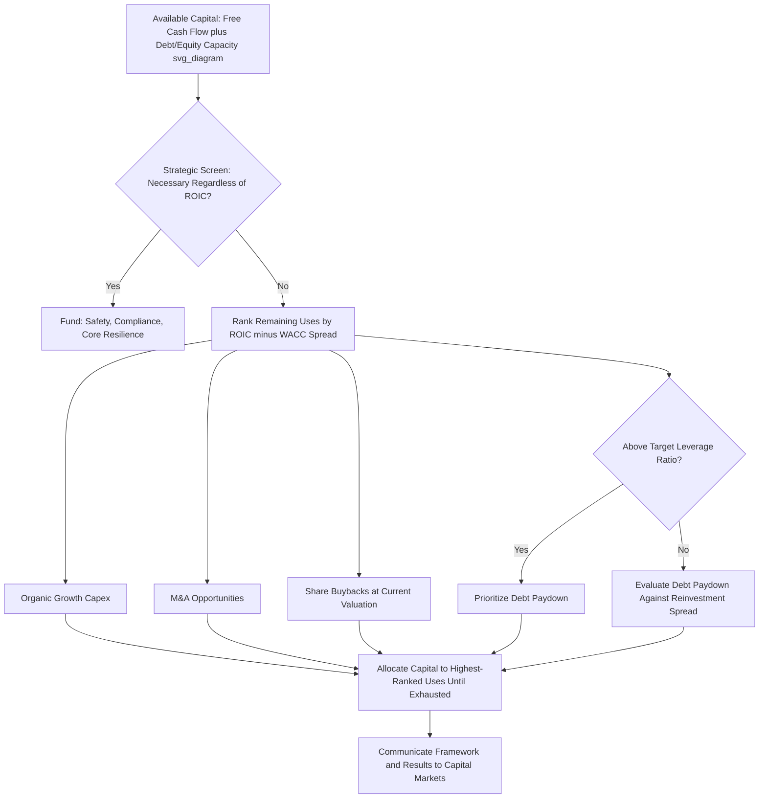

## Capital Allocation Frameworks and Priorities

<syllabot_broad_topic/>

### Conceptual Overview

Capital allocation is the process by which a company decides how to deploy the cash it generates and can raise across competing uses. Every dollar of free cash flow (or incremental debt/equity capacity) faces a decision among a finite set of alternatives, and the quality of these decisions compounds over time to become one of the primary determinants of long-run shareholder value creation, arguably more consequential than operating performance alone in capital-intensive or mature businesses.

A capital allocation framework provides a structured, repeatable methodology for evaluating and prioritizing these competing uses of capital, rather than making ad hoc, case-by-case decisions disconnected from a consistent set of financial and strategic criteria.

### The Core Uses of Capital

Nearly all capital allocation decisions fall into one of five categories:

1. **Reinvestment in the core business (organic capex)** — maintenance capex to sustain operations, and growth capex to expand capacity, enter new markets, or develop new products, as covered in capex forecasting.
2. **Mergers & acquisitions (M&A)** — inorganic growth via acquiring other businesses, assets, or capabilities.
3. **Debt reduction (deleveraging)** — repaying outstanding debt to reduce financial risk and interest expense.
4. **Dividends** — returning cash directly to shareholders on a recurring basis.
5. **Share repurchases (buybacks)** — returning cash to shareholders by reducing share count, increasing per-share metrics for remaining holders.

**[Inference]** Some frameworks also separate out a sixth category — building cash reserves/liquidity buffer — as a distinct (if often temporary or precautionary) use of capital, particularly relevant during periods of macroeconomic uncertainty or in anticipation of future large capital needs.

### The Foundational Decision Rule: Return Relative to Cost of Capital

The theoretical baseline for capital allocation, common across most rigorous frameworks, is that capital should flow to the use with the highest risk-adjusted return, provided that return exceeds the company's cost of capital:

$$\text{Value Created} = \text{Capital Invested} \times (\text{ROIC} - \text{WACC})$$

Where ROIC (return on invested capital) is compared against WACC (weighted average cost of capital). Any use of capital expected to generate ROIC below WACC destroys value even if it generates positive accounting profit, because it fails to compensate capital providers for the risk and opportunity cost of the capital deployed.

**Application across the five uses**:

- **Organic reinvestment**: Compare the project's expected ROIC (or project-level IRR/NPV) against WACC or a hurdle rate.
- **M&A**: Compare the acquisition's expected post-synergy ROIC against WACC, while also accounting for integration risk and execution probability, which are harder to quantify than organic project returns.
- **Debt reduction**: The "return" is the after-tax cost of debt avoided; comparing this against reinvestment ROIC determines whether paying down debt or reinvesting creates more value, particularly relevant when a company is above its target leverage ratio.
- **Dividends/buybacks**: These do not generate a company-level ROIC in the traditional sense, but returning capital to shareholders is the correct decision precisely when the company lacks sufficiently attractive ROIC-above-WACC reinvestment opportunities to absorb the capital productively.

### Common Capital Allocation Frameworks

**1. The Priority Waterfall (Sequential Ranking) Framework**

Establishes an explicit, ordered sequence of priorities that capital flows through, often used for its simplicity and communicability to investors:

A common illustrative waterfall (order varies by company and stated strategy):

1. Maintenance capex (non-discretionary, sustains existing operations)
2. Debt service (mandatory interest and principal payments)
3. Growth capex with ROIC clearly above WACC
4. Strategic M&A meeting return and strategic-fit criteria
5. Dividend (often targeted at a specific payout ratio or yield)
6. Share buybacks (residual use, opportunistic based on valuation)
7. Excess cash retained for balance sheet flexibility

**[Inference]** The specific ordering and the position of dividends relative to buybacks in particular varies significantly by company philosophy, industry norms, and jurisdiction (e.g., tax treatment differences between dividends and buybacks materially affect their relative attractiveness across different investor bases and countries), so this waterfall should be understood as an illustrative structure rather than a universal standard.

**2. The ROIC-Ranked Portfolio Framework**

Rather than a fixed sequential waterfall, this approach ranks all available capital uses (specific projects, M&A opportunities, debt paydown, buybacks at current valuation) by expected risk-adjusted return, and allocates capital to the highest-ranked opportunities until capital or attractive opportunities are exhausted.

$$\text{Rank all uses by: } (\text{Expected ROIC} - \text{Risk-Adjusted WACC})$$

**Application**: This framework treats even shareholder returns (buybacks) as a "project" to be ranked — a buyback is attractive when the company's own shares, at current market price, offer a higher effective return (via earnings/FCF accretion) than the next-best available reinvestment or M&A opportunity. This is the approach most closely associated with owner-oriented capital allocators.

**3. The Zero-Based Capital Budgeting Framework**

Rather than allocating capital incrementally off a prior year's budget (which entrenches existing spending patterns), each period's capital budget is built from zero, requiring every proposed use of capital — including ongoing/maintenance items — to be justified on its own merits against current-period alternatives.

**Rationale**: Prevents "budget inertia," where legacy projects or business units continue receiving capital simply because they received it previously, rather than because they currently represent the best use of scarce capital.

**[Inference]** This framework requires substantially more analytical and organizational effort than incremental budgeting, so it is more commonly adopted by companies undergoing deliberate capital discipline transformations or turnarounds than as a permanent steady-state practice, given its resource intensity.

**4. The Strategic-Financial Dual-Screen Framework**

Recognizes that not all capital allocation decisions can be reduced to a single ROIC/WACC comparison — some investments (e.g., core technology infrastructure, regulatory compliance, foundational R&D) are strategically necessary even when their standalone financial return is difficult to quantify or below typical hurdle rates. This framework applies two sequential screens:

1. **Strategic screen**: Is this use of capital necessary or highly value-additive to the long-term competitive position, regardless of precise ROIC quantification? (e.g., "must-do" categories: safety, regulatory compliance, core system resilience)
2. **Financial screen**: Among uses that pass or are exempt from the strategic screen, rank by expected ROIC/WACC and prioritize accordingly.

**Application**: Prevents purely financial ranking from starving genuinely necessary but hard-to-quantify investments, while still applying rigorous financial discipline to the larger, more discretionary pool of capital.

### Setting Hurdle Rates

Most frameworks require a **hurdle rate** — the minimum acceptable return for a project or investment to receive capital — which is typically:

$$\text{Hurdle Rate} = \text{WACC} + \text{Risk Premium (project/strategic-specific)}$$

**[Inference]** Many companies apply differentiated hurdle rates by risk category rather than a single blended rate — for example, a higher hurdle rate for a new-market or new-technology investment than for a maintenance or core-market expansion investment, reflecting the wider dispersion of possible outcomes in higher-risk categories — though the specific premium magnitudes vary by company policy and are not standardized externally.

### Balancing Flexibility and Discipline

A recurring tension in capital allocation frameworks is between **discipline** (consistent, rules-based allocation that avoids empire-building or reactive decision-making) and **flexibility** (the ability to seize unexpected opportunities or respond to changing conditions).

**Mechanisms used to balance this tension**:

- **Capital allocation committees/governance bodies**: A formal review body (often including the CFO, CEO, and sometimes board members) that evaluates major capital requests against the stated framework, providing consistency while allowing judgment on strategic-fit and qualitative factors the formulas cannot fully capture.
- **Rolling multi-year capital plans with annual review**: Balances long lead-time capital commitments (which require multi-year visibility) with the ability to revisit priorities annually as conditions change.
- **Reserved "opportunistic" capital pools**: Some companies explicitly set aside a portion of capital capacity for unplanned, high-conviction opportunities (bolt-on M&A, opportunistic buybacks during valuation dislocations) outside the standard planning cycle.

### Communicating the Framework to Capital Markets

**Key Points**

- Investors and credit rating agencies generally reward clearly articulated and consistently followed capital allocation frameworks, since predictability reduces the perceived risk of capital misallocation.
- Common disclosure elements include: a stated leverage target/range, a stated payout ratio or dividend policy, explicit ROIC/hurdle rate thresholds for growth capex and M&A, and a stated priority order among the five core uses.
- **[Inference]** Deviating from a previously communicated framework — e.g., pursuing a large debt-funded acquisition after stating a deleveraging priority — often carries a credibility cost with investors even if the specific deviation is individually value-accretive, since it undermines confidence in future adherence to stated capital allocation discipline.

### Worked Example: Applying the ROIC-Ranked Framework

A company has $500M of deployable capital and the following identified opportunities:

| Opportunity | Capital Required | Expected ROIC | WACC | Spread (ROIC – WACC) |
| --- | --- | --- | --- | --- |
| Plant capacity expansion | $200M | 14% | 9% | +5.0% |
| Bolt-on acquisition | $150M | 11% | 9% | +2.0% |
| Share buyback (current valuation) | $100M | 10% (implied) | 9% | +1.0% |
| New market entry (higher risk) | $150M | 16% | 12% (risk-adjusted) | +4.0% |
| Debt paydown | $100M | 5.5% (after-tax cost avoided) | 9% | N/A (deleveraging, not ROIC-ranked) |

**Ranking by spread**: Plant expansion (+5.0%) → New market entry (+4.0%) → Bolt-on acquisition (+2.0%) → Buyback (+1.0%).

With $500M available: fund plant expansion ($200M) and new market entry ($150M) fully ($350M), partially fund the bolt-on acquisition or buyback with the remaining $150M based on additional strategic/risk considerations, since both remaining opportunities show positive but comparatively lower spreads. Debt paydown is evaluated separately against the target leverage ratio rather than purely on the ROIC ranking, since deleveraging also serves a risk-management function not fully captured by the spread comparison alone.

### Common Pitfalls

- Applying a single blended hurdle rate across fundamentally different risk categories (core maintenance capex vs. new-market growth capex vs. M&A), understating risk in the riskiest categories and overstating it in the safest.
- Treating capital allocation as a series of independent decisions rather than a competitive ranking exercise — approving a mediocre project simply because it clears a hurdle rate, when a better use of that same capital exists elsewhere in the portfolio.
- Allowing incremental/legacy budget inertia to persist without periodic zero-based review, entrenching historically favored business units or projects regardless of current relative merit.
- Failing to account for M&A integration risk and execution probability at the same rigor applied to organic project ROIC, since acquisition returns are inherently more uncertain and dependent on post-close execution.
- Communicating a capital allocation framework to investors and then deviating from it without clear explanation, damaging capital markets credibility.

### Diagram: Capital Allocation Decision Framework (svg_diagram)

### Related Topics

- ROIC and WACC estimation methodologies
- Capex intensity benchmarking against peers
- Dividend policy design and payout ratio targeting
- Share buyback timing and valuation discipline
- M&A synergy evaluation and integration risk assessment
- Leverage targets and optimal capital structure
- Zero-based budgeting implementation
- Capital allocation governance and committee structures