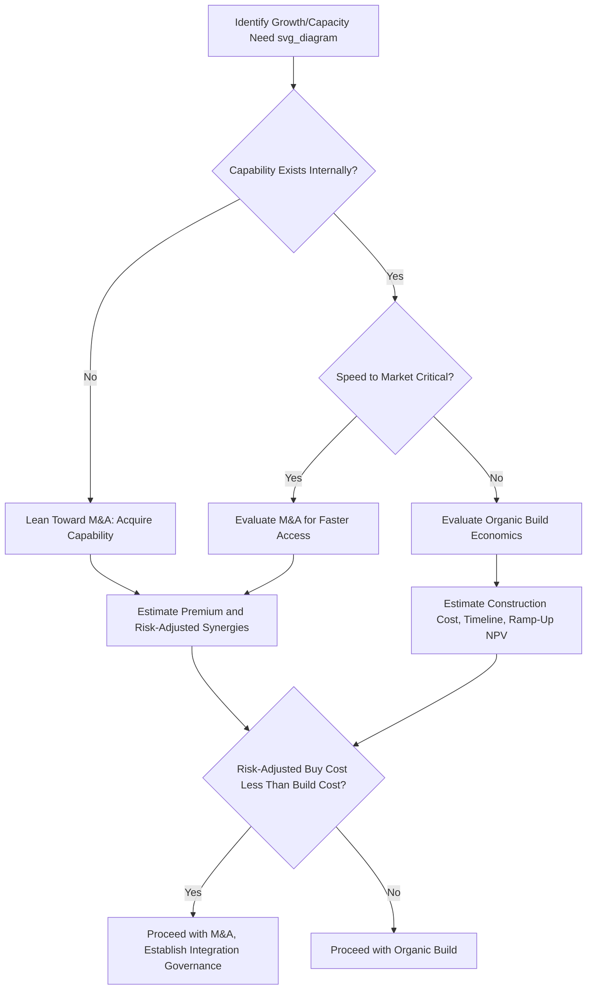

## Organic Growth Investment Versus Mergers and Acquisitions

### Conceptual Overview

Organic growth and M&A represent the two fundamental pathways by which a company deploys capital to grow revenue, capacity, or capability. Organic growth builds new capacity, products, or markets internally using the company's own resources and processes; M&A acquires existing capacity, capability, market position, or technology from another entity. Neither path is universally superior — the choice (or, more commonly, the optimal blend) depends on speed requirements, cost comparisons, risk tolerance, available capability, and competitive dynamics specific to the situation.

This decision sits directly beneath the broader capital allocation framework: both organic growth capex and M&A compete for the same pool of capital and are ideally evaluated on a comparable risk-adjusted return basis, even though the qualitative and execution-risk characteristics of each differ substantially.

### Core Trade-Off Dimensions

**1. Speed to market**

- Organic growth generally requires longer lead times: building a plant, developing a product, or establishing a new market presence from scratch follows a construction/development timeline, as discussed in capacity-utilization-driven capex modeling.
- M&A can deliver near-immediate capacity, market access, or capability, since the target already possesses the operating asset, customer base, or technology, subject only to closing/integration timelines rather than a full build cycle.

**2. Cost comparison ("build vs. buy" economics)**

- **Build (organic)**: Cost is typically closer to the replacement cost of the underlying assets/capability, without a premium for existing cash flows, market position, or intangibles.
- **Buy (M&A)**: Purchase price typically includes a **control premium** over the target's standalone market value, reflecting the price required to induce a change of control, plus the value the acquirer expects to capture from synergies.

$$\text{Acquisition Premium} = \text{Purchase Price} - \text{Target's Standalone Value}$$

$$\text{Value Creation Test: } \text{Synergies (NPV)} > \text{Premium Paid}$$

**[Inference]** As a general rule of thumb (not a rigid law), acquisitions tend to be economically justified over organic build primarily when speed, market access, proprietary capability, or genuinely achievable synergies offset the premium paid — buying an asset purely to avoid a modestly longer build timeline, without a clear premium-justifying rationale, is a common source of value-destructive M&A.

**3. Execution risk profile**

- **Organic growth risk**: Primarily execution/operational risk (construction delays, cost overruns, demand forecast errors) but generally lower integration complexity since the company is building within its own existing operational and cultural framework.
- **M&A risk**: Adds integration risk (cultural mismatch, systems consolidation, key talent attrition, customer/supplier relationship disruption) on top of the underlying operational risks of the acquired business, and requires accurately valuing an asset with information asymmetry (the seller typically knows more about the target than the buyer).

**4. Capability and know-how acquisition**

- Organic growth requires the company to already possess (or be able to internally develop) the necessary technical, operational, or market capability.
- M&A can acquire capability that would take years to build internally or that is protected by patents, proprietary technology, regulatory licenses, or accumulated tacit expertise not easily replicated — this is often the single strongest rationale for choosing M&A over organic build, particularly in technology, pharmaceuticals, and specialized industrial sectors.

**5. Competitive and market structure considerations**

- Organic capacity addition increases total industry supply, which can pressure industry-wide pricing/margins if demand does not grow proportionally — a dynamic particularly relevant in industries already covered by capacity-utilization analysis.
- M&A (particularly horizontal acquisition of a competitor) can consolidate existing capacity rather than adding new supply, potentially improving industry-wide pricing discipline, subject to antitrust/regulatory review in most jurisdictions.

### Comparative Financial Evaluation Framework

Both paths should ultimately be evaluated on a comparable expected-return basis, though the components of that evaluation differ:

| Dimension | Organic Growth | M&A |
| --- | --- | --- |
| Primary valuation method | Capex-based NPV/IRR on projected incremental cash flows | DCF or comparable-transaction valuation of target, adjusted for synergies |
| Key uncertainty | Demand forecast, construction cost/timeline, ramp-up curve | Synergy realization, integration cost/timeline, target's standalone performance trajectory |
| Typical time to full run-rate value | Multi-year (construction plus ramp-up) | Often faster for revenue/market access, but multi-year for cost synergy realization |
| Balance sheet impact | Gradual capex outflow over construction period | Often a large, discrete cash/debt/equity outflow at close |
| Reversibility | Low (asset-specific, illiquid) | Low, though a divestiture market exists (higher liquidity than a purpose-built organic asset in some cases) |

### The Synergy Evaluation Challenge in M&A

Since M&A typically requires paying a premium, the acquirer's investment thesis usually depends on capturing synergies unavailable to the target on a standalone basis:

**Cost synergies** (generally more reliably estimated and achieved):

- Headcount/overhead consolidation
- Procurement scale economies
- Facility/footprint rationalization
- Shared corporate/administrative functions

**Revenue synergies** (generally less reliable and slower to materialize):

- Cross-selling into combined customer bases
- Combined product/geographic market access
- Pricing power from consolidated market position

**[Inference]** A widely observed pattern in M&A post-mortems and academic studies is that cost synergies are realized more reliably and closer to original estimates than revenue synergies, which are more frequently overestimated at the time of deal announcement — this is a commonly cited generalization in M&A literature rather than a fixed, universally quantifiable rate, and actual realization varies significantly by deal and industry.

$$\text{Deal Value Creation} = PV(\text{Cost Synergies}) + PV(\text{Revenue Synergies}) - \text{Premium Paid} - \text{Integration Costs}$$

### Worked Example: Build vs. Buy Decision

A company needs additional manufacturing capacity of 200,000 units/year to meet forecast demand growth (per the capacity-utilization framework).

**Organic (Build) Option**:

- New plant construction cost: $180M
- Construction lead time: 24 months
- Ramp-up to full utilization: additional 12 months
- No integration risk; full control over specifications and technology

**M&A (Buy) Option**:

- Acquisition target with 220,000 units/year of existing, underutilized capacity
- Purchase price: $240M (including control premium)
- Target's standalone asset replacement value: $195M (implied premium: $45M)
- Time to full integration and utilization ramp: 9 months
- Estimated annual cost synergies (procurement, overhead consolidation): $15M/year, PV over 10 years at 9% WACC ≈ $96M

**Comparison**:

$$\text{Buy Option Net Cost} = 240 - 96 \text{ (PV synergies)} = \$144\text{M effective cost}$$

Against the $180M organic build cost, the acquisition appears more attractive on a pure capital-efficiency basis ($144M effective vs. $180M), and delivers capacity roughly 15 months sooner — but this comparison excludes integration execution risk, cultural fit, and the reliability discount that should be applied to the synergy estimate, which a full evaluation would incorporate via sensitivity analysis on the synergy realization rate.

**Key Points**

- A pure headline cost or premium comparison is insufficient — synergies must be risk-adjusted (e.g., applying a realization probability or haircut to estimated synergies) before comparing against the organic alternative.
- Speed-to-market value (the value of realizing capacity/revenue 12–15 months earlier) is a legitimate quantifiable factor and can be estimated via the NPV of the cash flows accelerated into earlier periods.

### Blended and Hybrid Strategies

Companies frequently pursue both paths simultaneously rather than treating the decision as binary:

- **Bolt-on M&A alongside core organic growth**: Using smaller, lower-integration-risk acquisitions to fill specific capability or geographic gaps while primary capacity growth remains organic.
- **Acquire-then-build**: Acquiring a platform/beachhead (e.g., a smaller regional player, a technology company) and then organically scaling that platform further, combining the speed/capability benefit of M&A with the capital efficiency of subsequent organic scaling.
- **Joint ventures and partnerships**: A middle path that shares capital commitment and risk with a partner, often used when full acquisition is prohibitively expensive, regulatory barriers exist, or when neither party alone possesses full capability (e.g., one partner contributes technology, the other contributes market access or manufacturing scale).

### Governance and Decision Process Considerations

**Key Points**

- Both organic growth and M&A proposals should ideally be evaluated against the same hurdle rate/ROIC framework used in broader capital allocation, to ensure capital flows to the genuinely highest-return use rather than being biased by organizational preference (e.g., an M&A team incentivized to close deals, or an operations team incentivized to build internally, each with a structural bias toward their own path).
- M&A processes typically require additional governance layers relative to organic capex — due diligence workstreams (financial, legal, commercial, technical), regulatory/antitrust review, and integration planning — that organic capex approval processes do not require to the same degree.
- **[Inference]** Because M&A returns depend heavily on integration execution (which occurs after the capital commitment/close, unlike organic capex where much of the execution risk is visible before full capital commitment), post-acquisition integration governance and synergy-tracking discipline are frequently cited as differentiators between successful and unsuccessful acquirers, though this is a qualitative pattern observed across case studies rather than a precisely quantifiable universal rule.

### Common Pitfalls

- Comparing M&A purchase price directly against organic build cost without properly risk-adjusting the synergy estimates that are meant to justify the acquisition premium.
- Underestimating integration costs and timeline, which are frequently a larger and slower component of realizing acquisition value than the headline deal economics suggest.
- Allowing organizational or personal incentives (build-oriented engineering culture vs. deal-oriented corporate development team) to bias the build-vs-buy recommendation rather than applying a consistent, capital-allocation-framework-driven evaluation.
- Ignoring the competitive/market-structure externality of organic capacity addition (potential industry oversupply) when evaluating organic growth purely on a standalone project-return basis.
- Treating build-vs-buy as a one-time, binary decision rather than revisiting the trade-off as market conditions, target valuations, and internal capability evolve over time.

### Diagram: Organic Growth vs. M&A Decision Framework (svg_diagram)

### Related Topics

- Capital allocation frameworks and priorities
- Linking capex to revenue growth and capacity utilization
- M&A synergy modeling and post-merger integration tracking
- Control premium and valuation methodologies in M&A
- Joint venture and strategic partnership structuring
- ROIC and hurdle rate application across investment types
- Due diligence process design (financial, commercial, technical)
- Antitrust and regulatory review considerations in horizontal M&A