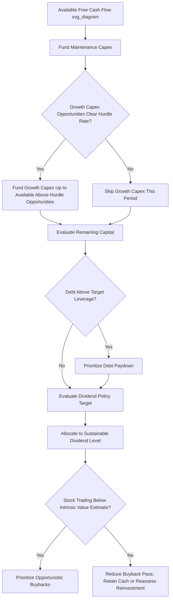

## Capex Versus Dividends and Share Buybacks

### Conceptual Overview

Once a company generates free cash flow, management faces a fundamental capital allocation choice: reinvest that cash into the business via capex (growth or maintenance), or return it to shareholders via dividends or share buybacks. This decision sits at the heart of the broader capital allocation framework and hinges on a single guiding principle — capital should be reinvested only when it can generate returns above the cost of capital; otherwise, returning it to shareholders (who can redeploy it elsewhere at market rates) is the value-maximizing choice.

The decision is not purely binary or one-time; most mature companies run both reinvestment and shareholder-return programs concurrently, with the relative balance shifting as growth opportunities, industry capital cycles, and valuation conditions evolve.

### The Core Decision Rule

$$\text{Reinvest if: } \text{Expected ROIC on Incremental Capex} > \text{WACC}$$

$$\text{Return Capital if: } \text{Available Growth Opportunities} < \text{Available Capital, at ROIC} > \text{WACC}$$

This is sometimes summarized as the "opportunity cost of capital" test: shareholders can, in principle, take a returned dollar and invest it in alternative opportunities offering a market-rate return; retaining that dollar inside the company is only justified if the company can generate a better risk-adjusted return on it than the shareholder could obtain externally.

**[Inference]** In practice, this comparison is rarely as clean as the formula suggests, since company-specific ROIC estimates carry uncertainty, and the "next best alternative" available to a given shareholder is not directly observable to management — as a result, most companies apply the rule as a general capital allocation philosophy and directional guide rather than a precise, single-number decision threshold applied mechanically to every dollar.

### Dividends: Characteristics and Rationale

**Structure**: A recurring cash payment to shareholders, typically declared quarterly (in the U.S.) or semi-annually/annually (common in many other markets), usually expressed as a per-share amount or as a payout ratio relative to earnings/FCF.

$$\text{Payout Ratio} = \frac{\text{Dividends Paid}}{\text{Net Income (or Free Cash Flow)}}$$

**Signaling and commitment characteristics**:

- Dividends are widely interpreted by investors as a **durable commitment** — companies are generally reluctant to cut a dividend once established, since a cut is typically read by the market as a signal of financial distress or a materially deteriorated outlook, often triggering a disproportionate negative share price reaction relative to the cash amount involved.
- This asymmetric reputational cost means dividend policy is usually set conservatively, based on a sustainable long-run payout level rather than the peak cash-generation capacity of a given year, to avoid the risk of a future cut.
- Dividends attract and retain a specific investor base — often income-focused or yield-oriented investors (e.g., certain pension funds, income mutual funds, retail income investors) — for whom the recurring, predictable cash flow is itself a primary investment objective independent of total return considerations.

**Tax treatment considerations**: **[Unverified/Inference]** Dividend tax treatment varies significantly by jurisdiction and investor type (qualified vs. ordinary dividend rates in the U.S., dividend imputation/franking credit systems in markets like Australia, withholding tax treatment for foreign investors), and this variation is frequently cited as a factor influencing the relative attractiveness of dividends versus buybacks for a given company's investor base — the specific tax rules should be verified for the relevant jurisdiction rather than assumed universal.

### Share Buybacks: Characteristics and Rationale

**Structure**: The company repurchases its own shares on the open market (or via tender offer/accelerated share repurchase), reducing shares outstanding.

**Mechanical effect on per-share metrics**:

$$\text{EPS} = \frac{\text{Net Income}}{\text{Shares Outstanding}}$$

Reducing the denominator (shares outstanding) mechanically increases EPS even with unchanged net income, and similarly increases other per-share metrics (FCF per share, book value per share).

**Flexibility characteristic**: Unlike dividends, buybacks carry no strong market expectation of recurrence or consistency — a company can pause or reduce buyback activity in a weaker period without the same signaling penalty typically associated with a dividend cut, making buybacks a more flexible, discretionary tool for returning excess capital.

**Valuation-sensitivity rationale**: Because buybacks are executed at the prevailing market share price, they can be used opportunistically — buying back more shares when the company's own stock appears undervalued relative to intrinsic value, and less (or none) when the stock appears fully or overvalued, effectively making the buyback decision itself a capital allocation judgment about the company's own equity as an "investment."

$$\text{Buyback Value Creation} \approx \text{Intrinsic Value per Share} - \text{Repurchase Price per Share}$$

**[Inference]** This valuation-sensitive framing is the theoretically ideal use of buybacks according to most capital allocation frameworks, though in practice many companies run buyback programs on a more programmatic, less valuation-timed basis (e.g., steady quarterly repurchases to offset stock-based compensation dilution), which serves a different, more mechanical purpose than opportunistic value-accretive repurchasing.

### Buybacks vs. Dividends: Comparative Framework

| Dimension | Dividends | Share Buybacks |
| --- | --- | --- |
| Commitment/flexibility | High commitment; cuts carry reputational cost | High flexibility; can pause without equivalent penalty |
| Shareholder choice | All shareholders receive cash pro rata (mandatory receipt) | Only selling shareholders receive cash; non-sellers retain increased proportional ownership |
| Valuation sensitivity | Generally not timed to valuation | Can be timed opportunistically to valuation |
| Signaling | Strong signal of confidence in sustainable cash generation | Can signal confidence, but also scrutinized for use in offsetting dilution or supporting EPS |
| Investor base attracted | Income/yield-focused investors | Total-return-focused investors indifferent to cash vs. capital appreciation |
| Tax treatment | Often taxed as income upon receipt (jurisdiction-dependent) | Shareholder controls tax timing (only realized if/when they choose to sell) |

**Key Points**

- The tax-timing flexibility of buybacks (a non-selling shareholder incurs no immediate tax event, unlike a dividend recipient) is a commonly cited theoretical advantage in jurisdictions where dividend income is taxed upon receipt, though the practical magnitude of this advantage depends on investor-specific tax circumstances and jurisdiction.
- Buybacks allow shareholders to self-select their preferred liquidity/reinvestment outcome (sell into the buyback for cash, or hold and benefit from increased proportional ownership), whereas a dividend imposes the same cash-receipt outcome on all shareholders regardless of individual preference.

### Integrating Capex, Dividends, and Buybacks in a Capital Allocation Waterfall

A typical sequential logic, consistent with the broader capital allocation framework:

1. Fund maintenance capex (non-discretionary)
2. Fund growth capex projects clearing the hurdle rate (ROIC > WACC)
3. Evaluate remaining excess free cash flow against: additional M&A opportunities, debt paydown (if above target leverage), dividend policy targets, and buyback opportunities
4. Allocate remaining capital among dividends/buybacks based on stated policy, investor base preferences, valuation levels, and tax considerations

**[Inference]** A commonly observed pattern (though not a fixed rule) is that companies in the early/high-growth phase of their lifecycle tend to allocate the large majority of free cash flow toward capex and M&A with minimal shareholder returns, while companies in the mature phase, having exhausted sufficient above-hurdle-rate reinvestment opportunities, tend to shift the balance progressively toward dividends and buybacks — this lifecycle pattern is a general tendency observed across many industries rather than a strict, universally quantified rule.

### Worked Example: Allocation Decision Under Capacity Constraints

A mature industrial company generates $400M of annual free cash flow before discretionary capital allocation decisions.

| Use | Amount | ROIC / Return | Decision Basis |
| --- | --- | --- | --- |
| Maintenance capex | $120M | N/A (non-discretionary) | Required to sustain operations |
| Growth capex (utilization-driven trigger active) | $100M | 13% (WACC: 9%) | Clears hurdle rate — fund |
| Bolt-on M&A opportunity | $50M | 10.5% (WACC: 9%) | Clears hurdle rate — fund |
| Remaining capital | $130M | — | Evaluate for shareholder return |

With $130M remaining and no additional above-hurdle-rate reinvestment opportunities identified, allocation might split between dividend increase (supporting a stated payout ratio target, e.g., $70M) and opportunistic buybacks ($60M), with the buyback portion potentially increased in future periods if the stock trades below management's intrinsic value estimate, or redirected toward capex if a new capacity trigger emerges (per the capacity-utilization framework).

### Signaling Effects and Market Reaction Considerations

- **Increasing capex** can be read positively (confidence in growth opportunities) or negatively (concern about capital discipline, or entering a lower-return reinvestment phase), depending on investor perception of the company's demonstrated capital allocation track record and the clarity of the stated rationale.
- **Announcing a new or increased dividend** typically generates a favorable market reaction, reflecting confidence in sustainable cash generation, but sets a durable expectation.
- **Announcing a buyback program** is often viewed favorably as a signal that management believes shares are undervalued, though sustained large buybacks in the absence of underlying earnings growth are sometimes scrutinized by analysts as a sign of limited reinvestment opportunity rather than purely a positive signal.
- **[Inference]** Market reaction to any of these announcements is also influenced by the broader context (industry capital cycle stage, company-specific track record, prevailing interest rate environment) rather than being a fixed, predictable response to the announcement type alone.

### Common Pitfalls

- Continuing to fund capex projects below the hurdle rate rather than returning excess capital, driven by organizational bias toward growth or empire-building rather than rigorous ROIC discipline.
- Committing to a dividend level that cannot be sustained through a full industry cycle, creating pressure toward a future cut during a downturn.
- Using buybacks primarily or exclusively to offset stock-based compensation dilution without regard to valuation, which can result in systematically repurchasing shares at unfavorable (overvalued) prices.
- Reducing growth capex specifically to fund buybacks during a period when genuine above-hurdle-rate capacity expansion opportunities exist (per the capacity-utilization-driven capex trigger framework), sacrificing long-term value creation for near-term per-share metric improvement.
- Failing to reassess the capex/shareholder-return balance as capacity utilization approaches a new threshold, since a previously appropriate "return excess capital" posture may need to shift back toward reinvestment as new capex triggers emerge.

### Diagram: Capex vs. Shareholder Return Decision Logic (svg_diagram)

### Related Topics

- Capital allocation frameworks and priorities
- Organic growth investment versus mergers and acquisitions
- ROIC and WACC estimation methodologies
- Dividend policy design and payout ratio targeting
- Linking capex to revenue growth and capacity utilization
- Leverage targets and optimal capital structure
- Intrinsic valuation methods for buyback timing decisions
- Capital markets signaling theory in corporate finance