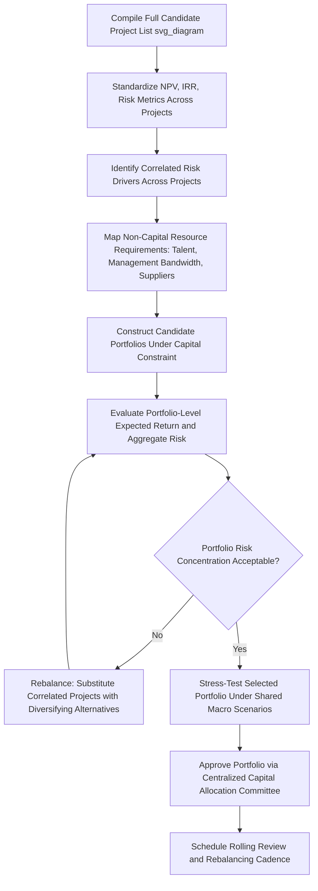

## Portfolio Approach to Capital Project Selection

### Conceptual Overview

The portfolio approach to capital project selection treats the full set of a company's candidate capital projects as an investment portfolio to be constructed and managed collectively, rather than evaluating and approving each project independently in isolation. Just as an investment portfolio manager considers correlation, diversification, and aggregate risk exposure across holdings — not just each security's standalone expected return — a capital allocation function applying portfolio logic considers how individual projects interact with one another, with the company's overall risk profile, and with the constraint of a finite capital budget.

This approach directly extends the ROIC-ranked capital allocation framework by adding a critical dimension that pure project-by-project ranking omits: the interaction effects between projects — shared risk factors, resource contention, sequencing dependencies, and portfolio-level risk diversification — that can materially change the optimal set of projects to fund relative to simply approving the highest-ranked projects individually until the budget is exhausted.

### Why Project-by-Project Evaluation Is Insufficient

Evaluating and approving projects strictly in descending order of individual ROIC or NPV, until capital is exhausted, implicitly assumes:

1. Projects are independent (no correlation in outcomes)
2. Projects do not compete for the same scarce non-capital resources (management attention, specialized engineering talent, key suppliers, permitting capacity)
3. The company's risk tolerance is indifferent to the composition of risk across the funded set (e.g., funding several highly correlated high-risk projects simultaneously carries different aggregate risk than funding an equivalent capital amount of diversified, less-correlated projects)

**[Inference]** Because these assumptions rarely hold in practice — most large organizations face genuine constraints on skilled project management capacity, specialized engineering resources, and organizational bandwidth for managing multiple large initiatives concurrently, and importantly, project outcomes are frequently correlated with shared underlying risk factors (a common commodity price input, a shared end-market demand driver, a common execution team) — pure independent ranking can produce a funded portfolio with underappreciated aggregate risk concentration, even when each individual project was soundly evaluated in isolation.

### Core Portfolio Dimensions to Manage

**1. Risk correlation and diversification**

Projects should be evaluated not only for standalone risk but for how their outcomes correlate with each other and with the company's existing asset base:

$$\text{Portfolio Variance} = \sum_i w_i^2 \sigma_i^2 + \sum_i \sum_{j \neq i} w_i w_j \sigma_i \sigma_j \rho_{ij}$$

Where $w_i$ is the capital weight allocated to project $i$, $\sigma_i$ is that project's standalone risk (return volatility), and $\rho_{ij}$ is the correlation between projects $i$ and $j$'s outcomes. A portfolio of projects with low or negative correlation reduces aggregate risk relative to the same expected return achieved through a concentrated set of highly correlated projects.

**Illustrative correlated risk factors in capital projects**: exposure to the same commodity input cost (e.g., steel, semiconductors), dependence on the same end-market demand cycle, reliance on the same key supplier or contractor, or execution by the same internal project team (concentrating key-person/organizational execution risk).

**2. Resource contention (beyond capital)**

Capital is often not the only binding constraint. Portfolio selection must also account for:

- Availability of specialized engineering, construction, or technical talent
- Management/executive attention bandwidth for overseeing multiple large concurrent initiatives
- Supplier and contractor capacity (multiple simultaneous large projects can bid up costs or extend lead times industry-wide)
- Permitting, regulatory, or environmental review capacity, particularly when multiple projects require the same regulatory body's approval within overlapping timeframes

**3. Strategic balance across time horizons and risk categories**

A well-constructed capital portfolio typically balances:

- **Near-term, lower-risk projects** (maintenance capex, proven-technology capacity expansion) that provide reliable, near-certain returns
- **Medium-term, moderate-risk projects** (new market entry using proven capability, larger capacity expansions)
- **Longer-term, higher-risk/higher-potential-return projects** (new technology adoption, entry into genuinely new markets or business lines)

**[Inference]** This is conceptually analogous to a "core-satellite" or barbell approach used in investment portfolio construction, ensuring the company is not solely dependent on either a narrow set of proven, incremental initiatives or an overconcentration in speculative, unproven ventures — though the specific proportional targets for each risk category vary by company strategy, industry, and risk appetite rather than following a standardized formula.

### Portfolio Construction Process

**Step 1: Generate the full candidate project list**

Compile all proposed capital projects across business units, including organic growth capex, maintenance capex, and M&A opportunities, each with standardized financial metrics (NPV, IRR, ROIC, payback period) and standardized risk characterization.

**Step 2: Assess correlation and shared risk exposures**

For each pair or cluster of candidate projects, identify shared underlying risk drivers (commodity exposure, end-market demand, execution team, geographic/regulatory exposure) to understand which projects would move together under common stress scenarios.

**Step 3: Apply resource capacity constraints**

Map each project's non-capital resource requirements (specialized talent, management oversight, supplier capacity) against total organizational capacity, identifying binding constraints beyond the capital budget itself.

**Step 4: Optimize for portfolio-level objectives**

Rather than a simple ranked list, use portfolio construction logic to select the combination of projects that maximizes expected portfolio-level return subject to: the capital budget constraint, an acceptable aggregate risk/variance level, non-capital resource constraints, and strategic balance targets across risk categories and time horizons.

**Step 5: Stress-test the selected portfolio**

Apply scenario analysis (as covered in scenario/sensitivity analysis for capex plans) at the portfolio level — not just project-by-project — to understand how a common macro shock (e.g., a demand recession, a commodity price spike, a financing cost increase) would affect the *combined* set of funded projects simultaneously, since correlated projects can compound losses under a shared adverse scenario in ways that independent project-level stress tests would understate.

### Worked Example: Portfolio Selection with Correlation Consideration

A company has $300M available and four candidate projects:

| Project | Capital | Standalone NPV | Standalone Risk | Primary Risk Driver |
| --- | --- | --- | --- | --- |
| A: Domestic capacity expansion | $120M | $45M | Medium | Domestic demand growth |
| B: Export market entry | $100M | $38M | Medium-High | Domestic demand growth (same core end-market) |
| C: New geography entry (different macro exposure) | $90M | $30M | Medium-High | Independent regional demand cycle |
| D: Process automation upgrade (existing plants) | $60M | $28M | Low | Internal execution only, no external demand dependency |

**Pure ranked selection (by NPV, ignoring correlation)**: A ($120M) + B ($100M) + D ($60M) = $280M, funding the three highest-NPV projects — but Projects A and B share the same core domestic demand driver, meaning a domestic demand downturn would simultaneously impair both of the two largest positions in the portfolio.

**Portfolio-adjusted selection**: Recognizing the correlation between A and B, a portfolio approach might instead select A ($120M) + C ($90M) + D ($60M) = $270M — accepting a slightly lower combined standalone NPV ($45M + $30M + $28M = $103M vs. A+B+D's $45M + $38M + $28M = $111M) in exchange for materially better risk diversification, since C's independent regional demand cycle is not correlated with the domestic demand driver affecting both A and D's broader exposure.

**Key Points**

- The portfolio-adjusted selection accepts a modestly lower sum of standalone NPVs in exchange for reduced aggregate risk concentration — this trade-off is the central logic distinguishing portfolio-level selection from simple independent project ranking.
- This decision should be made transparently, with the risk-reduction rationale explicitly documented, since a pure NPV-maximizing observer might otherwise question why the highest-NPV combination was not selected.

### Governance Structures Supporting Portfolio Selection

- **Centralized capital allocation committee**: Reviews the full candidate project list across business units simultaneously, rather than each business unit's projects being approved independently within a siloed budget, enabling cross-project correlation and resource-contention analysis that a decentralized process would miss.
- **Standardized project evaluation templates**: Ensures NPV, IRR, risk characterization, and resource requirements are calculated and presented consistently across business units and project types, enabling genuine like-for-like portfolio comparison.
- **Rolling portfolio review cadence**: Since new projects emerge and market conditions evolve continuously, the portfolio should be reviewed and rebalanced periodically (e.g., annually alongside the capital budgeting cycle, or upon material changes such as a completed capacity utilization threshold crossing) rather than treated as a single static, once-and-done selection exercise.

### Portfolio Optimization Techniques

**[Inference]** More quantitatively sophisticated organizations sometimes apply techniques adapted from financial portfolio theory and operations research to formalize the selection process, though the degree of formal quantitative optimization versus qualitative judgment varies significantly by company size, industry, and analytical maturity:

- **Efficient frontier analysis**: Plotting candidate project combinations by expected portfolio return against portfolio risk (variance), identifying the set of combinations that maximizes return for a given risk level (or minimizes risk for a given return level), analogous to modern portfolio theory applied to capital projects rather than financial securities.
- **Integer/binary optimization (knapsack-style problems)**: Since capital projects are typically indivisible (a project is either fully funded or not, unlike a financial security which can be held in any fraction), project selection under a capital constraint can be formally modeled as a variant of the knapsack problem, optimizing total portfolio value subject to the binary funded/not-funded decision for each project and the overall budget constraint.
- **Real options overlay**: Incorporating the option value of staged/phased projects (the ability to expand, delay, or abandon at defined checkpoints) into the portfolio-level risk assessment, recognizing that a portfolio containing staged projects with genuine decision flexibility carries different effective risk than one composed entirely of fully-committed, all-at-once capital deployments.

### Common Pitfalls

- Ranking and approving projects purely by standalone NPV or IRR without assessing correlation, resulting in a funded portfolio with hidden risk concentration around shared underlying drivers.
- Ignoring non-capital resource constraints (specialized talent, management bandwidth, supplier/contractor capacity), approving a capital-feasible portfolio that is operationally infeasible to execute simultaneously.
- Allowing business-unit-level siloed capital budgets to prevent genuine cross-organizational portfolio optimization, since each unit may independently fund reasonable projects that collectively create excessive aggregate risk concentration at the company level.
- Treating portfolio construction as a one-time annual exercise rather than a rolling process, missing the opportunity to rebalance as new information (a capacity utilization threshold crossing, a shift in a correlated risk factor) emerges intra-cycle.
- Over-formalizing the process with quantitative optimization techniques while neglecting qualitative strategic judgment (competitive positioning, long-term capability building) that pure financial optimization may not fully capture.

### Diagram: Portfolio Capital Project Selection Process (svg_diagram)

### Related Topics

- Capital allocation frameworks and priorities
- Scenario and sensitivity analysis for capex plans
- Organic growth investment versus mergers and acquisitions
- Real options valuation for staged capital projects
- Correlation and diversification concepts in modern portfolio theory
- Capital allocation governance and committee structures
- Resource capacity planning for large-scale project execution
- Risk-adjusted hurdle rate application across project categories