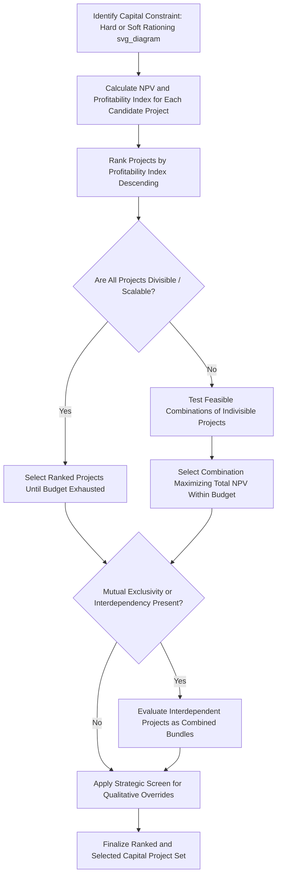

## Capital Rationing and Project Ranking

### Conceptual Overview

Capital rationing occurs when a company faces a binding constraint on the total capital available for investment that is lower than the capital required to fund all projects with positive NPV or returns exceeding the cost of capital. Under this constraint, the objective shifts from simply approving every value-accretive project to selecting the *combination* of projects that maximizes total value creation within the limited capital available — which requires a project ranking methodology different from, and in some cases in direct conflict with, the ranking that would result from evaluating projects purely by NPV or IRR in isolation.

Capital rationing can be **hard** (an absolute external ceiling, such as a covenant-imposed borrowing limit or genuinely unavailable external financing) or **soft** (an internally imposed discipline mechanism, where the company could theoretically raise more capital but chooses to cap the budget to enforce selectivity and prevent overextension of organizational execution capacity).

### Why NPV Ranking Alone Fails Under Rationing

In an unconstrained capital environment, the standard rule is simple: accept every project with positive NPV, since each such project adds value regardless of its size relative to others. Under capital rationing, however, a large project with a large absolute NPV but a lower *NPV per dollar invested* may consume capital that could otherwise fund multiple smaller projects with a higher combined NPV.

**Illustrative conflict**:

| Project | Capital Required | NPV | NPV/Capital Ratio |
| --- | --- | --- | --- |
| X | $100M | $25M | 0.25x |
| Y | $40M | $14M | 0.35x |
| Z | $40M | $13M | 0.325x |

With an unconstrained $100M+ budget, all three would be accepted. With a hard $100M capital ceiling, choosing Project X alone ($25M NPV) versus Projects Y + Z together ($40M capital, $27M combined NPV, leaving $60M for other opportunities) demonstrates that ranking by absolute NPV (favoring X) produces a worse outcome than ranking by NPV *efficiency* per unit of scarce capital.

### The Profitability Index: The Standard Ranking Tool Under Capital Rationing

The **profitability index (PI)**, also called the benefit-cost ratio, is the standard financial metric for ranking projects under a single-period capital constraint:

$$\text{Profitability Index} = \frac{\text{PV of Future Cash Flows}}{\text{Initial Capital Investment}} = 1 + \frac{\text{NPV}}{\text{Initial Investment}}$$

**Application**: Rank all candidate projects by PI in descending order, then select projects in that order until the capital budget is exhausted. This maximizes total NPV generated per dollar of the constrained resource, which is the objective function that matters when capital — not project availability — is the binding constraint.

**Decision rule**: A PI greater than 1.0 indicates a positive-NPV project (equivalent to the standard NPV > 0 acceptance criterion in an unconstrained environment); under rationing, the *ranking* by PI magnitude (not just the binary above/below 1.0 threshold) determines the optimal selection.

### Limitations of Simple PI Ranking

**1. Indivisibility of projects**

The PI-ranking approach implicitly assumes projects can be scaled or combined perfectly to exhaust the capital budget exactly. In reality, most capital projects are indivisible (a plant is either built or not; there is no "70% of a plant"), so simple PI ranking may leave a capital residual too small to fund the next-ranked project, requiring either a smaller substitute project or accepting the unused capital residual.

**[Inference]** This is why real-world capital rationing decisions typically require combinatorial evaluation (testing multiple feasible combinations of indivisible projects against the budget constraint, as in the portfolio approach) rather than a simple sequential fill-the-budget-in-ranked-order process, particularly when available projects vary significantly in size relative to the total budget.

**2. Multi-period capital constraints**

When capital rationing applies not just to the current period but across multiple future periods (e.g., a constrained annual capital budget recurring for several years), simple single-period PI ranking is insufficient, since a project's cash flows and capital requirements may span multiple constrained periods differently than another project of similar single-period PI. **[Inference]** Multi-period capital rationing problems are more rigorously addressed using linear programming formulations that optimize project selection across the full multi-period capital constraint set simultaneously, rather than a single-period PI ranking applied independently in each year.

**3. Mutual exclusivity and interdependency**

PI ranking assumes projects are independent. Where projects are mutually exclusive (only one of several alternative approaches to the same objective can be selected) or interdependent (one project's viability depends on another being funded first), simple independent PI ranking can produce an infeasible or suboptimal selection, requiring the projects to be evaluated as combined bundles rather than individually ranked line items.

**4. Ignoring correlation and portfolio risk**

As with the broader portfolio approach to capital project selection, pure PI ranking (like pure NPV ranking) does not account for correlation between projects' outcomes, potentially selecting a set of high-PI projects that share concentrated underlying risk exposure.

### Combinatorial Selection Under Indivisibility

When projects are indivisible and simple PI-ranked sequential selection does not cleanly exhaust the budget, the correct approach is to evaluate the total NPV of *feasible combinations* of projects within the budget constraint, not just the PI-ranked order:

**Worked Example**:

| Project | Capital Required | NPV | PI |
| --- | --- | --- | --- |
| M | $70M | $21M | 1.30x |
| N | $50M | $14M | 1.28x |
| O | $30M | $10M | 1.33x |

Budget: $100M

**Pure PI-ranked sequential fill**: O ($30M, PI 1.33x) → M ($70M, PI 1.30x) = $100M exactly, total NPV = $10M + $21M = $31M.

**Alternative combination**: N ($50M) + O ($30M) = $80M, total NPV = $14M + $10M = $24M, leaving $20M of unused capital (assume no smaller project available to absorb it).

In this case, the pure PI-ranked sequential approach (O then M) happens to both exhaust the budget exactly and produce the higher combined NPV ($31M vs. $24M), confirming it as the correct choice here — but this alignment is not guaranteed in general; **[Inference]** when the highest-PI-ranked combination does not cleanly exhaust the budget due to indivisibility, analysts should explicitly test alternative combinations (including some lower-PI projects) rather than assuming the naive sequential-fill order is automatically optimal, since a combination leaving substantial idle capital can sometimes be dominated by an alternative combination with slightly lower average PI but fuller capital utilization.

### Hard vs. Soft Capital Rationing: Strategic Implications

**Hard rationing** (externally imposed — e.g., debt covenant limits, genuinely inaccessible capital markets, regulatory capital constraints in regulated industries):

- The ranking and selection exercise is a genuine optimization problem with a firm, non-negotiable constraint.
- May signal financial distress or constrained access to capital, which itself carries strategic and reputational implications beyond the immediate project selection exercise.

**Soft rationing** (internally imposed — a deliberate management or board decision to cap capital spending below the level theoretically raisable):

- Often used as a discipline mechanism to force rigorous prioritization and prevent overextension of non-capital resources (management bandwidth, execution capacity, as discussed in the portfolio approach to project selection).
- **[Inference]** Some capital allocation frameworks and academic corporate finance literature argue that soft rationing, if applied too rigidly, can cause a company to reject genuinely value-accretive projects that could have been funded via additional debt or equity issuance at reasonable cost — this is a recognized theoretical tension in capital budgeting practice, and the appropriate degree of self-imposed capital discipline versus flexibility varies by company financial policy and risk tolerance rather than following a single prescribed standard.

### Integrating Ranking with Strategic and Qualitative Factors

**Key Points**

- Pure financial ranking (NPV, PI) should generally be treated as the primary but not sole input to the final ranking decision — as in the broader capital allocation framework's strategic-financial dual screen, some projects may be prioritized despite a lower PI due to strategic necessity (regulatory compliance, safety, competitive positioning) that is difficult to fully monetize in a standard NPV calculation.
- Sensitivity of the ranking itself should be tested — if two projects have similar PI values (e.g., 1.30x and 1.28x) that are within the margin of estimation uncertainty in the underlying cash flow forecasts, the ranking between them may not be robust enough to be decisive on financial grounds alone, and qualitative or strategic tie-breaking criteria become more relevant.

### Multi-Period Capital Rationing Illustration

For a simplified two-period capital rationing problem, the standard approach frames the selection as a linear programming problem:

$$\text{Maximize: } \sum_i x_i \times NPV_i$$

$$\text{Subject to: } \sum_i x_i \times \text{Capital}_{i,t} \leq \text{Budget}_t \text{ for each period } t$$

$$x_i \in \{0, 1\} \text{ for each project } i \text{ (indivisible)}$$

Where $x_i$ is a binary decision variable (1 if project $i$ is selected, 0 if not) for each candidate project, and the constraint set includes a separate capital limit for each constrained period rather than a single aggregate limit — this formulation is a direct extension of the single-period knapsack-style problem referenced in portfolio-based project selection, generalized across multiple time periods.

### Common Pitfalls

- Ranking and selecting projects purely by absolute NPV under a binding capital constraint, rather than by NPV efficiency (profitability index), which can lead to funding fewer, larger projects at the expense of a higher combined-NPV set of smaller projects.
- Applying simple sequential PI-ranked selection without testing alternative combinations when project indivisibility prevents the ranked order from cleanly exhausting the capital budget.
- Treating capital rationing as a single-period problem when the actual constraint recurs across multiple future periods, understating the true opportunity cost of committing capital-intensive projects early in a multi-year budget cycle.
- Ignoring mutual exclusivity or interdependency relationships between candidate projects, applying independent ranking to projects that must actually be evaluated as combined bundles.
- Applying self-imposed (soft) capital rationing so rigidly that genuinely value-accretive projects are rejected without seriously evaluating whether additional capital could reasonably be raised to fund them.

### Diagram: Capital Rationing and Project Ranking Process (svg_diagram)

### Related Topics

- Capital allocation frameworks and priorities
- Portfolio approach to capital project selection
- Scenario and sensitivity analysis for capex plans
- Profitability index and NPV estimation methodologies
- Linear programming applications in capital budgeting
- Mutually exclusive project evaluation techniques
- Debt covenant structures and hard capital constraints
- Strategic versus financial screening in project prioritization