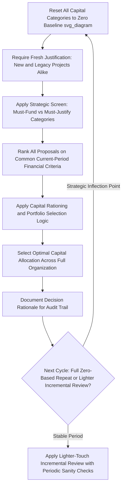

## Zero-Based Capital Budgeting

### Conceptual Overview

Zero-based capital budgeting (ZBB applied to capital expenditure) is a budgeting methodology in which every capital allocation decision for a given period is built from a zero baseline, requiring every proposed use of capital — including projects, programs, and asset categories that received funding in prior periods — to be justified afresh on its own current merits, rather than being carried forward incrementally from the prior period's approved budget with only marginal adjustments.

This stands in direct contrast to **incremental budgeting**, the more common default approach in which each period's budget starts from the prior period's baseline and adjusts up or down by a percentage or fixed amount, implicitly assuming the prior allocation was broadly appropriate and only the increment requires fresh justification.

### The Core Problem Zero-Based Budgeting Addresses: Budget Inertia

Under incremental budgeting, capital tends to flow disproportionately to business units, asset categories, or project types that have historically received funding, regardless of whether they currently represent the best available use of capital relative to the full universe of current alternatives. This "budget inertia" or "use it or lose it" dynamic can develop for several structural reasons:

- Business units learn that historical allocation levels function as an implicit floor for future negotiations, creating an incentive to protect existing budget levels rather than to actively compete for capital against better current-period alternatives.
- Legacy projects or asset categories may continue receiving maintenance-level or even growth-level capital simply because a formal, explicit decision to reduce or eliminate that funding was never triggered, rather than because an active current-period evaluation affirmed their continued priority.
- New business units, emerging technologies, or previously nonexistent capital needs may struggle to compete for capital against incumbents with an established budget "base," even when the new opportunity would generate a superior risk-adjusted return.

**[Inference]** This dynamic is a widely recognized structural risk of incremental budgeting discussed extensively in corporate finance and management literature, though the actual severity of inertia in any given organization depends heavily on the specific governance and review discipline applied, rather than being an automatic or universally quantifiable feature of every incremental budgeting process.

### Zero-Based Capital Budgeting Process

**Step 1: Reset the baseline to zero**

Every capital allocation category — including recurring maintenance capex, ongoing growth programs, and legacy business unit allocations — starts each budgeting cycle with no assumed baseline funding level.

**Step 2: Require fresh justification for every proposed use of capital**

Each business unit or project sponsor must submit a complete justification package for the current period, as if requesting funding for the first time, including updated ROIC/NPV projections, updated strategic rationale, and updated risk assessment reflecting current conditions rather than historical assumptions.

**Step 3: Rank all proposals on a common, current-period basis**

All capital requests — new and legacy alike — are evaluated and ranked together using the same financial and strategic criteria (consistent with the broader capital allocation framework and profitability-index-based ranking under capital rationing), rather than legacy programs being evaluated against a different, more lenient implicit standard than new proposals.

**Step 4: Apply the capital rationing/portfolio selection methodology**

Given the full re-justified and re-ranked candidate list, apply capital rationing and portfolio construction logic to select the optimal combination within the available capital budget, exactly as would be done for an entirely fresh set of proposals.

**Step 5: Document decisions and rationale for the next cycle**

Even though the *next* period's budget will again start from zero, documenting the current cycle's decision rationale provides an audit trail and institutional knowledge base, preventing the process from becoming purely repetitive re-litigation of the same analysis each cycle.

### Distinguishing "Must-Fund" from "Must-Justify" Categories

**[Inference]** In practice, most organizations applying zero-based capital budgeting do not treat literally every category as equally open to elimination — certain categories (core safety-critical maintenance, regulatory compliance-mandated capex) are generally still funded as a near-certainty, but even these categories are typically still required to submit fresh, current-period justification and cost estimates under a rigorous zero-based process, rather than being automatically rolled forward at the prior period's dollar amount without re-examination. This distinguishes a rigorous zero-based process (which re-justifies even "must-fund" categories' *scope and cost*, even if not their fundamental necessity) from a superficial one (which merely re-labels the incremental process without genuinely opening legacy allocations to challenge).

This connects directly to the strategic-financial dual-screen framework discussed in capital allocation frameworks: a zero-based process can incorporate a strategic "must-do" screen for genuinely non-discretionary categories, while still subjecting the *magnitude and specific approach* within that category to fresh scrutiny each cycle.

### Worked Example: Zero-Based vs. Incremental Outcome Comparison

A company's prior-year capital budget allocation across four business units:

| Business Unit | Prior Year Allocation | Incremental Budgeting (Prior Year x 1.03) |
| --- | --- | --- |
| Unit A (mature, declining ROIC) | $80M | $82.4M |
| Unit B (stable, moderate ROIC) | $60M | $61.8M |
| Unit C (emerging, high-growth ROIC) | $20M | $20.6M |
| Unit D (new business line, no prior allocation) | $0M | $0M (not part of prior base) |

Under incremental budgeting, Unit A retains the largest allocation by inertia despite declining ROIC, and Unit D — a genuinely promising new business line — receives no consideration at all since it has no prior-year baseline to increment from.

Under zero-based budgeting, all four units (including D) submit current-period justification:

| Business Unit | Current ROIC | Zero-Based Ranked Allocation |
| --- | --- | --- |
| Unit C (emerging, high-growth ROIC) | 18% | $35M (increased) |
| Unit D (new business line) | 16% | $30M (newly funded) |
| Unit B (stable, moderate ROIC) | 11% | $55M (modest decrease) |
| Unit A (mature, declining ROIC) | 7% | $40M (significant decrease) |

**Key Points**

- The zero-based outcome reallocates capital meaningfully toward Units C and D based on current-period return profiles, a reallocation an incremental process would be structurally unlikely to produce, since Unit D would receive zero consideration and Unit A's declining returns would not by themselves trigger a reduction absent an explicit override of the incremental baseline assumption.
- This does not mean Unit A is defunded entirely — it may still represent a legitimate, lower-but-positive-return use of capital — but the zero-based process forces an explicit, current-period comparison against alternatives rather than allowing historical allocation to serve as an unexamined floor.

### Benefits of Zero-Based Capital Budgeting

- **Genuine capital reallocation flexibility**: Enables capital to flow toward the highest-current-return opportunities across the full organization, rather than being anchored to historical patterns that may no longer reflect the best available uses of capital.
- **Improved visibility into the true return profile of legacy programs**: Forces explicit, current re-evaluation of long-standing capital commitments that might otherwise continue indefinitely without rigorous scrutiny.
- **Reduced organizational empire-building incentives**: Removes the structural advantage of simply protecting a historical budget base, shifting incentives toward actively demonstrating current value creation.
- **Better alignment with a portfolio approach to capital allocation**: Since all projects are evaluated together on a common current-period basis, it more naturally supports genuine cross-organizational portfolio optimization (as discussed in the portfolio approach to capital project selection) rather than allowing business-unit-level incremental budgets to silo capital decisions.

### Costs and Practical Challenges of Zero-Based Capital Budgeting

- **Significant analytical and administrative burden**: Requiring fresh justification for every capital category every cycle is substantially more resource- and time-intensive than incremental adjustment, particularly for large, complex organizations with many business units and ongoing capital programs.
- **Organizational disruption and morale effects**: Business units accustomed to a stable, predictable capital base may experience the process as threatening or destabilizing, particularly if legacy programs face genuine risk of defunding each cycle, which can create resistance to the process itself.
- **Risk of short-termism**: If not carefully designed, a purely current-period ROIC-driven re-justification process can undervalue longer-term strategic investments whose returns are not yet fully realized or easily quantified in the current period, unless the strategic screen (must-fund/must-justify distinction) is applied thoughtfully alongside the financial ranking.
- **Diminishing returns to repeated application**: **[Inference]** Given the substantial resource cost, some organizations apply a fully rigorous zero-based process only periodically (e.g., every 3–5 years, or triggered by a specific strategic inflection point such as a turnaround or major portfolio restructuring) rather than as a permanent annual practice, using lighter-touch incremental review with periodic sanity-checks in the intervening years — though the specific cadence varies by company and there is no single standardized practice across industries.

### When Zero-Based Capital Budgeting Is Most Valuable

**Key Points**

- Periods of significant strategic transition (turnaround situations, major portfolio restructuring, post-merger integration) where historical allocation patterns are least likely to reflect the current optimal capital deployment.
- Organizations with a history of significant budget inertia or empire-building dynamics that incremental review processes have failed to correct.
- Industries or companies experiencing rapid technological or competitive change, where historical capital allocation patterns are most likely to become quickly outdated relative to emerging opportunities.
- Organizations seeking to establish or re-establish rigorous capital allocation discipline and credibility with capital markets, as part of a broader communicated capital allocation framework.

### Common Pitfalls

- Implementing zero-based budgeting as a purely rhetorical or superficial exercise — relabeling the incremental process without genuinely subjecting legacy allocations to the same rigor and challenge applied to new proposals.
- Applying zero-based re-justification with excessive rigidity to genuinely necessary "must-fund" categories, creating organizational friction and wasted analytical effort re-litigating decisions that are not genuinely open to a different outcome.
- Underestimating the administrative and analytical resource cost of a fully rigorous process, leading to a rushed or superficial re-justification exercise that fails to achieve genuine reallocation benefits.
- Applying the process in a way that systematically disadvantages longer-term strategic investments whose value is not fully captured in near-term current-period return metrics, without a complementary strategic screen to protect genuinely necessary long-horizon investments.
- Running the process so frequently (e.g., every single annual cycle indefinitely) that the resource cost outweighs the incremental reallocation benefit relative to a lighter-touch periodic application.

### Diagram: Zero-Based Capital Budgeting Process Flow (svg_diagram)

### Related Topics

- Capital allocation frameworks and priorities
- Capital rationing and project ranking
- Portfolio approach to capital project selection
- Incremental budgeting and its structural limitations
- Strategic versus financial screening in project prioritization
- Post-merger integration and capital reallocation
- Turnaround management and capital discipline restoration
- Capital allocation governance and committee structures