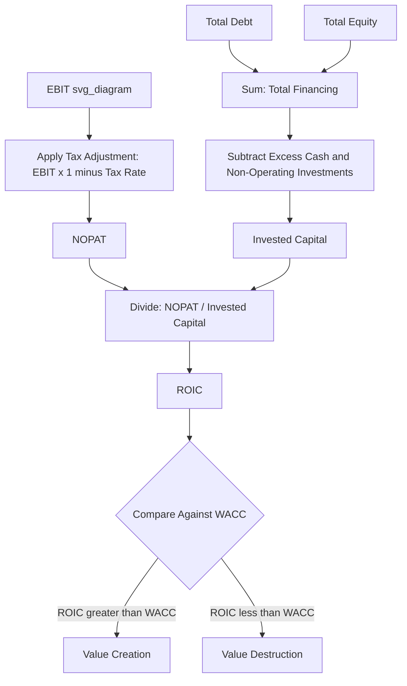

## ROIC Calculation and Components

### Conceptual Overview

Return on invested capital (ROIC) measures how efficiently a company converts the capital entrusted to it — by both debt and equity holders — into after-tax operating profit, independent of how that capital happens to be financed. ROIC is the central metric underlying nearly every capital allocation decision discussed elsewhere in this material: the hurdle rate comparisons in capital allocation frameworks, the build-vs-buy evaluation in organic growth versus M&A, the profitability index ranking under capital rationing, and the capex-versus-shareholder-return decision all ultimately reduce to comparing an activity's expected ROIC against the company's cost of capital (WACC).

Unlike return on equity (ROE), which is sensitive to a company's capital structure (leverage mechanically increases ROE even without any improvement in underlying operating performance), ROIC is a capital-structure-neutral measure of operating efficiency, making it the more appropriate metric for comparing operating performance across companies with different leverage profiles, and for evaluating whether a specific investment or business unit is creating value regardless of how the broader company happens to be financed.

### The Core ROIC Formula

$$\text{ROIC} = \frac{\text{NOPAT}}{\text{Invested Capital}}$$

Where NOPAT is Net Operating Profit After Tax and Invested Capital is the total capital (debt plus equity, net of certain non-operating items) deployed to generate that operating profit. Both the numerator and denominator require careful construction to ensure they are measuring genuinely comparable operating (as opposed to financing or non-operating) activity.

### Component 1: NOPAT (Net Operating Profit After Tax)

NOPAT represents the after-tax profit generated by core operations, before the effects of financing decisions (interest expense, which is a financing cost, not an operating cost):

$$\text{NOPAT} = \text{EBIT} \times (1 - \text{Effective Tax Rate})$$

**Why start from EBIT rather than net income**: Net income already reflects interest expense (a financing cost) and often includes non-operating items (gains/losses on asset sales, non-operating investment income). Since ROIC is meant to measure the return generated by operating assets independent of financing structure, starting from EBIT (which sits above interest expense) and then applying a tax adjustment produces a cleaner, capital-structure-neutral operating profit measure.

**Common refinements to the standard NOPAT calculation**:

- **Adjusting for non-recurring items**: One-time restructuring charges, litigation settlements, or asset impairments are often excluded to reflect a more normalized, sustainable operating profit level.
- **Adjusting for operating leases**: Under modern lease accounting standards (ASC 842/IFRS 16), the treatment of lease-related expense in EBIT can vary in its operating-versus-financing characterization; many practitioners add back the implicit interest component of lease expense to more cleanly separate operating performance from financing-like lease obligations.
- **Using the marginal or statutory tax rate versus the effective tax rate**: Some practitioners prefer the marginal statutory rate to avoid noise from one-time tax items (tax credits, prior-period tax settlements) that can distort the effective rate in a given year, though the effective rate is also commonly used, particularly when analyzing near-term realized returns rather than a normalized long-run figure.

### Component 2: Invested Capital

Invested capital represents the total capital base that has been deployed to generate the operating profit measured by NOPAT. It can be calculated via two theoretically equivalent approaches:

**Financing approach** (from the liabilities/equity side of the balance sheet):

$$\text{Invested Capital} = \text{Total Debt} + \text{Total Equity} - \text{Cash and Non-Operating Investments}$$

**Operating approach** (from the assets side of the balance sheet):

$$\text{Invested Capital} = \text{Net Working Capital (operating)} + \text{Net Fixed Assets (PP\&E)} + \text{Other Operating Long-Term Assets}$$

**[Inference]** Both approaches should, in principle, produce the same invested capital figure when constructed consistently and precisely, since they represent two views of the same balance sheet identity (total capital deployed equals total operating assets financed) — in practice, the operating approach is often considered more intuitive for understanding *what* capital is deployed in generating returns (working capital and fixed assets), while the financing approach is often more straightforward to calculate directly from readily available balance sheet financing line items.

**Why cash is typically excluded**: Excess cash and short-term investments held on the balance sheet are generally not generating the operating profit captured in NOPAT (they earn a separate, typically much lower, financial return), so including them in invested capital would understate the true return being earned on capital actually deployed into operations. Only cash required for genuine day-to-day operational liquidity (a modest "operating cash" allowance) is sometimes retained in invested capital, with the remainder treated as a non-operating financial asset excluded from the denominator.

**Treatment of goodwill and intangibles from acquisitions**: **[Inference]** This is a genuinely debated area in practice — including acquired goodwill in invested capital reflects the true total capital committed (including any acquisition premium paid), which some argue is the economically correct treatment since that capital was genuinely deployed; excluding it instead measures the return purely on the underlying operating assets, independent of how much premium was paid to acquire them. Different practitioners and academic sources adopt different conventions here, so the specific treatment should be made explicit and applied consistently whenever ROIC is used for cross-company or cross-time comparison, since the goodwill inclusion/exclusion choice can materially affect the resulting ratio for acquisitive companies.

### Worked Example: Full ROIC Calculation

Assume the following figures from a company's financial statements:

- Revenue: $800M
- EBIT: $120M
- Effective tax rate: 24%
- Total debt: $300M
- Total equity: $450M
- Cash and short-term investments: $80M (of which $20M considered required operating cash)
- Goodwill from acquisitions: $150M (included in invested capital per company convention)

**Step 1: Calculate NOPAT**

$$\text{NOPAT} = 120 \times (1 - 0.24) = 120 \times 0.76 = \$91.2\text{M}$$

**Step 2: Calculate Invested Capital (financing approach)**

$$\text{Invested Capital} = 300 + 450 - (80 - 20) = 750 - 60 = \$690\text{M}$$

(Excluding $60M of excess/non-operating cash, while retaining $20M as required operating cash within invested capital; goodwill of $150M remains embedded within total equity/debt financing and is not separately excluded under this company's stated convention.)

**Step 3: Calculate ROIC**

$$\text{ROIC} = \frac{91.2}{690} = 13.2\%$$

**Key Points**

- If this company's WACC is estimated at 9%, the 13.2% ROIC indicates a spread of +4.2%, suggesting the company is generating meaningful economic value creation on its total deployed capital base, consistent with the value creation formula referenced in capital allocation frameworks ($\text{Value Created} = \text{Capital Invested} \times (\text{ROIC} - \text{WACC})$).
- If goodwill were instead excluded from invested capital (isolating pure operating-asset returns), invested capital would fall to $540M ($690M – $150M), producing a materially higher calculated ROIC of 16.9% — illustrating why the goodwill treatment convention must be stated explicitly and applied consistently.

### Decomposing ROIC: The DuPont-Style Breakdown

ROIC can be decomposed into two multiplicative components, analogous to the classic DuPont decomposition of ROE, to distinguish margin-driven from asset-efficiency-driven return generation:

$$\text{ROIC} = \underbrace{\frac{\text{NOPAT}}{\text{Revenue}}}_{\text{NOPAT Margin}} \times \underbrace{\frac{\text{Revenue}}{\text{Invested Capital}}}_{\text{Invested Capital Turnover}}$$

**Application**: Two companies can arrive at an identical ROIC through very different operating profiles — a high-margin, lower-asset-turnover business (e.g., a specialty pharmaceutical company) versus a lower-margin, higher-asset-turnover business (e.g., a distribution or retail company) — and this decomposition makes that distinction explicit, which is often more strategically informative than the single blended ROIC figure alone.

**Continuing the worked example**:

$$\text{NOPAT Margin} = \frac{91.2}{800} = 11.4\%$$

$$\text{Invested Capital Turnover} = \frac{800}{690} = 1.16\text{x}$$

$$\text{ROIC} = 11.4\% \times 1.16 = 13.2\% \text{ (consistent with the direct calculation)}$$

### Point-in-Time vs. Average Invested Capital

**[Inference]** A methodological choice with meaningful impact on the calculated ratio: using invested capital measured at a single point in time (typically period-end) versus an average of beginning and ending invested capital for the period. Since NOPAT is a flow measure accumulated *over* the period while invested capital is a stock measure at a point in time, using an average invested capital figure (beginning plus ending, divided by two) is generally considered more methodologically consistent — particularly for companies with significant capital deployed mid-period (e.g., a large acquisition or capacity addition completed partway through the year) — since period-end invested capital in such cases would include capital that had only been in place for a fraction of the period in which the NOPAT was earned, potentially understating the calculated ROIC in the year of the capital deployment.

### ROIC in Multi-Year and Trend Analysis

**Key Points**

- A single-year ROIC snapshot can be distorted by one-time items in NOPAT (even after adjustment) or by lumpy invested capital changes (a major capacity addition or acquisition completed late in the measurement period, per point-in-time versus average considerations above) — multi-year trend analysis (typically 3–5 years) provides a more reliable read on sustainable underlying return generation.
- ROIC trend direction (improving, stable, declining) is often as informative as the absolute level for assessing whether a company's competitive position and capital allocation discipline are strengthening or weakening over time, and connects directly to the capex intensity benchmarking discussed elsewhere, since a rising capex-to-D&A ratio combined with a declining ROIC trend can signal deteriorating capital allocation efficiency even while absolute profit continues to grow.

### Common Pitfalls

- Using net income (which includes financing costs) instead of NOPAT in the numerator, producing a capital-structure-contaminated measure that is not truly comparable across companies with different leverage levels.
- Failing to exclude excess cash and non-operating investments from invested capital, understating the true return being earned on capital genuinely deployed into operations.
- Applying an inconsistent goodwill treatment convention when comparing ROIC across companies or across time for a single company that has made acquisitions, without disclosing which convention is being used.
- Using period-end invested capital rather than an average when a major capital deployment (acquisition, large capacity addition) occurred mid-period, distorting the ratio in the year of that deployment.
- Relying on a single-year ROIC figure without adjusting for non-recurring items or examining the multi-year trend, drawing conclusions from a figure that may be temporarily distorted.

### Diagram: ROIC Calculation Structure (svg_diagram)

### Related Topics

- WACC estimation methodologies
- Capital allocation frameworks and priorities
- Capex intensity benchmarking against peers
- DuPont decomposition and ROE analysis
- Lease accounting treatment (ASC 842/IFRS 16) and operating capital adjustments
- Goodwill accounting and post-acquisition return measurement
- Value creation and economic profit (EVA) frameworks
- Multi-year trend analysis in performance benchmarking