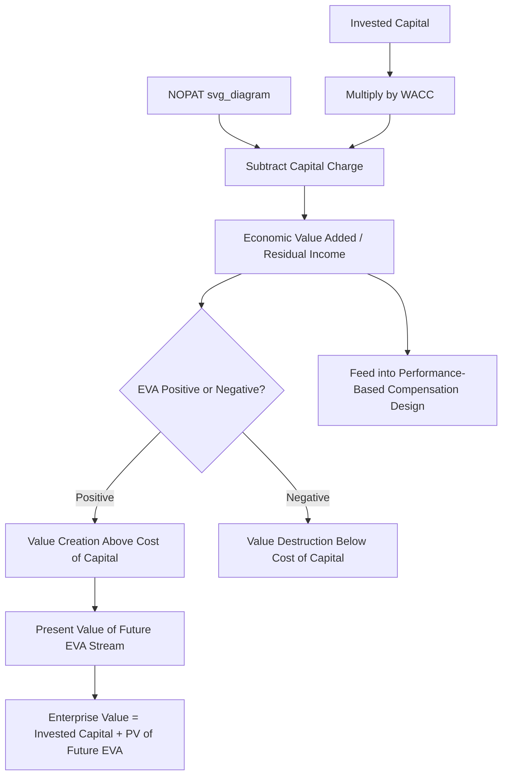

## Economic Value Added and Residual Income

### Conceptual Overview

Economic Value Added (EVA) and residual income (RI) are related performance measures that quantify value creation in absolute dollar terms rather than as a ratio, directly building on the ROIC-versus-WACC comparison introduced in ROIC calculation and components. Where ROIC answers "what rate of return is being earned on capital?", EVA and residual income answer "how many dollars of value, above and beyond what capital providers require, is this business actually creating?" — converting the percentage spread into a concrete dollar figure that can be aggregated, compared across business units of different sizes, and directly tied to compensation and capital allocation decisions.

Residual income is the more general, foundational concept from academic and managerial accounting; EVA is a specific, trademarked commercial implementation of residual income (developed and popularized by the consulting firm Stern Stewart & Co.) that applies a defined set of standardized accounting adjustments to the residual income calculation. In practice, the two terms are often used loosely interchangeably, though EVA technically refers to the specific branded methodology with its particular adjustment conventions.

### The Core Residual Income / EVA Formula

$$\text{Residual Income (EVA)} = \text{NOPAT} - (\text{Invested Capital} \times \text{WACC})$$

Equivalently, expressed using the ROIC-WACC spread directly:

$$\text{EVA} = \text{Invested Capital} \times (\text{ROIC} - \text{WACC})$$

This is the same value creation formula introduced in capital allocation frameworks, now presented as a standalone performance metric in its own right: the term $(\text{Invested Capital} \times \text{WACC})$ represents the **capital charge** — the minimum dollar return capital providers require to be adequately compensated for the capital committed — and any NOPAT generated above that capital charge represents genuine economic value creation.

### Why a Dollar Measure Complements a Ratio Measure

**[Inference]** ROIC and EVA are generally considered complementary rather than substitute metrics, since they can produce different (and sometimes conflicting) signals for capital allocation decisions:

- A business unit with a very high ROIC (e.g., 40%) but a small invested capital base may generate a smaller absolute EVA than a business unit with a more modest ROIC (e.g., 15%) but a much larger invested capital base, even though the smaller unit's ratio is more attractive on a percentage basis.
- This distinction matters directly for capital allocation: a manager incentivized purely on ROIC percentage might be reluctant to accept additional capital for a project with a "merely" above-WACC return (since it could dilute a very high existing ROIC), even though accepting that capital would increase total EVA (dollar value created) for the company — a phenomenon sometimes discussed as the tension between "return maximization" and "value maximization" in capital budgeting and management incentive design.

**Worked illustration**:

| Business Unit | Invested Capital | ROIC | WACC | EVA (Dollar Value Created) |
| --- | --- | --- | --- | --- |
| Unit A (small, high-return) | $50M | 28% | 9% | $50M x 19% = $9.5M |
| Unit B (large, moderate-return) | $400M | 13% | 9% | $400M x 4% = $16M |

Unit B generates a lower ROIC than Unit A but creates substantially more absolute dollar value ($16M vs. $9.5M), illustrating why a pure ROIC-percentage ranking, without considering the scale of invested capital, can produce misleading capital allocation priorities if the goal is total value creation rather than percentage efficiency alone.

### Standard EVA Adjustments (Stern Stewart Methodology)

The commercial EVA framework applies a series of standardized accounting adjustments to both NOPAT and invested capital, intended to convert GAAP/IFRS-based accounting figures (which reflect conservative accounting conventions designed for external financial reporting) into a more economically meaningful measure of true operating performance and capital deployed. **[Unverified]** The original Stern Stewart methodology reportedly specified over 150 potential adjustments, though in practice, most companies implementing EVA apply only a small, company-specific subset most relevant to their particular accounting policies and industry.

**Illustrative common adjustments** (not exhaustive, and specific selection varies by company):

- **R&D capitalization**: Since R&D is typically expensed immediately under standard accounting rules despite often generating multi-year benefits (similar economically to a capital investment), some EVA implementations capitalize R&D spending and amortize it over an estimated useful life, adding it back to invested capital and adjusting NOPAT accordingly.
- **Operating lease capitalization**: Historically a significant adjustment prior to modern lease accounting standards (ASC 842/IFRS 16) bringing most leases onto the balance sheet; the adjustment is less consequential under current accounting standards but the underlying principle (treating lease-financed assets similarly to owned assets for return-measurement purposes) remains relevant.
- **LIFO reserve adjustments**: For companies using LIFO (last-in-first-out) inventory accounting, adjusting inventory and cost of goods sold to a more economically representative basis.
- **Restructuring and non-recurring charge add-backs**: Similar to the NOPAT normalization adjustments discussed in ROIC calculation, removing one-time items to reflect sustainable, normalized operating performance.
- **Goodwill amortization treatment**: Adjusting for the accounting treatment of goodwill (which under current standards is subject to periodic impairment testing rather than regular amortization) to reflect a chosen economic view of acquisition-related capital deployment.

**[Inference]** The extensive, customizable nature of these adjustments is both a strength (allowing the metric to be tailored to reflect a company's true economics) and a criticism (reducing standardization and comparability across companies, and creating complexity and interpretive burden that can undermine the metric's usefulness as a simple, transparent performance signal) — this trade-off is a commonly discussed critique in both academic and practitioner literature on EVA implementation.

### Using EVA for Performance Measurement and Compensation

**Rationale for compensation linkage**: A commonly cited advantage of EVA/residual income over simpler metrics (like net income growth or ROIC alone) as a compensation basis is that it explicitly charges managers for the cost of capital they deploy, discouraging the common agency-cost problem where a manager pursues growth or asset accumulation using cheap or "free-seeming" internally generated capital without regard to whether the resulting returns actually clear the true cost of that capital.

**Bonus banking mechanisms**: **[Inference]** Some EVA-based compensation implementations use a "bonus bank" mechanism, where a portion of calculated EVA-based bonus in a given year is held back and only paid out over subsequent years (with clawback provisions if future EVA turns negative), intended to discourage managers from generating short-term EVA improvements (e.g., by cutting genuinely necessary long-term investment) at the expense of longer-term value creation — this is a design feature associated with more sophisticated EVA compensation systems rather than a universal feature of every implementation.

**Multi-year and trend considerations**: Similar to ROIC, single-period EVA can be distorted by lumpy capital deployment (a large capacity addition per the capacity-utilization-driven capex framework will temporarily depress ROIC and EVA before the new capacity's incremental NOPAT is realized), so EVA is generally most useful evaluated on a multi-year trend basis or combined with an understanding of the underlying capital deployment cycle, rather than as a rigid single-year performance target.

### EVA and Enterprise Valuation: The Value Driver Connection

Residual income / EVA has a direct mathematical link to enterprise valuation via a variant of the standard DCF framework, sometimes called the **EVA valuation model** or **residual income valuation model**:

$$\text{Enterprise Value} = \text{Invested Capital} + \sum_{t=1}^{\infty} \frac{\text{EVA}_t}{(1 + WACC)^t}$$

**Interpretation**: A company's enterprise value equals its current invested capital base plus the present value of all future economic value it is expected to create above its cost of capital. A company expected to generate EVA of exactly zero indefinitely (ROIC = WACC forever) would be valued at exactly its invested capital, with no premium for value creation — while a company expected to sustain positive EVA has a valuation premium reflecting that expected future value creation, and a company with persistently negative EVA would be valued at a discount to its invested capital base.

**[Inference]** This framework is mathematically equivalent to a standard discounted cash flow valuation when constructed consistently (both should, in principle, arrive at the same enterprise value from the same underlying cash flow assumptions), but the EVA/residual income framing is often considered more intuitively informative for understanding *why* a company is valued at a premium or discount to its invested capital — explicitly separating the "capital already deployed" component from the "expected future value creation" component of total valuation, which a standard DCF's aggregated free cash flow figures do not make as visually explicit.

### Worked Example: EVA-Based Valuation Bridge

A company has $500M of current invested capital and is expected to generate a stable EVA of $25M per year in perpetuity, with a WACC of 9%.

$$\text{PV of Perpetual EVA} = \frac{25}{0.09} = \$277.8\text{M}$$

$$\text{Enterprise Value} = 500 + 277.8 = \$777.8\text{M}$$

**Key Points**

- This implies the market (or an analyst using this framework) would value the company at roughly 1.56x its current invested capital base ($777.8M / $500M), with the premium entirely attributable to the expected sustained value creation above WACC.
- If a proposed new capex project (per capacity-utilization-driven or growth capex analysis elsewhere) is expected to generate ROIC below WACC, funding it would increase invested capital in the denominator/base term without a corresponding increase in the EVA-driven premium — actually reducing the EVA-based value bridge relative to not funding the project, directly reinforcing why ROIC-below-WACC investments destroy value even when nominally profitable on an accounting basis.

### Comparing EVA/Residual Income to Alternative Value-Based Metrics

| Metric | Measurement Basis | Key Distinction |
| --- | --- | --- |
| ROIC | Percentage/ratio | Return rate on capital, independent of scale |
| EVA / Residual Income | Absolute dollar figure | Dollar value created above capital charge, reflects scale |
| Cash Value Added (CVA) | Absolute dollar figure, cash-based | Similar to EVA but emphasizes cash flow over accrual-based NOPAT, reducing sensitivity to depreciation method choices |
| Market Value Added (MVA) | Absolute dollar figure, market-based | Cumulative market value created relative to total capital invested historically, viewed from an external market valuation perspective rather than an internal accounting-based calculation |

**[Inference]** CVA and MVA are less universally standardized and less commonly implemented than EVA/residual income in corporate practice, and are included here primarily to illustrate the broader family of value-based performance metrics sharing the same underlying "return above cost of capital" logic, rather than as equally prevalent alternatives.

### Common Pitfalls

- Using ROIC percentage alone for capital allocation ranking without considering EVA's absolute dollar value creation, potentially favoring smaller, higher-percentage-return opportunities over larger, still-value-accretive opportunities that would create more total dollar value.
- Applying an excessive number of customized EVA adjustments without clear documentation, undermining comparability and transparency even while intending to improve economic accuracy.
- Evaluating EVA on a single-period basis without accounting for the lumpy, multi-year nature of capital deployment cycles, potentially penalizing managers for temporarily depressed EVA following a genuinely value-accretive but not-yet-fully-realized capital investment.
- Designing EVA-based compensation without adequate safeguards (such as bonus banking or multi-year averaging) against short-termist behavior, where managers might underinvest in genuinely necessary long-term capex specifically to boost near-term EVA-based bonus payouts.
- Treating the EVA valuation bridge and standard DCF valuation as producing fundamentally different answers, when properly constructed they should be mathematically consistent — apparent discrepancies typically indicate an inconsistency in the underlying assumptions used across the two approaches rather than a genuine conceptual conflict between the frameworks.

### Diagram: EVA / Residual Income Calculation and Valuation Bridge (svg_diagram)

### Related Topics

- ROIC calculation and components
- WACC estimation methodologies
- Capital allocation frameworks and priorities
- Enterprise value and discounted cash flow valuation methods
- Performance-based executive compensation design
- R&D capitalization and intangible asset accounting adjustments
- Capital rationing and project ranking
- Value creation trend analysis across business units