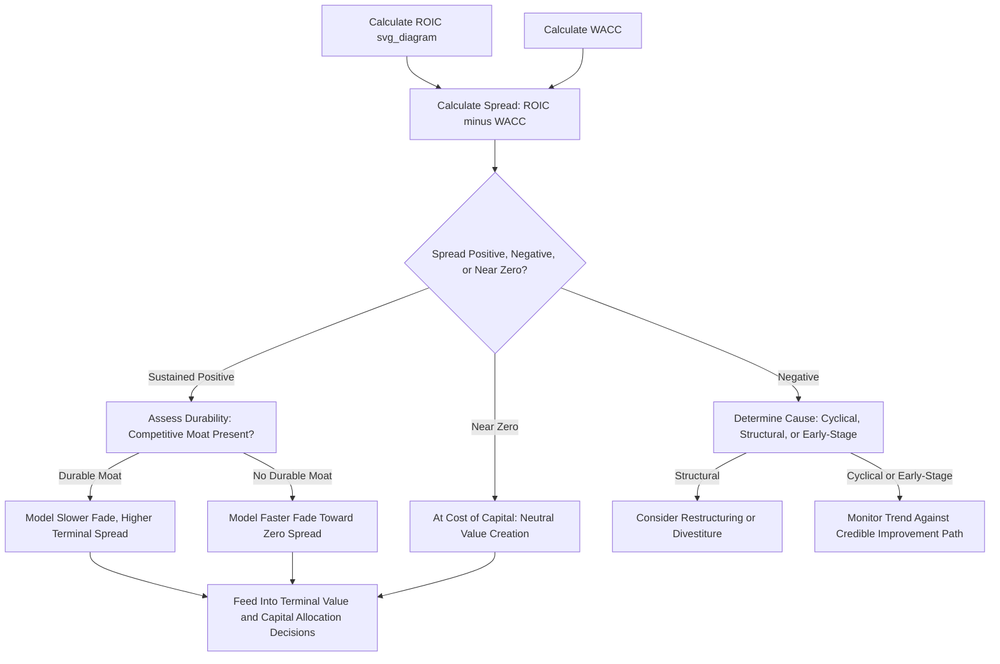

## Spread Between ROIC and Cost of Capital

### Conceptual Overview

The ROIC-WACC spread is the single most important summary statistic in value-based capital allocation: it distills the comparison between a company's (or a specific investment's) return on invested capital and its weighted average cost of capital into one number that directly indicates the direction and approximate magnitude of value creation or destruction. While ROIC calculation and components and EVA/residual income each address one side of this comparison individually, the spread itself — and how it behaves over time, across a portfolio, and under competitive pressure — is a distinct and central analytical lens in its own right.

$$\text{ROIC-WACC Spread} = \text{ROIC} - \text{WACC}$$

A positive spread indicates the company (or investment) generates returns exceeding what capital providers require, creating economic value; a negative spread indicates the reverse — economic value destruction, even in the presence of positive accounting profit. A spread of exactly zero indicates the company earns precisely its cost of capital, creating no economic value and no economic destruction, sometimes referred to as an "at cost of capital" equilibrium state.

### Why the Spread Matters More Than Either Metric Alone

**[Inference]** Both ROIC in isolation and WACC in isolation provide incomplete information for assessing whether value is being created:

- A high ROIC in an industry with a similarly high WACC (reflecting high systematic risk) may represent no more than adequate — not superior — risk-adjusted performance.
- A modest-looking ROIC in a low-WACC, low-risk industry (e.g., regulated utilities) may still represent a healthy, sustainable positive spread and genuine value creation.

This is why cross-industry comparison of ROIC levels alone can be misleading — the spread, which nets out the industry-specific and company-specific risk embedded in WACC, is the more theoretically correct basis for comparing value-creation performance across companies operating in structurally different risk environments.

### The Spread as a Signal of Competitive Advantage

**Sustained positive spreads and economic moats**: A company that sustains a meaningfully positive ROIC-WACC spread over an extended period, without that spread eroding toward zero, is generally interpreted as possessing some form of durable competitive advantage — a "moat" — that prevents competitive forces from bidding down its excess returns, since standard competitive market theory predicts that excess returns should attract new entrants and competitive responses that erode the spread over time absent some structural barrier to that competitive response.

**Common sources of durable positive spreads** (illustrative, not exhaustive):

- Structural cost advantages (economies of scale, proprietary low-cost inputs or processes)
- Intangible asset advantages (brand strength, patents, regulatory licenses, network effects)
- Switching costs that entrench a customer base against competitive alternatives
- Regulatory or geographic barriers to entry limiting new competitive capacity

**Mean reversion tendency**: **[Inference]** A substantial body of empirical corporate finance research and practitioner observation suggests that ROIC-WACC spreads, in the absence of a durable competitive moat, tend to mean-revert toward zero over time as competitive forces respond to excess returns — new entrants are attracted, existing competitors expand capacity, or customers gain bargaining power — though the specific speed and degree of this mean reversion varies substantially by industry structure, regulatory environment, and the nature of any competitive barriers present, and should not be treated as a fixed, universally quantifiable rate.

### Spread Analysis in Forecasting and Valuation

**Fade period modeling**: In DCF and other forward-looking valuation frameworks, a common practice is to model an explicit **fade period** during which an unusually high current ROIC-WACC spread is projected to gradually narrow toward a long-run sustainable level (often assumed to converge toward zero, or toward a modest positive spread reflecting the company's assessed durable competitive position), rather than assuming the current spread persists unchanged indefinitely into a terminal value calculation.

$$\text{ROIC}_t = \text{ROIC}_{\text{terminal}} + (\text{ROIC}_0 - \text{ROIC}_{\text{terminal}}) \times (1 - \text{Fade Rate})^t$$

**Application**: The specific fade rate and terminal spread assumption should be informed by the strength and durability of the company's assessed competitive moat — a company with a demonstrably strong, durable advantage might be modeled with a slower fade and a higher terminal spread than a company operating in a more commoditized, competitively exposed industry.

**Terminal value sensitivity**: Because terminal value typically represents a substantial portion of total enterprise value in most DCF models, the assumed terminal ROIC-WACC spread (and the pace of fade toward it) is often one of the single most consequential assumptions in the entire valuation — a seemingly modest difference in the assumed terminal spread (e.g., assuming a 2% versus a 0% long-run spread) can produce a materially different valuation output, warranting the sensitivity analysis techniques discussed in scenario and sensitivity analysis for capex plans applied specifically to this assumption.

### Worked Example: Spread Trend Analysis Across a Capital Cycle

A company's ROIC-WACC spread over a hypothetical multi-year period, incorporating a major capacity expansion (per the capacity-utilization-driven capex framework):

| Year | ROIC | WACC | Spread | Commentary |
| --- | --- | --- | --- | --- |
| 1 | 16% | 9% | +7% | Strong spread, capacity near-fully utilized |
| 2 | 14% | 9% | +5% | New capex begins; new capacity not yet fully productive |
| 3 | 10% | 9% | +1% | New capacity online but underutilized during ramp-up |
| 4 | 13% | 9% | +4% | Utilization improving as demand catches up to new capacity |
| 5 | 15% | 9% | +6% | Full utilization reached; spread recovers and exceeds pre-expansion level |

**Key Points**

- The temporary spread compression in Years 2–3 reflects the mechanical effect of adding invested capital (new capacity) before its full incremental NOPAT is realized — this is an expected and often value-accretive pattern (assuming the underlying capex project has a positive standalone NPV) rather than a signal of genuine value destruction, provided the multi-year trend confirms the spread recovers as capacity utilization normalizes.
- Analysts and investors evaluating spread trends during an active capex cycle should distinguish this "temporary dilution during a value-accretive investment phase" pattern from a genuine, sustained spread deterioration reflecting competitive erosion or poor capital allocation, which is a materially different and more concerning signal — this distinction often requires examining the underlying capacity utilization and demand trends (per capacity-utilization-driven capex modeling) rather than relying on the spread figure in isolation.

### Spread-Based Capital Allocation Screening

The ROIC-WACC spread serves as the practical decision criterion across virtually every capital allocation context discussed elsewhere in this material:

- **Hurdle rate setting** (capital allocation frameworks): The hurdle rate is effectively a required minimum spread (WACC plus a risk premium) that a project must clear.
- **Capital rationing and project ranking**: The profitability index is mathematically derived from the same underlying spread logic, expressed as a ratio rather than a percentage difference.
- **Portfolio approach to capital project selection**: Aggregate portfolio-level spread (weighted by invested capital across all funded projects) provides a single summary statistic for overall portfolio quality.
- **Capex versus dividends/buybacks**: The core decision rule (reinvest only if expected spread is positive; return capital otherwise) is a direct application of spread analysis.

### Spread Analysis at the Segment or Business Unit Level

**[Inference]** Calculating ROIC-WACC spreads at the individual business unit or segment level — rather than only at the consolidated company level — is generally considered a more analytically rigorous approach for internal capital allocation decisions, since a consolidated company-level spread can mask significant variation across business units (some units generating strongly positive spreads subsidizing others generating negative spreads), which is directly relevant to the portfolio approach to capital project selection and to identifying candidates for divestiture, restructuring, or capital reallocation under a zero-based capital budgeting process.

**Practical challenge**: Segment-level WACC estimation requires assessing the specific risk profile of each business unit separately (since different business lines within a diversified company often carry genuinely different systematic risk and therefore different appropriate discount rates) rather than applying a single company-wide WACC uniformly across structurally different businesses — a methodological complexity that increases the analytical burden relative to company-level spread analysis but is generally necessary for accurate segment-level capital allocation decisions in a diversified enterprise.

### Interpreting Persistently Negative Spreads

A business or investment with a persistently negative ROIC-WACC spread warrants particular scrutiny, since it indicates ongoing value destruction even if accounting profitability (net income, EBIT) remains positive:

**Possible explanations and responses**:

- **Early-stage investment not yet at scale**: A genuinely promising new venture may show a negative spread during an initial ramp-up period before achieving sufficient scale — appropriate response is continued monitoring against a credible path to positive spread, not automatic divestiture.
- **Structurally uncompetitive position**: The business may lack any durable competitive advantage in a commoditized, competitive industry — appropriate response may include restructuring, cost reduction, or divestiture consideration.
- **Temporary cyclical trough**: Industry-wide cyclical downturns can depress ROIC across an entire sector temporarily — distinguishing a cyclical trough from a structural problem typically requires comparing the company's spread trend against peer/industry spread trends over a full cycle.
- **Capital allocation discipline failure**: Continued reinvestment into a persistently negative-spread business, absent a credible turnaround thesis, represents a capital allocation failure that the frameworks discussed in capital allocation frameworks and zero-based capital budgeting are specifically designed to surface and correct.

### Common Pitfalls

- Comparing raw ROIC levels across companies or industries without adjusting for the different WACC each faces, drawing misleading conclusions about relative performance quality.
- Treating a temporary spread compression during an active, value-accretive capex cycle as equivalent to a genuine competitive-driven spread deterioration, without examining underlying capacity utilization and demand trends to distinguish the two patterns.
- Assuming a currently high spread will persist unchanged indefinitely in terminal value modeling, without applying a fade-toward-sustainable-level assumption informed by the durability of the company's competitive position.
- Relying solely on consolidated company-level spread analysis for internal capital allocation decisions, masking significant business-unit-level variation that a segment-level analysis would reveal.
- Failing to distinguish a temporary cyclical spread trough from a structural, competitively-driven spread deterioration, potentially leading to either premature divestiture of a fundamentally sound cyclical business or continued value-destructive investment in a structurally uncompetitive one.

### Diagram: ROIC-WACC Spread Analysis Framework (svg_diagram)

### Related Topics

- ROIC calculation and components
- Economic value added and residual income
- WACC estimation methodologies
- Capital allocation frameworks and priorities
- Terminal value construction and fade period modeling
- Competitive moat analysis and sustainable advantage assessment
- Linking capex to revenue growth and capacity utilization
- Segment-level performance measurement and capital allocation