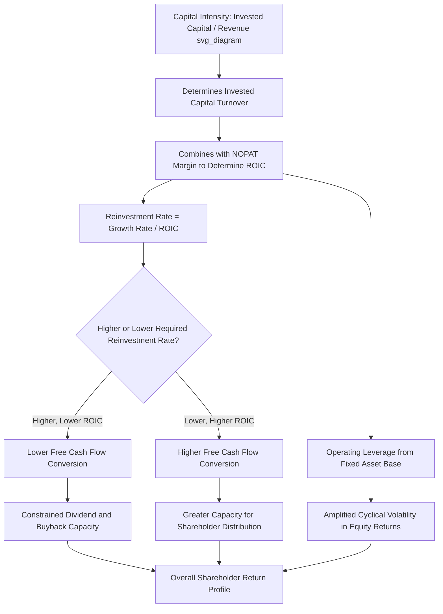

## Capital Intensity's Effect on Shareholder Returns

### Conceptual Overview

Capital intensity — the degree to which a business requires large amounts of invested capital relative to the revenue or profit it generates — has a systematic, structural effect on the shareholder returns a business can deliver, independent of the quality of its underlying operating performance. This connects directly to ROIC calculation and components, the ROIC-WACC spread, and capex intensity benchmarking: capital intensity determines how much capital must be committed to generate a given level of operating profit, which in turn shapes free cash flow generation, reinvestment requirements, and ultimately the total shareholder return a business can realistically sustain over time.

The central insight is that two businesses with identical revenue growth rates and identical operating margins can produce dramatically different shareholder returns if one requires substantially more invested capital to support that growth than the other — capital intensity is not a neutral background characteristic but an active determinant of value creation potential.

### Capital Intensity Defined and Measured

$$\text{Capital Intensity} = \frac{\text{Invested Capital (or Total Assets)}}{\text{Revenue}}$$

This is the inverse of the invested capital turnover ratio introduced in the ROIC decomposition: a high capital intensity ratio corresponds to low invested capital turnover, and vice versa. Industries at the high end of capital intensity (utilities, telecommunications infrastructure, heavy manufacturing, oil & gas, semiconductor fabrication) generally require multiple dollars of invested capital to generate each dollar of revenue; industries at the low end (software, services, asset-light retail/franchise models) generate more revenue per dollar of invested capital.

### The Free Cash Flow Mechanism: Why Capital Intensity Constrains Returns

Free cash flow available for shareholder distribution (dividends, buybacks) after funding necessary reinvestment is fundamentally:

$$\text{Free Cash Flow} = \text{NOPAT} - \text{Net Investment (Capex minus Depreciation)} - \Delta \text{Working Capital}$$

For a given growth rate, a more capital-intensive business must reinvest a larger proportion of its NOPAT to fund the incremental invested capital (both fixed assets and working capital) required to support that growth, leaving a smaller residual available for distribution to shareholders — even if its ROIC and growth rate are otherwise comparable to a less capital-intensive peer.

**Illustrative comparison**:

| Characteristic | Capital-Light Business | Capital-Intensive Business |
| --- | --- | --- |
| Revenue growth rate | 8% | 8% |
| NOPAT margin | 15% | 15% |
| Invested capital / Revenue | 0.4x | 2.0x |
| Incremental capital required to fund 8% growth | Modest | Substantial |
| Resulting free cash flow conversion (FCF / NOPAT) | High | Lower |

**Key Points**

- At identical growth rates and margins, the capital-light business converts a much higher proportion of its NOPAT into distributable free cash flow, because it requires proportionally less reinvestment to sustain the same percentage growth.
- This is the structural reason capital-light, high-growth businesses can sometimes command premium valuations relative to capital-intensive businesses with superficially similar growth and margin profiles — the capital-light business's growth is inherently less cash-consumptive.

### The Reinvestment Rate and Growth Relationship

A useful analytical identity links growth, ROIC, and the required reinvestment rate:

$$\text{Growth Rate} = \text{Reinvestment Rate} \times \text{ROIC}$$

Rearranged:

$$\text{Reinvestment Rate} = \frac{\text{Growth Rate}}{\text{ROIC}}$$

**Interpretation**: For a given target growth rate, a lower ROIC (often associated with, though not synonymous with, higher capital intensity, since ROIC also depends on margin) requires a *higher* reinvestment rate to sustain that growth, mechanically leaving less of NOPAT available as free cash flow. Conversely, a business with a very high ROIC can sustain the same growth rate while reinvesting a much smaller proportion of its profit, freeing up substantially more cash for shareholder distribution.

**Worked example**:

- Business A: 8% growth target, ROIC of 25% → required reinvestment rate = 8%/25% = 32% of NOPAT, leaving 68% available as free cash flow.
- Business B: 8% growth target, ROIC of 10% → required reinvestment rate = 8%/10% = 80% of NOPAT, leaving only 20% available as free cash flow.

Despite identical growth rates, Business A generates more than three times the free cash flow conversion of Business B, purely as a function of the ROIC difference (which is itself heavily influenced by capital intensity).

### Capital Intensity's Effect on Valuation Multiples

**[Inference]** This reinvestment-rate mechanism is a primary reason capital-light, high-ROIC businesses tend to command higher valuation multiples (e.g., EV/EBITDA, P/E) than capital-intensive, lower-ROIC businesses even at comparable growth rates, since valuation is ultimately a function of discounted free cash flow, and a lower required reinvestment rate directly translates into higher free cash flow generation per dollar of reported profit — though the specific multiple premium/discount observed in markets also reflects other factors (perceived growth durability, risk, competitive position) beyond capital intensity alone, so this should be understood as one significant contributing factor among several rather than the sole determinant of relative valuation.

**Connection to the EVA valuation bridge**: Recall from economic value added and residual income that enterprise value equals invested capital plus the present value of future EVA. A highly capital-intensive business, even with a healthy absolute ROIC-WACC spread, requires a much larger invested capital base to generate that spread — meaning a larger proportion of its total enterprise value is attributable to the "capital already deployed" component rather than the "future value creation" component, which markets sometimes value differently (with the future value-creation component often attracting a higher multiple than the capital-base component, particularly for businesses with less certain long-term competitive durability in their capital-intensive assets).

### Capital Intensity Across the Business Lifecycle

**[Inference]** Capital intensity's effect on shareholder returns interacts significantly with a business's lifecycle stage, and this interaction is a commonly observed pattern rather than a rigid rule:

- **Early growth phase**: Even a capital-intensive business can generate strong prospective (though not yet realized) shareholder value if it is deploying capital into genuinely high-ROIC opportunities, since the market values the expected future EVA stream, not just current-period free cash flow — but this phase typically generates minimal near-term free cash flow available for direct distribution, since nearly all NOPAT is being reinvested per the reinvestment-rate identity above.
- **Mature phase**: As growth moderates, the required reinvestment rate declines (per the same identity, since a lower growth target requires a lower reinvestment rate at a given ROIC), releasing a rising proportion of NOPAT as free cash flow — this is the structural basis for the common pattern (also referenced in capex versus dividends and share buybacks) of capital-intensive businesses shifting toward higher dividend/buyback payout as they mature, since the same capital intensity that constrained free cash flow during the growth phase now supports higher distributable cash flow at a lower reinvestment rate.
- **Declining phase**: If ROIC deteriorates (e.g., due to competitive erosion, per the ROIC-WACC spread discussion) while the business remains capital-intensive, the business may generate declining absolute NOPAT even while distributable free cash flow temporarily rises further (due to minimal remaining growth-driven reinvestment need) — a pattern that requires careful distinction between genuine harvest-phase cash generation and a deteriorating, potentially unsustainable competitive position.

### Capital Intensity and Financial Risk

Beyond the direct free cash flow mechanism, capital intensity affects shareholder returns through its interaction with financial risk and capital structure:

- **Operating leverage**: Capital-intensive businesses typically carry substantial fixed costs (depreciation on the large asset base, fixed maintenance costs) relative to variable costs, producing higher operating leverage — meaning profit is more sensitive to revenue/volume fluctuations than in a less capital-intensive business, which amplifies both the upside and downside of shareholder returns through economic cycles.
- **Financial leverage capacity**: **[Inference]** Capital-intensive businesses with stable, predictable cash flows (regulated utilities being a commonly cited example) are sometimes able to sustain higher financial leverage (debt relative to equity) than less capital-intensive, more cyclical businesses, since their asset base and cash flow stability can support more reliable debt service — though the appropriate leverage level ultimately depends on the specific cash flow volatility and credit profile of each business rather than capital intensity alone being determinative.
- **Combined leverage effect on equity returns**: The combination of operating leverage (from capital intensity) and financial leverage (from capital structure choices) compounds to determine how sensitive shareholder (equity) returns are to changes in underlying business performance — a highly capital-intensive, highly levered business will generally show more volatile equity returns through a cycle than a capital-light, conservatively financed business, even if their through-cycle average ROIC is similar.

### Strategic Responses to Capital Intensity Constraints

Companies in structurally capital-intensive industries have several strategic levers to mitigate the shareholder-return constraint imposed by capital intensity, several of which connect to frameworks discussed elsewhere:

- **Improving ROIC through operational efficiency or pricing power**: Since the reinvestment-rate identity shows that a higher ROIC directly reduces the required reinvestment rate for a given growth target, operational improvements that raise ROIC (margin improvement, asset utilization improvement) directly improve free cash flow conversion even without changing capital intensity itself.
- **Reducing capital intensity through business model shifts**: Some capital-intensive businesses have pursued deliberate strategies to reduce capital intensity — for example, shifting toward asset-light models (leasing rather than owning, outsourcing capital-intensive production steps, licensing rather than directly operating), though such shifts often involve trade-offs in margin, control, or competitive positioning that must be weighed against the capital efficiency benefit.
- **Moderating growth ambitions to match sustainable reinvestment capacity**: Rather than pursuing growth that requires reinvestment rates approaching or exceeding 100% of NOPAT (per the reinvestment-rate identity), some capital-intensive businesses deliberately moderate growth targets to a level sustainable within a reinvestment rate that still permits meaningful shareholder distribution, prioritizing the capital allocation discipline discussed in capital allocation frameworks and priorities.
- **Portfolio diversification across capital intensity profiles**: Diversified companies sometimes deliberately balance capital-intensive and capital-light business segments within a single portfolio, using capital-light segment cash generation to help fund capital-intensive segment growth without over-relying on external financing — directly connecting to the portfolio approach to capital project selection discussed elsewhere.

### Common Pitfalls

- Comparing shareholder return potential across companies with different capital intensity profiles using growth rate and margin alone, without accounting for the differing reinvestment rates required to sustain that growth.
- Assuming a capital-intensive business's low current free cash flow conversion reflects poor management, when it may simply reflect a genuinely high-ROIC growth phase appropriately reinvesting per the reinvestment-rate identity.
- Failing to distinguish a mature capital-intensive business's rising free cash flow (from declining reinvestment need at moderating growth) from genuine operational improvement, when it may simply reflect natural lifecycle-stage capital intensity dynamics.
- Ignoring the operating leverage implications of capital intensity when assessing the risk profile of expected shareholder returns, focusing only on average expected return without adequately weighing cyclical volatility.
- Pursuing capital-intensity-reducing business model shifts (asset-light transitions) without adequately evaluating the potential margin, control, or competitive trade-offs those shifts often involve.

### Diagram: Capital Intensity's Path to Shareholder Returns (svg_diagram)

### Related Topics

- ROIC calculation and components
- Spread between ROIC and cost of capital
- Economic value added and residual income
- Capex versus dividends and share buybacks
- Capex intensity benchmarking against peers
- Operating and financial leverage analysis
- Enterprise value and discounted cash flow valuation methods
- Business lifecycle stages and capital allocation strategy