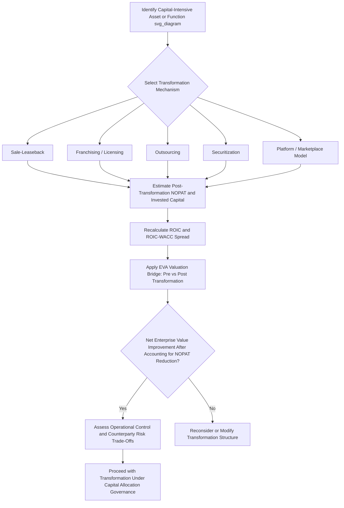

## Asset-Light Business Model Transformations

### Conceptual Overview

Asset-light business model transformation refers to the deliberate strategic process by which a company reduces the invested capital required to generate a given level of revenue or operating profit, typically by shifting from owning and directly operating capital-intensive assets toward leasing, outsourcing, licensing, franchising, or otherwise decoupling asset ownership from operational control and economic benefit. This directly extends capital intensity's effect on shareholder returns: since capital intensity mechanically constrains free cash flow conversion and shareholder distribution capacity, a successful asset-light transformation can materially improve ROIC, free cash flow generation, and valuation multiples — but the transformation involves real trade-offs that must be weighed against the capital efficiency gains.

The core mechanism is straightforward in principle: by removing owned assets from the balance sheet (or by structuring the business so that assets never need to be owned at all) while retaining the associated revenue stream or margin capture, invested capital in the denominator of ROIC falls while NOPAT in the numerator is preserved or only partially reduced, producing a higher ROIC and improved capital intensity ratio.

### Common Structural Mechanisms for Asset-Light Transformation

**1. Sale-leaseback transactions**

The company sells owned real estate, equipment, or facilities to a third party (often a REIT, specialty leasing company, or financial investor) and simultaneously leases the same asset back for continued operational use.

**Effect**: Immediate cash inflow from the sale (which can fund debt reduction, reinvestment elsewhere, or shareholder returns) in exchange for an ongoing lease obligation; invested capital falls by the net book value of the divested asset, while the recurring lease payment becomes an ongoing operating cost.

**[Inference]** Under modern lease accounting standards (ASC 842/IFRS 16), most operating leases are now capitalized on the balance sheet as a right-of-use asset and corresponding lease liability, which somewhat reduces (though does not eliminate) the invested-capital-reduction benefit of sale-leaseback transactions relative to the pre-2019 accounting environment, since a portion of the "asset-light" benefit under current accounting rules manifests more in cash flow timing and balance sheet composition than in a full removal of the asset's economic footprint from reported invested capital — the specific accounting treatment should be verified against current standards when evaluating a particular transaction's balance sheet impact.

**2. Franchising and licensing models**

Rather than directly owning and operating retail locations, restaurants, or hotel properties, the company licenses its brand, operating system, and support infrastructure to independent franchisees or licensees who provide the capital for individual location build-out and ongoing operation, in exchange for royalty and fee payments to the brand owner.

**Effect**: The franchisor's invested capital shrinks dramatically relative to a fully company-operated model, since the capital-intensive real estate, equipment, and working capital burden shifts to the franchisee, while the franchisor retains a royalty stream (typically a percentage of franchisee revenue) that requires minimal incremental invested capital to service — often producing very high ROIC on the franchisor's remaining invested capital base, though at a lower absolute margin per unit than full ownership would capture.

**3. Outsourcing capital-intensive production or operations**

Shifting manufacturing, logistics, data center operations, or other capital-intensive functions to third-party specialists (contract manufacturers, third-party logistics providers, cloud infrastructure providers) rather than owning and operating the underlying capital assets directly.

**Effect**: Removes the associated fixed assets from the company's invested capital base entirely, converting what would have been a capital expenditure and ongoing depreciation/maintenance burden into a variable or semi-variable operating cost paid to the outsourcing partner — trading capital intensity and ROIC improvement for reduced direct control over the outsourced function and dependence on the third-party partner's capability and reliability.

**4. Asset securitization and receivables monetization**

For businesses with significant working-capital-intensive assets (loan portfolios, lease receivables, trade receivables), securitizing or selling those receivables to third-party investors converts a capital-intensive balance sheet asset into an immediate cash inflow, reducing invested capital while typically retaining an origination or servicing fee stream.

**5. Platform and marketplace models**

Rather than owning the underlying inventory, real estate, or transportation assets involved in a transaction, a platform or marketplace business connects independent asset owners (drivers, property owners, independent sellers) with customers, capturing a transaction fee or commission without directly owning the capital-intensive assets involved in fulfilling the underlying transaction.

**[Inference]** This represents one of the most extreme forms of asset-light transformation, since the platform business may require minimal invested capital relative to the total transaction volume it facilitates — though this model also depends heavily on network effects and platform scale to generate sufficient transaction volume for the fee-based revenue model to produce attractive absolute returns, and carries its own distinct competitive and regulatory risk considerations (e.g., worker classification disputes in labor-intensive platform models, regulatory scrutiny of marketplace market power) not present in traditional asset-light structures like franchising.

### Worked Example: ROIC Impact of an Asset-Light Transformation

A hypothetical hotel company evaluating a transition from a fully-owned operating model to a franchise/management model:

**Before transformation (owned-and-operated model)**:

- Revenue: $500M
- NOPAT: $60M
- Invested Capital (owned real estate, FF&E, working capital): $900M
- ROIC: 60M / 900M = 6.7%

**After transformation (franchise/management model)**:

- Royalty and management fee revenue: $45M (reduced from $500M gross revenue, since franchisees now capture the retained hotel-level revenue and cost economics)
- NOPAT: $36M (lower absolute NOPAT, reflecting the fee-based rather than full-ownership economics)
- Invested Capital: $120M (retained brand/systems infrastructure and minimal remaining owned assets)
- ROIC: 36M / 120M = 30.0%

**Key Points**

- ROIC improves dramatically (6.7% to 30.0%) despite absolute NOPAT falling ($60M to $36M), because invested capital falls even more sharply (proportionally) than NOPAT does.
- Applying the reinvestment-rate identity from capital intensity's effect on shareholder returns, this transformation substantially reduces the reinvestment rate required to sustain any given future growth target, freeing up a much larger proportion of the (smaller) NOPAT base for shareholder distribution — the transformation's shareholder-return benefit stems from this improved capital efficiency and free cash flow conversion, not from the reduced absolute profit figure taken in isolation.
- Whether this transformation creates net shareholder value depends on whether the market capitalizes the resulting higher-ROIC, more capital-light fee stream at a sufficiently higher valuation multiple to offset the reduction in absolute NOPAT — a comparison requiring the enterprise valuation frameworks discussed in economic value added and residual income and capital intensity's effect on shareholder returns, not the ROIC improvement viewed in isolation.

### Valuation Implications of Asset-Light Transformation

**[Inference]** A commonly cited strategic rationale for asset-light transformations (and one that has driven a number of observed real-world corporate transactions in sectors such as hospitality, restaurants, and telecommunications infrastructure) is that capital markets frequently apply a higher valuation multiple to a high-ROIC, capital-light, fee-based or royalty-based earnings stream than to a lower-ROIC, capital-intensive, directly-owned earnings stream of comparable underlying economic scale — reflecting both the improved free cash flow conversion (per capital intensity's effect on shareholder returns) and, in some cases, reduced perceived operational and cyclical risk from no longer directly bearing asset-level fixed costs and demand risk. This multiple-expansion effect is a widely discussed strategic rationale rather than a guaranteed or precisely quantifiable outcome in every case, since actual market reception depends on execution, the specific terms of the transformation, and prevailing market conditions.

### Trade-Offs and Risks of Asset-Light Transformation

**Reduced absolute profit and potential margin dilution**: As illustrated in the worked example, absolute NOPAT frequently falls in an asset-light transformation, since the company forgoes the full economics of asset ownership in exchange for a smaller, capital-light fee or royalty stream — the transformation only creates net value if the ROIC/valuation-multiple improvement more than offsets this absolute profit reduction.

**Loss of direct operational control**: Franchising, outsourcing, and platform models all involve ceding some degree of direct control over the quality, consistency, and execution of the underlying operations to a third party (franchisee, outsourcing partner, platform participant) — this can create brand and reputational risk if the third party's execution falls short of the standards the company could enforce under direct ownership.

**Counterparty and concentration risk**: Reliance on third-party partners (franchisees, outsourcing providers, leasing counterparties) introduces a dependency the company did not previously bear — a key outsourcing partner's financial distress, capacity constraints, or strategic misalignment can disrupt operations in ways a fully owned and operated model would not be exposed to in the same manner.

**Transition costs and execution risk**: The transformation process itself (negotiating sale-leaseback terms, establishing franchisee agreements and support infrastructure, transitioning outsourced functions) typically involves significant one-time costs, organizational disruption, and execution risk during the transition period, which must be weighed against the steady-state capital efficiency benefits.

**Reduced long-term strategic flexibility**: Once capital-intensive assets are divested or operational control is ceded to third parties, reversing the transformation (re-acquiring owned assets or operational control) is often costly and slow, meaning the decision carries a degree of long-term strategic commitment that should be evaluated with the same rigor applied to other largely irreversible capital allocation decisions.

### Evaluating an Asset-Light Transformation Decision

**Key Points**

- Apply the same ROIC-WACC spread and EVA-based valuation bridge analysis (from spread between ROIC and cost of capital and economic value added and residual income) to compare the pre- and post-transformation enterprise value estimates, rather than relying on the ROIC improvement in isolation, since the absolute NOPAT reduction must be weighed against the invested capital reduction and any multiple re-rating together.
- Assess the durability and quality of the resulting fee/royalty stream — a franchise or licensing revenue stream backed by a strong, differentiated brand and a large, stable franchisee base is qualitatively different (and likely more durable) than a fee stream dependent on a small number of concentrated counterparties or a less differentiated competitive position.
- Consider the transformation as a capital allocation decision in its own right, subject to the same capital allocation frameworks and priorities discipline applied to any other major strategic capital decision, including scenario and sensitivity analysis for capex plans applied to the range of plausible post-transformation outcomes.

### Common Pitfalls

- Evaluating an asset-light transformation purely on the resulting ROIC improvement without assessing whether the absolute reduction in NOPAT is adequately offset by capital efficiency gains and any expected valuation multiple re-rating.
- Underestimating the loss of operational control and associated brand/quality risk inherent in franchising, outsourcing, or platform-based structures relative to a directly owned and operated model.
- Failing to adequately assess counterparty concentration risk introduced by the transformation, particularly when a small number of large franchisees, outsourcing partners, or leasing counterparties become individually significant to overall business performance.
- Treating the transformation as fully reversible or low-commitment, when in practice divesting capital-intensive assets or ceding operational control is often difficult and costly to reverse.
- Assuming the valuation multiple re-rating commonly associated with asset-light transformations is a guaranteed outcome rather than a strategic rationale contingent on execution quality and market reception.

### Diagram: Asset-Light Transformation Evaluation Process (svg_diagram)

### Related Topics

- Capital intensity's effect on shareholder returns
- ROIC calculation and components
- Spread between ROIC and cost of capital
- Economic value added and residual income
- Lease accounting treatment (ASC 842/IFRS 16) and balance sheet impact
- Organic growth investment versus mergers and acquisitions
- Enterprise value and valuation multiple analysis
- Capital allocation frameworks and priorities