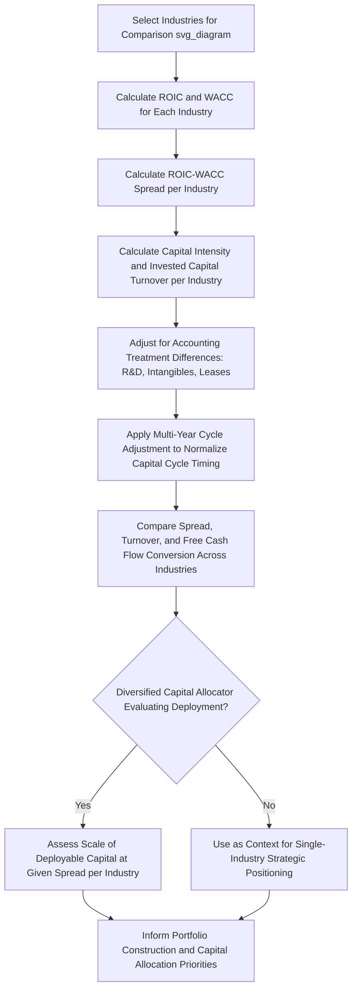

## Capital Efficiency Benchmarking Across Industries

### Conceptual Overview

Capital efficiency benchmarking across industries extends the peer-based benchmarking discussed in capex intensity benchmarking against peers to a broader cross-industry comparison of how effectively different sectors convert invested capital into returns. Where within-industry benchmarking asks "how does this company compare to its direct competitors?", cross-industry benchmarking asks a structurally different question: "how does capital efficiency vary systematically across fundamentally different business models and industry structures, and what does that variation reveal about the sources of value creation available in each?"

This cross-industry lens is particularly relevant for capital allocation decisions that span industry boundaries — diversified conglomerates deciding where to direct incremental capital across business segments, investors comparing opportunities across sectors, and companies evaluating whether to enter adjacent industries or pursue asset-light transformations that shift their position along the capital efficiency spectrum.

### Why Cross-Industry Comparison Requires Different Handling Than Peer Benchmarking

**[Inference]** Unlike within-industry peer benchmarking, where structural business model and risk characteristics are largely held constant, cross-industry comparison inherently mixes together businesses with fundamentally different risk profiles, capital structures, growth trajectories, and competitive dynamics — meaning that raw ROIC or capital intensity comparisons across industries, without appropriate context, risk more readily being misinterpreted than similar comparisons within a single industry. A raw ranking of industries by average ROIC, taken without adjusting for the different WACC each industry faces (per the ROIC-WACC spread framework) or without recognizing structural business model differences, can produce superficially interesting but analytically misleading conclusions about which industries are genuinely more attractive for capital deployment.

### Illustrative Capital Efficiency Spectrum Across Industry Types

**[Inference/Unverified]** The following is a general, illustrative characterization of typical relative capital intensity positioning across broad industry categories, based on commonly observed structural business model characteristics rather than a precise, universally sourced dataset — actual figures vary significantly by specific company, time period, and geography, and should be verified against current data for any specific analytical application:

| Industry Category | Typical Capital Intensity | Primary Capital Requirement Driver |
| --- | --- | --- |
| Software / SaaS | Very low | Minimal physical assets; primarily human capital and intangible development costs |
| Professional/consulting services | Very low | Human capital; minimal fixed assets |
| Consumer branded goods (asset-light licensing models) | Low | Brand and marketing intangibles; outsourced manufacturing |
| Retail (leased real estate model) | Low-to-moderate | Inventory and working capital; leased (not owned) real estate |
| Pharmaceuticals (branded, patent-protected) | Moderate | R&D investment (though often expensed, not capitalized, per accounting treatment); some manufacturing capacity |
| Industrial manufacturing | Moderate-to-high | Owned production facilities, equipment |
| Telecommunications infrastructure | High | Network infrastructure, spectrum licenses |
| Oil & gas (upstream/integrated) | Very high | Exploration, extraction, and refining infrastructure |
| Utilities (regulated) | Very high | Generation, transmission, and distribution infrastructure |
| Semiconductors (fabrication/IDM model) | Very high | Fabrication facilities and equipment |
| Airlines | Very high | Aircraft fleet (owned or leased) |

**Key Points**

- This spectrum broadly correlates with the invested capital turnover component of the ROIC decomposition (from ROIC calculation and components) — capital-light industries typically achieve high invested capital turnover even at moderate margins, while capital-intensive industries typically require higher margins to achieve comparable ROIC, given their structurally lower turnover.
- The positioning on this spectrum is not a direct indicator of relative attractiveness for capital deployment on its own — a highly capital-intensive but structurally advantaged industry (e.g., a regulated utility with a guaranteed regulatory return) can offer a perfectly attractive, stable risk-adjusted ROIC-WACC spread, while a capital-light but intensely competitive industry can offer persistently thin or negative spreads despite minimal capital requirements.

### Adjusting for Risk: The WACC Dimension in Cross-Industry Comparison

Since different industries typically carry structurally different systematic risk (and therefore different appropriate WACC), a rigorous cross-industry capital efficiency comparison should evaluate the ROIC-WACC spread (per spread between ROIC and cost of capital) rather than ROIC in isolation:

**Illustrative spread comparison logic**:

- A regulated utility might show a moderate absolute ROIC (e.g., 8-10%) against a relatively low WACC (e.g., 6-7%, reflecting regulatory-protected, low-volatility cash flows), producing a modest but stable positive spread.
- A software company might show a very high absolute ROIC (e.g., 30%+) against a higher WACC (e.g., 10-12%, reflecting higher business-specific and competitive risk, despite low capital intensity), producing a larger spread but with potentially greater volatility and uncertainty around its persistence.

**[Inference]** Neither industry positioning is inherently "better" from a pure capital efficiency standpoint without additional context on spread durability, growth potential, and risk tolerance of the capital allocator — this is precisely why the spread (rather than either ROIC or WACC in isolation, and rather than capital intensity in isolation) is the more theoretically sound basis for cross-industry capital efficiency comparison, though practical judgment about spread durability and strategic context remains essential rather than relying on the spread figure alone.

### Benchmarking Metrics Suited to Cross-Industry Comparison

**1. ROIC-WACC spread** (most theoretically robust): Directly comparable across industries since it nets out industry-specific risk differences embedded in WACC.

**2. Invested capital turnover** (revenue efficiency, independent of margin): Useful for isolating the pure capital-efficiency dimension separate from margin/profitability differences, since two industries can have very different margins but similar underlying capital efficiency in generating revenue per dollar of invested capital.

**3. Free cash flow conversion (FCF / NOPAT)**: As discussed in capital intensity's effect on shareholder returns, this metric directly reflects how much of reported profit an industry's typical capital intensity and growth profile allows to flow through to distributable cash, which is often more directly relevant to a shareholder-return-focused cross-industry comparison than ROIC alone.

**4. Incremental ROIC on growth capital**: Rather than comparing the stock of existing invested capital's return, comparing the *marginal* return an industry currently earns on newly deployed growth capital can reveal whether an industry's attractive historical capital efficiency is likely to persist as it continues to grow, versus reflecting a legacy, potentially non-repeatable asset base.

### Worked Example: Cross-Industry Spread Comparison

| Industry | ROIC | WACC | Spread | Capital Intensity (Invested Capital/Revenue) |
| --- | --- | --- | --- | --- |
| Regulated Utility | 8.5% | 6.5% | +2.0% | 3.2x |
| Industrial Manufacturer | 12.0% | 9.0% | +3.0% | 1.1x |
| Branded Consumer Goods | 22.0% | 8.5% | +13.5% | 0.6x |
| Enterprise Software | 35.0% | 11.0% | +24.0% | 0.2x |

**Key Points**

- The software company shows both the highest ROIC and the highest spread, alongside the lowest capital intensity — consistent with the general pattern that capital-light businesses can sustain very high ROIC and, when combined with a defensible competitive position, very high spreads, since minimal capital deployment is required to support their revenue generation.
- The regulated utility shows the lowest absolute spread but also the lowest WACC and by far the highest capital intensity — this combination, if the regulatory framework provides genuine durability to the allowed return, can still represent an attractive, low-risk, capital-absorbing investment appropriate for an investor or capital allocator specifically seeking stable, bond-like risk-adjusted returns, illustrating why "lowest spread" does not automatically mean "least attractive" once risk tolerance and capital deployment capacity needs are incorporated into the comparison.
- A diversified capital allocator choosing between deploying incremental capital into the utility versus the software business is not simply choosing the higher spread — the utility can absorb vastly more capital at its given (lower) spread than the software business likely can, given the software business's much smaller capital base and turnover profile, meaning total *dollar* value creation (per the EVA framework from economic value added and residual income) depends on both the spread and the scale of capital that can be productively deployed at that spread in each industry.

### Using Cross-Industry Benchmarking in Diversified Capital Allocation

For a diversified company or investor allocating capital across multiple industry segments, cross-industry capital efficiency benchmarking directly supports:

- **Portfolio construction decisions**: Understanding the different capital efficiency and risk profiles of business segments operating in structurally different industries, extending the portfolio approach to capital project selection framework across industry boundaries rather than only within a single-industry project set.
- **Strategic diversification or divestiture decisions**: Assessing whether a company's current industry mix positions it favorably or unfavorably on the capital efficiency spectrum relative to where incremental capital could be more productively deployed, potentially informing decisions to divest capital-intensive, lower-spread segments or to pursue asset-light business model transformations discussed elsewhere.
- **M&A target screening**: When evaluating acquisition targets across different industries (per organic growth investment versus mergers and acquisitions), cross-industry capital efficiency benchmarking provides context for assessing whether a target's industry-typical capital intensity and spread profile aligns with the acquirer's capital allocation objectives and risk tolerance.

### Limitations and Caveats of Cross-Industry Benchmarking

**[Inference]** Cross-industry capital efficiency comparisons carry several important limitations that warrant caution in interpretation:

- **Different accounting treatments across industries can distort comparability**: Industries with significant intangible investment expensed rather than capitalized (e.g., R&D-intensive pharmaceuticals, marketing-intensive consumer brands) may show understated invested capital and correspondingly inflated ROIC relative to industries where comparable investments are capitalized, a distortion the EVA adjustment methodology (from economic value added and residual income) is partly designed to address but which is not always applied consistently across the specific companies being compared.
- **Different growth stages within the same industry can produce very different capital efficiency snapshots**: A comparison capturing one industry mid-capital-cycle (per the utilization-driven capex framework) against another industry in a harvest phase can produce a misleading cross-sectional comparison unless multi-year averaging or cycle-adjustment is applied.
- **Industry classification boundaries are imperfect**: Broad industry categories often contain meaningfully different sub-segments with different capital efficiency profiles (e.g., "retail" spans capital-light e-commerce platforms and capital-intensive owned-real-estate department stores), so overly broad industry-level benchmarking can obscure more useful sub-segment-level comparison.
- **Regulatory and structural barriers limit true capital mobility across industries**: Even where a cross-industry comparison suggests capital would be more efficiently deployed in a different industry, practical, regulatory, and competitive-capability barriers often prevent a company from simply redirecting capital across fundamentally different industries, limiting the direct actionability of the comparison for a single-industry-focused company (though it remains highly relevant for genuinely diversified capital allocators).

### Common Pitfalls

- Ranking industries by raw ROIC without adjusting for differing WACC, mistaking a higher-risk, higher-required-return industry's elevated ROIC for genuinely superior capital efficiency rather than a risk-appropriate return level.
- Treating capital intensity itself as a proxy for attractiveness, when a highly capital-intensive industry with a durable, regulator-protected or structurally advantaged position can represent a perfectly sound capital allocation destination for an appropriately risk-tolerant allocator.
- Comparing industries at different points in their respective capital investment cycles without cycle-adjustment, mistaking temporary capital-efficiency divergence for a permanent structural difference.
- Ignoring the scale of capital that can be productively deployed at a given spread in each industry, focusing purely on the percentage spread without considering total dollar value creation potential (per the EVA framework) across the available capital deployment opportunity in each industry.
- Applying overly broad industry classification categories that obscure meaningful capital efficiency variation across sub-segments within the same nominal industry.

### Diagram: Cross-Industry Capital Efficiency Benchmarking Framework (svg_diagram)

### Related Topics

- Capex intensity benchmarking against peers
- ROIC calculation and components
- Spread between ROIC and cost of capital
- Capital intensity's effect on shareholder returns
- Economic value added and residual income
- Asset-light business model transformations
- Portfolio approach to capital project selection
- WACC estimation methodologies across industries