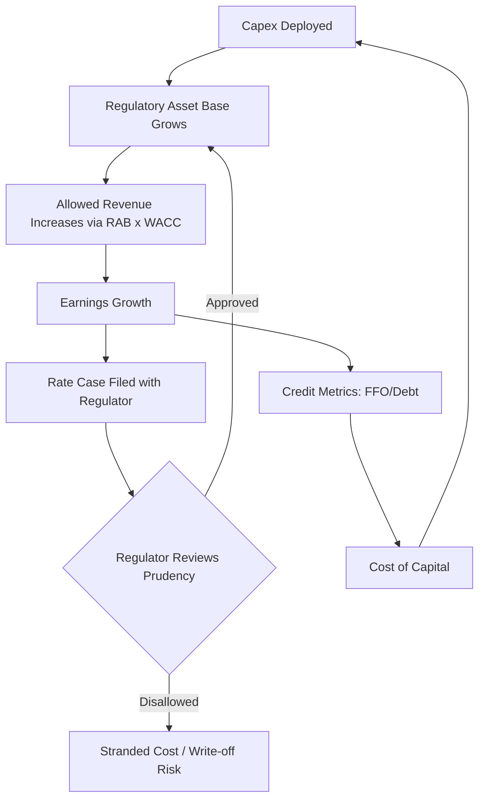

## Capital Intensity in Utilities and Infrastructure

### Definition and Sector Context

Capital intensity refers to the proportion of capital (fixed assets, infrastructure) required relative to revenue or output generated by a business. In utilities and infrastructure sectors, capital intensity is structurally the highest of any industry group, driven by the need for long-lived physical assets — generation plants, transmission networks, pipelines, water treatment facilities, and toll roads — that must be built before any revenue can be earned.

The standard metric used is:

$$\text{Capital Intensity Ratio} = \dfrac{\text{Total Assets}}{\text{Total Revenue}}$$

An alternative formulation uses capital expenditure relative to revenue:

$$\text{Capex Intensity} = \dfrac{\text{Capital Expenditures}}{\text{Total Revenue}}$$

Utilities commonly exhibit capital intensity ratios (Total Assets / Revenue) between 3x and 6x, compared to 0.5x–1.5x for typical industrial or consumer companies. Regulated utilities in particular operate under a business model where capital intensity is not incidental but structurally embedded into rate-setting mechanisms.

### Why Utilities and Infrastructure Are Inherently Capital-Intensive

**Key Points**

- **Network economics**: Electric grids, water systems, and pipelines require near-total upfront buildout before serving a single customer; there is no minimum viable product.
- **Asset longevity**: Transmission lines, dams, and pipelines have useful lives of 30–80 years, meaning capital is locked in for generations rather than recovered in a normal business cycle.
- **Natural monopoly characteristics**: Duplicating infrastructure (e.g., two competing water mains under one street) is economically wasteful, which is why regulators grant exclusive service territories in exchange for oversight of returns.
- **Regulatory asset base (RAB) model**: In regulated utilities, the value of the asset base itself becomes the mechanism through which the company earns a return, directly linking capital spending to earnings growth.
- **Maintenance capex floor**: Aging infrastructure (many U.S. and European grids were built mid-20th century) requires continuous replacement capex independent of growth capex, creating a permanently elevated capital base.

### The Regulatory Asset Base (RAB) Model

In rate-regulated utilities (common in electricity transmission/distribution, gas distribution, and water), the return earned by the company is explicitly a function of capital deployed:

$$\text{Allowed Revenue} = \text{Operating Costs} + \text{Depreciation} + (\text{RAB} \times \text{WACC})$$

Where:

- $RAB$ = Regulatory Asset Base (the regulator-approved value of invested capital, net of depreciation)
- $WACC$ = Weighted Average Cost of Capital, set by the regulator as the "allowed return"

This creates a distinctive incentive structure: **regulated utilities often have an economic incentive to grow their asset base**, because earnings growth is mechanically tied to capital deployed, not purely to operational efficiency or volume growth. This is sometimes referred to in academic literature as the Averch-Johnson effect — the tendency of rate-of-return regulated firms to over-invest in capital relative to a competitive-market optimum. [Inference: the magnitude of this effect in modern regulatory regimes is debated and varies by jurisdiction and regulatory design.]

### Capital Intensity Across Infrastructure Subsectors

| Subsector | Typical Capex/Revenue | Asset Life | Primary Capex Drivers |
| --- | --- | --- | --- |
| Electric Transmission & Distribution | 25–40% | 40–60 yrs | Grid modernization, reliability, undergrounding |
| Electric Generation (regulated) | 20–35% | 30–50 yrs | Plant construction, renewables buildout |
| Natural Gas Distribution | 20–30% | 40–65 yrs | Pipe replacement (cast iron/bare steel), safety mandates |
| Water & Wastewater | 30–50% | 50–100 yrs | Treatment plants, pipe replacement, compliance |
| Telecom (fixed-line/fiber) | 15–25% | 10–25 yrs | Fiber buildout, network upgrades |
| Toll Roads / Airports | 15–30% (lumpy) | 30–50 yrs | Expansion, runway/lane capacity |
| Railroads | 15–20% (steady-state) | 30–50 yrs | Track, rolling stock, signaling |

[Unverified: exact percentages vary meaningfully by company, jurisdiction, and reporting period; figures above represent typical ranges observed in North American and European regulated infrastructure and should be validated against current company filings for specific analysis.]

### Capex Categorization in Utilities

**Growth Capex**

- New customer connections, service territory expansion
- Generation capacity additions (especially renewables interconnection)
- Capacity upgrades to meet demand growth (e.g., data center load growth on grids)

**Maintenance / Sustaining Capex**

- Like-for-like replacement of aging assets (pole replacement, pipe relining)
- Reliability-driven reinvestment (storm hardening, vegetation-adjacent infrastructure)

**Compliance / Regulatory-Mandated Capex**

- Environmental retrofits (emissions controls, water quality standards)
- Safety-driven replacement programs (e.g., pipeline integrity management mandated by regulators after incidents)

**Resilience / Climate-Adaptation Capex**

- Grid hardening against extreme weather
- Undergrounding of distribution lines in wildfire-prone areas
- Flood defense for substations and treatment plants

This categorization matters because regulators typically evaluate **prudency** of capex differently across categories — compliance and safety capex is usually pre-approved or fast-tracked into rates, while discretionary growth capex faces more scrutiny.

### Capital Structure and Financing Implications

Because utility capex programs are large, continuous, and multi-year, financing strategy is a core part of capital intensity management:

- **Debt-heavy capital structures**: Regulated utilities typically target 45–55% debt/total capital, supported by stable, regulator-guaranteed cash flows that make them attractive to bondholders.
- **Rate base "lag"**: A time gap often exists between capital deployment and its inclusion in the rate base (regulatory lag), creating cash flow timing risk that must be bridged with short-term financing.
- **Construction Work in Progress (CWIP)**: Some regulators allow utilities to earn a return on capital while it is still under construction (CWIP in rate base); others require completion before inclusion, materially affecting financing needs and investor cash flow timing.
- **Equity issuance cycles**: Large multi-year capex programs (e.g., grid modernization, offshore wind interconnection) frequently require periodic equity raises to maintain target debt/equity ratios and preserve credit ratings.

### Credit Rating Agency Perspective

Rating agencies (Moody's, S&P) evaluate utility capital intensity primarily through:

$$\text{FFO / Debt Ratio} = \dfrac{\text{Funds From Operations}}{\text{Total Debt}}$$

A sustained increase in capex programs without proportional FFO growth compresses this ratio and can pressure credit ratings, which in turn raises the cost of capital — creating a feedback loop where capital intensity itself becomes a financial risk factor, not merely an operational one. [Inference: exact rating agency thresholds vary by agency, jurisdiction, and issuer-specific factors, and should be confirmed against current published rating methodologies.]

### Capital Intensity vs. Return Metrics

Because capital intensity is structurally high and largely non-discretionary, standard capital efficiency metrics must be interpreted differently for utilities than for asset-light industries:

$$\text{Return on Rate Base (RORB)} = \dfrac{\text{Net Operating Income}}{\text{Regulatory Asset Base}}$$

$$\text{Regulatory Return Spread} = \text{Allowed ROE} - \text{Cost of Equity}$$

Unlike unregulated capital-intensive industries (e.g., mining, heavy manufacturing) where capital efficiency is judged against market-based ROIC, utilities are judged against a **regulator-set allowed return**, making the regulatory compact itself the primary driver of whether high capital intensity translates into shareholder value creation.

### Illustration: Capital Intensity Feedback Loop in Regulated Utilities

### Diagram: Utility Capital Intensity Structure (svg_diagram)

<svg xmlns="http://www.w3.org/2000/svg" viewBox="0 0 720 380">
<text x="360" y="28" font-size="16" font-weight="bold" text-anchor="middle" fill="#1a1a1a">Utility Capital Intensity Structure (svg_diagram)</text>
<rect x="30" y="60" width="200" height="80" rx="8" fill="#dbeafe" stroke="#1e40af" stroke-width="1.5" />
<text x="130" y="90" font-size="13" font-weight="bold" text-anchor="middle" fill="#1e3a8a">Capital Deployed</text>
<text x="130" y="110" font-size="11" text-anchor="middle" fill="#1e3a8a">Capex (Growth +</text>
<text x="130" y="124" font-size="11" text-anchor="middle" fill="#1e3a8a">Maintenance + Compliance)</text>
<rect x="270" y="60" width="200" height="80" rx="8" fill="#dcfce7" stroke="#15803d" stroke-width="1.5" />
<text x="370" y="90" font-size="13" font-weight="bold" text-anchor="middle" fill="#14532d">Regulatory Asset Base</text>
<text x="370" y="110" font-size="11" text-anchor="middle" fill="#14532d">Net of Accumulated</text>
<text x="370" y="124" font-size="11" text-anchor="middle" fill="#14532d">Depreciation</text>
<rect x="510" y="60" width="180" height="80" rx="8" fill="#fef3c7" stroke="#b45309" stroke-width="1.5" />
<text x="600" y="90" font-size="13" font-weight="bold" text-anchor="middle" fill="#78350f">Allowed Revenue</text>
<text x="600" y="110" font-size="11" text-anchor="middle" fill="#78350f">OpEx + Depreciation</text>
<text x="600" y="124" font-size="11" text-anchor="middle" fill="#78350f">+ (RAB x WACC)</text>
<line x1="230" y1="100" x2="268" y2="100" stroke="#333" stroke-width="2" marker-end="url(#arrow)" />
<line x1="470" y1="100" x2="508" y2="100" stroke="#333" stroke-width="2" marker-end="url(#arrow)" />
<rect x="270" y="220" width="200" height="80" rx="8" fill="#fee2e2" stroke="#b91c1c" stroke-width="1.5" />
<text x="370" y="250" font-size="13" font-weight="bold" text-anchor="middle" fill="#7f1d1d">Rate Case Review</text>
<text x="370" y="270" font-size="11" text-anchor="middle" fill="#7f1d1d">Prudency Test by</text>
<text x="370" y="284" font-size="11" text-anchor="middle" fill="#7f1d1d">Regulatory Commission</text>
<line x1="600" y1="140" x2="600" y2="260" stroke="#333" stroke-width="2" />
<line x1="600" y1="260" x2="472" y2="260" stroke="#333" stroke-width="2" marker-end="url(#arrow)" />
<line x1="270" y1="260" x2="232" y2="260" stroke="#333" stroke-width="2" marker-end="url(#arrow)" />
<line x1="130" y1="260" x2="130" y2="140" stroke="#333" stroke-width="2" marker-end="url(#arrow)" />
<text x="150" y="200" font-size="10" fill="#444">Approved capex</text>
<text x="150" y="212" font-size="10" fill="#444">recycles into new spend</text>
<text x="360" y="350" font-size="11" text-anchor="middle" fill="#555" font-style="italic">Capital intensity in regulated utilities is a closed-loop system linking capex, asset base, and earnings</text>

</svg>

### Worked Example: Rate Base Growth and Earnings Impact

**Example**

A regulated electric utility has:

- Beginning RAB: $8.0 billion
- Annual capex: $900 million
- Annual depreciation: $400 million
- Allowed WACC (ROE component blended with debt cost): 7.2%

Ending RAB:

$$RAB_{end} = 8{,}000 + 900 - 400 = 8{,}500 \text{ million}$$

Incremental allowed revenue from rate base growth:

$$\Delta \text{Revenue} = 500 \times 7.2\% = 36 \text{ million}$$

This illustrates the direct, mechanical link between capex decisions and earnings growth in a rate-regulated model — a dynamic that does not exist in competitive, non-regulated capital-intensive industries where returns depend on market pricing power rather than a formulaic allowed return.

### Risks Specific to Infrastructure Capital Intensity

- **Stranded asset risk**: Regulators may disallow recovery of capex deemed imprudent (e.g., a canceled nuclear plant, obsolete generation assets facing early retirement due to decarbonization policy).
- **Technology and demand-side disruption**: Distributed energy resources (rooftop solar, behind-the-meter batteries) can reduce forecasted load growth, undermining the basis for prior large capex commitments ("death spiral" risk in extreme scenarios).
- **Inflation and supply chain exposure**: Large multi-year capital programs are highly sensitive to input cost inflation (steel, copper, transformers), and regulatory lag means cost overruns are not always immediately recoverable.
- **Interest rate sensitivity**: Given high debt loads, utilities are structurally more sensitive to rising rates than asset-light sectors, both for new financing and refinancing of existing debt.
- **Climate/extreme weather exposure**: Increasing frequency of extreme weather events raises both the required resilience capex and the risk of catastrophic asset loss (e.g., wildfire liability tied to transmission infrastructure).

### Capital Allocation Frameworks Used by Infrastructure Operators

**Key Points**

- **Regulatory stakeholder engagement**: Capex plans are typically pre-negotiated with regulators through multi-year rate case filings rather than pursued unilaterally.
- **Portfolio prioritization by risk-adjusted regulatory treatment**: Capex categories with higher probability of full cost recovery (safety, compliance) are prioritized over discretionary growth capex with uncertain recovery.
- **Long-term capital planning horizons**: Utilities commonly publish 5–10 year capital plans, reflecting asset planning cycles far longer than typical corporate budgeting horizons.
- **Integrated Resource Planning (IRP)**: Electric utilities in many jurisdictions are required to file IRPs, which formally link long-term capex decisions (generation, transmission) to forecasted demand and policy mandates (e.g., renewable portfolio standards).

### Related Topics

- Regulatory Asset Base (RAB) mechanics and rate case procedures
- Weighted Average Cost of Capital (WACC) determination for regulated entities
- Averch-Johnson effect and over-investment incentives under rate-of-return regulation
- Public-Private Partnerships (P3s) in infrastructure financing
- Green bonds and sustainability-linked financing for infrastructure capex
- Depreciation methodologies and their impact on rate base (straight-line vs. composite methods)
- Capital intensity comparison: regulated vs. merchant (unregulated) generation assets
- Stranded asset risk and energy transition capex reallocation
- Construction Work in Progress (CWIP) accounting treatment across jurisdictions
- Credit rating agency methodologies for infrastructure and utility issuers