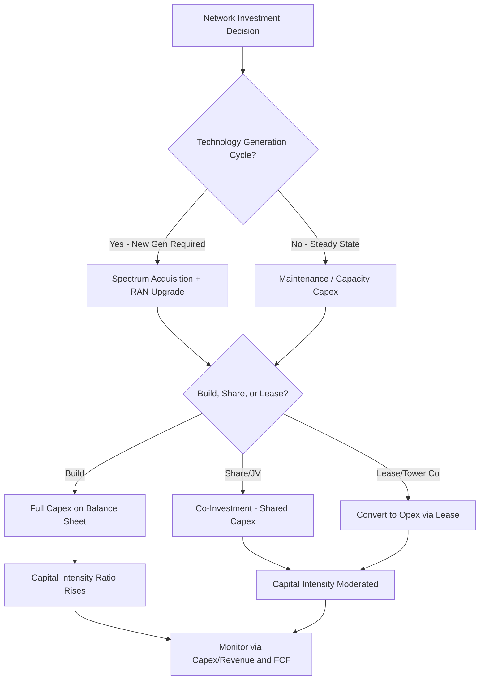

## Capital Intensity in Telecommunications Networks

### Definition and Sector Context

Telecommunications is one of the most capital-intensive industries outside of pure utilities, driven by the need to build, densify, and continuously upgrade physical network infrastructure — fiber optic cable, cell towers, radio access equipment, switching centers, and subsea/terrestrial backbone — ahead of, or in step with, subscriber revenue realization. Unlike regulated utilities, most telecom capex is driven by competitive positioning and technology cycles rather than a guaranteed regulatory return, making capital allocation decisions higher-risk and more strategically consequential.

The standard capital intensity metric used across the sector:

$$\text{Capex Intensity} = \dfrac{\text{Capital Expenditures}}{\text{Total Revenue}} \times 100\%$$

Telecom operators typically report capex intensity in the range of 15–25% of revenue during steady-state periods, with spikes to 25–35%+ during major technology transitions (e.g., 4G-to-5G buildout, fiber-to-the-home rollouts).

### Why Telecom Networks Are Structurally Capital-Intensive

**Key Points**

- **Network buildout precedes revenue**: Coverage must exist before a single subscriber can be served in a given geography — there is no incremental "minimum viable" rollout at the network layer.
- **Technology generation cycles**: The industry undergoes discrete generational shifts (2G → 3G → 4G/LTE → 5G → eventually 6G), each requiring substantial new capex even where prior infrastructure is only partially depreciated.
- **Spectrum acquisition costs**: Mobile operators must acquire government-auctioned spectrum licenses, which are capitalized and often represent billions of dollars in upfront non-recurring capex.
- **Densification requirements**: Higher-frequency spectrum (used in 5G, especially mmWave) has shorter propagation range, requiring significantly more cell sites per unit area than earlier generations.
- **Last-mile fixed infrastructure**: Fiber-to-the-home (FTTH) requires physical cable to be run to each individual premise, making fixed broadband one of the most capex-heavy subsegments per subscriber.
- **Redundancy and reliability requirements**: Carrier-grade networks require redundant paths, backup power, and resilience engineering that materially increase per-unit infrastructure cost versus best-effort networks.

### Capex Categorization in Telecommunications

**Growth / Coverage Capex**

- New market entry, geographic expansion
- New cell site construction in underserved areas
- Subsea cable systems and long-haul backbone expansion

**Capacity / Densification Capex**

- Small cell deployment, additional spectrum bands activated on existing towers
- Data center and core network capacity upgrades to handle traffic growth

**Technology Upgrade Capex**

- Generational transitions (e.g., 4G to 5G radio equipment, virtualized RAN)
- Fiber overbuild of legacy copper (DSL to FTTH migration)

**Maintenance Capex**

- Equipment replacement at end-of-life
- Software-defined network upgrades, security infrastructure

**Spectrum Capex**

- License acquisition in government auctions (treated as an intangible capital asset, amortized over the license term)

### Fixed vs. Mobile Capital Intensity Comparison

| Network Type | Typical Capex/Revenue | Cost Driver | Payback Characteristics |
| --- | --- | --- | --- |
| Mobile (4G/5G RAN) | 15–20% | Tower/site density, spectrum | Faster ARPU realization, shared infrastructure |
| Fixed Fiber (FTTH) | 25–40% (buildout phase) | Per-home passed cost | Slower payback, higher take-rate dependency |
| Cable/HFC (legacy) | 12–18% | Node splits, DOCSIS upgrades | Lower buildout cost, capacity ceiling |
| Subsea Cable Systems | Lumpy, project-based | Cable-ship deployment, landing stations | Very long payback (15–25 yrs), consortium-shared |
| Satellite (LEO broadband) | Very high upfront | Satellite manufacturing, launch costs | Deferred payback, rapid depreciation |

[Unverified: exact ratios vary substantially by operator, geography, and regulatory market structure — figures represent typically observed ranges and should be validated against specific company disclosures for analytical use.]

### Unit Economics: Cost Per Home Passed / Cost Per Subscriber

A core metric for fixed broadband capital planning:

$$\text{Cost per Home Passed} = \dfrac{\text{Total Network Capex}}{\text{Homes Passed}}$$

$$\text{Cost per Subscriber} = \dfrac{\text{Cost per Home Passed}}{\text{Take Rate}}$$

**Example**

An FTTH operator spends $400 million to pass 500,000 homes:

$$\text{Cost per Home Passed} = \dfrac{400{,}000{,}000}{500{,}000} = \$800$$

If the achieved take rate (percentage of passed homes that subscribe) is 40%:

$$\text{Cost per Subscriber} = \dfrac{\$800}{0.40} = \$2{,}000$$

This illustrates why take-rate assumptions are the single largest driver of fiber project economics — a shortfall in take rate directly inflates the effective capital cost per paying customer, often turning a marginally profitable buildout into a value-destructive one. [Inference: the specific take-rate threshold for project viability depends on ARPU, churn, and cost of capital assumptions specific to each operator and market.]

### 5G-Specific Capital Intensity Dynamics

5G deployment introduced several capital intensity dynamics not present in earlier mobile generations:

- **Dual-mode buildout**: Operators often must maintain and upgrade 4G LTE core/RAN infrastructure simultaneously with 5G rollout, rather than a clean replacement, elevating combined capex during the transition period.
- **Massive MIMO and active antenna systems**: 5G radio equipment is meaningfully more expensive per site than 4G-era equipment due to more complex antenna arrays.
- **Core network virtualization**: The shift toward cloud-native, virtualized 5G core networks (5G Standalone) shifts some capex from proprietary hardware toward compute infrastructure, with implications for depreciation schedules and vendor economics.
- **Fixed Wireless Access (FWA)**: 5G FWA has been used by some operators as a lower-capex alternative to fiber for last-mile broadband, trading off lower buildout cost against spectrum capacity constraints.
- **Network slicing infrastructure**: Enterprise-oriented 5G services requiring guaranteed SLAs (e.g., network slicing) require additional core and orchestration investment beyond baseline coverage capex. [Speculation: monetization of network slicing at scale remains commercially unproven across the industry as of the most recent public disclosures, and capex directed at this use case carries elevated demand-realization risk.]

### Depreciation and Asset Life Considerations

Telecom capital assets have highly varied useful lives, which materially affects capital intensity metrics over time:

| Asset Class | Typical Useful Life |
| --- | --- |
| Fiber optic cable (outside plant) | 20–25 years |
| Cell towers / passive infrastructure | 15–20 years |
| Active radio equipment (RAN) | 5–8 years |
| Core network / switching equipment | 5–10 years |
| Spectrum licenses | Amortized over license term (often 10–20 years) |
| Customer premises equipment (CPE) | 3–5 years |

The mismatch between long-lived passive infrastructure (fiber, towers) and short-lived active equipment (radio, core) creates a "rolling" capital intensity profile — passive infrastructure capex is front-loaded and depreciates slowly, while active equipment requires recurring reinvestment on a much shorter cycle, keeping capex intensity structurally elevated even in mature markets.

### Capital-Light Strategies Used to Manage Telecom Capital Intensity

**Key Points**

- **Infrastructure sharing / tower company spin-offs**: Many operators have divested passive tower infrastructure to independent tower companies (e.g., sale-leaseback structures), converting fixed capex into variable opex (lease payments) and improving reported capital efficiency.
- **Network sharing agreements**: Competing operators jointly build or share RAN infrastructure in a geography (common in parts of Europe and Asia) to reduce duplicative capex.
- **Fiber joint ventures and co-investment**: Operators increasingly partner with infrastructure funds or co-investors to share FTTH buildout costs in exchange for shared ownership or wholesale access rights.
- **Open RAN (O-RAN)**: Disaggregating radio access network hardware and software aims to reduce vendor lock-in and hardware costs over time by enabling multi-vendor interoperability. [Inference: realized capex savings from Open RAN adoption vary significantly by deployment and remain an area of ongoing industry debate regarding total cost of ownership versus integration complexity.]
- **Wholesale/open-access fiber models**: Some fiber builders operate as wholesale-only infrastructure providers, monetizing the network across multiple retail ISPs rather than bearing customer acquisition capital themselves.

### Illustration: Telecom Capital Intensity Decision Flow

### Diagram: Telecom Capex Allocation by Network Layer (svg_diagram)

<svg xmlns="http://www.w3.org/2000/svg" viewBox="0 0 720 360">
<text x="360" y="26" font-size="16" font-weight="bold" text-anchor="middle" fill="#1a1a1a">Telecom Capex Allocation by Network Layer (svg_diagram)</text>
<rect x="40" y="60" width="640" height="50" rx="6" fill="#dbeafe" stroke="#1e40af" stroke-width="1.5" />
<text x="360" y="90" font-size="13" font-weight="bold" text-anchor="middle" fill="#1e3a8a">Spectrum Licenses (Regulatory Acquisition, Amortized 10-20 yrs)</text>
<rect x="40" y="125" width="640" height="50" rx="6" fill="#dcfce7" stroke="#15803d" stroke-width="1.5" />
<text x="360" y="155" font-size="13" font-weight="bold" text-anchor="middle" fill="#14532d">Passive Infrastructure: Towers, Ducts, Fiber Outside Plant (15-25 yrs)</text>
<rect x="40" y="190" width="640" height="50" rx="6" fill="#fef3c7" stroke="#b45309" stroke-width="1.5" />
<text x="360" y="220" font-size="13" font-weight="bold" text-anchor="middle" fill="#78350f">Active Equipment: RAN, Core, Switching (5-8 yrs)</text>
<rect x="40" y="255" width="640" height="50" rx="6" fill="#fee2e2" stroke="#b91c1c" stroke-width="1.5" />
<text x="360" y="285" font-size="13" font-weight="bold" text-anchor="middle" fill="#7f1d1d">Customer Premises Equipment / Devices (3-5 yrs)</text>

<text x="360" y="330" font-size="11" text-anchor="middle" fill="#555" font-style="italic">Layers depreciate at different rates, producing a rolling reinvestment cycle</text>

<line x1="360" y1="112" x2="360" y2="123" stroke="#333" stroke-width="1.5" marker-end="url(#arrow2)" />
<line x1="360" y1="177" x2="360" y2="188" stroke="#333" stroke-width="1.5" marker-end="url(#arrow2)" />
<line x1="360" y1="242" x2="360" y2="253" stroke="#333" stroke-width="1.5" marker-end="url(#arrow2)" />
</svg>

### Key Financial Metrics for Assessing Telecom Capital Intensity

$$\text{Free Cash Flow} = \text{EBITDA} - \text{Capex} - \Delta\text{Working Capital} - \text{Interest} - \text{Taxes}$$

Because telecom EBITDA margins are typically strong (35–45%+) but capex intensity is also high, **free cash flow conversion** (FCF as a percentage of EBITDA) is the metric most closely watched by investors and rating agencies, since it isolates how much of the operating profitability is actually available after reinvestment.

$$\text{EBITDA-Capex Margin} = \dfrac{\text{EBITDA} - \text{Capex}}{\text{Revenue}}$$

A declining EBITDA-Capex margin over a multi-year period, even with stable or growing EBITDA margins, is a common early indicator of an intensifying technology upgrade cycle straining free cash flow generation.

### Risks Specific to Telecom Capital Intensity

- **Technology obsolescence risk**: Capital committed to one generation of technology can be stranded or accelerated into write-off if adoption timelines shift (e.g., early 3G overbuild in some markets became obsolete faster than anticipated amortization schedules assumed).
- **Take-rate risk in fixed broadband**: Fiber buildout economics are highly sensitive to actual subscriber uptake versus planning assumptions, as shown in the unit economics example above.
- **Competitive overbuild risk**: In markets with multiple fiber or 5G FWA competitors targeting the same footprint, capital intensity can rise industry-wide without proportional revenue growth, compressing sector-wide returns on invested capital.
- **Spectrum auction cost inflation**: Competitive spectrum auctions can result in capex outlays significantly above initial valuation models, particularly in mature markets with scarce available bandwidth.
- **Vendor concentration and supply chain risk**: Reliance on a small number of network equipment vendors (with some markets further constrained by geopolitical restrictions on vendor selection) can affect both capex cost and deployment timelines.
- **Interest rate sensitivity**: Telecom's typically elevated debt levels (used to fund large capex programs) make the sector sensitive to refinancing costs during periods of higher interest rates.

### Capital Allocation Frameworks in Telecom

**Key Points**

- **Return on Invested Capital (ROIC) versus WACC discipline**: Unlike regulated utilities, telecom operators must generate returns above a market-determined cost of capital, making capital allocation decisions inherently higher-risk.
- **Geographic prioritization by competitive density**: Fiber and 5G rollout is frequently sequenced by expected take rate and competitive intensity rather than uniform national coverage, particularly for privately funded buildouts.
- **Capex guidance as an investor signal**: Multi-year capex intensity guidance (e.g., "capex as % of revenue declining from X% to Y% by year Z") is a standard element of telecom investor communications, reflecting the sector's sensitivity to capital discipline as a valuation driver.
- **Buildout phase versus harvest phase framing**: Telecom capital planning is commonly organized around a "build" phase (elevated capex intensity, negative or low FCF) followed by a "harvest" phase (capex intensity declines as the asset base matures and monetizes), a framework frequently referenced in fiber and 5G rollout investor narratives. [Inference: the timing and shape of the transition from build to harvest phase is company- and market-specific and subject to execution risk.]

### Related Topics

- Fiber-to-the-home (FTTH) economics and take-rate modeling
- Tower company sale-leaseback structures and REIT conversion
- Open RAN architecture and total cost of ownership analysis
- Spectrum auction design and valuation methodologies
- Network sharing and infrastructure co-investment agreements
- 5G Standalone core virtualization and cloud-native network economics
- Subsea cable consortium financing models
- EBITDA-Capex margin as a telecom valuation metric
- Fixed Wireless Access (FWA) as a capital-light broadband alternative
- Comparative capital intensity: telecom versus regulated utilities