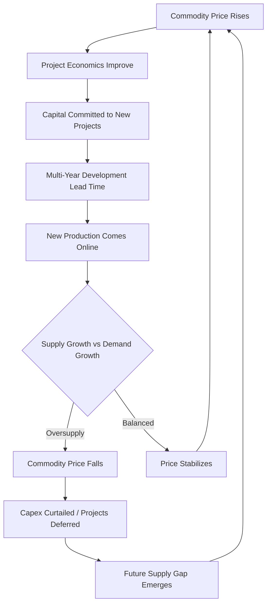

## Capital Intensity in Oil, Gas and Mining

### Definition and Sector Context

Oil, gas, and mining constitute the extractive industries, characterized by capital intensity driven not by network buildout (as in utilities and telecom) but by the physical and geological requirements of locating, accessing, and extracting finite natural resources. Capital intensity here is fundamentally shaped by the **depleting asset** nature of the underlying resource — each unit of capital invested is tied to a finite reserve that is consumed over the project's life, requiring continuous reinvestment in new reserves or extraction capacity simply to sustain output, let alone grow it.

$$\text{Capex Intensity} = \dfrac{\text{Capital Expenditures}}{\text{Total Revenue}} \times 100\%$$

Capital intensity in these sectors is highly cyclical and commodity-price dependent, typically ranging from 15% of revenue in mature, low-cost operations to 40%+ during major project construction phases or commodity price upcycles.

### Structural Drivers of Capital Intensity

**Key Points**

- **Resource depletion**: Unlike a factory or network asset, an oil well or ore deposit has a finite, depleting reserve base — capital must be continuously redeployed into exploration and new project development merely to replace produced volumes ("reserve replacement").
- **Long lead times**: Major upstream oil/gas and mining projects commonly take 5–15 years from discovery/exploration to first production, requiring capital to be committed years before any revenue is generated.
- **Geological and technical uncertainty**: Exploration capex is inherently risk-capital in nature — a significant proportion of exploration wells and mineral exploration programs do not result in commercially viable discoveries.
- **Remote and harsh operating environments**: Deepwater, Arctic, and high-altitude/remote mining locations require substantially higher capex per unit of resource due to logistics, specialized equipment, and infrastructure buildout (roads, power, ports) that must often be constructed from scratch.
- **Regulatory and environmental compliance**: Permitting, environmental impact studies, and reclamation/decommissioning obligations add substantial capital requirements beyond the extraction infrastructure itself.
- **Declining ore grades / resource quality**: In mining particularly, average ore grades have declined over time in many commodities, requiring more material to be moved and processed per unit of output, raising capital intensity per unit of production over time. [Inference: the rate of ore grade decline and its capital impact varies significantly by commodity and deposit type, and specific trend claims should be verified against current geological survey data.]

### Capex Categorization Across the Value Chain

**Upstream Oil & Gas**

- **Exploration capex**: Seismic surveys, exploratory drilling (high risk, high write-off probability)
- **Development capex**: Production wells, platforms, subsea infrastructure, processing facilities
- **Sustaining capex**: Infield drilling, workovers, infrastructure maintenance to offset natural decline rates

**Midstream (Oil & Gas)**

- Pipelines, storage terminals, LNG liquefaction/regasification facilities
- Generally lower-risk, more utility-like capital profile (often under long-term contracts)

**Mining**

- **Exploration capex**: Drilling programs to define and upgrade mineral resources/reserves
- **Project development capex**: Mine construction, processing plant (mill/concentrator), tailings storage facilities, associated infrastructure (power, water, rail/road)
- **Sustaining capex**: Equipment replacement, pit pushbacks, underground development to access ore
- **Expansion capex**: Mill throughput expansions, new pit phases, mine life extensions
- **Closure/reclamation capex**: Legally mandated environmental restoration, often funded through dedicated reclamation trusts or bonds

### Capital Intensity Comparison Across Extractive Subsectors

| Subsector | Typical Capex/Revenue (steady-state) | Project Lead Time | Primary Capex Risk |
| --- | --- | --- | --- |
| Conventional Onshore Oil & Gas | 15–25% | 1–3 yrs | Commodity price, decline rate |
| Offshore Shallow Water | 25–35% | 3–6 yrs | Platform cost, weather/logistics |
| Deepwater / Ultra-Deepwater | 35–50%+ | 5–10 yrs | Extreme capex per well, technical risk |
| LNG (liquefaction) | Very high, lumpy | 5–8 yrs | Mega-project cost overrun risk |
| Open-Pit Mining (base metals) | 15–30% | 5–10 yrs | Ore grade, strip ratio, permitting |
| Underground Mining | 20–35% | 6–12 yrs | Development capex, ground conditions |
| Coal (thermal/metallurgical) | 10–20% | 3–7 yrs | Regulatory/ESG-driven capital access |

[Unverified: figures represent broadly observed industry ranges; actual capital intensity varies materially by specific project geology, jurisdiction, and prevailing commodity price environment, and should be corroborated against current company and industry data for precise analysis.]

### Reserve Replacement and Capital Intensity

A defining metric unique to extractive industries:

$$\text{Reserve Replacement Ratio} = \dfrac{\text{Reserves Added During Period}}{\text{Production During Period}}$$

A ratio below 100% indicates the company is depleting reserves faster than it is replacing them — an unsustainable trajectory without either increased exploration/development capex or acquisition of additional reserves. This creates a structural floor on required reinvestment that does not exist in most other industries: **even a company with no growth ambitions must still deploy substantial "maintenance" capital simply to hold production flat**, because the underlying asset (the reservoir or ore body) is being physically consumed.

$$\text{Finding \& Development (F\&D) Cost} = \dfrac{\text{Exploration + Development Capex}}{\text{Reserves Added (boe or tonnes)}}$$

F&D cost is a core capital efficiency metric in upstream oil & gas, analogous to all-in sustaining cost in mining (below).

### All-In Sustaining Cost (AISC) — Mining's Core Capital Efficiency Metric

Mining companies commonly report **All-In Sustaining Cost (AISC)**, a metric that explicitly incorporates sustaining capital intensity into the cost structure, distinguishing it from simple cash operating costs:

$$\text{AISC} = \text{Cash Operating Costs} + \text{Sustaining Capex} + \text{Corporate G\&A} + \text{Reclamation Accretion}$$

This metric is significant because it demonstrates that in mining, **ongoing capital reinvestment is treated as a genuine cost of production**, not a discretionary growth decision — reflecting the same reserve-depletion dynamic seen in oil & gas F&D costs.

**Example**

A gold mining operation reports:

- Cash operating costs: $900/oz
- Sustaining capex: $150/oz (equivalent)
- Corporate G&A: $40/oz
- Reclamation accretion: $10/oz

$$\text{AISC} = 900 + 150 + 40 + 10 = \$1{,}100/\text{oz}$$

At a gold price of $1,900/oz, this implies an AISC margin of $800/oz — but this margin excludes growth/expansion capex, meaning true full-cycle profitability (including exploration and expansion investment) is materially lower than the headline AISC margin suggests.

### Capital Cyclicality and the "Boom-Bust" Investment Pattern

**Key Points**

- **Pro-cyclical capex behavior**: Historically, extractive industry capex has tended to rise sharply during commodity price upcycles (when capital is cheapest to raise and project returns appear most attractive) and contract sharply during downturns — a pattern widely critiqued for contributing to subsequent supply gluts and price crashes.
- **Long project lead times amplify cyclicality**: Because major projects sanctioned during a price upcycle often do not reach first production for 5+ years, new supply frequently arrives after the price cycle has already turned, exacerbating price volatility.
- **Capital discipline era (post-2014/2015 oil price crash and post-2011 mining downturn)**: Many oil & gas and mining companies publicly shifted capital allocation frameworks toward prioritizing free cash flow and shareholder returns over production growth, following investor pressure after a period of capital misallocation during the prior commodity upcycle. [Inference: the durability of this capital discipline framework across companies and future commodity cycles remains uncertain and is subject to change based on commodity price environments and investor sentiment.]
- **Energy transition capital reallocation**: Some oil & gas majors have begun allocating a portion of capex toward lower-carbon energy sources, though the pace and scale of this reallocation varies significantly by company and is an area of ongoing strategic and investor debate. [Speculation: the long-term capital allocation split between traditional hydrocarbon and transition-related investment across the sector is not yet settled and should not be treated as a fixed trend.]

### Illustration: Extractive Industry Capital Cycle

### Diagram: Capital Deployment Across a Mine/Field Life Cycle (svg_diagram)

<svg xmlns="http://www.w3.org/2000/svg" viewBox="0 0 720 380">
<text x="360" y="26" font-size="16" font-weight="bold" text-anchor="middle" fill="#1a1a1a">Capital Deployment Across a Mine/Field Life Cycle (svg_diagram)</text>
<line x1="60" y1="300" x2="680" y2="300" stroke="#333" stroke-width="2" />
<text x="370" y="330" font-size="12" text-anchor="middle" fill="#333">Time (Years)</text>
<polyline points="60,300 140,280 220,120 320,90 460,110 560,180 640,240 680,270" fill="none" stroke="#1e40af" stroke-width="3" />
<text x="140" y="270" font-size="10" fill="#1e3a8a">Exploration</text>
<text x="220" y="105" font-size="10" fill="#1e3a8a">Development Capex Peak</text>
<text x="460" y="95" font-size="10" fill="#1e3a8a">Sustaining Capex</text>
<text x="620" y="255" font-size="10" fill="#1e3a8a">Closure/Reclamation</text>
<rect x="60" y="60" width="130" height="20" fill="#fee2e2" opacity="0.6" />
<text x="125" y="55" font-size="10" text-anchor="middle" fill="#7f1d1d">High-risk capital, no revenue</text>
<rect x="190" y="60" width="200" height="20" fill="#fef3c7" opacity="0.6" />
<text x="290" y="55" font-size="10" text-anchor="middle" fill="#78350f">Construction, pre-revenue</text>
<rect x="390" y="60" width="220" height="20" fill="#dcfce7" opacity="0.6" />
<text x="500" y="55" font-size="10" text-anchor="middle" fill="#14532d">Production, sustaining capex, FCF generation</text>
<rect x="610" y="60" width="70" height="20" fill="#dbeafe" opacity="0.6" />
<text x="645" y="55" font-size="9" text-anchor="middle" fill="#1e3a8a">Reclamation</text>

<text x="360" y="360" font-size="11" text-anchor="middle" fill="#555" font-style="italic">Capital is committed years before revenue; sustaining capex persists throughout production life</text>

</svg>

### Financing Structures for Extractive Capital Projects

- **Reserve-based lending (RBL)**: Common in upstream oil & gas, debt facilities are sized against the value of proven reserves, directly linking financing capacity to the depleting asset base.
- **Project finance / non-recourse structures**: Large mining and LNG projects are frequently financed through special-purpose vehicles with debt secured against project cash flows rather than the parent company balance sheet, isolating project-specific capital risk.
- **Streaming and royalty financing**: Mining companies increasingly use streaming agreements (selling a portion of future production at a fixed price for upfront capital) and royalty financing as capital-light alternatives to traditional equity/debt for project development.
- **Joint ventures and farm-outs**: Sharing exploration and development risk/capital across multiple partners is standard practice, particularly for high-cost, high-uncertainty projects (deepwater, frontier exploration).
- **Government/sovereign participation**: Many jurisdictions require state participation (national oil companies, state mining enterprises) in resource projects, affecting both capital structure and project decision-making authority.

### Risks Specific to Extractive Industry Capital Intensity

- **Commodity price risk**: Project economics are highly sensitive to price assumptions made at the time of capital sanction, which may not hold across the multi-year construction and multi-decade production period.
- **Exploration risk / dry hole risk**: A substantial portion of exploration capex may be written off entirely if no commercially viable resource is found.
- **Cost overrun risk on mega-projects**: Large oil & gas and mining projects have a well-documented history of cost overruns relative to initial capital estimates, driven by technical complexity, remote logistics, and long construction timelines. [Inference: the magnitude and frequency of cost overruns vary by project type, era, and region, and specific statistics should be sourced from current industry benchmarking studies.]
- **Political and expropriation risk**: Resource nationalism, changes in royalty/tax regimes, and expropriation risk are material considerations for capital committed in certain jurisdictions.
- **Stranded asset / energy transition risk**: Long-lived hydrocarbon and thermal coal assets face increasing risk that they may not reach originally planned economic life due to decarbonization policy, demand shifts, or asset-level ESG-driven capital access constraints.
- **ESG and permitting risk**: Increasing environmental and social governance scrutiny has lengthened permitting timelines and, in some jurisdictions, increased the probability of project delay or cancellation after capital has already been committed.
- **Decommissioning/reclamation liability**: Legally mandated end-of-life obligations represent a capital commitment that may not be fully funded or accurately estimated at the time of initial project sanction.

### Capital Allocation Frameworks

**Key Points**

- **Return-based capital allocation hierarchy**: Post-downturn capital discipline frameworks commonly prioritize: (1) sustaining capex to protect the base business, (2) balance sheet strength/debt reduction, (3) shareholder returns (dividends/buybacks), and (4) growth capex — a reordering from the growth-first approach common in prior commodity cycles.
- **Hurdle rate discipline**: Extractive companies typically apply elevated internal hurdle rates (required minimum IRR) to new project capital relative to WACC, reflecting the additional geological, commodity price, and execution risk embedded in these investments.
- **Portfolio high-grading**: Capital is increasingly allocated toward the lowest-cost, highest-return assets in a company's portfolio, with higher-cost or higher-risk assets divested or deprioritized — a trend frequently cited in post-2014 oil & gas and post-2011 mining capital allocation strategy.
- **Scenario/stress testing against commodity price decks**: Major capital sanction decisions are typically stress-tested against a range of commodity price scenarios (including low-price cases) given the multi-decade revenue exposure of a single capital decision.

### Related Topics

- All-In Sustaining Cost (AISC) methodology and cross-company comparability
- Reserve-based lending mechanics and borrowing base redeterminations
- Finding & Development (F&D) cost and finding & development efficiency ratios
- Streaming and royalty financing structures in mining capital markets
- Capital discipline frameworks and shareholder return prioritization post-2014
- Decommissioning and reclamation liability accounting (ARO — Asset Retirement Obligations)
- Deepwater versus shale capital intensity comparison in upstream oil & gas
- Energy transition capital reallocation among integrated oil & gas majors
- Project finance and non-recourse debt structures for mega-projects
- Ore grade decline and its long-term impact on mining capital intensity