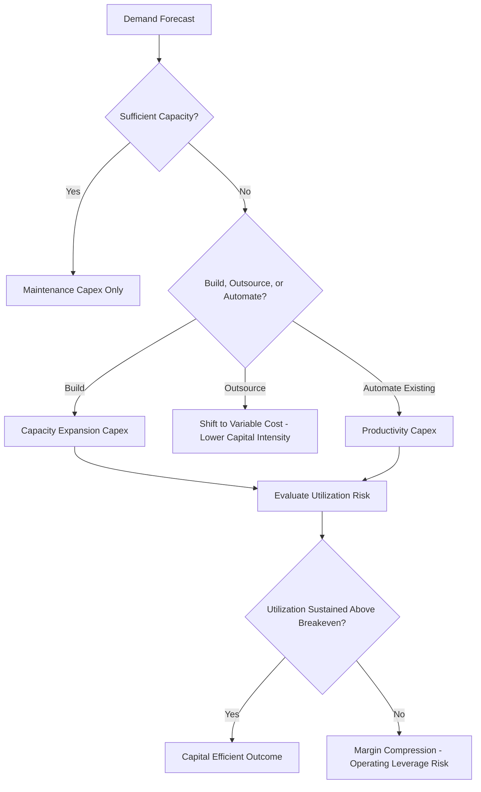

## Capital Intensity in Manufacturing and Industrials

### Definition and Sector Context

Manufacturing and industrials represent a heterogeneous sector where capital intensity varies more widely than in utilities, telecom, or extractives — ranging from relatively asset-light assembly operations to extremely capital-intensive process industries like steel, chemicals, and semiconductors. Unlike network or resource-depletion industries, manufacturing capital intensity is primarily driven by **production technology, scale economics, and capacity utilization dynamics**, making it more sensitive to demand cyclicality and more amenable to capital-light strategic choices (outsourcing, asset-light models) than utilities or extractives.

$$\text{Capex Intensity} = \dfrac{\text{Capital Expenditures}}{\text{Total Revenue}} \times 100\%$$

Manufacturing subsectors span an unusually wide range: from 2–5% of revenue for light assembly and consumer goods manufacturing, up to 15–25%+ for heavy process industries (semiconductors, steel, chemicals) and capital-intensive discrete manufacturing (automotive, aerospace).

### Structural Drivers of Capital Intensity in Manufacturing

**Key Points**

- **Fixed asset specificity**: Specialized production equipment (e.g., semiconductor fabrication tools, steel blast furnaces) often has limited alternative use, meaning capital committed is difficult to redeploy if demand or technology shifts.
- **Scale economics**: Many manufacturing processes exhibit strong economies of scale, incentivizing large, capital-intensive facilities to achieve competitive unit costs — creating high fixed capital requirements as a barrier to entry.
- **Technology/process complexity**: Industries with highly complex, precision-dependent processes (semiconductors, advanced materials, pharmaceuticals) require capital-intensive cleanrooms, specialized tooling, and quality control infrastructure.
- **Vertical integration decisions**: Manufacturers that own upstream production stages (e.g., automakers owning battery cell plants, steelmakers owning iron ore operations) carry materially higher capital intensity than those relying on outsourced inputs.
- **Automation and robotics investment**: Increasing automation reduces labor cost but shifts cost structure toward capital, raising capital intensity while typically improving labor productivity and consistency.
- **Regulatory/environmental compliance capex**: Process industries (chemicals, cement, steel) face substantial capex requirements for emissions control, environmental compliance, and increasingly, decarbonization technology retrofits.

### Capital Intensity Spectrum Across Manufacturing Subsectors

| Subsector | Typical Capex/Revenue | Key Capital Driver | Asset Specificity |
| --- | --- | --- | --- |
| Consumer Goods (light assembly) | 2–5% | Packaging lines, general equipment | Low-moderate |
| Automotive OEM | 5–8% | Stamping, assembly, tooling | Moderate-high |
| Automotive (EV/battery cell) | 10–20%+ | Gigafactory construction, cell production | Very high |
| Aerospace & Defense | 3–7% | Precision tooling, testing facilities | High |
| Semiconductors (fabless) | 2–5% | Design tools, minimal fab ownership | Low |
| Semiconductors (IDM/foundry) | 25–40%+ | Fabrication plants, lithography equipment | Extremely high |
| Steel (integrated) | 8–15% | Blast furnaces, rolling mills | Very high |
| Chemicals (commodity) | 8–15% | Crackers, reactors, process plants | High |
| Pharmaceuticals (manufacturing) | 5–10% | GMP facilities, sterile production | Moderate-high |
| Paper & Packaging | 8–12% | Paper machines, mills | High |

[Unverified: figures represent typically observed industry ranges; actual capital intensity varies by company strategy (vertical integration, outsourcing), technology generation, and business cycle position, and should be validated against current company-specific filings.]

### The Fabless vs. Integrated Device Manufacturer (IDM) Spectrum — A Capital Intensity Case Study

Semiconductors illustrate the widest capital intensity range within a single industry, driven entirely by business model choice:

- **Fabless model**: Companies design chips but outsource manufacturing to third-party foundries, resulting in very low capital intensity (2–5% of revenue) but dependence on external capacity availability and pricing.
- **Foundry model**: Pure-play foundries bear extreme capital intensity (often 30–50%+ of revenue in peak investment years) because they must continuously build leading-edge fabrication capacity years ahead of demand to remain competitive at the technology frontier.
- **IDM (Integrated Device Manufacturer) model**: Companies that both design and manufacture their own chips bear high capital intensity but retain full control over process technology and capacity allocation.

This illustrates a broader principle applicable across manufacturing: **capital intensity is often a strategic choice, not solely a technical necessity** — companies can shift capital intensity substantially by choosing where to vertically integrate versus outsource.

### Capacity Utilization and Capital Efficiency

Unlike utilities (where the regulator effectively guarantees a return on the capital base regardless of utilization), manufacturing returns are highly sensitive to how intensively fixed capital is actually used:

$$\text{Capacity Utilization} = \dfrac{\text{Actual Output}}{\text{Maximum Achievable Output}} \times 100\%$$

$$\text{Fixed Cost per Unit} = \dfrac{\text{Total Fixed Costs (incl. Depreciation)}}{\text{Units Produced}}$$

**Example**

A manufacturing facility has annual fixed costs (including depreciation) of $120 million and a maximum capacity of 2 million units:

At 90% utilization (1.8 million units):

$$\text{Fixed Cost per Unit} = \dfrac{120{,}000{,}000}{1{,}800{,}000} = \$66.67$$

At 60% utilization (1.2 million units):

$$\text{Fixed Cost per Unit} = \dfrac{120{,}000{,}000}{1{,}200{,}000} = \$100.00$$

This demonstrates why capital-intensive manufacturers are disproportionately vulnerable to demand downturns: the same capital base produces a dramatically worse unit cost outcome at lower utilization, directly compressing margins — a dynamic sometimes referred to as **operating leverage**, which is structurally amplified by high capital intensity.

### Capex Categorization in Manufacturing

**Maintenance Capex**

- Equipment overhaul, replacement of worn tooling and machinery
- Facility upkeep, safety-mandated equipment upgrades

**Capacity Expansion Capex**

- New production lines, plant expansions, greenfield facility construction
- Often the largest single capital decision category, highly sensitive to demand forecasts

**Productivity/Automation Capex**

- Robotics, process automation, digital manufacturing (Industry 4.0) investments
- Aimed at reducing unit costs and improving quality/consistency rather than adding capacity

**Product Transition / Retooling Capex**

- Tooling changes for new product generations (common in automotive model changeovers)
- Can be substantial even without net capacity change

**Compliance and Sustainability Capex**

- Emissions control equipment, energy efficiency retrofits
- Increasingly significant in heavy industry (steel, cement, chemicals) due to decarbonization requirements

### Illustration: Manufacturing Capital Intensity Decision Framework

### Diagram: Operating Leverage Effect of Capital Intensity (svg_diagram)

<svg xmlns="http://www.w3.org/2000/svg" viewBox="0 0 700 360">
<text x="350" y="26" font-size="16" font-weight="bold" text-anchor="middle" fill="#1a1a1a">Operating Leverage Effect of Capital Intensity (svg_diagram)</text>
<line x1="70" y1="300" x2="650" y2="300" stroke="#333" stroke-width="2" />
<line x1="70" y1="300" x2="70" y2="50" stroke="#333" stroke-width="2" />
<text x="360" y="330" font-size="12" text-anchor="middle" fill="#333">Revenue / Volume</text>
<text x="30" y="180" font-size="12" text-anchor="middle" fill="#333" transform="rotate(-90 30 180)">Profit</text>
<line x1="70" y1="220" x2="650" y2="60" stroke="#1e40af" stroke-width="2.5" />
<text x="560" y="80" font-size="11" fill="#1e3a8a">High Capital Intensity</text>
<text x="560" y="94" font-size="10" fill="#1e3a8a">(steep slope - high fixed cost)</text>
<line x1="70" y1="260" x2="650" y2="180" stroke="#15803d" stroke-width="2.5" />
<text x="560" y="165" font-size="11" fill="#14532d">Low Capital Intensity</text>
<text x="560" y="179" font-size="10" fill="#14532d">(flatter slope - variable cost)</text>
<line x1="70" y1="300" x2="70" y2="300" stroke="#999" stroke-dasharray="4" />
<circle cx="230" cy="300" r="3" fill="#1e40af" />
<text x="230" y="315" font-size="9" fill="#1e3a8a">BE (High CI)</text>
<circle cx="150" cy="300" r="3" fill="#15803d" />
<text x="130" y="290" font-size="9" fill="#14532d">BE (Low CI)</text>

<text x="360" y="350" font-size="11" text-anchor="middle" fill="#555" font-style="italic">Higher capital intensity raises breakeven volume but increases profit sensitivity above it</text>

</svg>

### Depreciation and Technology Obsolescence

Manufacturing asset lives vary considerably by equipment type, with a general trend toward shorter effective economic lives in technology-sensitive segments:

| Asset Class | Typical Useful Life | Obsolescence Risk |
| --- | --- | --- |
| Buildings/general facilities | 25–40 years | Low |
| Heavy process equipment (furnaces, reactors) | 15–30 years | Low-moderate |
| General production machinery | 10–15 years | Moderate |
| Semiconductor fabrication equipment | 5–10 years (economic life often shorter than physical life) | Very high |
| Robotics/automation equipment | 7–12 years | Moderate-high |
| Tooling (product-specific) | 3–7 years (tied to product lifecycle) | High |

In technology-intensive segments (semiconductors, advanced electronics manufacturing), **economic obsolescence frequently occurs well before physical asset failure**, since equipment capable of producing prior-generation technology loses competitiveness even while remaining fully functional — a dynamic that requires manufacturers to plan for accelerated reinvestment cycles independent of physical depreciation schedules. [Inference: the specific pace of economic obsolescence is technology- and segment-specific and evolves with the underlying pace of process/technology innovation.]

### Capital-Light Strategies in Manufacturing

**Key Points**

- **Contract manufacturing / outsourcing**: Shifting production to third-party manufacturers (common in electronics, apparel, and increasingly automotive components) converts fixed capital investment into variable per-unit cost, reducing capital intensity at the expense of production control.
- **Asset-light licensing models**: Some manufacturers license technology/brand to third-party producers rather than operating owned facilities, particularly in consumer products.
- **Sale-leaseback of facilities**: Converting owned real estate/equipment into leased assets to release capital while retaining operational use, similar in principle to telecom tower sale-leasebacks.
- **Flexible/modular manufacturing**: Designing production lines capable of producing multiple product variants reduces the capital intensity penalty of demand uncertainty by improving asset utilization flexibility across product lines.
- **Just-in-time and lean manufacturing**: While primarily inventory-focused, lean manufacturing principles also reduce capital intensity indirectly by minimizing excess capacity buffer requirements.

### Financial Metrics for Assessing Manufacturing Capital Efficiency

$$\text{Asset Turnover} = \dfrac{\text{Revenue}}{\text{Total Assets}}$$

$$\text{Return on Invested Capital (ROIC)} = \dfrac{\text{NOPAT}}{\text{Invested Capital}}$$

$$\text{Capex-to-Depreciation Ratio} = \dfrac{\text{Capital Expenditures}}{\text{Depreciation Expense}}$$

The capex-to-depreciation ratio is particularly useful in manufacturing analysis: a ratio consistently above 1.0x indicates the company is investing faster than its asset base is being consumed (expansionary or reinvestment-heavy), while a ratio persistently below 1.0x may indicate underinvestment, harvest-mode capital allocation, or a shrinking asset base — each carrying different implications depending on strategic context and industry maturity.

### Risks Specific to Manufacturing Capital Intensity

- **Demand cyclicality risk**: Capital-intensive manufacturers are structurally more exposed to margin compression during demand downturns due to operating leverage, as illustrated above.
- **Technology transition risk**: Capital committed to one production technology (e.g., internal combustion engine tooling) can be stranded or require accelerated write-off if the industry shifts technology paradigms (e.g., transition to electric vehicles).
- **Overcapacity / industry-wide capex cycles**: Similar to extractives, manufacturing sectors (notably semiconductors and steel) have historically exhibited industry-wide capacity build cycles that can lead to oversupply and margin pressure when multiple competitors expand capacity simultaneously.
- **Geographic/geopolitical concentration risk**: Capital-intensive facilities are difficult to relocate; geographic concentration of manufacturing capacity (e.g., semiconductor fabrication concentrated in specific regions) creates supply chain and geopolitical exposure that is costly to diversify away from once capital is committed.
- **Working capital interaction**: Capital-intensive manufacturing often carries elevated inventory and work-in-process requirements, compounding total capital intensity beyond fixed asset capex alone.
- **Decarbonization/compliance capex risk**: Heavy industry faces increasing capital requirements for emissions reduction technology, with cost and timeline uncertainty tied to evolving regulatory requirements across jurisdictions. [Speculation: the total future capital requirement for industrial decarbonization at a sector-wide level remains a subject of ongoing estimation and policy-dependent uncertainty.]

### Capital Allocation Frameworks in Manufacturing

**Key Points**

- **Make-versus-buy analysis**: A foundational capital allocation decision in manufacturing, formally evaluating whether to invest capital in owned production capability versus outsourcing to preserve capital flexibility.
- **Capacity planning against demand scenarios**: Given long lead times for major capacity additions (particularly in semiconductors and heavy industry), capital decisions are typically evaluated against multiple demand scenarios rather than a single base case.
- **Modular/phased capital deployment**: Where feasible, manufacturers increasingly favor phased capacity additions (building in smaller increments tied to demand realization) over single large capital commitments, to reduce utilization risk.
- **Reshoring/nearshoring considerations**: Recent supply chain disruption experience has led some manufacturers to reassess geographic capital allocation, weighing capital cost differentials against supply chain resilience and geopolitical risk. [Inference: the extent and permanence of reshoring-driven capital reallocation trends vary by industry and company and remain an evolving area of corporate strategy.]

### Related Topics

- Fabless versus IDM semiconductor business models and capital structure implications
- Operating leverage and breakeven analysis in capital-intensive manufacturing
- Contract manufacturing and outsourcing as capital intensity management strategies
- Capex-to-depreciation ratio as a reinvestment intensity indicator
- Industrial decarbonization capex requirements in heavy industry
- Gigafactory capital economics in EV battery manufacturing
- Semiconductor fabrication capacity cycles and industry-wide overcapacity risk
- Make-versus-buy capital allocation frameworks
- Asset-light licensing and sale-leaseback strategies in industrials
- Reshoring and geographic capital allocation post-supply chain disruption