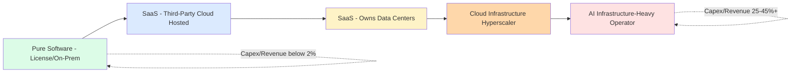

## Capital Intensity in Technology, Software and Data Centers

### Definition and Sector Context

Technology as a sector spans the widest capital intensity range of any industry grouping — from pure software companies with near-zero fixed asset requirements to hyperscale data center and AI infrastructure operators whose capital intensity now rivals or exceeds traditional utilities. This bifurcation makes "technology" a uniquely important case study in capital intensity analysis, since the label alone reveals almost nothing about the underlying capital structure without further segmentation.

$$\text{Capex Intensity} = \dfrac{\text{Capital Expenditures}}{\text{Total Revenue}} \times 100\%$$

Traditional enterprise/SaaS software companies commonly report capex intensity below 5% of revenue, while hyperscale cloud and AI infrastructure providers have seen capex intensity rise sharply — in some recent periods to 30–40%+ of revenue — driven by the scale of data center and AI compute infrastructure buildout. [Unverified: specific current-period capex intensity figures for named companies change quarter to quarter and should be verified against the most recent public filings rather than relied upon as fixed figures.]

### The Software-to-Infrastructure Capital Intensity Spectrum

| Business Model | Typical Capex/Revenue | Primary Capital Driver |
| --- | --- | --- |
| Pure Software (on-premise licensing) | <2% | Office facilities only, minimal fixed assets |
| SaaS (cloud-hosted, using third-party cloud) | 2–5% | Third-party cloud hosting costs (often opex, not capex) |
| SaaS (owns data center infrastructure) | 8–15% | Servers, networking equipment |
| Cloud Infrastructure Providers (hyperscalers) | 15–35%+ | Data centers, servers, networking, custom silicon |
| AI/ML Infrastructure-Heavy Operators | 25–45%+ | GPU/AI accelerator clusters, power infrastructure, data center construction |
| Semiconductor Design (fabless AI chips) | 2–5% | R&D-heavy, manufacturing outsourced to foundries |

[Unverified: figures represent broadly observed ranges as of recent reporting periods; the AI infrastructure buildout is an actively evolving area, and capex intensity figures for specific companies should be verified against current quarterly disclosures given the pace of change in this subsector.]

### Why Software Itself Is Capital-Light

**Key Points**

- **Near-zero marginal cost of distribution**: Once developed, software can be distributed to additional customers at minimal incremental capital cost, unlike physical infrastructure or manufactured goods.
- **R&D as the dominant "investment" category**: Software companies typically invest heavily in R&D and capitalized software development costs rather than fixed physical assets — an investment category that, depending on accounting treatment, may not appear as traditional capex.
- **Reliance on third-party cloud infrastructure**: Most SaaS companies rent compute/storage capacity from hyperscale cloud providers rather than owning data centers, converting what would be capital-intensive infrastructure into a variable operating cost (cloud hosting fees).
- **High gross margins enabling asset-light scaling**: Because incremental revenue does not require proportional capital investment, software business models can scale revenue with disproportionately low capital reinvestment relative to revenue growth, compared to physical-asset industries.

### Why Data Center and AI Infrastructure Has Become Extremely Capital-Intensive

**Key Points**

- **Physical compute infrastructure requirements**: Training and running large-scale AI models requires enormous quantities of specialized processors (GPUs/AI accelerators), high-speed networking, and purpose-built data center facilities.
- **Power infrastructure as a binding constraint**: Data center capacity is increasingly constrained not just by compute hardware but by available electrical power, driving capex into power generation, grid interconnection, and on-site power solutions alongside the data centers themselves.
- **Rapid hardware refresh cycles**: AI accelerator hardware has historically been superseded by newer generations relatively quickly, creating a depreciation and reinvestment cycle that is faster and more capital-intensive than general-purpose enterprise IT infrastructure.
- **Cooling and facility infrastructure**: High-density AI compute clusters generate substantial heat, requiring advanced cooling infrastructure (liquid cooling, specialized HVAC) that adds materially to data center construction capex beyond compute hardware itself.
- **Land and construction lead times**: Physical data center construction, particularly at hyperscale, involves multi-year lead times for site selection, permitting, power interconnection, and construction — similar in character to utility infrastructure lead times.

### Capex Categorization for Cloud/Data Center Infrastructure

**Compute Hardware Capex**

- Servers, GPUs/AI accelerators, custom silicon (ASICs designed in-house by some hyperscalers)
- Highest depreciation rate category due to rapid technology generational turnover

**Data Center Facility Capex**

- Building construction/leasing, cooling infrastructure, physical security
- Longer useful life than compute hardware, more similar to traditional real estate/industrial capex

**Networking Infrastructure Capex**

- Internal data center networking (high-bandwidth interconnects for AI training clusters)
- Long-haul network capacity connecting data center regions

**Power Infrastructure Capex**

- On-site power generation or storage, grid interconnection upgrades
- Increasingly a distinct capex category as power availability becomes a primary constraint on AI infrastructure buildout, in some cases leading technology companies into direct investment in power generation assets (including nuclear and renewable power purchase/investment arrangements). [Inference: the extent to which technology companies will directly own versus contract for power generation capacity going forward is an evolving strategic question across the industry.]

### Depreciation Considerations Specific to AI/Cloud Infrastructure

A significant and actively debated accounting and financial analysis topic in this subsector is the **useful life assumption applied to AI accelerator hardware (GPUs)**. Useful life assumptions directly affect reported depreciation expense and, consequently, reported operating margins:

$$\text{Annual Depreciation Expense} = \dfrac{\text{Asset Cost} - \text{Salvage Value}}{\text{Useful Life (years)}}$$

**Example**

A cloud infrastructure operator purchases $10 billion of GPU hardware.

At a 4-year assumed useful life (straight-line, no salvage value):

$$\text{Annual Depreciation} = \dfrac{10{,}000{,}000{,}000}{4} = \$2.5 \text{ billion/year}$$

At a 6-year assumed useful life:

$$\text{Annual Depreciation} = \dfrac{10{,}000{,}000{,}000}{6} \approx \$1.67 \text{ billion/year}$$

This roughly $830 million annual difference in reported depreciation expense — purely from a useful life assumption change, with no change in actual capex — illustrates why useful life assumptions for AI hardware have become a closely scrutinized disclosure item for investors and analysts assessing reported profitability of AI infrastructure operators. [Inference: whether GPU/AI accelerator hardware in practice retains economic and operational value in line with any specific useful life assumption over a multi-year period is not yet established by a long track record, given the relative recency of large-scale AI infrastructure buildout, and remains a genuine area of analytical judgment and debate.]

### Illustration: Technology Sector Capital Intensity Spectrum

### Diagram: Capital Structure of a Hyperscale Data Center Investment (svg_diagram)

<svg xmlns="http://www.w3.org/2000/svg" viewBox="0 0 720 380">
<text x="360" y="26" font-size="16" font-weight="bold" text-anchor="middle" fill="#1a1a1a">Capital Structure of a Hyperscale Data Center Investment (svg_diagram)</text>
<rect x="60" y="60" width="600" height="60" rx="6" fill="#fee2e2" stroke="#b91c1c" stroke-width="1.5" />
<text x="360" y="85" font-size="13" font-weight="bold" text-anchor="middle" fill="#7f1d1d">Compute Hardware: GPUs / AI Accelerators</text>
<text x="360" y="103" font-size="10" text-anchor="middle" fill="#7f1d1d">Shortest useful life (~3-6 yrs), highest capex share</text>
<rect x="60" y="135" width="600" height="60" rx="6" fill="#fed7aa" stroke="#c2410c" stroke-width="1.5" />
<text x="360" y="160" font-size="13" font-weight="bold" text-anchor="middle" fill="#7c2d12">Networking Infrastructure</text>
<text x="360" y="178" font-size="10" text-anchor="middle" fill="#7c2d12">High-bandwidth interconnects for training clusters</text>
<rect x="60" y="210" width="600" height="60" rx="6" fill="#fef3c7" stroke="#b45309" stroke-width="1.5" />
<text x="360" y="235" font-size="13" font-weight="bold" text-anchor="middle" fill="#78350f">Power Infrastructure</text>
<text x="360" y="253" font-size="10" text-anchor="middle" fill="#78350f">Grid interconnection, on-site generation/storage</text>
<rect x="60" y="285" width="600" height="60" rx="6" fill="#dcfce7" stroke="#15803d" stroke-width="1.5" />
<text x="360" y="310" font-size="13" font-weight="bold" text-anchor="middle" fill="#14532d">Facility / Building Shell</text>
<text x="360" y="328" font-size="10" text-anchor="middle" fill="#14532d">Longest useful life (~15-25 yrs), lowest relative capex share</text>

<text x="360" y="365" font-size="11" text-anchor="middle" fill="#555" font-style="italic">Layers with shortest useful life typically represent the largest share of total capex</text>

</svg>

### Financing and Capital Structure Approaches

**Key Points**

- **Self-funding via operating cash flow**: Established hyperscale cloud providers have historically funded much of their infrastructure capex from internally generated cash flow, given the strong profitability of their core software/services businesses.
- **Debt-financed infrastructure buildout**: As AI infrastructure capex requirements have grown, some technology companies have increased use of debt financing and off-balance-sheet structures for data center construction, a shift from historically equity/cash-funded technology sector norms.
- **Joint ventures and special-purpose vehicles**: Some large-scale data center and AI infrastructure projects are being structured through joint ventures with infrastructure investors or specialized financing vehicles, sharing capital risk and potentially keeping some infrastructure off the primary technology company's balance sheet. [Inference: the scale and structure of such financing arrangements are evolving rapidly and specific deal structures should be verified against current disclosures rather than assumed static.]
- **Vendor financing and capacity commitments**: Long-term supply and capacity agreements with chip manufacturers and cloud infrastructure builders represent a form of forward capital commitment that functions similarly to traditional capex planning, even when not immediately reflected on the balance sheet.

### Capital Efficiency Metrics Specific to Cloud/AI Infrastructure

$$\text{Revenue per Dollar of Infrastructure Capex} = \dfrac{\text{Incremental Revenue}}{\text{Incremental Infrastructure Capex}}$$

$$\text{Free Cash Flow} = \text{Operating Cash Flow} - \text{Capital Expenditures}$$

A key analytical focus in this subsector has become **free cash flow compression** — many technology companies with historically very high free cash flow margins (a hallmark of asset-light software economics) have seen FCF margins decline materially as infrastructure capex has scaled to support AI compute demand, a structural shift that changes how these companies should be analyzed relative to their historical asset-light profile. [Inference: whether this represents a temporary buildout phase analogous to a utility's "build" phase or a more permanent structural shift in the underlying business model's capital intensity is a matter of ongoing market and analytical debate, and outcomes will likely vary by company.]

### Risks Specific to Technology/Data Center Capital Intensity

- **Demand realization risk**: Capex committed to AI infrastructure buildout assumes a level of future demand (for AI compute/inference services) that may not fully materialize within the assumed hardware useful life, creating potential for underutilized capacity or accelerated write-offs.
- **Rapid technology obsolescence risk**: Given fast-moving AI accelerator hardware generations, capital committed to current-generation hardware carries meaningful risk of economic obsolescence before the end of its assumed useful life, similar in character to semiconductor fabrication equipment risk but potentially more acute given the pace of AI hardware innovation.
- **Power availability constraint risk**: Data center buildout plans are increasingly constrained by grid capacity and power availability in target regions, which can delay planned capex deployment independent of a company's own capital availability.
- **Depreciation assumption risk**: As illustrated above, useful life assumptions materially affect reported profitability, and changes to these assumptions (whether due to genuine operational learning or accounting judgment) can create significant swings in reported margins without corresponding changes in underlying cash economics.
- **Capital intensity mismatch with historical valuation frameworks**: Technology companies have historically been valued using asset-light, high-margin, high-FCF-conversion frameworks; a structural shift toward utility-like capital intensity may warrant different valuation approaches, and market participants may be in the process of recalibrating expectations. [Speculation: the appropriate long-term valuation framework for AI-infrastructure-heavy technology companies is not yet a settled matter and reasonable analysts hold differing views.]
- **Concentration risk in supply chain**: Reliance on a small number of specialized chip manufacturers and advanced semiconductor fabrication capacity creates supply chain concentration risk that can affect both capex cost and deployment timing.

### Capital Allocation Frameworks

**Key Points**

- **Build-ahead-of-demand strategy**: Given multi-year data center construction lead times, infrastructure capex decisions are frequently made based on forecasted future demand rather than currently realized demand, similar in principle to utility and telecom capacity planning but with shorter planning horizons and faster technology change.
- **Balance between owned and leased/contracted capacity**: Companies weigh direct ownership of data center and compute infrastructure against contracting capacity from third-party providers, trading capital intensity for flexibility.
- **Segment-level capital allocation transparency**: As capex has scaled, there has been increased investor focus on disaggregating capital allocation between core software/services investment and infrastructure buildout, given the differing risk and return characteristics of each.
- **Scenario planning against AI demand uncertainty**: Given the relative novelty of large-scale AI infrastructure investment and limited historical demand data, capital planning in this subsector inherently involves greater uncertainty than in more mature capital-intensive industries with longer historical demand patterns. [Inference: the specific scenario planning methodologies used by individual companies are generally not fully disclosed publicly and this characterization reflects a general inference about prudent capital planning practice rather than confirmed company-specific process.]

### Related Topics

- GPU/AI accelerator useful life assumptions and depreciation policy debates
- Hyperscale data center power infrastructure and grid interconnection constraints
- Fabless semiconductor business models and foundry capacity dependency
- Free cash flow margin compression in infrastructure-heavy technology companies
- Joint venture and off-balance-sheet financing structures for AI infrastructure
- SaaS capital-light economics versus infrastructure-owning technology business models
- Liquid cooling and data center facility engineering capital requirements
- Capitalized software development costs versus traditional capex accounting treatment
- Technology company direct investment in power generation assets
- Comparative capital intensity: cloud hyperscalers versus traditional utilities