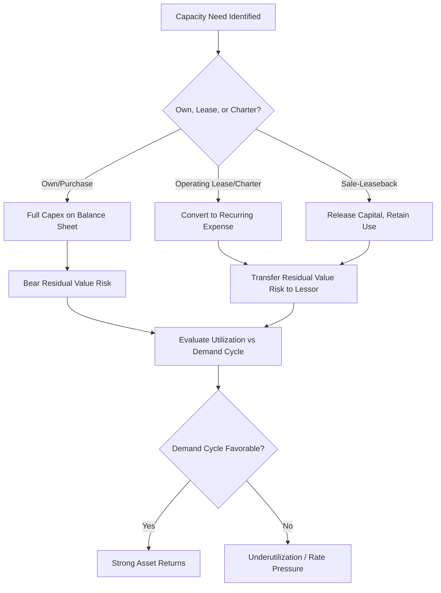

## Capital Intensity in Airlines, Shipping and Transportation

### Definition and Sector Context

Airlines, shipping, and broader transportation represent capital-intensive industries defined by ownership or leasing of high-cost, mobile fixed assets — aircraft, vessels, locomotives, and trucking fleets — that must be financed and deployed against volatile demand and highly competitive, often thin-margin pricing environments. Unlike utilities, transportation capital intensity is not offset by a regulated guaranteed return; instead, capital-intensive fleets operate in largely competitive markets, making transportation one of the highest-capital, historically lowest-return industry groups when measured across full economic cycles.

$$\text{Capex Intensity} = \dfrac{\text{Capital Expenditures}}{\text{Total Revenue}} \times 100\%$$

Capital intensity varies meaningfully by transport mode, generally ranging from 10% of revenue for asset-light logistics/freight brokerage to 20–30%+ for airlines and shipping during fleet renewal or expansion cycles.

### Structural Drivers of Capital Intensity

**Key Points**

- **High unit asset cost**: A single wide-body aircraft or large containership represents tens to hundreds of millions of dollars of capital committed to a single mobile unit, with multi-decade economic lives.
- **Long asset lives with mid-life reinvestment**: Aircraft and vessels typically operate for 20–30 years, but require substantial mid-life capital reinvestment (engine overhauls, dry-docking, major maintenance checks) that functions similarly to sustaining capex in other capital-intensive sectors.
- **Cyclical, competitive demand environments**: Unlike utility infrastructure, transportation capacity operates in a competitive market where pricing power is limited, meaning capital-intensive assets can be poorly utilized or command low rates during demand downturns or overcapacity periods.
- **Fuel price and operating leverage interaction**: High fixed capital costs combine with variable fuel costs to create a cost structure highly sensitive to both demand volume and commodity input price volatility.
- **Regulatory/safety-driven capital requirements**: Aviation and maritime industries face stringent safety and, increasingly, environmental regulatory requirements that mandate specific capital investment (engine emissions standards, ballast water treatment systems, aircraft noise compliance).
- **Network/hub infrastructure ownership**: Beyond mobile assets, some transportation operators (railroads, some airlines) own substantial fixed infrastructure (track, terminals, maintenance facilities) adding a network-infrastructure capital layer similar in character to utilities.

### Capital Intensity Across Transportation Modes

| Mode | Typical Capex/Revenue | Primary Asset | Ownership vs. Lease Norm |
| --- | --- | --- | --- |
| Passenger Airlines | 10–20% (higher during fleet renewal) | Aircraft | Increasingly mixed — significant operating/finance lease usage |
| Air Cargo | 10–18% | Freighter aircraft | Mixed owned/leased |
| Container Shipping | 15–25% (highly cyclical) | Vessels, containers | Mixed owned/chartered |
| Bulk/Tanker Shipping | 15–25% (highly cyclical) | Vessels | Mixed owned/chartered |
| Railroads (Class I freight) | 15–20% (steady-state) | Track, locomotives, rolling stock | Predominantly owned infrastructure |
| Trucking (asset-based) | 8–15% | Tractors, trailers | Mixed owned/leased |
| Trucking (asset-light/brokerage) | <2% | Minimal (technology platform) | N/A — non-asset-based model |
| Logistics/3PL (non-asset) | 1–3% | Minimal | N/A |

[Unverified: figures represent broadly observed ranges; actual capital intensity varies significantly by company fleet age, ownership strategy, and position in the industry cycle, and should be validated against current company filings.]

### Aircraft Ownership Structures: Owned, Leased, and Sale-Leaseback

**Key Points**

- **Direct ownership**: Airlines purchase aircraft outright (often debt-financed), bearing full capital intensity and residual value risk but retaining maximum operational and financial flexibility.
- **Operating leases**: Airlines lease aircraft from lessors (dedicated aircraft leasing companies) for a defined term, converting what would be capital expenditure into a recurring lease expense — reducing balance sheet capital intensity but not eliminating the underlying economic capital cost, which is embedded in lease rates.
- **Sale-and-leaseback transactions**: Airlines purchase aircraft new, then immediately sell to a leasing company and lease it back — allowing airlines to access aircraft capacity while transferring residual value risk and releasing capital for other uses.
- **Finance leases**: Structured similarly to a loan, finance leases are typically recognized on the balance sheet as both an asset and a liability, differing from operating lease accounting treatment (relevant under current lease accounting standards such as ASC 842/IFRS 16, which generally require most leases to be recognized on-balance-sheet, narrowing — though not eliminating — the reported capital intensity difference between owned and leased fleets).

This structural flexibility means airline capital intensity, as reported, can vary significantly based on fleet financing strategy even between two airlines with operationally similar fleets — a distinction critical to accurate cross-company capital intensity comparison.

### Shipping-Specific Capital Intensity Dynamics

- **Newbuild ordering cycles**: Shipping capacity is added through vessel orders placed years before delivery (typically 2–4 year shipyard lead times), creating a structural lag between capital commitment and capacity realization similar to other long-lead-time capital-intensive industries.
- **Charter market as a capital-light alternative**: Shipping companies can charter vessels from independent owners rather than purchasing, converting capital intensity into variable charter hire expense — a dynamic directly analogous to aircraft leasing.
- **Vessel size economics**: Larger vessels (e.g., ultra-large container ships) offer lower unit cost per container but require substantially higher absolute capital commitment and port/infrastructure compatibility, creating a scale-versus-flexibility capital allocation tradeoff.
- **Environmental regulation-driven retrofitting**: International maritime emissions regulations have required significant retrofit capex (scrubbers, ballast water treatment, alternative fuel capability) across the global shipping fleet, representing a compliance capital layer analogous to utility environmental compliance capex.
- **Highly cyclical freight rate environment**: Container and bulk shipping freight rates are historically volatile, meaning capital committed to vessel ordering during rate upcycles can face materially different economics by the time vessels are delivered — a dynamic similar to the extractive industry boom-bust capital cycle discussed in related material.

### Railroad Capital Intensity — The Infrastructure-Owning Exception

Class I freight railroads represent a distinctive case within transportation because, unlike airlines or shipping, they typically own their underlying network infrastructure (track, signaling, terminals) in addition to rolling stock — creating a capital intensity profile structurally closer to a regulated utility than to other transportation modes:

$$\text{Operating Ratio} = \dfrac{\text{Operating Expenses (excl. Capex)}}{\text{Operating Revenue}} \times 100\%$$

Railroads commonly report capex intensity in the 15–20% of revenue range on a sustained basis (not merely cyclically), reflecting continuous track maintenance and capacity investment requirements — a level of persistent capital intensity that distinguishes railroads from lighter-asset trucking or logistics operators within the same broad "transportation" category.

### Illustration: Transportation Capital Intensity Decision Framework

### Diagram: Aircraft Capital Cost Lifecycle (svg_diagram)

<svg xmlns="http://www.w3.org/2000/svg" viewBox="0 0 720 360">
<text x="360" y="26" font-size="16" font-weight="bold" text-anchor="middle" fill="#1a1a1a">Aircraft Capital Cost Lifecycle (svg_diagram)</text>
<line x1="60" y1="300" x2="680" y2="300" stroke="#333" stroke-width="2" />
<text x="370" y="330" font-size="12" text-anchor="middle" fill="#333">Years in Service (0-25 yr typical life)</text>
<rect x="60" y="60" width="60" height="220" fill="#fee2e2" opacity="0.7" />
<text x="90" y="55" font-size="10" text-anchor="middle" fill="#7f1d1d">Acquisition</text>
<text x="90" y="200" font-size="10" text-anchor="middle" fill="#7f1d1d" transform="rotate(-90 90 200)">Large Capex/Lease Entry</text>
<rect x="120" y="60" width="360" height="220" fill="#dcfce7" opacity="0.6" />
<text x="300" y="55" font-size="10" text-anchor="middle" fill="#14532d">Operating Period - Scheduled Maintenance</text>
<rect x="480" y="60" width="120" height="220" fill="#fef3c7" opacity="0.7" />
<text x="540" y="55" font-size="10" text-anchor="middle" fill="#78350f">Mid-Life Overhaul</text>
<text x="540" y="200" font-size="9" text-anchor="middle" fill="#78350f">Engine/Heavy Check Capex</text>
<rect x="600" y="60" width="80" height="220" fill="#dbeafe" opacity="0.7" />
<text x="640" y="55" font-size="10" text-anchor="middle" fill="#1e3a8a">End of Life</text>
<text x="640" y="200" font-size="9" text-anchor="middle" fill="#1e3a8a" transform="rotate(-90 640 200)">Residual/Resale Value</text>

<text x="360" y="350" font-size="11" text-anchor="middle" fill="#555" font-style="italic">Sustaining capex recurs at mid-life overhaul independent of initial acquisition structure</text>

</svg>

### Financial Metrics for Assessing Transportation Capital Efficiency

$$\text{Load Factor (Airlines)} = \dfrac{\text{Revenue Passenger Miles}}{\text{Available Seat Miles}} \times 100\%$$

$$\text{Return on Invested Capital (ROIC)} = \dfrac{\text{NOPAT}}{\text{Invested Capital}}$$

$$\text{Cost per Available Seat Mile (CASM)} = \dfrac{\text{Total Operating Costs}}{\text{Available Seat Miles}}$$

**Example**

An airline with a fleet financed at higher average ownership cost per aircraft, but achieving a load factor of 85%, versus a competitor with a similar cost structure achieving only 75% load factor, will realize a materially lower effective fixed cost per passenger — illustrating that in capital-intensive transportation, **utilization (load factor, vessel utilization, railcar velocity) is often as significant a determinant of realized capital efficiency as the nominal capital cost of the asset itself.**

### Risks Specific to Transportation Capital Intensity

- **Demand cyclicality and overcapacity risk**: Transportation capacity additions (aircraft orders, vessel newbuilds) are typically committed years before delivery, creating risk that capacity arrives after demand conditions have shifted — a dynamic closely paralleling the extractive industry boom-bust capital cycle.
- **Residual value risk**: Owned assets (aircraft, vessels) carry risk that resale/residual value at disposal is lower than assumed at acquisition, particularly if a technology transition (e.g., more fuel-efficient aircraft generations) accelerates obsolescence of older fleet types.
- **Fuel price volatility interacting with fixed capital costs**: High fixed capital costs combined with volatile variable fuel costs create compounded margin volatility during periods of both weak demand and high fuel prices.
- **Interest rate sensitivity**: Heavy reliance on debt and lease financing for fleet acquisition makes transportation capital costs particularly sensitive to prevailing interest rate environments.
- **Regulatory and environmental compliance risk**: Evolving emissions standards (aviation and maritime) create ongoing capital requirement uncertainty, with potential for accelerated fleet retirement or retrofit mandates. [Speculation: the ultimate scale and timeline of decarbonization-driven fleet capital requirements across aviation and shipping remains an evolving regulatory and technology question not yet fully settled.]
- **Geopolitical and trade flow disruption risk**: Capital committed to specific trade routes or network configurations (particularly in shipping and air cargo) can be affected by shifts in global trade patterns, tariffs, or geopolitical disruption to established routes.

### Capital Allocation Frameworks in Transportation

**Key Points**

- **Fleet age and renewal planning**: Operators balance the capital cost of new, more fuel-efficient assets against the lower capital cost (but higher operating/maintenance cost and potential compliance risk) of retaining older fleet — a recurring strategic capital allocation tradeoff.
- **Owned versus leased fleet mix targets**: Many operators explicitly manage a target ratio of owned-to-leased assets as a capital structure and flexibility decision, balancing capital intensity against operational flexibility and residual value risk transfer.
- **Route/network profitability-driven capital deployment**: Capital-intensive assets (aircraft, vessels) are allocated to specific routes or trade lanes based on profitability analysis, with the ability to redeploy mobile assets (unlike fixed infrastructure) representing a distinct capital flexibility advantage relative to utility or extractive infrastructure.
- **Countercyclical ordering discipline**: Some operators have adopted strategies of ordering new capacity during industry downturns (when asset prices and shipyard/manufacturer lead times are more favorable) rather than during upcycles, aiming to avoid the boom-bust capital misallocation pattern common in cyclical capital-intensive industries. [Inference: the consistency and effectiveness of countercyclical ordering discipline varies significantly by individual company and management approach, and is not uniformly practiced across the industry.]

### Related Topics

- Aircraft leasing markets and sale-leaseback transaction economics
- Lease accounting standards (ASC 842/IFRS 16) impact on reported capital intensity
- Shipping newbuild ordering cycles and freight rate volatility
- Railroad infrastructure ownership and operating ratio analysis
- Load factor, vessel utilization, and railcar velocity as capital efficiency drivers
- Maritime and aviation decarbonization capex requirements
- Residual value risk management in aircraft and vessel fleet planning
- Asset-light versus asset-based models in trucking and logistics
- Countercyclical capital deployment strategies in cyclical transportation markets
- Comparative capital intensity: railroads versus airlines versus shipping