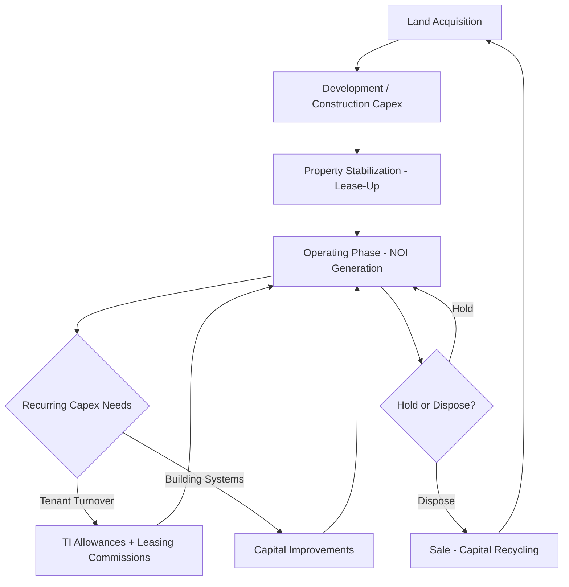

## Capital Intensity in Real Estate and REITs

### Definition and Sector Context

Real estate and Real Estate Investment Trusts (REITs) represent a distinctive capital intensity case: the business model itself *is* the capital-intensive asset. Unlike manufacturing or telecom, where capital intensity is a means of producing goods or services, in real estate the physical property is simultaneously the productive asset and the primary source of investment return, blending elements of capital intensity analysis with real asset investment theory.

$$\text{Capital Intensity Ratio} = \dfrac{\text{Total Assets}}{\text{Total Revenue}}$$

Real estate companies and REITs commonly exhibit some of the highest capital intensity ratios of any sector — frequently 8x to 15x+ total assets relative to revenue — because rental revenue represents only a modest yield on a very large underlying asset base, in contrast to industries where assets are consumed or transformed to generate proportionally larger revenue.

### Why Real Estate Is Structurally the Most Capital-Intensive Business Model

**Key Points**

- **Asset-as-product model**: The building itself generates revenue directly through rent, meaning the "product" and the "capital asset" are the same physical item — there is no manufacturing or transformation step that leverages a smaller capital base into larger revenue.
- **Low asset turnover by design**: Real estate is intentionally a low-turnover, income-generating asset class; unlike inventory or production equipment, the goal is not to cycle capital quickly but to hold it for extended periods generating steady yield.
- **High absolute acquisition/development cost**: Land acquisition and construction costs represent enormous upfront capital commitments relative to the ongoing rental income initially generated.
- **Long investment horizons**: Real estate assets are typically held for years to decades, with value realization occurring through a combination of rental income, appreciation, and eventual disposition rather than rapid capital recycling.
- **Leverage as a structural feature, not exception**: Given high absolute asset values relative to equity capital available, debt financing is a standard and expected component of real estate capital structure, rather than a discretionary choice as in many other industries.

### REIT-Specific Structural Considerations

**Key Points**

- **Mandatory distribution requirement**: REITs are generally required by tax law (in most jurisdictions that recognize the REIT structure, including the U.S.) to distribute a high percentage of taxable income (typically 90%+) to shareholders as dividends in exchange for favorable tax treatment (avoiding corporate-level income tax on distributed earnings).
- **Structural reliance on external capital for growth**: Because REITs distribute most taxable income rather than retaining it, growth capex (new acquisitions, development) is disproportionately dependent on external capital raising (debt issuance or equity offerings) rather than internally generated retained earnings — a capital structure dynamic distinct from most other capital-intensive industries.
- **Funds From Operations (FFO) as the primary earnings metric**: Because standard net income includes depreciation (a large non-cash expense for real estate given the size of the depreciable asset base, though real property often appreciates rather than truly depreciating economically), REITs and real estate analysts commonly use FFO as a more representative cash-generation metric.

$$\text{FFO} = \text{Net Income} + \text{Depreciation \& Amortization} - \text{Gains on Property Sales}$$

$$\text{Adjusted FFO (AFFO)} = \text{FFO} - \text{Recurring Capital Expenditures} - \text{Straight-Line Rent Adjustments}$$

AFFO is generally considered a closer proxy for sustainable cash flow available for distribution, since it explicitly nets out recurring capital expenditures required to maintain the property portfolio (tenant improvements, leasing commissions, building maintenance capex) — directly incorporating capital intensity into the core earnings metric used by the sector.

### Capital Intensity Across Real Estate Property Types

| Property Type | Relative Capital Intensity | Key Capex Driver | Typical Lease Structure |
| --- | --- | --- | --- |
| Office | High | Tenant improvements, building systems | Multi-year leases, significant TI allowances |
| Industrial/Logistics | Moderate | Warehouse construction, minimal TI | Longer-term, lower TI requirements |
| Multifamily/Residential | Moderate-High | Unit renovation, amenity upgrades | Short-term (annual) leases, frequent turnover capex |
| Retail | Moderate | Tenant buildout, common area maintenance | Varies widely by format (mall vs. net-lease) |
| Data Center REITs | Very High | Specialized power/cooling infrastructure | Long-term leases, high infrastructure specificity |
| Healthcare/Senior Living | High | Specialized medical/care infrastructure | Long-term, operator-dependent |
| Net-Lease (single-tenant) | Lower relative ongoing capex | Minimal — tenant typically responsible for property costs | Very long-term, triple-net structure |
| Hotels/Hospitality | Very High | Continuous renovation cycles, brand standard compliance | Operating model, not traditional leasing |

[Unverified: relative capital intensity characterizations reflect generally observed sector patterns; specific capex requirements vary by individual property age, market, and management strategy, and should be validated against current property-level and company-level disclosures.]

### Tenant Improvement and Leasing Capital — A Real Estate-Specific Capex Category

Unlike most other capital-intensive industries, real estate features a recurring capex category tied directly to leasing activity rather than production or maintenance:

$$\text{Leasing Capex} = \text{Tenant Improvement Allowances} + \text{Leasing Commissions}$$

**Example**

An office REIT signs a new 10-year lease for 50,000 square feet at a tenant improvement allowance of $60/square foot, plus a leasing commission equal to 4% of total lease value ($35/sq ft/year average rent):

$$\text{TI Allowance} = 50{,}000 \times 60 = \$3{,}000{,}000$$

$$\text{Total Lease Value} = 50{,}000 \times 35 \times 10 = \$17{,}500{,}000$$

$$\text{Leasing Commission} = 17{,}500{,}000 \times 0.04 = \$700{,}000$$

$$\text{Total Leasing Capex} = 3{,}000{,}000 + 700{,}000 = \$3{,}700{,}000$$

This $3.7 million capital outlay, amortized against a 10-year lease term, illustrates why office and other TI-intensive property types face materially higher recurring capital intensity per unit of leased space than property types with minimal tenant improvement requirements (such as net-lease or industrial properties), even at identical rental rates.

### Capital Structure and Leverage in Real Estate

$$\text{Loan-to-Value (LTV)} = \dfrac{\text{Debt Outstanding}}{\text{Property Value}} \times 100\%$$

$$\text{Debt Service Coverage Ratio (DSCR)} = \dfrac{\text{Net Operating Income}}{\text{Annual Debt Service}}$$

Real estate capital structures are typically far more leveraged than operating companies in other industries, commonly targeting LTV ratios of 40–65% at the property or portfolio level, reflecting both the collateral value of hard real property assets (which supports higher lender confidence) and the stable, contractual nature of lease-based cash flows that support debt service.

**Key Points**

- **Mortgage/asset-level debt versus corporate-level debt**: Real estate financing frequently occurs at the individual property or portfolio level (secured by the specific asset) rather than solely at the corporate entity level, differing from typical corporate capital structure practice.
- **Cap rate as the core real estate capital efficiency metric**:

$$\text{Capitalization Rate (Cap Rate)} = \dfrac{\text{Net Operating Income}}{\text{Property Value}} \times 100\%$$

Cap rate functions as real estate's equivalent of a return-on-capital metric, directly linking income generation to the capital value of the asset, and is highly sensitive to prevailing interest rates and perceived risk of the property type/location.

### Illustration: Real Estate Capital Lifecycle

### Diagram: Capital Structure Layers of a Leveraged Real Estate Investment (svg_diagram)

<svg xmlns="http://www.w3.org/2000/svg" viewBox="0 0 700 340">
<text x="350" y="26" font-size="16" font-weight="bold" text-anchor="middle" fill="#1a1a1a">Capital Structure Layers of a Leveraged Real Estate Investment (svg_diagram)</text>
<rect x="150" y="60" width="400" height="220" fill="none" stroke="#333" stroke-width="2" />
<rect x="150" y="60" width="400" height="130" fill="#dbeafe" stroke="#1e40af" stroke-width="1" />
<text x="350" y="130" font-size="14" font-weight="bold" text-anchor="middle" fill="#1e3a8a">Senior Mortgage Debt</text>
<text x="350" y="150" font-size="11" text-anchor="middle" fill="#1e3a8a">(~50-65% of property value, LTV-based)</text>
<rect x="150" y="190" width="400" height="50" fill="#fef3c7" stroke="#b45309" stroke-width="1" />
<text x="350" y="220" font-size="13" font-weight="bold" text-anchor="middle" fill="#78350f">Mezzanine / Preferred Equity (if used)</text>
<rect x="150" y="240" width="400" height="40" fill="#dcfce7" stroke="#15803d" stroke-width="1" />
<text x="350" y="265" font-size="13" font-weight="bold" text-anchor="middle" fill="#14532d">Common Equity</text>

<text x="350" y="310" font-size="11" text-anchor="middle" fill="#555" font-style="italic">Property value at the top of the stack; equity absorbs first-loss risk at the base</text>

</svg>

### Depreciation and Its Unique Character in Real Estate

Real estate presents a distinctive accounting-versus-economic-value dynamic: buildings are depreciated for accounting and tax purposes over standard schedules (commonly 27.5–39 years depending on property type and jurisdiction), yet the underlying land and often the building itself may appreciate economically over the same period — meaning reported depreciation expense frequently does not reflect actual economic value decline. This is the foundational reason FFO/AFFO metrics add back depreciation rather than treating it as a true economic cost, in direct contrast to industries like manufacturing or extractives where depreciation more closely tracks genuine economic asset consumption.

### Risks Specific to Real Estate Capital Intensity

- **Interest rate sensitivity**: Given high leverage and long-duration assets, real estate values and refinancing capacity are highly sensitive to interest rate changes — rising rates both increase debt service costs and typically increase cap rates, which mechanically reduces property valuations.
- **Refinancing risk**: Property-level debt often carries maturities shorter than the underlying asset's economic life, creating recurring refinancing risk, particularly acute if credit markets tighten or property values decline near a debt maturity date.
- **Vacancy and lease rollover risk**: Recurring TI and leasing commission capex is directly tied to tenant turnover; elevated vacancy or unfavorable lease renewal terms increase both capital requirements and reduce income simultaneously.
- **Obsolescence risk by property type**: Structural shifts in demand (e.g., remote work affecting office demand, e-commerce affecting certain retail formats) can impair the economic value of specific property types, requiring either substantial repositioning capex or asset value write-downs.
- **Development and construction risk**: Ground-up development carries cost overrun, timeline delay, and lease-up risk during the pre-stabilization period when the asset generates minimal income against substantial capital deployed.
- **Concentration risk**: Significant capital deployed in a single property, market, or property type creates concentration risk not present in more diversified capital-intensive industries.

### Capital Allocation Frameworks in Real Estate and REITs

**Key Points**

- **Portfolio recycling strategy**: Many REITs explicitly pursue a strategy of selling mature, lower-growth assets to fund acquisition or development of higher-growth opportunities, effectively recycling capital within a largely capital-intensive, low-organic-growth business model.
- **Build-to-core versus acquire-stabilized tradeoff**: Developers/REITs weigh higher-risk, higher-return ground-up development capital deployment against lower-risk, lower-return acquisition of already-stabilized, income-producing assets.
- **Same-store versus external growth capital allocation**: Capital allocation is typically analyzed separately between capex required to maintain/grow income from the existing portfolio ("same-store") versus capital deployed toward new acquisitions or development (external growth), given their differing risk and return profiles.
- **Access to capital markets as a strategic capability**: Given the structural reliance on external capital for growth (due to mandatory distribution requirements), a REIT's cost of capital and capital markets access is itself a significant competitive differentiator and strategic capital allocation consideration.

### Related Topics

- Funds From Operations (FFO) and Adjusted FFO (AFFO) calculation methodologies
- Capitalization rate determinants and interest rate sensitivity
- Tenant improvement allowances and leasing commission capital planning
- Loan-to-value and debt service coverage ratio analysis in real estate financing
- Data center REITs as a capital-intensity outlier within the REIT sector
- Development versus acquisition capital allocation strategy
- REIT mandatory distribution requirements and external capital dependency
- Property-level versus corporate-level debt structures
- Same-store capex versus external growth capital allocation
- Obsolescence risk and repositioning capex across property types