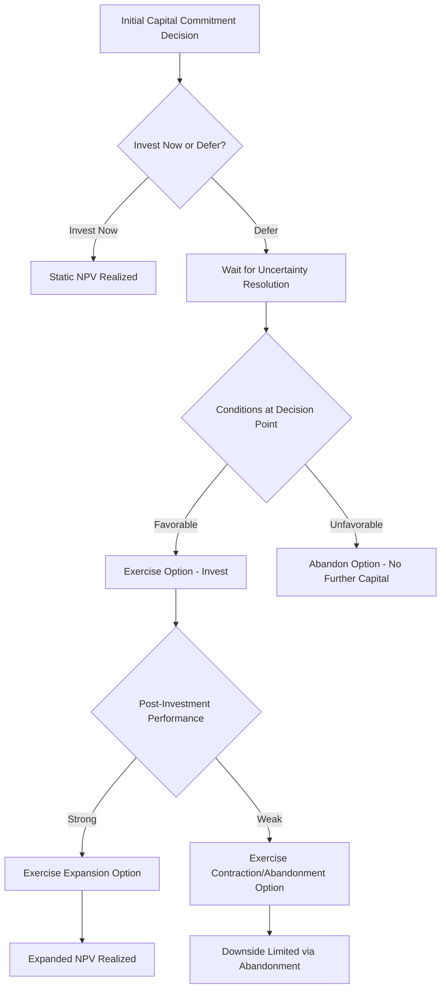

## Real Options Analysis in Capital Projects

### Definition and Conceptual Foundation

Real options analysis (ROA) is a capital budgeting framework that applies option pricing theory — originally developed for financial derivatives — to valuing managerial flexibility embedded in real (physical/operational) investment decisions. The core insight is that traditional discounted cash flow (DCF) and Net Present Value (NPV) analysis systematically undervalues capital projects that contain flexibility to expand, delay, abandon, or otherwise adapt decisions as uncertainty resolves over time, because standard NPV assumes a fixed, static path of future decisions.

$$\text{Expanded NPV} = \text{Traditional NPV} + \text{Value of Real Options}$$

This framework is particularly relevant to capital-intensive industries — extractives, real estate, technology infrastructure, pharmaceuticals — where large, irreversible capital commitments are made under significant uncertainty, and where management retains meaningful discretion over the timing, scale, and continuation of investment.

### Why Traditional NPV Undervalues Flexibility

**Key Points**

- **Static assumption limitation**: Standard NPV analysis typically evaluates a single, predetermined investment path (invest now, at this scale, for this duration) and discounts expected cash flows at a risk-adjusted rate — it does not explicitly value the ability to change course as new information arrives.
- **Asymmetric payoff structures ignored**: Managerial flexibility creates asymmetric payoffs — the ability to expand if conditions are favorable while limiting downside by abandoning or delaying if conditions are unfavorable — a payoff shape that traditional NPV, using a single expected cash flow scenario, does not capture.
- **Uncertainty treated as purely negative**: In standard NPV/DCF, higher uncertainty (volatility) generally increases the discount rate applied or widens the range of possible outcomes, typically reducing calculated project value. In options theory, by contrast, **higher underlying uncertainty increases option value**, because flexibility becomes more valuable precisely when outcomes are less certain — a fundamentally different treatment of volatility that is the central conceptual distinction of real options analysis.
- **Irreversibility not separately priced**: Traditional analysis does not explicitly separate the cost of irreversible commitment from the investment's expected return; real options analysis makes this distinction explicit by valuing the option to delay commitment.

### Core Types of Real Options in Capital Projects

**Option to Defer (Timing Option)**

- The right, but not obligation, to delay investment until additional information resolves uncertainty.
- Common in resource extraction (delaying field development pending price clarity) and real estate development (delaying construction start based on market absorption signals).

**Option to Expand (Growth Option)**

- The right to scale up investment if initial results or market conditions are favorable.
- Common in phased manufacturing capacity additions, modular data center buildout, and staged mine development.

**Option to Contract**

- The right to scale down operations or investment if conditions deteriorate, reducing ongoing capital/operating commitment.

**Option to Abandon**

- The right to permanently cease a project and recover salvage/resale value if conditions are sufficiently unfavorable, limiting downside exposure below what continued operation would produce.
- Particularly relevant in extractive industries (mine/well abandonment) and technology infrastructure (data center repurposing or sale).

**Option to Switch (Flexibility Option)**

- The right to alter inputs, outputs, or operating modes in response to changing relative prices or conditions (e.g., a power plant capable of switching fuel sources, or flexible manufacturing capable of shifting product mix).

**Compound/Sequential Options**

- A project structured as a series of stage-gated investments, where each stage is itself an option on proceeding to the next — common in pharmaceutical R&D (clinical trial phases), exploration-to-development sequences in extractives, and phased technology infrastructure buildout.

### The Options Analogy: Mapping Financial Option Variables to Real Projects

| Financial Option Variable | Real Option Equivalent |
| --- | --- |
| Stock price ($S$) | Present value of expected project cash flows |
| Strike price ($K$) | Investment cost required to exercise the option |
| Time to expiration ($T$) | Time period during which the investment decision can be deferred |
| Volatility ($\sigma$) | Uncertainty in the value of underlying project cash flows |
| Risk-free rate ($r$) | Risk-free rate of return |
| Dividend yield equivalent | Value "leakage" from deferring (e.g., competitive entry, cash flows foregone by waiting) |

This mapping allows adaptation of established option pricing methodologies (Black-Scholes, binomial lattice models) to real investment decisions, though with important caveats discussed below regarding the limitations of directly transplanting financial option assumptions onto real assets.

### Valuation Approaches

**Black-Scholes-Based Approximation**

For a simple option to defer (analogous to a European call option):

$$C = S \cdot N(d_1) - K e^{-rT} \cdot N(d_2)$$

$$d_1 = \dfrac{\ln(S/K) + (r + \sigma^2/2)T}{\sigma\sqrt{T}}, \quad d_2 = d_1 - \sigma\sqrt{T}$$

Where $C$ is the value of the option to defer investment, $S$ is the present value of expected project cash flows, $K$ is the required investment cost, and $N(\cdot)$ is the cumulative standard normal distribution function.

**Binomial Lattice Model**

More commonly used in practice for real options given the ability to model multiple decision points and path-dependent flexibility:

$$u = e^{\sigma\sqrt{\Delta t}}, \quad d = \dfrac{1}{u}$$

$$p = \dfrac{e^{r\Delta t} - d}{u - d}$$

Where $u$ and $d$ represent up/down movement factors for underlying project value over each discrete time step, and $p$ is the risk-neutral probability of an upward movement. The lattice is built forward to represent possible future project value paths, then valued backward from terminal nodes, applying optimal exercise decisions (invest, defer, abandon, expand) at each node.

**Example**

A mining company evaluates a deferred investment decision on a mineral deposit:

- Present value of developed project cash flows ($S$): $500 million
- Required development investment ($K$): $450 million
- Time until the deferral option must be exercised ($T$): 3 years
- Annual volatility of project value ($\sigma$): 35%
- Risk-free rate ($r$): 4%

Traditional (static) NPV, evaluated as if the investment must be made immediately:

$$NPV_{static} = 500 - 450 = \$50 \text{ million}$$

Applying the Black-Scholes framework to value the deferral option (using the inputs above) would typically yield an option value **greater than** the static NPV of $50 million, because the 3-year deferral window combined with 35% volatility creates meaningful asymmetric upside value — the company can wait for price/geological information to resolve favorably before committing capital, while avoiding commitment if conditions turn unfavorable. [Inference: the precise numerical option value depends on the exact calculation methodology and rounding conventions applied; this example illustrates the directional and conceptual result rather than a precise computed figure, and practitioners should perform the full calculation using appropriate software or lattice modeling for actual investment decisions.]

### Illustration: Real Options Decision Tree

### Diagram: Value of Flexibility vs. Uncertainty (svg_diagram)

<svg xmlns="http://www.w3.org/2000/svg" viewBox="0 0 700 360">
<text x="350" y="26" font-size="16" font-weight="bold" text-anchor="middle" fill="#1a1a1a">Value of Flexibility vs. Uncertainty (svg_diagram)</text>
<line x1="70" y1="300" x2="650" y2="300" stroke="#333" stroke-width="2" />
<line x1="70" y1="300" x2="70" y2="50" stroke="#333" stroke-width="2" />
<text x="360" y="330" font-size="12" text-anchor="middle" fill="#333">Underlying Project Uncertainty (Volatility)</text>
<text x="30" y="180" font-size="12" text-anchor="middle" fill="#333" transform="rotate(-90 30 180)">Value</text>
<line x1="70" y1="260" x2="650" y2="260" stroke="#b91c1c" stroke-width="2.5" stroke-dasharray="6,3" />
<text x="560" y="245" font-size="11" fill="#7f1d1d">Traditional NPV (flat, ignores volatility)</text>
<path d="M70,280 Q 200,270 350,200 T 650,80" fill="none" stroke="#1e40af" stroke-width="2.5" />
<text x="480" y="130" font-size="11" fill="#1e3a8a">Real Option Value (rises with uncertainty)</text>

<text x="360" y="350" font-size="11" text-anchor="middle" fill="#555" font-style="italic">Option value increases with volatility, while static NPV treats volatility as irrelevant or negative</text>

</svg>

### Practical Applications by Industry

**Key Points**

- **Extractive industries**: Valuing the option to defer field/mine development pending commodity price clarity, and the option to abandon marginal projects when prices fall below breakeven thresholds — directly relevant given the reserve depletion and boom-bust capital cycle dynamics discussed elsewhere in this material.
- **Pharmaceutical R&D**: Clinical trial phases represent a natural compound option structure — each phase is an option to continue (paying the cost of the next phase) contingent on trial results, with abandonment at each stage gate limiting downside capital exposure.
- **Technology/data center infrastructure**: Modular, phased data center buildout allows companies to expand capacity incrementally as demand materializes, embedding expansion option value rather than committing to full-scale capacity upfront.
- **Real estate development**: Land banking represents a pure option to defer — holding undeveloped land provides the option to develop when market conditions (rents, absorption, financing costs) become favorable, without obligation to develop on any fixed timeline.
- **Manufacturing capacity planning**: Flexible manufacturing lines capable of producing multiple product variants embed a switching option, valuable precisely because demand mix uncertainty makes rigid single-product capacity riskier.

### Limitations and Practical Challenges

**Key Points**

- **Volatility estimation difficulty**: Unlike traded financial assets with observable market prices and historical volatility, real project cash flow volatility must typically be estimated through simulation, comparable industry data, or subjective judgment, introducing significant estimation uncertainty into the valuation.
- **Market completeness assumption**: Classical option pricing theory (Black-Scholes) assumes the underlying asset can be replicated through a dynamically traded portfolio (enabling risk-neutral valuation) — an assumption that holds cleanly for financial securities but is often imperfectly satisfied for real, illiquid project cash flows, raising theoretical questions about direct applicability. [Inference: practitioners generally treat this as a workable approximation rather than a precise theoretical fit, and the degree of approximation error varies by how closely the underlying project cash flows correlate with traded market instruments.]
- **Competitive interaction not fully captured**: Basic real options models generally treat the option holder as acting in isolation; in reality, competitor actions (e.g., a competitor investing first, altering the payoff of deferral) can materially affect option value in ways that require game-theoretic extensions to properly capture.
- **Organizational and behavioral complexity**: Real options theory assumes management will rationally exercise or abandon options at value-optimal points; in practice, sunk cost bias, organizational momentum, and misaligned incentives can prevent optimal real option exercise even when a rigorous quantitative analysis correctly identifies it.
- **Complexity and communication challenges**: Real options valuations can be difficult to communicate to non-technical stakeholders and boards compared to traditional NPV, creating practical adoption barriers even where the underlying analysis is sound.

### Real Options vs. Scenario/Decision Tree Analysis

**Key Points**

- **Decision tree analysis** shares conceptual similarity with real options (both value sequential decisions under uncertainty) but typically discounts all cash flows at a single risk-adjusted rate throughout the tree, whereas rigorous real options valuation uses risk-neutral valuation techniques that can more precisely reflect how risk changes at different decision points.
- **Monte Carlo simulation** is often used as a complementary or alternative technique, particularly for path-dependent or complex multi-variable uncertainty, and can be combined with real options logic (simulating underlying value paths, then applying optimal exercise rules) — sometimes termed "simulation-based real options" analysis.
- **Sensitivity/scenario analysis** (evaluating NPV under optimistic/pessimistic cases) is a simpler, complementary tool but does not explicitly value the flexibility to change course, unlike full real options analysis.

### Related Topics

- Black-Scholes and binomial lattice option pricing methodologies
- Decision tree analysis versus real options analysis comparison
- Monte Carlo simulation for capital project uncertainty modeling
- Compound options and staged investment decision structures
- Game-theoretic extensions to real options under competitive response
- Volatility estimation techniques for illiquid real asset cash flows
- Real options applications in pharmaceutical R&D staged investment
- Land banking and deferred development option value in real estate
- Abandonment option valuation in extractive industry project economics
- Behavioral and organizational barriers to optimal real option exercise