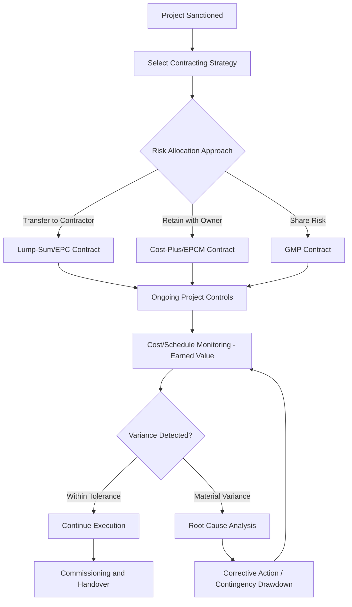

## Managing Construction and Execution Risk

### Definition and Scope

Construction and execution risk refers to the range of uncertainties that can cause a capital project to deviate from its planned cost, schedule, quality, or scope during the physical construction/implementation phase — the period between capital sanction and asset commissioning. This risk category is distinct from, though related to, the market, demand, and price risks addressed in project evaluation (e.g., real options analysis) because it concerns the ability to *deliver* the planned asset as specified, rather than uncertainty about the value of the asset once delivered.

$$\text{Cost Variance} = \text{Actual Cost} - \text{Budgeted Cost}$$

$$\text{Schedule Variance (Time)} = \text{Actual Duration} - \text{Planned Duration}$$

Construction and execution risk is a critical topic in capital-intensive industries — utilities, extractives, infrastructure, manufacturing plant construction, real estate development, and large-scale technology infrastructure buildout — because cost and schedule overruns during construction directly erode project returns calculated at the capital sanction stage, independent of whether the underlying market/demand assumptions later prove correct.

### Categories of Construction and Execution Risk

**Key Points**

- **Cost overrun risk**: The risk that actual construction costs exceed budgeted costs, driven by factors including input price inflation, design changes, quantity underestimation, and contractor/subcontractor performance issues.
- **Schedule delay risk**: The risk that project completion occurs later than planned, driven by permitting delays, weather, labor/material availability, technical complications, or contractor performance — schedule delay frequently compounds cost overrun risk through extended overhead, financing costs, and delayed revenue realization.
- **Technical/performance risk**: The risk that the completed asset does not perform to design specifications (throughput, efficiency, quality) even if delivered on time and budget, requiring remediation capital after commissioning.
- **Interface and coordination risk**: Particularly acute in complex, multi-contractor projects, this is the risk arising from poor coordination between design, procurement, and construction interfaces (e.g., civil works not properly sequenced with equipment installation).
- **Permitting and regulatory risk**: The risk that required permits, approvals, or regulatory compliance sign-offs are delayed or subject to additional conditions not anticipated in the original project plan.
- **Force majeure and external event risk**: Risk from events outside project control — extreme weather, natural disasters, geopolitical disruption, pandemics — that can halt or delay construction activity.
- **Supply chain and logistics risk**: Risk related to availability, lead time, and cost of critical equipment and materials, particularly acute for specialized long-lead-time items (e.g., turbines, transformers, specialized reactors) sourced from limited global supplier bases.

### Why Large Capital Projects Are Prone to Cost and Schedule Overruns

**Key Points**

- **Optimism bias in initial estimation**: A well-documented pattern in capital project planning literature is that initial cost and schedule estimates tend to be systematically optimistic relative to actual outcomes, a phenomenon studied extensively in megaproject research (notably by academics such as Bent Flyvbjerg). [Inference: the precise magnitude of this bias varies by project type, industry, region, and era studied, and specific statistical figures should be sourced from current academic literature rather than treated as universal constants.]
- **Strategic misrepresentation**: Beyond genuine estimation error, some research suggests project sponsors may face organizational or political incentives to present favorable cost/schedule estimates during the approval process, a distinct phenomenon from unintentional optimism bias. [Inference: the relative contribution of strategic misrepresentation versus genuine estimation error to observed overruns is a matter of ongoing academic and practitioner debate, and likely varies by project and organizational context.]
- **Complexity and scale interaction**: Larger, more technically complex projects have proportionally more interfaces, dependencies, and potential failure points, increasing the statistical likelihood that at least one significant issue will materialize during execution.
- **First-of-kind technology risk**: Projects employing novel or first-of-a-kind technology (new reactor designs, first-generation industrial processes) lack the benefit of accumulated learning curve experience that reduces execution risk in repeat, standardized project types.
- **Long project duration exposure**: Multi-year construction projects have extended exposure to input price inflation, currency fluctuation, and changing regulatory requirements simply due to the passage of time between initial budgeting and completion.

### Contract Structures for Allocating Construction Risk

A central tool for managing execution risk is the choice of contracting structure, which determines how cost and schedule risk is allocated between the project owner and the construction contractor(s):

**Lump-Sum / Fixed-Price Contracts (EPC — Engineering, Procurement, Construction)**

- Contractor bears cost overrun risk above the fixed price (subject to change order provisions for scope changes)
- Typically carries a cost premium reflecting the risk transfer to the contractor
- Most effective when project scope and design are well-defined prior to contract execution

**Cost-Plus / Reimbursable Contracts**

- Owner bears cost risk; contractor is reimbursed actual costs plus a fee (fixed fee or percentage)
- Provides greater flexibility for projects with evolving scope but retains cost overrun exposure with the owner
- Often used for projects where design is not yet finalized or where speed of mobilization is prioritized over cost certainty

**Guaranteed Maximum Price (GMP) Contracts**

- Hybrid structure: contractor is reimbursed actual costs up to a guaranteed ceiling, with the contractor bearing risk of costs exceeding that ceiling
- Often includes shared savings provisions if actual costs come in below the GMP, incentivizing contractor cost discipline

**EPCM (Engineering, Procurement, Construction Management)**

- Owner retains more direct control and risk, with the contractor acting in an advisory/management capacity rather than bearing fixed-price risk
- Common in complex projects (mining, process industries) where the owner has strong internal technical capability and wishes to retain design flexibility

| Contract Type | Owner Cost Risk | Contractor Cost Risk | Typical Use Case |
| --- | --- | --- | --- |
| Lump-Sum EPC | Low | High | Well-defined scope, standardized technology |
| Cost-Plus | High | Low | Evolving scope, urgent mobilization needs |
| GMP | Moderate (capped) | Moderate (above cap) | Balance of cost certainty and flexibility |
| EPCM | High | Low (advisory role) | Complex, owner-managed technical projects |

### Illustration: Construction Risk Allocation and Mitigation Framework

### Project Controls and Monitoring Frameworks

**Earned Value Management (EVM)**

A widely used quantitative framework for monitoring construction execution against baseline plans:

$$\text{Cost Performance Index (CPI)} = \dfrac{\text{Earned Value (EV)}}{\text{Actual Cost (AC)}}$$

$$\text{Schedule Performance Index (SPI)} = \dfrac{\text{Earned Value (EV)}}{\text{Planned Value (PV)}}$$

A CPI or SPI below 1.0 indicates the project is over budget or behind schedule relative to the earned value of work completed, respectively; values above 1.0 indicate favorable performance.

**Example**

A construction project has:

- Planned Value (PV) at the current reporting date: $40 million (work scheduled to be complete)
- Earned Value (EV): $32 million (value of work actually completed)
- Actual Cost (AC): $38 million (actual spend to date)

$$CPI = \dfrac{32}{38} \approx 0.84$$

$$SPI = \dfrac{32}{40} = 0.80$$

A CPI of 0.84 indicates the project is spending approximately $1.19 for every $1.00 of value earned (the reciprocal of CPI), while an SPI of 0.80 indicates the project has only earned 80% of the value it was scheduled to have completed by this point — signaling both a cost overrun trend and a schedule delay trend simultaneously, warranting management intervention.

**Estimate at Completion (EAC) and Estimate to Complete (ETC)**

$$\text{EAC} = \text{AC} + \dfrac{\text{Budget at Completion (BAC)} - \text{EV}}{\text{CPI}}$$

This formula projects total expected project cost at completion based on current cost performance trends, a standard tool for forecasting the ultimate cost impact of observed execution variances before the project is finished.

### Diagram: Earned Value Management Cost/Schedule Tracking (svg_diagram)

<svg xmlns="http://www.w3.org/2000/svg" viewBox="0 0 700 380">
<text x="350" y="26" font-size="16" font-weight="bold" text-anchor="middle" fill="#1a1a1a">Earned Value Management Cost/Schedule Tracking (svg_diagram)</text>
<line x1="70" y1="320" x2="650" y2="320" stroke="#333" stroke-width="2" />
<line x1="70" y1="320" x2="70" y2="50" stroke="#333" stroke-width="2" />
<text x="360" y="350" font-size="12" text-anchor="middle" fill="#333">Time</text>
<text x="30" y="190" font-size="12" text-anchor="middle" fill="#333" transform="rotate(-90 30 190)">Cumulative Value ($)</text>
<path d="M70,300 L200,240 L350,150 L500,90 L650,60" fill="none" stroke="#1e40af" stroke-width="2.5" />
<text x="560" y="50" font-size="11" fill="#1e3a8a">Planned Value (PV)</text>
<path d="M70,300 L200,260 L350,190 L440,160" fill="none" stroke="#15803d" stroke-width="2.5" />
<text x="450" y="150" font-size="11" fill="#14532d">Earned Value (EV)</text>
<path d="M70,300 L200,255 L350,175 L440,120" fill="none" stroke="#b91c1c" stroke-width="2.5" stroke-dasharray="5,3" />
<text x="450" y="110" font-size="11" fill="#7f1d1d">Actual Cost (AC)</text>
<line x1="440" y1="160" x2="440" y2="120" stroke="#666" stroke-width="1" stroke-dasharray="2,2" />
<text x="460" y="140" font-size="9" fill="#444">Cost Variance</text>

<text x="360" y="370" font-size="11" text-anchor="middle" fill="#555" font-style="italic">AC above EV indicates cost overrun; EV below PV indicates schedule delay</text>

</svg>

### Contingency and Reserve Management

**Key Points**

- **Contingency reserves**: Budgeted allowances explicitly set aside within the project budget to cover identified but not yet realized risks (known-unknowns), typically calculated through risk register quantification, Monte Carlo simulation of cost risk factors, or percentage-based rules of thumb calibrated to project complexity and stage of design maturity.
- **Management reserves**: A separate, typically smaller allowance held for unforeseen risks (unknown-unknowns) not captured in the formal risk register, generally controlled at a higher management level than contingency reserves.
- **Contingency drawdown tracking**: Effective project controls track not just whether the project is over/under the base budget, but how much of the contingency reserve has been consumed and at what rate — a rapid contingency drawdown early in a project is a leading indicator of potential total cost overrun even before the base budget itself shows variance.
- **Front-End Loading (FEL) / stage-gate maturity**: Contingency levels are typically set as a percentage of estimated cost that decreases as project definition matures through sequential stage gates (e.g., feasibility study, preliminary engineering, detailed engineering), reflecting the standard industry principle that estimating accuracy improves — and required contingency correspondingly decreases — as design and scope definition become more complete. [Inference: specific contingency percentage benchmarks vary by industry, project type, and organizational risk tolerance, and referenced figures should be validated against current industry-specific estimating guidelines such as those published by professional cost engineering associations.]

### Risk Mitigation Strategies

**Key Points**

- **Front-end engineering and design (FEED) investment**: Investing more heavily in detailed engineering and design definition prior to construction sanction reduces the likelihood of costly design changes and rework during construction, though it extends the pre-construction timeline and cost.
- **Modularization and standardization**: Using standardized, factory-fabricated modules (particularly in process industries, data centers, and increasingly in nuclear and renewable energy construction) can reduce on-site construction risk by shifting work to controlled factory environments with more predictable quality and schedule outcomes.
- **Owner's engineer / independent project review**: Engaging independent technical advisors to review contractor cost estimates, schedules, and progress reporting provides an additional check against optimism bias or information asymmetry between the owner and contractor.
- **Staged/phased capital commitment**: Structuring large projects into sequential phases with defined decision gates (conceptually related to the compound options and staged investment structures discussed in real options analysis) allows the owner to limit capital exposure and reassess before committing to subsequent, larger capital tranches.
- **Insurance and risk transfer instruments**: Construction all-risk insurance, delay-in-startup insurance, and performance bonds/guarantees are standard tools for transferring specific categories of execution risk to insurers or sureties.
- **Supply chain diversification and early procurement**: For long-lead-time critical equipment, early procurement commitments and diversified supplier relationships reduce schedule risk associated with equipment availability bottlenecks.

### Post-Completion Considerations

**Key Points**

- **Commissioning and ramp-up risk**: Even after physical construction completion, projects frequently face a ramp-up period before achieving designed operational performance; this ramp-up risk should be explicitly planned for and, where material, reflected in initial capital project financial models rather than assuming immediate full-capacity performance upon mechanical completion.
- **Post-project review and lessons learned**: Systematic post-completion review comparing actual versus planned cost, schedule, and performance outcomes is a widely recommended (though inconsistently implemented in practice) discipline for improving estimation accuracy and risk management on future projects. [Inference: the consistency of post-project review practice varies significantly across organizations and industries, and its demonstrated impact on improving future project outcomes, while broadly supported by capital project management literature and practice, depends on how rigorously lessons learned are actually incorporated into subsequent project planning.]

### Related Topics

- Earned Value Management (EVM) formulas and forecasting techniques
- EPC, GMP, and cost-plus contract structures compared
- Front-End Loading (FEL) and stage-gate capital project maturity models
- Optimism bias and strategic misrepresentation in megaproject cost estimation
- Modularization and factory fabrication as construction risk mitigation
- Contingency and management reserve calculation methodologies
- Construction insurance, performance bonds, and risk transfer instruments
- Commissioning and ramp-up risk in capital project financial modeling
- Monte Carlo simulation for construction cost risk quantification
- Post-project review and organizational learning in capital project delivery