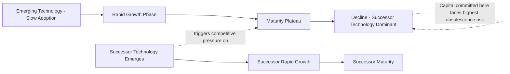

## Technological Obsolescence Risk

### Definition and Conceptual Foundation

Technological obsolescence risk is the risk that a capital asset loses economic value or competitive utility before the end of its assumed useful life, because a newer technology, process, or standard renders it inferior, uneconomic to operate, or unable to meet market/regulatory requirements — independent of the asset's physical condition. This distinguishes obsolescence risk from physical deterioration risk: an asset can be fully functional and well-maintained while still being economically obsolete.

$$\text{Economic Life} \leq \text{Physical Life}$$

This inequality is the foundational relationship underlying obsolescence risk analysis: capital budgeting and depreciation schedules based on physical life assumptions can materially overstate an asset's true remaining economic value if obsolescence risk is not separately considered, a theme that recurs across multiple capital-intensive industries examined elsewhere in this material (semiconductor fabrication equipment, AI accelerator hardware, aircraft fleets, and internal combustion engine tooling among them).

### Categories of Technological Obsolescence

**Key Points**

- **Functional obsolescence**: The asset can no longer perform its intended function competitively because newer technology delivers substantially better performance, efficiency, or output quality at comparable or lower cost.
- **Systemic/compatibility obsolescence**: The asset becomes obsolete not because it individually underperforms, but because it is incompatible with a broader system, standard, or ecosystem that has shifted (e.g., legacy IT infrastructure incompatible with current software/security standards).
- **Regulatory-driven obsolescence**: Changes in regulatory or compliance requirements (emissions standards, safety codes, environmental regulations) render an asset non-compliant or uneconomic to continue operating, regardless of its technical performance.
- **Economic/cost obsolescence**: The asset remains technically functional but becomes uneconomic to operate relative to newer alternatives due to shifts in relative input costs (e.g., an older, less fuel-efficient power plant becoming uneconomic as fuel prices rise relative to newer, more efficient alternatives).
- **Supply chain obsolescence**: Replacement parts, technical support, or complementary inputs for an asset become unavailable or prohibitively costly as the broader technology ecosystem moves on, even if the asset itself continues to function.

### Cross-Industry Patterns in Obsolescence Risk

| Industry Context | Obsolescence Driver | Typical Time Horizon |
| --- | --- | --- |
| Semiconductor fabrication equipment | Process node/technology generation advancement | 3–7 years economic life vs. longer physical life |
| AI/GPU accelerator infrastructure | Rapid hardware generation turnover | 3–6 years (actively debated, evolving) |
| Telecom active network equipment | Generational technology shifts (4G to 5G) | 5–8 years |
| Internal combustion engine manufacturing tooling | Powertrain technology transition (EV shift) | Variable, policy and adoption-dependent |
| Fossil fuel power generation assets | Decarbonization policy and renewable cost declines | Variable, jurisdiction-dependent |
| Legacy IT/enterprise software systems | Cloud/architecture paradigm shifts | 5–15 years, highly variable |
| Aircraft fleets (older generation) | Fuel efficiency improvements in newer generations | 15–25 years typical, accelerated by fuel price shifts |

[Unverified: time horizons represent broadly observed industry patterns; actual obsolescence timing is highly case-specific and depends on the pace of competing technology development, regulatory change, and market adoption dynamics, which vary considerably and should not be treated as fixed predictive figures.]

### Distinguishing Obsolescence Risk from Related Risk Categories

**Key Points**

- **Obsolescence vs. physical deterioration**: Physical deterioration is addressed through maintenance capex and standard depreciation; obsolescence risk requires a separate analytical lens because maintenance spending does not resolve the underlying competitive/economic disadvantage.
- **Obsolescence vs. demand risk**: Demand risk concerns whether sufficient market demand exists for the asset's output; obsolescence risk concerns whether the *specific asset* remains competitive at producing that output relative to alternatives, even where aggregate demand for the underlying product/service remains strong.
- **Obsolescence vs. stranded asset risk**: Stranded asset risk (discussed in the extractive and utility industry context) is often a *consequence* of severe obsolescence risk materializing — an asset becomes stranded when obsolescence, regulatory change, or demand shift jointly render continued operation or completion uneconomic; obsolescence risk is one causal pathway toward a stranded asset outcome, though not the only one.

### Financial and Analytical Frameworks for Obsolescence Risk

**Adjusting Useful Life Assumptions**

$$\text{Annual Depreciation} = \dfrac{\text{Asset Cost} - \text{Salvage Value}}{\text{Economic Useful Life}}$$

The central analytical adjustment for obsolescence risk is ensuring depreciation schedules reflect realistic *economic* useful life rather than solely physical/engineering useful life — as illustrated in the AI/GPU hardware depreciation example discussed elsewhere in this material, where shortening the assumed useful life from 6 to 4 years materially increased annual depreciation expense, reflecting a more conservative view of economic (versus physical) asset life.

**Technology S-Curve Analysis**

A qualitative but widely used framework for assessing obsolescence timing risk: technologies typically follow an S-curve adoption pattern (slow initial adoption, rapid mid-cycle growth, then plateau as the technology matures and a successor technology begins its own S-curve). Assets built on a technology nearing the plateau phase of its S-curve, particularly where a successor technology is entering its rapid growth phase, face elevated near-term obsolescence risk.

**Real Options Framing**

Obsolescence risk interacts directly with the real options concepts discussed elsewhere in this material: the option to defer investment is partly a hedge against committing capital to a technology on the verge of being superseded, while the option to abandon or the option to switch (flexible/multi-technology capable assets) directly mitigates realized obsolescence risk once it materializes.

### Illustration: Technology S-Curve and Obsolescence Risk Timing

### Diagram: Physical Life vs. Economic Life Gap (svg_diagram)

<svg xmlns="http://www.w3.org/2000/svg" viewBox="0 0 700 340">
<text x="350" y="26" font-size="16" font-weight="bold" text-anchor="middle" fill="#1a1a1a">Physical Life vs. Economic Life Gap (svg_diagram)</text>
<line x1="70" y1="280" x2="650" y2="280" stroke="#333" stroke-width="2" />
<text x="360" y="310" font-size="12" text-anchor="middle" fill="#333">Years in Service</text>
<rect x="70" y="150" width="580" height="40" fill="#dbeafe" stroke="#1e40af" stroke-width="1.5" />
<text x="360" y="175" font-size="13" font-weight="bold" text-anchor="middle" fill="#1e3a8a">Physical / Engineering Life (asset remains functional)</text>
<rect x="70" y="200" width="280" height="40" fill="#dcfce7" stroke="#15803d" stroke-width="1.5" />
<text x="210" y="225" font-size="12" font-weight="bold" text-anchor="middle" fill="#14532d">Economic Life (competitive value)</text>
<rect x="350" y="200" width="300" height="40" fill="#fee2e2" stroke="#b91c1c" stroke-width="1.5" />
<text x="500" y="220" font-size="11" font-weight="bold" text-anchor="middle" fill="#7f1d1d">Obsolescence Gap</text>
<text x="500" y="234" font-size="10" text-anchor="middle" fill="#7f1d1d">(functional but uncompetitive)</text>
<line x1="350" y1="150" x2="350" y2="240" stroke="#666" stroke-dasharray="4,3" />

<text x="360" y="330" font-size="11" text-anchor="middle" fill="#555" font-style="italic">Depreciation based on physical life alone understates true economic risk</text>

</svg>

### Industry-Specific Obsolescence Dynamics

**Semiconductor and Technology Infrastructure**

Process node advancement in semiconductor manufacturing has historically followed a pattern of periodic generational improvement, meaning fabrication equipment capable of producing a given process node becomes progressively less competitive as newer nodes offer better performance/cost characteristics — even while the equipment itself remains physically capable of production. This same dynamic, discussed elsewhere in this material regarding AI accelerator hardware, illustrates how rapidly evolving technology segments compress the gap between physical and economic life most severely.

**Automotive and Powertrain Transition**

The ongoing shift toward electric vehicle powertrains creates obsolescence risk for capital committed to internal combustion engine-specific manufacturing tooling and production lines. The degree and timing of this obsolescence risk is directly tied to the pace of EV adoption, which varies substantially by region and is subject to policy, infrastructure, and consumer adoption uncertainty. [Speculation: the specific timeline over which internal combustion engine-related manufacturing capital becomes economically obsolete varies by jurisdiction and remains subject to evolving policy and market adoption factors that are not yet fully resolved.]

**Energy Generation Assets**

Fossil fuel power generation assets face obsolescence risk from the combination of declining renewable energy costs and decarbonization policy, potentially rendering otherwise physically functional generation capacity uneconomic to continue operating before the end of its physical life — a dynamic closely related to the stranded asset risk discussed in the utilities and extractive industry context. [Inference: the pace and scope of this transition varies significantly by jurisdiction, generation technology, and evolving policy frameworks, and specific asset-level outcomes should be assessed against current regional energy market and regulatory conditions.]

### Risk Mitigation Strategies

**Key Points**

- **Modular and upgradeable design**: Designing capital assets with modular components that can be individually upgraded (rather than requiring full asset replacement) reduces the capital impact of partial obsolescence — a strategy directly analogous to the option-to-switch flexibility discussed in real options analysis.
- **Technology-agnostic infrastructure investment**: Where feasible, prioritizing capital investment in infrastructure layers less exposed to rapid technology change (e.g., building shells, power infrastructure, facility infrastructure) while treating faster-obsolescing components (compute hardware, active network equipment) as a separate, shorter-cycle reinvestment category — a distinction explicitly illustrated in the data center capital structure discussion elsewhere in this material.
- **Shortened depreciation and accelerated capital recovery**: Applying more conservative (shorter) useful life assumptions in financial planning for assets in fast-moving technology segments, ensuring capital recovery targets align with realistic economic life rather than optimistic physical life assumptions.
- **Staged/phased capital commitment**: Consistent with real options and construction risk management principles discussed elsewhere in this material, deferring full capital commitment until closer to the point of actual need reduces the window of exposure to a successor technology emerging before the asset is fully utilized.
- **Diversified technology portfolio approach**: Avoiding full commitment to a single technology generation or standard where multiple credible technology paths remain viable, preserving optionality until a dominant technology trajectory becomes clearer.
- **Monitoring technology roadmaps and competitive intelligence**: Systematic tracking of technology development roadmaps (both incumbent and potential disruptor technologies) to identify emerging obsolescence risk earlier in the capital planning cycle rather than reactively after competitive disadvantage has already materialized.

### Financial Statement and Disclosure Implications

**Key Points**

- **Impairment testing**: Under standard accounting frameworks, assets facing significant obsolescence risk may require impairment testing, comparing the asset's carrying value against recoverable value (fair value or value-in-use), potentially triggering write-downs if the carrying value is no longer supportable.
- **Accelerated depreciation policy changes**: Companies may revise depreciation policies (shortening useful life assumptions) in response to observed or anticipated obsolescence risk, which — as illustrated in the AI hardware depreciation example elsewhere in this material — directly affects reported profitability without any change in underlying cash capital deployed.
- **Disclosure of obsolescence risk factors**: Companies in technology-exposed capital-intensive industries commonly disclose technological obsolescence as a risk factor in financial filings, reflecting its materiality to long-term asset value and capital planning assumptions.

### Related Topics

- Technology S-curve analysis and adoption lifecycle modeling
- Useful life and depreciation policy assumptions under obsolescence risk
- Real options (option to switch, option to defer) as obsolescence risk mitigation
- Stranded asset risk in energy transition and extractive industries
- Impairment testing and asset write-down triggers under accounting standards
- Modular and upgradeable capital asset design strategies
- Semiconductor process node advancement and fabrication equipment economic life
- Automotive powertrain transition and manufacturing tooling obsolescence
- AI accelerator hardware depreciation assumptions and useful life debates
- Technology roadmap monitoring as a capital planning risk management practice