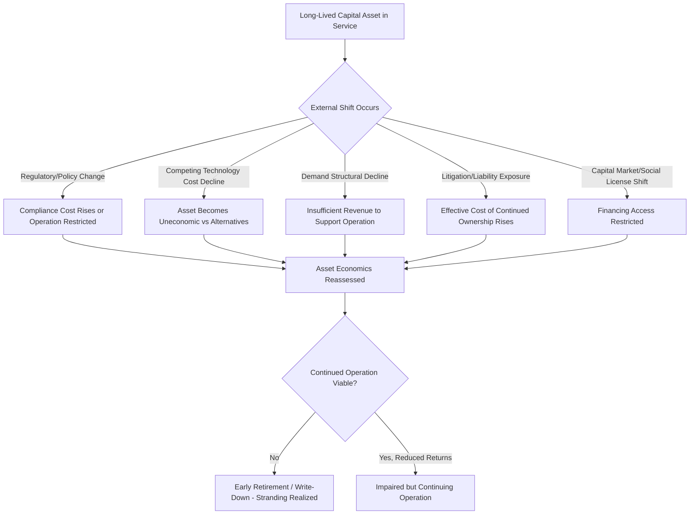

## Stranded Asset Risk

### Definition and Conceptual Foundation

Stranded asset risk is the risk that a capital asset suffers a material, often unanticipated, write-down, early retirement, or conversion to a liability before the end of its originally planned economic life, due to external shifts in regulation, technology, market structure, or social/environmental expectations that undermine the asset's ability to generate its previously assumed returns. Unlike ordinary depreciation or gradual obsolescence, stranding often involves a discontinuous, structural change in the operating or regulatory environment that invalidates the original investment thesis.

$$\text{Stranding Loss} = \text{Carrying Value} - \text{Recoverable Value (post-stranding)}$$

Stranded asset risk has become a particularly prominent topic in capital-intensive, long-lived-asset industries — fossil fuel extraction and generation, utilities, heavy industry, and real estate — because these sectors combine multi-decade asset lives with meaningful exposure to policy, technology, and social/market shifts occurring over shorter timeframes than the assets were originally designed to operate.

### Relationship to Other Risk Categories Discussed in This Material

**Key Points**

- **Stranding as an outcome, not solely a cause**: Stranded asset risk is often the *realized consequence* of other risk categories materializing — technological obsolescence, regulatory-driven asset devaluation, or demand collapse can each independently or jointly produce a stranding outcome.
- **Distinct from ordinary write-downs**: While any capital asset can be impaired under adverse conditions, "stranded asset" terminology is typically reserved for situations involving a structural, often policy- or transition-driven, shift that renders an entire asset category — not just an individual underperforming asset — economically unviable ahead of schedule.
- **Overlap with technological obsolescence risk**: As discussed elsewhere in this material, technological obsolescence is one causal pathway toward stranding (e.g., fossil fuel generation assets becoming uneconomic as renewable costs decline), though stranding can also arise from purely regulatory or social/market causes independent of any competing technology.
- **Overlap with reserve/resource depletion economics**: In extractive industries, stranding is specifically relevant to *unextracted reserves* — proven reserves that a company may hold on its books but which may never be economically extracted due to policy constraints, carbon budget considerations, or shifting demand, distinct from ordinary reserve depletion through production.

### Primary Drivers of Stranded Asset Risk

**Regulatory and Policy-Driven Stranding**

- Carbon pricing, emissions caps, or outright prohibition of certain activities (e.g., restrictions on new fossil fuel extraction licenses, coal plant retirement mandates)
- Changes in environmental permitting standards rendering existing operations non-compliant
- Shifts in subsidy or tax treatment that alter the relative economics of competing technologies

**Technology-Driven Stranding**

- Cost declines in substitute technologies (e.g., renewable energy and battery storage cost declines affecting fossil fuel generation economics) reaching a point where continued operation of the incumbent asset is uneconomic relative to new-build alternatives
- Disruptive technology shifts rendering entire asset categories obsolete faster than anticipated (related to the technological obsolescence risk discussed elsewhere in this material)

**Market and Demand-Driven Stranding**

- Structural demand decline for an asset's output (e.g., reduced demand for a specific fuel type or industrial process input) independent of any single competing technology
- Shifts in consumer or corporate purchasing preferences (e.g., corporate decarbonization commitments reducing demand for carbon-intensive products)

**Litigation and Liability-Driven Stranding**

- Legal liability exposure (e.g., climate-related litigation, environmental contamination liability) that increases the effective cost of continued asset operation or ownership beyond economic viability
- Insurance market withdrawal from certain asset categories, raising or eliminating the availability of coverage necessary for continued operation

**Social License and Reputational Stranding**

- Shifting investor, lender, or public sentiment leading to reduced capital availability for certain asset categories (e.g., financial institutions restricting lending to specific fossil fuel project types), which can force early asset retirement or divestment independent of the asset's continued technical or even standalone economic viability. [Inference: the extent to which social license pressure alone (absent regulatory or direct economic drivers) causes material stranding, versus primarily accelerating stranding that would eventually occur from other causes, is a matter of ongoing debate and likely varies by asset type, jurisdiction, and time period.]

### Sector-Specific Stranded Asset Exposure

| Sector | Primary Stranding Driver | Asset Types at Risk |
| --- | --- | --- |
| Fossil Fuel Extraction (upstream) | Policy/demand shift, carbon budget constraints | Unextracted reserves, exploration assets |
| Coal-Fired Power Generation | Regulatory mandates, renewable cost decline | Generation plants, associated infrastructure |
| Natural Gas Generation & Infrastructure | Long-term decarbonization trajectory, though generally viewed as a lower and later-stage risk than coal | Generation plants, pipelines (variable by jurisdiction) |
| Internal Combustion Engine Manufacturing | Powertrain transition | Manufacturing tooling, engine plants |
| Commercial Real Estate (certain segments) | Structural demand shift (e.g., remote work), energy efficiency regulation | Office buildings, older/inefficient building stock |
| Heavy Industry (steel, cement) | Decarbonization technology requirements, carbon pricing | Legacy high-emissions production facilities |

[Unverified: relative risk characterizations reflect broadly discussed patterns in stranded asset literature and policy analysis; the specific timing, scope, and magnitude of stranding risk for any given asset category is highly jurisdiction- and policy-dependent, evolving, and subject to genuine ongoing uncertainty and debate rather than settled prediction.]

### Illustration: Pathways to Asset Stranding

### Diagram: Stranded Asset Value Impairment Timeline (svg_diagram)

<svg xmlns="http://www.w3.org/2000/svg" viewBox="0 0 700 360">
<text x="350" y="26" font-size="16" font-weight="bold" text-anchor="middle" fill="#1a1a1a">Stranded Asset Value Impairment Timeline (svg_diagram)</text>
<line x1="70" y1="300" x2="650" y2="300" stroke="#333" stroke-width="2" />
<line x1="70" y1="300" x2="70" y2="50" stroke="#333" stroke-width="2" />
<text x="360" y="330" font-size="12" text-anchor="middle" fill="#333">Time (Originally Planned Asset Life)</text>
<text x="30" y="180" font-size="12" text-anchor="middle" fill="#333" transform="rotate(-90 30 180)">Asset Value</text>
<line x1="70" y1="270" x2="650" y2="80" stroke="#94a3b8" stroke-width="2" stroke-dasharray="5,3" />
<text x="500" y="100" font-size="10" fill="#64748b">Originally Planned Value Path</text>
<path d="M70,270 L280,150 L300,150 L310,230 L400,250 L650,290" fill="none" stroke="#b91c1c" stroke-width="2.5" />
<text x="330" y="170" font-size="11" fill="#7f1d1d">External Shift Event</text>
<circle cx="300" cy="150" r="4" fill="#b91c1c" />
<line x1="300" y1="150" x2="310" y2="230" stroke="#7f1d1d" stroke-width="1" stroke-dasharray="2,2" />
<text x="320" y="200" font-size="9" fill="#7f1d1d">Impairment / Write-down</text>

<text x="360" y="350" font-size="11" text-anchor="middle" fill="#555" font-style="italic">Value diverges sharply from planned trajectory following a structural external shift</text>

</svg>

### Financial Analysis and Risk Assessment Frameworks

**Scenario Analysis Against Policy/Transition Pathways**

$$\text{Value at Risk (Stranding)} = \sum_{i} P(\text{Scenario}_i) \times \text{Value Loss}_i$$

Companies and analysts increasingly apply scenario-based frameworks — evaluating asset value under multiple plausible policy and technology transition pathways (e.g., different carbon pricing trajectories or renewable cost decline rates) — rather than relying on a single base-case forecast, given the genuine structural uncertainty involved in stranding risk.

**Carbon Budget-Implied Reserve Analysis**

A specific analytical approach used particularly in fossil fuel sector stranding analysis compares a company's or industry's proven reserves against estimated global carbon budgets consistent with climate policy targets, to assess what proportion of reserves might ultimately be "unburnable" under various policy scenarios. [Inference: this analytical approach, while widely referenced in stranded asset literature and by some investor and policy organizations, involves substantial modeling assumptions regarding future policy stringency, technology pathways, and global carbon budget allocation methodology, and results vary considerably across different studies and assumption sets.]

**Impairment Testing Under Accounting Standards**

$$\text{Impairment Loss} = \text{Carrying Value} - \max(\text{Fair Value Less Costs to Sell}, \text{Value in Use})$$

Under standard accounting frameworks, indicators of potential stranding (regulatory change, adverse market conditions, technological developments) can trigger formal impairment testing, requiring companies to assess whether the carrying value of affected assets remains supportable — directly linking stranded asset risk analysis to standard financial reporting obligations.

### Risk Mitigation and Management Strategies

**Key Points**

- **Portfolio diversification away from single-technology concentration**: Reducing capital concentration in asset categories with elevated policy or technology transition exposure, consistent with the diversified technology portfolio approach discussed in the technological obsolescence risk material.
- **Shortened payback period requirements for exposed asset categories**: Applying more conservative capital allocation hurdle rates or shortened required payback periods for investments in asset categories with elevated stranding risk exposure, effectively pricing in the risk of early retirement.
- **Flexible/convertible asset design**: Where technically feasible, designing assets capable of conversion to alternative uses (e.g., industrial sites designed for potential repurposing) to preserve some recoverable value even if the original use case becomes stranded.
- **Active engagement with policy trajectory monitoring**: Systematic tracking of regulatory and policy development relevant to asset categories with elevated stranding exposure, allowing more proactive capital allocation adjustment rather than reactive response after stranding materializes.
- **Explicit stranding risk premium in capital allocation decisions**: Incorporating stranding risk explicitly into investment hurdle rates or scenario-weighted valuation (rather than treating asset life as a fixed, certain planning assumption) for new capital committed to exposed asset categories.
- **Decommissioning and reclamation fund pre-provisioning**: Establishing dedicated funding mechanisms for eventual decommissioning/reclamation obligations in advance, reducing the financial shock if asset retirement occurs earlier than originally planned.

### Stakeholder and Disclosure Dimensions

**Key Points**

- **Investor and lender scrutiny**: Financial institutions and institutional investors have increasingly incorporated stranded asset risk assessment into lending and investment decision frameworks for exposed sectors, affecting capital availability and cost of capital for companies with significant exposure. [Inference: the extent and consistency of this practice varies considerably across financial institutions, jurisdictions, and over time, and should not be assumed uniform across all capital providers.]
- **Climate-related financial disclosure frameworks**: Various disclosure frameworks and regulatory requirements have emerged internationally requiring companies to assess and disclose climate-related transition risks, including stranded asset exposure, though specific requirements vary significantly by jurisdiction and continue to evolve. [Unverified: given the pace of regulatory development in this area, current disclosure requirements should be verified against the most recent applicable jurisdictional requirements rather than assumed static.]
- **Debate regarding materiality and timing**: Genuine analytical and political debate exists regarding the pace, scope, and ultimate magnitude of stranded asset risk across different sectors and asset categories, with a range of credible views reflecting differing assumptions about policy trajectories, technology cost curves, and demand evolution. This is a topic where reasonable analysts and stakeholders hold differing views based on differing underlying assumptions, rather than a matter of settled consensus.

### Related Topics

- Technological obsolescence risk and its relationship to asset stranding
- Impairment testing and asset write-down accounting frameworks
- Carbon budget-implied reserve analysis in fossil fuel sector risk assessment
- Scenario analysis for policy and technology transition risk
- Climate-related financial disclosure frameworks and regulatory requirements
- Decommissioning and reclamation liability pre-funding strategies
- Reserve replacement and unextracted reserve valuation in extractive industries
- Capital allocation hurdle rate adjustments for transition-exposed assets
- Portfolio diversification strategies against single-technology concentration risk
- Real options (option to abandon) as a stranded asset risk mitigation tool