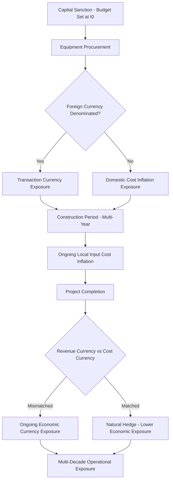

## Currency and Inflation Risk in Multi-Year Capex

### Definition and Conceptual Foundation

Currency and inflation risk in multi-year capex refers to the exposure a capital project faces from adverse movements in foreign exchange rates and general or input-specific price inflation over the extended timeframe between initial capital budgeting/sanction and final project completion or operational cash flow realization. Because large capital projects — particularly in utilities, extractives, infrastructure, and manufacturing — routinely span multiple years from sanction to completion, and often decades of subsequent operation, they carry sustained exposure to macroeconomic variables that can materially alter the economics established at the time of initial investment approval.

$$\text{Real Cost Overrun (Inflation)} = \text{Nominal Actual Cost} - \text{Nominal Budgeted Cost}$$

$$\text{Currency Translation Impact} = \text{Foreign Currency Cash Flow} \times (\text{Spot Rate}_{t} - \text{Spot Rate}_{0})$$

This risk category interacts directly with the construction/execution risk and stranded asset risk discussed elsewhere in this material, since currency and inflation shocks are among the specific mechanisms through which cost overruns and altered project economics can materialize.

### Inflation Risk in Capital Projects

**Key Points**

- **General inflation versus input-specific inflation**: Broad consumer or producer price inflation indices often diverge significantly from the specific input cost inflation relevant to a capital project (e.g., steel, copper, cement, specialized labor, or equipment), meaning general inflation indices may understate or overstate actual project cost exposure.
- **Commodity input cost volatility**: Capital-intensive construction projects are heavily exposed to volatility in key commodity inputs (steel, copper, aluminum, cement, fuel), which can move independently of, and often more sharply than, general inflation measures.
- **Labor cost inflation and skilled labor scarcity**: Specialized construction and engineering labor costs can inflate rapidly during periods of high overall construction activity (regional or global capital investment booms), independent of general wage inflation trends.
- **Equipment and long-lead-item cost inflation**: Specialized capital equipment (turbines, transformers, reactors, custom fabrication) often has concentrated global supplier bases, making pricing particularly sensitive to global demand cycles for that specific equipment category rather than tracking general inflation.
- **Escalation clause interaction with contract structure**: The choice of contracting structure (as discussed in the construction and execution risk material) directly determines how inflation risk is allocated — fixed-price contracts transfer inflation risk to the contractor (typically at a cost premium), while cost-plus and many escalation-indexed contracts retain some or all inflation risk with the project owner.

### Currency Risk in Multi-Year Capex

**Key Points**

- **Cross-border project exposure**: Projects involving imported equipment, foreign-currency-denominated debt, or operations generating revenue in a currency different from the reporting/functional currency face currency risk at multiple points in the project lifecycle.
- **Transaction exposure**: Direct exposure arising from specific contractual payments denominated in foreign currency (e.g., equipment purchase contracts priced in a foreign currency for a domestic project) — the risk that exchange rate movements between contract signing and payment settlement alter the effective cost.
- **Translation exposure**: Exposure arising when consolidating foreign subsidiary or foreign-currency-denominated asset values into a parent company's reporting currency for financial statement purposes, affecting reported (though not necessarily cash) results.
- **Economic exposure**: Longer-term, structural exposure where currency movements affect the underlying competitiveness or cash flow generation of an asset (e.g., a commodity export facility whose revenue is denominated in one currency while its operating costs are denominated in another).
- **Emerging market currency volatility**: Capital projects located in emerging or frontier markets often face materially higher currency volatility and, in some cases, convertibility or capital control risk, compounding standard currency exposure with additional political/regulatory currency risk dimensions.

### The Compounding Effect of Currency and Inflation Risk in Long-Duration Projects

**Example**

A capital project sanctioned with the following assumptions:

- Total budgeted capex: $1.0 billion, denominated 60% in local currency and 40% in imported equipment priced in a foreign currency
- Project construction duration: 4 years
- Assumed local inflation: 3% per year
- Assumed foreign currency appreciation against local currency: 5% per year (compounding)

Local currency-denominated portion after inflation over 4 years:

$$600{,}000{,}000 \times (1.03)^4 \approx \$675{,}418{,}000$$

Foreign currency-denominated portion after currency appreciation over 4 years:

$$400{,}000{,}000 \times (1.05)^4 \approx \$486{,}202{,}000$$

$$\text{Total Nominal Cost} \approx 675{,}418{,}000 + 486{,}202{,}000 = \$1{,}161{,}620{,}000$$

This represents an approximately 16.2% increase over the original $1.0 billion budget, driven purely by the combined effect of local inflation and foreign currency appreciation over the construction period — before accounting for any construction execution risk (cost overruns, schedule delays) discussed elsewhere in this material. This illustrates why multi-year capital projects require explicit currency and inflation risk modeling as a distinct budgeting discipline, separate from construction execution risk contingencies. [Inference: this example uses illustrative assumed rates for demonstration purposes; actual inflation and currency movements over any specific multi-year period are inherently uncertain and should be modeled using scenario ranges rather than single-point forecasts for real capital planning purposes.]

### Illustration: Currency and Inflation Risk Points Across the Capital Project Lifecycle

### Diagram: Currency and Inflation Risk Exposure Points (svg_diagram)

<svg xmlns="http://www.w3.org/2000/svg" viewBox="0 0 700 360">
<text x="350" y="26" font-size="16" font-weight="bold" text-anchor="middle" fill="#1a1a1a">Currency and Inflation Risk Exposure Points (svg_diagram)</text>
<line x1="70" y1="300" x2="650" y2="300" stroke="#333" stroke-width="2" />
<text x="360" y="330" font-size="12" text-anchor="middle" fill="#333">Project Timeline: Sanction to Multi-Decade Operation</text>
<rect x="70" y="200" width="140" height="70" fill="#dbeafe" stroke="#1e40af" stroke-width="1.5" />
<text x="140" y="225" font-size="11" font-weight="bold" text-anchor="middle" fill="#1e3a8a">Procurement Phase</text>
<text x="140" y="245" font-size="9" text-anchor="middle" fill="#1e3a8a">Transaction FX Exposure</text>
<text x="140" y="258" font-size="9" text-anchor="middle" fill="#1e3a8a">Equipment Cost Inflation</text>
<rect x="230" y="200" width="140" height="70" fill="#fef3c7" stroke="#b45309" stroke-width="1.5" />
<text x="300" y="225" font-size="11" font-weight="bold" text-anchor="middle" fill="#78350f">Construction Phase</text>
<text x="300" y="245" font-size="9" text-anchor="middle" fill="#78350f">Labor/Material Inflation</text>
<text x="300" y="258" font-size="9" text-anchor="middle" fill="#78350f">Financing Cost Exposure</text>
<rect x="390" y="200" width="260" height="70" fill="#dcfce7" stroke="#15803d" stroke-width="1.5" />
<text x="520" y="225" font-size="11" font-weight="bold" text-anchor="middle" fill="#14532d">Operational Phase (Multi-Decade)</text>
<text x="520" y="245" font-size="9" text-anchor="middle" fill="#14532d">Economic Currency Exposure</text>
<text x="520" y="258" font-size="9" text-anchor="middle" fill="#14532d">Ongoing Opex Inflation</text>

<text x="360" y="350" font-size="11" text-anchor="middle" fill="#555" font-style="italic">Exposure type and magnitude shift across distinct project lifecycle phases</text>

</svg>

### Hedging and Risk Mitigation Strategies

**Currency Risk Mitigation**

- **Natural hedging**: Structuring project financing and/or revenue arrangements to match the currency of costs and revenues where possible (e.g., financing a project with debt denominated in the same currency as anticipated revenue), reducing net economic currency exposure without requiring financial derivatives.
- **Forward contracts and currency swaps**: Financial derivative instruments used to lock in exchange rates for known future foreign currency payments (e.g., equipment purchase installments), converting uncertain future currency exposure into a fixed, known cost at the time of hedging.
- **Currency options**: Provide the right, but not obligation, to exchange currency at a specified rate, offering downside protection while retaining some upside potential if currency movements are favorable — at the cost of an upfront option premium.
- **Local currency financing**: Where feasible, financing a portion of project capital in the same currency as project revenues reduces the net currency mismatch, though local currency debt markets may have less favorable terms or availability in some jurisdictions, particularly emerging markets.

**Inflation Risk Mitigation**

- **Escalation clauses in contracts**: Contractual provisions that adjust payment amounts based on specified inflation indices or commodity price benchmarks, sharing inflation risk between the contracting parties rather than concentrating it entirely with one side.
- **Fixed-price contracting (with contractor-borne inflation risk)**: As discussed in the construction and execution risk material, lump-sum EPC contracts effectively transfer inflation risk to the contractor, typically reflected in a higher initial contract price as compensation for bearing that risk.
- **Early procurement / price locking for critical inputs**: Committing to pricing for major equipment or material categories earlier in the project timeline, before potential inflationary pressure materializes, at the cost of reduced flexibility and potential upfront capital commitment timing changes.
- **Commodity hedging for input-specific exposure**: Using commodity derivatives (futures, forwards) to hedge exposure to specific volatile input costs (e.g., copper, steel, fuel) that are material to the project's cost structure, distinct from general inflation hedging.

### Financial Modeling Implications

**Key Points**

- **Real versus nominal cash flow modeling consistency**: Capital project financial models must maintain internal consistency between real (inflation-adjusted) and nominal cash flow and discount rate treatment — combining nominal cash flow projections with a real discount rate (or vice versa) produces analytically inconsistent and materially misleading valuation results.

$$\text{Real Discount Rate} \approx \text{Nominal Discount Rate} - \text{Expected Inflation Rate}$$

- **Scenario-based currency and inflation modeling**: Given the inherent unpredictability of multi-year currency and inflation trajectories, robust capital project financial models typically incorporate scenario ranges (e.g., base, high-inflation, currency-stress scenarios) rather than relying on a single-point forecast, consistent with the scenario analysis approaches discussed in the real options and stranded asset risk material.
- **Sensitivity analysis on key exposure variables**: Explicit sensitivity testing of project NPV/returns to variations in key currency pairs and inflation assumptions helps identify which specific exposures are most material to overall project economics, focusing risk mitigation resources accordingly.
- **Contingency budgeting distinct from currency/inflation provisions**: Best practice generally treats currency and inflation risk provisioning as analytically distinct from the construction execution contingency reserves discussed elsewhere in this material, since the underlying risk drivers, mitigation tools, and probability distributions differ meaningfully between the two categories, even though both are ultimately embedded in overall project cost risk management. [Inference: specific organizational practices regarding whether currency/inflation risk is budgeted separately from general contingency reserves vary by company and industry convention, and this represents a commonly recommended rather than universally applied practice.]

### Risks and Limitations of Hedging Approaches

**Key Points**

- **Hedging cost versus benefit tradeoff**: Financial hedging instruments carry direct costs (option premiums, bid-ask spreads, potential opportunity cost if rates move favorably) that must be weighed against the risk reduction benefit, particularly for very long-dated exposures where liquid hedging instruments may not be readily available at reasonable cost.
- **Basis risk**: Hedging instruments may not perfectly match the specific timing, currency pair, or commodity grade of the actual underlying exposure, leaving residual "basis risk" even after hedging is implemented.
- **Limited hedging horizon availability**: Deep, liquid hedging markets for very long-dated currency or commodity exposures (matching multi-decade project operational exposure) are often limited, meaning hedging is typically more feasible for the construction-phase exposure than for the full operational life of long-lived capital assets.
- **Counterparty credit risk**: Derivative hedging instruments introduce counterparty credit risk, requiring appropriate counterparty selection and, in some cases, collateral/margin arrangements to manage this additional risk dimension.

### Related Topics

- Natural hedging strategies through currency-matched financing and revenue structures
- Forward contracts, currency swaps, and options for project currency risk management
- Real versus nominal discount rate consistency in capital project financial modeling
- Escalation clauses and inflation risk allocation in EPC/construction contracts
- Emerging market currency volatility and convertibility risk in cross-border projects
- Commodity hedging for input-specific cost exposure in construction projects
- Scenario analysis techniques for multi-year currency and inflation forecasting
- Construction contingency reserves versus currency/inflation risk provisioning
- Economic, transaction, and translation currency exposure distinctions
- Basis risk and hedging limitations for long-dated capital project exposures