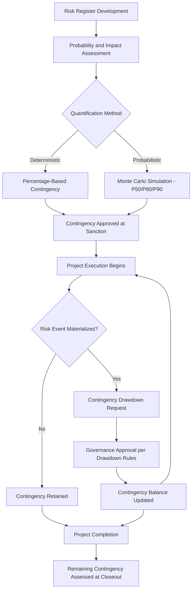

## Contingency Planning and Post-Investment Audits

### Definition and Conceptual Foundation

Contingency planning and post-investment audits represent two complementary disciplines that bracket the capital investment lifecycle: contingency planning addresses *forward-looking* risk provisioning made at or before capital sanction, while post-investment audits provide *backward-looking* evaluation of actual outcomes against original projections after the asset is operational. Together, they form a closed-loop capital governance system — contingency planning sets aside resources to absorb anticipated risk, while post-investment audits assess whether that provisioning, and the underlying investment decision itself, proved accurate, feeding lessons learned back into future contingency planning and capital approval processes.

$$\text{Contingency Reserve} = f(\text{Risk Register Severity}, \text{Project Complexity}, \text{Estimate Maturity})$$

$$\text{Post-Investment Variance} = \text{Actual Outcome} - \text{Approved Business Case Projection}$$

This pairing is directly relevant to capital-intensive industries given the scale, duration, and irreversibility of major capital commitments discussed throughout this material — from utility infrastructure to extractive mega-projects to technology infrastructure buildout.

### Contingency Planning: Purpose and Structure

**Key Points**

- **Known-unknowns versus unknown-unknowns distinction**: Contingency reserves are generally intended to cover identified risks captured in a formal risk register (known-unknowns) — quantifiable, if uncertain, cost and schedule risks. Separate management reserves are typically held for risks not anticipated at all (unknown-unknowns), often controlled at a higher organizational level.
- **Risk register-based quantification**: A structured contingency planning process typically begins with a comprehensive risk register identifying discrete risk events, their estimated probability of occurrence, and potential cost/schedule impact if realized, forming the analytical basis for contingency sizing.
- **Probabilistic contingency sizing (Monte Carlo simulation)**: Rather than applying a single deterministic contingency percentage, more sophisticated approaches simulate the combined probabilistic impact of multiple identified risk factors to generate a contingency value calibrated to a specific confidence level (e.g., P50, P80, P90 cost estimates).
- **Contingency drawdown governance**: Effective contingency planning includes explicit governance rules for how and when contingency funds can be accessed during project execution, preventing contingency from being treated as a discretionary budget buffer rather than a risk-specific reserve.
- **Stage-gate contingency reduction**: As discussed in the construction and execution risk material, contingency levels are typically set as a percentage of estimated cost that decreases as project definition matures through sequential approval stage gates, reflecting improving estimate accuracy as design and scope definition become more complete.

### Types of Contingency Reserves

| Reserve Type | Purpose | Typical Control Level |
| --- | --- | --- |
| Cost Contingency | Covers identified, quantified cost risks in the risk register | Project management level |
| Schedule Contingency | Buffer time allocated to absorb identified schedule risks | Project management level |
| Management Reserve | Covers unforeseen/unidentified risks (unknown-unknowns) | Senior management/sponsor level |
| Currency/Inflation Provision | Covers modeled currency and inflation exposure (distinct from execution risk contingency, as discussed elsewhere in this material) | Finance/treasury function typically involved |
| Escalation Allowance | Specifically tied to anticipated input cost inflation over the project duration | Estimating/cost engineering function |

### Illustration: Contingency Planning and Governance Flow

### Post-Investment Audits: Purpose and Structure

**Key Points**

- **Definition and objective**: A post-investment audit (also referred to as a post-completion audit, post-implementation review, or post-project review) is a structured evaluation, typically conducted at a defined interval after a capital asset becomes operational, comparing actual financial and operational performance against the projections used to justify the original capital approval.
- **Distinguishing from ongoing project controls**: Post-investment audits differ from the earned value management and project controls monitoring discussed in the construction and execution risk material, which track performance *during* execution — post-investment audits specifically assess outcomes *after* completion and operational ramp-up, focusing on whether the original investment decision and its underlying assumptions proved sound.
- **Dual purpose — accountability and organizational learning**: Post-investment audits serve both an accountability function (assessing whether capital was deployed as approved and whether sponsors delivered projected results) and a learning function (identifying systematic patterns in estimation bias, risk assessment accuracy, or execution capability that should inform future capital approval and planning processes).
- **Timing considerations**: Audits conducted too soon after completion may not capture the asset's true steady-state performance (particularly relevant given the ramp-up/commissioning risk discussed in the construction and execution risk material), while audits conducted very late may face data availability challenges or reduced organizational relevance to current decision-making; many organizations target a post-investment audit at a defined interval (commonly one to three years) after commercial operation begins, though this varies by industry and asset type. [Inference: specific timing conventions vary considerably by organization, industry, and asset class, and should be calibrated to the specific ramp-up characteristics of the asset type in question rather than applied as a universal rule.]

### Components of a Comprehensive Post-Investment Audit

**Financial Performance Comparison**

- Actual capex versus approved budget (final total cost variance)
- Actual revenue/cash flow generation versus original business case projections
- Actual NPV/IRR/payback period (recalculated using actual results) versus originally approved projections

**Operational Performance Comparison**

- Actual capacity utilization, throughput, or output quality versus design specifications
- Actual operating cost structure versus original assumptions
- Actual timeline to reach steady-state operational performance versus planned ramp-up assumptions

**Assumption and Methodology Review**

- Assessment of which specific assumptions (market demand, commodity prices, currency, technical performance) proved most and least accurate
- Review of whether risk factors identified in the original risk register and contingency planning process materialized as anticipated, and whether contingency reserves were appropriately sized

**Decision Process Review**

- Evaluation of whether the original capital approval process itself (analysis rigor, stakeholder review, approval governance) functioned effectively
- Identification of any evidence of optimism bias or strategic misrepresentation in original projections, as discussed in the construction and execution risk material

### Diagram: Post-Investment Audit Feedback Loop into Capital Governance (svg_diagram)

<svg xmlns="http://www.w3.org/2000/svg" viewBox="0 0 720 380">
<text x="360" y="26" font-size="16" font-weight="bold" text-anchor="middle" fill="#1a1a1a">Post-Investment Audit Feedback Loop (svg_diagram)</text>
<rect x="40" y="60" width="160" height="70" rx="8" fill="#dbeafe" stroke="#1e40af" stroke-width="1.5" />
<text x="120" y="90" font-size="12" font-weight="bold" text-anchor="middle" fill="#1e3a8a">Capital Sanction</text>
<text x="120" y="108" font-size="10" text-anchor="middle" fill="#1e3a8a">Original Business Case</text>
<rect x="280" y="60" width="160" height="70" rx="8" fill="#fef3c7" stroke="#b45309" stroke-width="1.5" />
<text x="360" y="90" font-size="12" font-weight="bold" text-anchor="middle" fill="#78350f">Execution &amp; Commissioning</text>
<text x="360" y="108" font-size="10" text-anchor="middle" fill="#78350f">Project Controls / EVM</text>
<rect x="520" y="60" width="160" height="70" rx="8" fill="#dcfce7" stroke="#15803d" stroke-width="1.5" />
<text x="600" y="90" font-size="12" font-weight="bold" text-anchor="middle" fill="#14532d">Steady-State Operation</text>
<text x="600" y="108" font-size="10" text-anchor="middle" fill="#14532d">Actual Performance Data</text>
<rect x="280" y="220" width="160" height="70" rx="8" fill="#fee2e2" stroke="#b91c1c" stroke-width="1.5" />
<text x="360" y="250" font-size="12" font-weight="bold" text-anchor="middle" fill="#7f1d1d">Post-Investment Audit</text>
<text x="360" y="268" font-size="10" text-anchor="middle" fill="#7f1d1d">Actual vs. Projected</text>
<line x1="200" y1="95" x2="278" y2="95" stroke="#333" stroke-width="2" marker-end="url(#arrow3)" />
<line x1="440" y1="95" x2="518" y2="95" stroke="#333" stroke-width="2" marker-end="url(#arrow3)" />
<line x1="600" y1="130" x2="600" y2="255" stroke="#333" stroke-width="2" />
<line x1="600" y1="255" x2="442" y2="255" stroke="#333" stroke-width="2" marker-end="url(#arrow3)" />
<line x1="280" y1="255" x2="120" y2="255" stroke="#333" stroke-width="2" marker-end="url(#arrow3)" />
<line x1="120" y1="255" x2="120" y2="132" stroke="#333" stroke-width="2" marker-end="url(#arrow3)" />
<text x="140" y="200" font-size="10" fill="#444">Lessons learned feed</text>
<text x="140" y="212" font-size="10" fill="#444">future capital approval</text>
<text x="360" y="350" font-size="11" text-anchor="middle" fill="#555" font-style="italic">The audit closes the loop, feeding actual outcomes back into future capital planning discipline</text>

</svg>

### Quantitative Metrics Used in Post-Investment Audits

$$\text{Cost Overrun \%} = \dfrac{\text{Actual Total Cost} - \text{Approved Budget}}{\text{Approved Budget}} \times 100\%$$

$$\text{Recalculated IRR (Actual)} = \text{IRR using actual realized cash flows to date, plus remaining projected cash flows}$$

**Example**

A capital project approved with a projected IRR of 14% and a 5-year payback period is audited three years after commercial operation begins:

- Actual capex came in 8% over the approved budget
- Actual revenue in the first three years of operation tracked approximately 12% below original projections, due to slower-than-anticipated demand ramp-up
- Actual operating costs were roughly in line with original projections

Recalculating IRR using actual results to date combined with updated (more conservative) forward projections might yield a revised expected IRR in the range of 9–10%, materially below the originally approved 14% — a finding that, if this pattern recurs across multiple audited projects within an organization, would suggest a systematic bias toward overly optimistic demand ramp-up assumptions in that organization's capital approval process, information directly actionable for improving future capital planning rigor. [Inference: this example illustrates the type of finding a post-investment audit is designed to surface; specific numerical outcomes are illustrative rather than derived from a real audited case, and actual recalculated IRR depends on the complete set of realized and projected remaining cash flows for the specific project being audited.]

### Organizational and Governance Considerations

**Key Points**

- **Independence of the audit function**: Post-investment audits are generally considered most credible and useful when conducted with some degree of independence from the original project sponsors or approval team, reducing incentive to understate unfavorable variances or overstate favorable ones.
- **Standardized audit methodology and comparability**: Applying a consistent audit framework and metric set across multiple projects over time allows an organization to identify systematic patterns (e.g., recurring optimism bias in a particular business unit or project type) rather than treating each audit as an isolated exercise.
- **Linkage to future capital approval requirements**: The greatest organizational value from post-investment audits is typically realized when findings are explicitly incorporated into future capital approval processes — for example, requiring more conservative demand ramp-up assumptions in future business cases if audits reveal a persistent pattern of over-optimistic ramp-up projections.
- **Cultural and incentive challenges**: Effective post-investment audit practice requires an organizational culture that treats variance findings as learning opportunities rather than solely as a basis for individual blame, since a punitive audit culture can incentivize future project sponsors to be less transparent in original risk disclosure, undermining the overall quality of future capital planning. [Inference: the specific balance between accountability and psychological safety in post-investment audit culture varies by organization, and reasonable approaches to this tradeoff differ across companies and industries.]
- **Resource and consistency challenges in practice**: Despite widely acknowledged value, post-investment audits are inconsistently and sometimes only partially implemented across organizations and industries in practice, often due to resource constraints, reduced organizational attention once a project moves from "new investment" to "existing operations," or the absence of a formal mandate requiring the audit to occur. [Inference: the degree of inconsistency in practice is widely discussed in capital project management literature and practitioner experience, though precise adoption rates across industries are not something that can be stated with high confidence without reference to specific current survey data.]

### Integration with Broader Capital Investment Risk Management

**Key Points**

- **Relationship to real options and staged investment**: Post-investment audit findings can directly inform the exercise of embedded real options (as discussed in the real options analysis material) — for example, audit findings on an initial project phase directly informing the decision of whether to exercise an expansion option on a subsequent phase.
- **Relationship to construction risk contingency calibration**: Systematic post-investment audit findings regarding contingency drawdown patterns (whether contingency reserves were consistently under- or over-utilized across a portfolio of projects) provide an empirical basis for recalibrating future contingency-setting methodologies, rather than relying solely on generic industry benchmarks.
- **Relationship to stranded asset and obsolescence risk monitoring**: Post-investment audits conducted later in an asset's operational life can also serve as a checkpoint for reassessing technological obsolescence or stranding risk exposure discussed elsewhere in this material, informing decisions about potential early asset retirement, repurposing, or additional capital investment to extend competitive asset life.

### Related Topics

- Risk register development and Monte Carlo-based contingency quantification
- Stage-gate capital project maturity models and contingency calibration
- Earned value management versus post-investment audit distinctions
- Optimism bias and strategic misrepresentation in capital project forecasting
- Organizational learning and capital governance feedback loops
- Real options exercise decisions informed by post-investment audit findings
- Independent audit function design and organizational governance
- Recalculated IRR and payback period methodologies using actual project data
- Ramp-up and commissioning performance benchmarking in post-completion review
- Portfolio-level pattern analysis across multiple post-investment audits