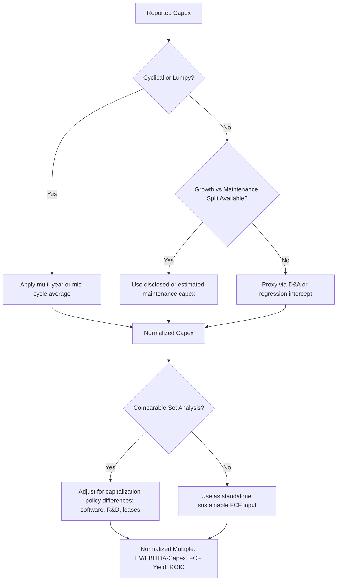

## Normalizing Capex for Valuation Multiples

### Overview

Reported capex figures in financial statements often reflect timing distortions, one-off investments, accounting classification choices, and cyclical positioning that make raw capex unsuitable for direct use in valuation multiples or cross-company comparisons. Normalizing capex means adjusting the reported figure to reflect a sustainable, comparable, or economically representative level of capital spending, so that derived metrics such as free cash flow yield, EV/FCF, capex-to-sales ratios, and ROIC-based multiples are not distorted by non-recurring or cyclical noise.

### Why Normalization Matters

Multiples built on unadjusted capex can mislead in several ways:

- **Cyclicality**: capex-intensive sectors (semiconductors, shipping, mining, airlines) invest in large discrete waves followed by multi-year troughs; a multiple computed in a peak capex year understates normalized free cash flow, while a trough-year multiple overstates it.
- **Lumpy, discrete projects**: a single large plant, data center, or fleet order can spike capex in one year without recurring in subsequent years.
- **Accounting classification differences**: companies vary in how they classify capitalized software, capitalized interest, capitalized R&D, and finance vs. operating leases, distorting cross-company comparability even within the same sector.
- **Growth vs. maintenance conflation**: a fast-growing company's elevated capex (funding new capacity) is economically different from a mature company's elevated capex (potentially signaling deferred maintenance catch-up), yet both show up as "high capex" in a raw ratio.
- **M&A-related capex or divestiture effects**: asset acquisitions or disposals can distort the PP&E roll-forward and reported capex without reflecting organic investment behavior.

### Common Normalization Techniques

**1. Multi-Year Average (Trailing Normalization)**

$$Normalized\ Capex = \frac{1}{n}\sum_{i=1}^{n} Capex_{t-i}$$

Typically a 3–5 year trailing average, or a full-cycle average for cyclical industries (e.g., a full commodity price cycle in mining/oil & gas, or a full technology upgrade cycle in telecom). This smooths lumpiness but can lag turning points if the company has structurally shifted its capex intensity.

**2. Maintenance Capex Proxy**

Analysts frequently substitute maintenance capex for total capex when computing "sustainable" or "owner earnings"-style free cash flow, following approaches associated with value-investing frameworks. Maintenance capex is estimated via:

- **D&A proxy**: $Maintenance\ Capex \approx D\&A$ (assumes a mature, non-growing asset base)
- **Management disclosure**: many companies (particularly REITs, midstream energy, and utilities) explicitly disclose a maintenance vs. growth capex split in supplemental filings or investor presentations
- **Regression/statistical approach**: regressing historical capex against revenue growth to isolate the capex level associated with zero revenue growth (the intercept approximates maintenance capex) [Inference: this method is sensitive to the historical sample period and to structural changes in the business, and different analysts applying it to the same dataset can reach materially different intercept estimates]

**3. Percent-of-Revenue Smoothing**

$$Normalized\ Capex_t = Revenue_t \times \overline{Capex\ Margin}_{historical}$$

Applies a normalized historical capex margin to current-year revenue, useful for removing year-specific capex timing noise while preserving the scale effect of the current revenue base.

**4. Capitalization Adjustments for Cross-Company Comparability**

To make capex-derived multiples comparable across companies with different accounting treatments:

- **Capitalized software**: some companies expense software development costs (reducing capex, inflating opex) while others capitalize them (inflating capex, reducing opex, deferring costs into future D&A); normalization requires adding back or stripping out these amounts consistently across the comparable set.
- **Capitalized R&D adjustment**: for pro forma comparability, some equity research practitioners capitalize a portion of R&D spend as a synthetic capex-like item and amortize it over an assumed useful life, particularly when comparing pharma, tech, or industrials with heterogeneous R&D accounting. [Unverified: the specific amortization period assumed varies significantly by analyst and by sector convention and is not standardized under GAAP/IFRS.]
- **Operating vs. finance leases**: post-ASC 842/IFRS 16, most leases are on-balance-sheet, but analysts still sometimes adjust capex/D&A to reflect economic lease-related capital consumption consistently across companies with different lease-vs-buy strategies.

**5. Mid-Cycle / Through-the-Cycle Normalization**

For commodity-linked or highly cyclical sectors, capex is normalized to a "mid-cycle" assumption tied to a normalized commodity price or utilization rate deck rather than the trailing actual, since spot-year capex behavior (aggressive expansion at price peaks, capex holidays at price troughs) is a poor predictor of sustainable reinvestment needs.

### Application in Valuation Multiples

**Free Cash Flow Yield (normalized):**

$$FCF\ Yield_{normalized} = \frac{EBIT(1-t) + D\&A - Capex_{normalized} - \Delta NWC}{Market\ Cap\ or\ EV}$$

**EV/EBITDA vs. Capex Intensity Overlay**

EV/EBITDA multiples ignore capex entirely, which is precisely why capital-intensity-adjusted multiples are used alongside it:

$$EV/EBITDA\text{-}Capex = \frac{EV}{EBITDA - Capex_{normalized}}$$

This is commonly used in capital-intensive sector comparisons (telecom, cable, energy midstream) where EV/EBITDA alone can make a high-capex-intensity company look artificially cheap relative to a low-capex-intensity peer with similar EBITDA margins.

**Capex-to-Sales Benchmarking**

$$Capex\ Intensity = \frac{Capex_{normalized}}{Revenue}$$

Used to benchmark a company's normalized capital intensity against sector peers and against its own historical range, often displayed across a multi-year band rather than a single point estimate to convey the cyclical range.

### Normalization in ROIC-Based Multiples

Since ROIC is a core determinant of intrinsic multiples (per the standard relationship between P/E, ROIC, growth, and cost of capital), normalizing capex within the invested capital base and NOPAT calculation is essential:

$$ROIC_{normalized} = \frac{NOPAT_{normalized}}{Invested\ Capital_{average}}$$

Where $NOPAT_{normalized}$ reflects a depreciation charge consistent with normalized (rather than spiked or lagging) capex, so that returns are not artificially inflated in years following a capex trough (understated asset base, understated D&A) or deflated in years following a capex peak (overstated asset base mid-ramp, before the new capacity is generating full revenue).

### Illustrative Example

A shipping company shows the following trailing capex history ($mm):

| Year | Reported Capex | Context |
| --- | --- | --- |
| Y1 | 40 | Trough of cycle |
| Y2 | 55 | Recovery |
| Y3 | 320 | Fleet renewal order (one-off) |
| Y4 | 60 | Post-delivery normalization |
| Y5 | 65 | Current year |

A naive current-year FCF yield using Y5 reported capex ($65mm) would appear attractive. However, a 5-year average ($108mm) or a full-cycle mid-point estimate reflecting the periodic nature of fleet renewal (perhaps $120–140mm annualized, reflecting that a $320mm order recurs roughly once per 5–7 year fleet cycle) would meaningfully reduce normalized free cash flow and the resulting FCF yield, providing a more conservative and cycle-appropriate valuation input. [Inference] The precise normalized figure depends on assumed fleet replacement cycle length and vessel useful life, which are analyst judgment calls rather than disclosed figures.

### Common Pitfalls

- **Using a single peak or trough year** as the basis for a multiple without disclosing the distortion to clients/readers.
- **Applying D&A as a maintenance capex proxy in inflationary environments** without adjusting for replacement cost inflation, understating true maintenance capex in nominal terms.
- **Inconsistent capitalization treatment across a comparable company set**, making cross-sectional multiple comparisons invalid without adjustment.
- **Ignoring capacity utilization**: a company running at 60% utilization has embedded slack that may reduce near-term normalized growth capex needs relative to a company at 95% utilization, even at similar revenue and margin profiles.
- **Failing to disclose the normalization methodology**, reducing the transparency and defensibility of the resulting valuation multiple to internal or external reviewers.

### Normalization Decision Framework (Mermaid)

### Normalized vs. Reported Capex Over a Cycle (svg_diagram)

<svg xmlns="http://www.w3.org/2000/svg" viewBox="0 0 700 340">
\<style\>
.axis{stroke:#333;stroke-width:1.5;}
.gridline{stroke:#e0e0e0;stroke-width:1;}
.reportedline{stroke:#c0392b;stroke-width:2.5;fill:none;}
.normline{stroke:#1a7a3c;stroke-width:2.5;stroke-dasharray:6,4;fill:none;}
.txt{font-family:Arial,Helvetica,sans-serif;font-size:12px;fill:#111;}
\</style\>
<text x="350" y="24" text-anchor="middle" font-family="Arial" font-size="15" font-weight="bold" fill="#111">Reported vs Normalized Capex Across a Cycle (svg_diagram)</text>
<line x1="70" y1="270" x2="650" y2="270" class="axis" />
<line x1="70" y1="270" x2="70" y2="50" class="axis" />
<text x="30" y="275" class="txt">$0</text>
<text x="330" y="305" class="txt">Year (full capex cycle)</text>
<line x1="70" y1="220" x2="650" y2="220" class="gridline" />
<line x1="70" y1="170" x2="650" y2="170" class="gridline" />
<line x1="70" y1="120" x2="650" y2="120" class="gridline" />
<line x1="70" y1="70" x2="650" y2="70" class="gridline" />
<path d="M100,230 L200,215 L300,70 L400,210 L500,215 L600,212" class="reportedline" />
<path d="M100,175 L200,175 L300,175 L400,175 L500,175 L600,175" class="normline" />
<rect x="450" y="60" width="14" height="14" fill="#c0392b" />
<text x="470" y="71" class="txt">Reported Capex (spiked at fleet order)</text>
<rect x="450" y="80" width="14" height="14" fill="#1a7a3c" />
<text x="470" y="91" class="txt">Normalized Capex (mid-cycle average)</text>
</svg>

**Related Topics:**

- Maintenance vs. growth capex disaggregation methodologies
- Free cash flow yield and owner earnings frameworks
- ROIC normalization and invested capital adjustments
- Capitalized software and R&D adjustments in cross-company comparability
- Mid-cycle and through-the-cycle valuation approaches for commodity and cyclical sectors
- Comparable company analysis (comps) methodology and adjustment conventions
- Capex assumptions in discounted cash flow models
- Depreciation policy differences and their effect on reported earnings quality