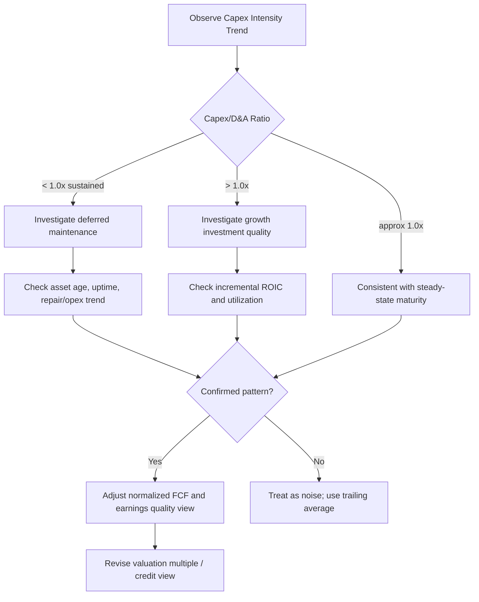

## Capex Intensity as a Quality-of-Earnings Signal

### Overview

Capex intensity — capital expenditure scaled against revenue, EBITDA, or invested capital — is a diagnostic tool used in quality-of-earnings (QoE) analysis to assess whether reported profitability is sustainable, whether earnings are being flattered by deferred reinvestment, and whether a business's cash conversion is representative of its true economic performance. Because capex sits below EBITDA and is often excluded from headline profitability metrics, it is a frequent location for earnings quality distortions that a purely income-statement-focused analysis would miss.

### Core Rationale

EBITDA and even EBIT are capex-agnostic by construction: two companies with identical EBITDA margins can have vastly different sustainable free cash flow if one requires continuous heavy reinvestment to maintain its asset base and the other does not. Capex intensity analysis exists to answer the question headline earnings cannot: *how much of this company's reported profit is actually available to capital providers after the business reinvests what it needs to sustain itself?*

$$Capex\ Intensity = \frac{Capex}{Revenue}\quad or\quad \frac{Capex}{EBITDA}$$

A rising capex-to-EBITDA ratio over time, absent a clear growth narrative, is a common red flag that earnings quality may be deteriorating — either because the underlying asset base requires more reinvestment than before (aging infrastructure, competitive erosion requiring reinvestment to defend share) or because prior-period capex was under-invested and is now catching up.

### Key Diagnostic Ratios

**1. Capex-to-D&A Ratio**

$$\frac{Capex}{D\&A}$$

- Ratio persistently **below 1.0x**: the company may be under-investing relative to the depreciation of its existing asset base, which can flatter near-term FCF and reported returns on capital while quietly eroding the asset base's competitive position. This is one of the most closely watched QoE red flags, particularly in private equity and credit due diligence.
- Ratio **at or near 1.0x**: consistent with a steady-state, non-growing asset base — appropriate for a mature business, potentially a warning sign for a company that markets itself as a growth story.
- Ratio **above 1.0x**: consistent with real asset base growth; the key follow-up question is whether the incremental capex is producing incremental revenue/EBITDA (i.e., whether ROIC on the new investment justifies the spend) or is defensive/replacement spending mischaracterized as growth.

**2. Capex-to-Revenue Trend**

Tracking capex intensity over a 5–10 year window reveals whether current-period capex is representative or an outlier. A sudden **decline** in capex intensity that coincides with margin expansion should prompt scrutiny: is the margin improvement structural (efficiency gains, mix shift, pricing power) or is it partly an artifact of deferred reinvestment that will need to be caught up later, temporarily depressing future free cash flow?

**3. Free Cash Flow Conversion**

$$FCF\ Conversion = \frac{FCF}{EBITDA} = \frac{EBITDA - Capex - \Delta NWC - Cash\ Taxes - Cash\ Interest}{EBITDA}$$

Persistently low or declining FCF conversion driven specifically by rising capex (rather than working capital or tax items) isolates capex as the source of the earnings-to-cash gap, which is a more durable and structural quality-of-earnings concern than a working-capital-driven gap (which can be more transient/seasonal).

### Deferred Maintenance as an Earnings Quality Red Flag

A company can temporarily boost reported EBITDA margins and FCF by deferring necessary maintenance capex — a classic technique observed in distressed situations, pre-sale "dress-up" of a business (common in private equity exit scenarios and M&A due diligence), or under short-term-incentivized management teams. Indicators that deferred maintenance may be masking true earnings quality:

- Capex-to-D&A ratio trending meaningfully below 1.0x for multiple consecutive years without a credible efficiency or productivity narrative.
- Rising equipment age, deteriorating uptime/reliability metrics, or increasing unplanned maintenance/repair expense (which shows up in opex, partially offsetting the capex deferral — a useful cross-check).
- Management commentary or disclosed forward capex guidance showing a step-up ("catch-up capex") immediately following a period of suppressed spending, particularly common right after a change of ownership or new management team.
- Divergence between capex intensity and industry peers operating similar asset bases without a clear competitive or technological explanation.

[Inference] Deferred maintenance is inherently difficult to detect from financial statements alone without operational KPIs (uptime, asset age, incident rates); financial analysis can flag the pattern but rarely proves intent or quantifies the deferred liability with precision.

### Capex Intensity in Private Equity and Credit QoE Work

In buy-side and lender due diligence, capex intensity analysis typically involves:

- **Normalized maintenance capex re-estimate**: independent of management's own maintenance/growth split, re-deriving a maintenance capex figure via asset-level analysis (equipment age, replacement cost, useful life) to stress-test management's presented "adjusted EBITDA less maintenance capex" bridge.
- **Sponsor-adjusted EBITDA scrutiny**: in leveraged buyout contexts, adjusted EBITDA add-backs are examined alongside capex trends, since a business showing rising adjusted EBITDA alongside declining capex intensity may be presenting an overly optimistic cash-generation picture to support valuation or debt capacity.
- **Covenant and credit-agreement capex baskets**: lenders often negotiate maintenance capex minimums or growth capex caps specifically because capex intensity is viewed as a lever management can pull to manage near-term reported metrics at the expense of long-term asset quality — this is itself evidence of how central capex intensity is to earnings/cash quality assessment in practice.

### Sector Context Matters

Capex intensity benchmarks are meaningless without sector context. A capex-to-revenue ratio of 15% might be alarmingly high for a software company (signaling potential misclassification or an unusual hardware/infrastructure buildout) but entirely normal or even low for a telecom or utility. Effective QoE analysis benchmarks capex intensity against:

- The company's own historical range (5–10 year band)
- Direct sector peers with comparable business models
- The stage of the company's asset/network lifecycle (e.g., early-stage telecom network buildout vs. mature network in harvest/upgrade mode)

| Signal Pattern | Likely Interpretation | Follow-Up Diagnostic |
| --- | --- | --- |
| Capex/D&A < 1.0x, margins rising | Possible deferred maintenance | Check asset age, uptime, peer capex intensity |
| Capex/D&A > 1.0x, revenue flat | Possible over-investment or stranded capacity | Check utilization rates, ROIC on incremental capex |
| Capex/Revenue rising with revenue growth | Likely healthy growth investment | Check incremental margin/ROIC on new capacity |
| Capex/Revenue volatile, no clear trend | Lumpy/discrete project-based capex | Normalize over full investment cycle |

### Interaction with Reported Non-GAAP Metrics

Many companies present "adjusted EBITDA" or "adjusted free cash flow" metrics that exclude certain capex items (e.g., excluding "growth capex" from a free cash flow definition, or presenting "maintenance-capex-adjusted EBITDA"). Quality-of-earnings analysis requires independently verifying:

- Whether the company's own growth/maintenance capex classification is consistent year-over-year and consistent with how peers classify similar spending.
- Whether "one-time" or "non-recurring" capex exclusions actually recur with some regularity when viewed over a longer window (a common technique to persistently understate normalized capex by labeling recurring lumpy items as one-off in each individual year).

### Capex Intensity Diagnostic Framework (Mermaid)

### Capex Intensity vs. Reported Margin Divergence (svg_diagram)

<svg xmlns="http://www.w3.org/2000/svg" viewBox="0 0 700 340">
\<style\>
.axis{stroke:#333;stroke-width:1.5;}
.gridline{stroke:#e0e0e0;stroke-width:1;}
.marginline{stroke:#2874a6;stroke-width:2.5;fill:none;}
.capexline{stroke:#c0392b;stroke-width:2.5;stroke-dasharray:6,4;fill:none;}
.txt{font-family:Arial,Helvetica,sans-serif;font-size:12px;fill:#111;}
\</style\>
<text x="350" y="24" text-anchor="middle" font-family="Arial" font-size="15" font-weight="bold" fill="#111">Capex Intensity vs Reported EBITDA Margin — Divergence Warning (svg_diagram)</text>
<line x1="70" y1="270" x2="650" y2="270" class="axis" />
<line x1="70" y1="270" x2="70" y2="50" class="axis" />
<text x="330" y="305" class="txt">Year</text>
<text x="30" y="60" class="txt">%</text>
<line x1="70" y1="220" x2="650" y2="220" class="gridline" />
<line x1="70" y1="170" x2="650" y2="170" class="gridline" />
<line x1="70" y1="120" x2="650" y2="120" class="gridline" />
<line x1="70" y1="70" x2="650" y2="70" class="gridline" />
<path d="M100,180 L200,165 L300,145 L400,120 L500,95 L600,80" class="marginline" />
<path d="M100,200 L200,205 L300,215 L400,225 L500,232 L600,238" class="capexline" />

<text x="610" y="80" class="txt" fill="`#2874a6`">Margin rising</text>

<text x="610" y="240" class="txt" fill="`#c0392b`">Capex intensity falling</text>

<rect x="90" y="55" width="14" height="14" fill="#2874a6" />
<text x="110" y="66" class="txt">Reported EBITDA Margin</text>
<rect x="280" y="55" width="14" height="14" fill="#c0392b" />
<text x="300" y="66" class="txt">Capex / Revenue (declining — divergence flag)</text>
</svg>

**Related Topics:**

- Maintenance vs. growth capex disaggregation
- Normalizing capex for valuation multiples
- Free cash flow conversion analysis and cash earnings quality
- Adjusted EBITDA add-back scrutiny in QoE and M&A due diligence
- Working capital analysis as a complementary quality-of-earnings signal
- ROIC and incremental ROIC analysis on new capex
- Credit agreement capex covenants and baskets
- Asset age and useful life analysis in industrial and infrastructure sectors