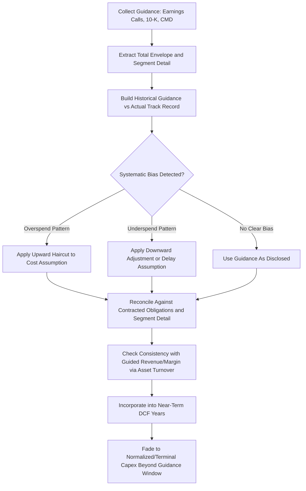

## Analyzing Management Capex Guidance and Capital Markets Days

### Overview

Management capex guidance — issued via earnings calls, 10-K/annual report outlook sections, investor days, and dedicated Capital Markets Days (CMDs) — is a primary input into equity research forecasts, particularly for the near-term explicit forecast period where formula-driven estimates are less reliable than direct management disclosure. Critically evaluating this guidance, rather than simply transcribing it into a model, is a core analytical skill: guidance is a management-controlled communication tool with its own incentives, track record, and framing choices that analysts must independently interrogate.

### Sources of Capex Guidance

- **Quarterly earnings calls and press releases**: near-term (current fiscal year) capex guidance, often given as a range (e.g., "$450–475mm for FY26") or as a percent of revenue.
- **10-K/Annual Report MD&A sections**: backward-looking capex detail plus, in some jurisdictions/companies, forward capex commitments (contracted but unspent capex, purchase obligations).
- **Investor Days / Capital Markets Days (CMDs)**: multi-year strategic capex plans, typically 3–5 year horizons, often broken out by segment, initiative (e.g., capacity expansion, digital transformation, decarbonization/ESG-related capex), and sometimes tied to explicit ROIC or payback targets.
- **Regulatory filings for regulated industries**: utilities and other rate-regulated businesses often file multi-year capital plans with regulators (rate cases, integrated resource plans), which are publicly available and provide an independently verifiable capex trajectory distinct from company self-reported guidance.
- **Segment-level disclosures**: for diversified companies, capex guidance may be given at the consolidated level only, requiring analysts to infer segment-level splits from historical allocation patterns or management commentary.

### What to Extract from a Capital Markets Day Capex Disclosure

- **Total multi-year capex envelope** (e.g., "$2.5–3.0bn cumulative over 2027–2030") and the implied annual run-rate.
- **Growth vs. maintenance split**, if disclosed — CMDs are often the only venue where management provides this breakdown explicitly, since quarterly calls rarely go into this level of detail.
- **Return targets tied to the capex plan**: incremental ROIC, payback period, or IRR hurdles management claims to apply to new capital projects. These figures are useful for stress-testing whether the guided capex is consistent with the growth and margin assumptions management is separately guiding to.
- **Capital allocation framework**: how capex ranks against dividends, buybacks, and deleveraging in management's stated priority order, and whether the framework is a fixed-percent-of-cash-flow model or a project-by-project return-driven model.
- **Sensitivity language**: whether management discloses how the capex plan would flex under different demand, commodity price, or macro scenarios (common in energy, mining, and industrials CMDs).
- **Explicit terminal/normalized capex commentary**: some companies explicitly guide to a "steady-state" or "normalized" capex-to-revenue or capex-to-D&A ratio beyond the explicit guidance window, which is directly usable as a terminal value input.

### Evaluating Credibility of Guidance

**1. Track Record Analysis (Guidance vs. Actual)**

The single most useful diagnostic is a historical comparison of prior guidance against subsequent actual capex outcomes:

$$Guidance\ Accuracy_t = \frac{Actual\ Capex_t}{Guided\ Capex_t\ (as\ originally\ issued)}$$

Building this ratio over multiple historical guidance cycles reveals systematic patterns:

- **Chronic overspending** relative to original guidance (common in large-scale project-driven capex, e.g., mega-projects in energy, mining, or infrastructure, where cost overruns are a well-documented industry pattern) should lead analysts to haircut or fade skepticism into current guidance rather than taking it at face value.
- **Chronic underspending** may indicate conservative guidance practices, capital discipline, or a pattern of announced projects being delayed/deferred — each with different implications for the reliability of the multi-year plan.
- **Guidance revisions mid-cycle** (raised or lowered within a fiscal year) and their frequency/direction provide additional signal on management's forecasting discipline and the underlying business's predictability.

**2. Consistency Checks Against Other Disclosures**

- Does guided capex reconcile with disclosed contracted purchase obligations (a note typically found in the 10-K, showing legally committed future capex spend)?
- Does the guided capex trajectory imply a depreciation schedule and PP&E growth path consistent with management's separately guided revenue/margin targets (i.e., is the guided capex actually sufficient to support the guided growth, using a fixed-asset-turnover sanity check)?
- Does segment-level guidance sum to the consolidated guidance figure, and if not, what explains the gap (corporate/unallocated capex, timing differences)?

**3. Incentive Analysis**

Management compensation structures can bias capex guidance in either direction:

- Compensation tied heavily to near-term EPS or free cash flow metrics can incentivize under-guiding or deferring capex to flatter near-term metrics.
- Compensation tied to revenue growth, market share, or long-term equity value can incentivize aggressive capex guidance that may not be fully executed or that may not generate the implied returns.
- Newly appointed management teams sometimes reset capex guidance materially (either a "kitchen sink" downward reset or an aggressive upward reinvestment pivot) as part of establishing a new baseline narrative — this transition period warrants extra scrutiny before extrapolating the new guidance forward.

### Capital Markets Day Analysis Checklist

| Element | Analytical Question |
| --- | --- |
| Total capex envelope | Is this consistent with, above, or below trailing run-rate and peer benchmarks? |
| Growth/maintenance split | Is the split disclosed, and does it match the company's stated growth ambitions? |
| Return targets | Are the stated ROIC/IRR hurdles above the company's cost of capital, and are they credible given historical project returns? |
| Funding plan | Is the capex plan funded by internally generated cash flow, or does it require incremental debt/equity issuance? |
| Track record | How has this management team's prior multi-year capex guidance compared to actual outcomes? |
| Sensitivity disclosure | Does management disclose how the plan flexes under adverse scenarios (demand, commodity price, rates)? |
| Segment detail | Is capex broken out by segment/geography, and does it reconcile to consolidated guidance? |

### Incorporating Guidance into the DCF Model

- **Near-term years (Year 1–2, sometimes 3)**: use management's guided figures directly, ideally applying a modest haircut or premium based on the historical guidance-accuracy analysis above rather than accepting guidance uncomputed.
- **Mid-term years (post-explicit-guidance-window, pre-terminal)**: fade guided capex intensity toward a normalized/terminal level over a transition period, particularly if guided capex reflects an elevated investment cycle (e.g., a multi-year capacity expansion or technology transition) that is not expected to persist indefinitely.
- **Terminal year**: even where management provides long-range guidance, terminal capex should still satisfy the standard internal-consistency check against D&A and the reinvestment-rate-to-growth relationship; management's own "long-term normalized capex" language, when disclosed, is a useful anchor but should still be reconciled against the model's implied ROIC and growth assumptions.

### Common Analytical Errors

- **Mechanically inputting guidance without adjustment**, ignoring the company's own historical guidance-accuracy track record.
- **Treating a single Capital Markets Day figure as static** when management typically updates multi-year plans annually or with each subsequent CMD — models should be refreshed as new guidance is issued rather than anchored to a stale multi-year plan.
- **Ignoring the difference between "planned" and "committed" capex**: early-stage capex plans (e.g., pre-final-investment-decision projects in energy/mining) carry materially more execution risk and cancellation probability than contractually committed spend, and probability-weighting is often appropriate.
- **Failing to adjust for inflation in multi-year nominal guidance**, particularly relevant in the post-2021 environment where construction, equipment, and input cost inflation have caused several companies to revise multi-year capex plans upward in nominal terms without a change in the underlying physical scope of investment. [Inference] The degree to which any specific company's guidance revisions reflect cost inflation versus scope changes generally requires cross-referencing management's own commentary, since this attribution is rarely broken out explicitly.
- **Not distinguishing gross capex guidance from net capex** (net of expected asset sales, government incentives/subsidies such as tax credits for green capex, or joint-venture partner co-funding), which can materially change the cash flow impact to the company being modeled.

### Guidance Evaluation Workflow (Mermaid)

### Guidance Track Record Visualization (svg_diagram)

<svg xmlns="http://www.w3.org/2000/svg" viewBox="0 0 700 340">
\<style\>
.axis{stroke:#333;stroke-width:1.5;}
.gridline{stroke:#e0e0e0;stroke-width:1;}
.guideline{stroke:#2874a6;stroke-width:2.5;fill:none;}
.actualline{stroke:#c0392b;stroke-width:2.5;stroke-dasharray:6,4;fill:none;}
.txt{font-family:Arial,Helvetica,sans-serif;font-size:12px;fill:#111;}
\</style\>
<text x="350" y="24" text-anchor="middle" font-family="Arial" font-size="15" font-weight="bold" fill="#111">Guided vs Actual Capex — Track Record Check (svg_diagram)</text>
<line x1="70" y1="270" x2="650" y2="270" class="axis" />
<line x1="70" y1="270" x2="70" y2="50" class="axis" />
<text x="330" y="305" class="txt">Fiscal Year (guidance cycle)</text>
<text x="30" y="60" class="txt">$ mm</text>
<line x1="70" y1="220" x2="650" y2="220" class="gridline" />
<line x1="70" y1="170" x2="650" y2="170" class="gridline" />
<line x1="70" y1="120" x2="650" y2="120" class="gridline" />
<line x1="70" y1="70" x2="650" y2="70" class="gridline" />
<path d="M100,190 L200,175 L300,160 L400,145 L500,130 L600,115" class="guideline" />
<path d="M100,195 L200,190 L300,150 L400,110 L500,95 L600,80" class="actualline" />
<rect x="90" y="55" width="14" height="14" fill="#2874a6" />
<text x="110" y="66" class="txt">Originally Guided Capex</text>
<rect x="290" y="55" width="14" height="14" fill="#c0392b" />
<text x="310" y="66" class="txt">Actual Capex (persistent overspend pattern)</text>
</svg>

**Related Topics:**

- Capex assumptions in discounted cash flow models
- Normalizing capex for valuation multiples
- Capex intensity as a quality-of-earnings signal
- Management incentive structures and compensation-linked capital allocation bias
- Contracted purchase obligations and forward commitment disclosures in the 10-K
- Segment-level financial modeling and reconciliation techniques
- Scenario and sensitivity analysis for capex-dependent business models
- Regulated utility rate case and integrated resource plan analysis