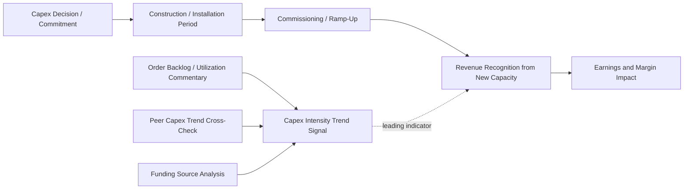

## Capex Trends as Leading Indicators of Future Growth

### Overview

Capital expenditure decisions precede the revenue and earnings they are intended to generate, which makes capex trend analysis a forward-looking (leading) indicator rather than a backward-looking (lagging or coincident) one. Because capacity must typically be built, installed, and commissioned before it can generate output, changes in a company's or sector's capex trajectory often signal shifts in expected demand, competitive positioning, or strategic direction well before those shifts appear in reported revenue or earnings. Equity research analysts use capex trend analysis both at the single-company level and, more powerfully, in aggregate across a sector or the broader economy as a macro/cyclical signal.

### Why Capex Leads Growth

The causal and temporal logic is straightforward: a company observing (or forecasting) rising demand must commit capital to expand capacity before that demand can be served, meaning the capex decision and cash outlay occur before the associated revenue is recognized. The lag between capex commitment and revenue realization — the **capex-to-revenue lag** — varies substantially by industry:

| Industry | Typical Capex-to-Revenue Lag | Driver of Lag Length |
| --- | --- | --- |
| Software/cloud infrastructure | Months to ~1 year | Server/data center deployment is relatively fast |
| Semiconductor fabs | 2–4 years | Fab construction and equipment installation lead times |
| Mining | 3–7+ years | Permitting, construction, ramp-up to full production |
| Oil & Gas (upstream) | 1–5 years | Varies by conventional vs. deepwater vs. shale (shale is fastest) |
| Utilities (generation) | 3–8+ years | Regulatory approval, construction, commissioning |
| Retail (new stores) | Months to ~1 year | Site selection, buildout, opening |
| Telecom (network buildout) | 1–3 years | Spectrum deployment, tower/fiber construction |

[Inference] These lag ranges are general industry patterns rather than precise universal constants; actual lag length varies by project type, geography, and company-specific execution capability.

### Company-Level Signal: Capex Acceleration as a Growth Precursor

An acceleration in a company's capex-to-revenue ratio, capex-to-D&A ratio, or absolute capex dollars — particularly when concentrated in growth capex rather than maintenance capex — is frequently interpreted by equity analysts as an early signal of anticipated future revenue growth, for several reasons:

- **Management possesses superior forward visibility** into order backlogs, contracted demand, or strategic initiatives relative to public market participants, so a capex acceleration can reflect information not yet visible in reported financials.
- **Capacity constraints** disclosed alongside capex increases (e.g., "operating near full utilization, therefore accelerating capacity investment") directly link the capex signal to an explicit demand narrative.
- **Multi-year capex commitments** (announced via Capital Markets Days or press releases for specific projects) provide a more concrete and dateable growth catalyst than qualitative management commentary alone.

Conversely, a **deceleration or pause in capex**, especially growth capex, can signal:

- Management's more cautious view of near-term demand than the sell-side or buy-side consensus reflects.
- A strategic pivot toward capital discipline, deleveraging, or capital return (buybacks/dividends) at the expense of growth investment — which has different valuation implications (potentially higher near-term FCF and multiple support, but lower long-term growth).
- Completion of a prior investment cycle, after which capex should be expected to normalize toward maintenance levels, with the associated revenue benefit still to be realized in subsequent periods.

### Sector and Macro-Level Signal: Aggregate Capex as an Economic Leading Indicator

At the sector or economy-wide level, aggregate capex/capital goods orders are widely tracked as leading economic indicators:

- **Non-defense capital goods orders excluding aircraft** (a U.S. Census Bureau durable goods report subcomponent) is a commonly cited proxy for private-sector business investment intentions and is closely watched by economists and equity strategists as a leading indicator of industrial activity and GDP growth. [Unverified: the precise current lead time and correlation strength versus GDP can shift across economic cycles and is a matter of ongoing econometric debate rather than a fixed, universally agreed figure.]
- **Semiconductor capital equipment bookings and book-to-bill ratios** are used as leading indicators for the broader technology hardware cycle, since fab equipment orders precede chip production, which in turn precedes downstream electronics manufacturing and sales.
- **Oil & gas rig counts and E&P capex budgets** serve as leading indicators for oilfield services demand, since upstream capex directly drives drilling, completion, and related service activity with a relatively short lag.
- **Data center capex from hyperscale cloud providers** has become a widely tracked leading indicator for semiconductor demand (particularly AI accelerators and high-bandwidth memory), power infrastructure, and networking equipment demand across the technology supply chain, given the direct and relatively short lag between hyperscaler capex commitments and downstream component orders.

### Analytical Framework: Reading the Capex Signal

When analyzing capex trends as a growth indicator, equity researchers typically triangulate the following:

**1. Direction and Magnitude of Change**

$$\Delta Capex\ Intensity_t = \frac{Capex_t}{Revenue_t} - \frac{Capex_{t-1}}{Revenue_{t-1}}$$

A material, sustained increase (not a single-quarter blip) is a stronger signal than a one-off spike, which may simply reflect a discrete, non-recurring project.

**2. Composition (Growth vs. Maintenance)**

As established in maintenance/growth capex disaggregation, only the growth component carries forward-looking demand signal; an increase driven entirely by maintenance/replacement capex (e.g., a required regulatory upgrade or an aging fleet replacement cycle) does not imply incremental revenue capacity.

**3. Corroborating Qualitative Disclosure**

Cross-referencing capex trend changes against management's stated rationale (order backlog growth, new contract wins, capacity utilization approaching ceiling, competitive response to a rival's capacity expansion) increases confidence that the capex signal reflects genuine demand-driven investment rather than, for example, a one-off regulatory mandate or opportunistic asset purchase.

**4. Peer and Supply Chain Cross-Checks**

If a company's capex acceleration is echoed by capex acceleration among direct peers and by order growth at its key equipment/construction suppliers, this cross-validation strengthens the growth thesis; if the company is a lone outlier while peers hold capex flat, the signal may instead reflect company-specific market share ambitions (which carry execution risk) rather than a sector-wide demand inflection.

**5. Funding Source and Balance Sheet Capacity**

Capex increases funded by strong internally generated cash flow are viewed more favorably than those requiring substantial incremental leverage, since the latter introduces financial risk that can amplify the downside if the anticipated demand growth does not materialize as expected.

### Risks and Limitations of the Capex-as-Leading-Indicator Framework

- **Execution risk**: capex commitments do not guarantee successful project completion, on-time delivery, or the anticipated demand materializing; cost overruns, delays, and demand shortfalls (excess capacity) are common failure modes, particularly in commodity and cyclical sectors.
- **Herding and overbuild cycles**: capex trend analysis can be misleading during industry-wide capacity buildout cycles, where multiple competitors simultaneously accelerate capex in response to similar demand signals, potentially leading to industry overcapacity, price/margin compression, and disappointing returns on the aggregate capex once new capacity comes online — a well-documented pattern in commodity cycles (e.g., shale oil, semiconductor memory, shipping).
- **Technology and demand obsolescence risk**: long-lead-time capex (e.g., multi-year fab construction, power generation projects) carries the risk that the demand environment or technology landscape shifts materially between the capex decision and the capacity coming online, particularly relevant in fast-moving technology sectors.
- **Distinguishing genuine demand response from speculative/momentum-driven investment**: not all capex acceleration reflects disciplined, return-driven capital allocation; some reflects competitive pressure to avoid ceding market share, which can result in capex outpacing actual sustainable demand growth. [Inference] Distinguishing disciplined from speculative capex acceleration in real time, before outcomes are observed, is inherently uncertain and is a recurring source of forecasting error even among experienced sector analysts.

### Practical Application in Equity Research

- **Screening tool**: analysts and quantitative strategies sometimes screen for companies or sectors showing capex intensity inflections (acceleration from a trough, or deceleration from a peak) as an early-stage idea generation signal, to be followed by fundamental diligence on the drivers.
- **Revenue forecast validation**: when a sell-side model assumes above-trend revenue growth in outer forecast years, checking whether the company's disclosed or guided capex trajectory is consistent with (i.e., sufficient to physically support) that growth via a fixed-asset-turnover sanity check is a standard forecast discipline exercise.
- **Cross-sector read-through**: capex disclosures from large capital goods buyers (e.g., hyperscalers, oil majors, auto OEMs) are routinely used by analysts covering their suppliers (semiconductor equipment makers, industrial equipment manufacturers, oilfield services) to inform demand forecasts for the supplier before the supplier's own order book fully reflects the shift.

### Capex-to-Growth Lead/Lag Framework (Mermaid)

### Capex Lead Time vs. Revenue Realization (svg_diagram)

<svg xmlns="http://www.w3.org/2000/svg" viewBox="0 0 700 340">
\<style\>
.axis{stroke:#333;stroke-width:1.5;}
.gridline{stroke:#e0e0e0;stroke-width:1;}
.capexline{stroke:#c0392b;stroke-width:2.5;fill:none;}
.revline{stroke:#1a7a3c;stroke-width:2.5;stroke-dasharray:6,4;fill:none;}
.txt{font-family:Arial,Helvetica,sans-serif;font-size:12px;fill:#111;}
\</style\>
<text x="350" y="24" text-anchor="middle" font-family="Arial" font-size="15" font-weight="bold" fill="#111">Capex Acceleration Leading Revenue Realization (svg_diagram)</text>
<line x1="70" y1="270" x2="650" y2="270" class="axis" />
<line x1="70" y1="270" x2="70" y2="50" class="axis" />
<text x="330" y="305" class="txt">Time (Years)</text>
<text x="30" y="60" class="txt">Index</text>
<line x1="70" y1="220" x2="650" y2="220" class="gridline" />
<line x1="70" y1="170" x2="650" y2="170" class="gridline" />
<line x1="70" y1="120" x2="650" y2="120" class="gridline" />
<line x1="70" y1="70" x2="650" y2="70" class="gridline" />
<path d="M100,230 L200,150 L300,90 L400,90 L500,90 L600,90" class="capexline" />
<path d="M100,230 L200,225 L300,200 L400,140 L500,100 L600,80" class="revline" />
<line x1="200" y1="150" x2="200" y2="270" stroke="#999" stroke-dasharray="3,3" />
<text x="205" y="285" class="txt">Capex spike</text>
<line x1="500" y1="100" x2="500" y2="270" stroke="#999" stroke-dasharray="3,3" />
<text x="450" y="300" class="txt">Revenue ramp materializes (lag)</text>
<rect x="90" y="55" width="14" height="14" fill="#c0392b" />
<text x="110" y="66" class="txt">Capex Intensity</text>
<rect x="280" y="55" width="14" height="14" fill="#1a7a3c" />
<text x="300" y="66" class="txt">Revenue (realized with lag)</text>
</svg>

**Related Topics:**

- Capex assumptions in discounted cash flow models
- Analyzing management capex guidance and capital markets days
- Capex intensity as a quality-of-earnings signal
- Supply chain and cross-sector read-through analysis
- Industry capacity cycles and overbuild/oversupply risk
- Macroeconomic leading indicators and business investment cycles
- Semiconductor and hyperscale data center capex cycle analysis
- Fixed asset turnover and capacity utilization analysis