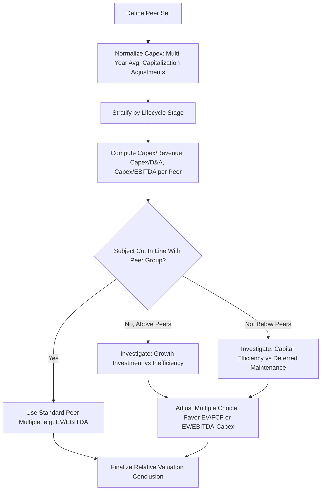

## Comparing Capex Intensity Across Comparable Companies

### Overview

Comparable company (comps) analysis in equity research routinely benchmarks capex intensity across a peer set to contextualize valuation multiples, assess relative capital efficiency, and identify companies whose reinvestment needs diverge meaningfully from the sector norm. Because capex intensity directly affects free cash flow generation, ROIC, and the sustainability of reported margins, a comps analysis that ignores capex intensity risks drawing incorrect relative-value conclusions purely from EBITDA- or EPS-based multiples.

### Why Capex Intensity Comparability Is Difficult

Cross-company capex comparisons are complicated by several structural factors that must be normalized or adjusted for before conclusions are drawn:

- **Business model differences within a nominal sector**: two companies classified in the same GICS sub-industry can have fundamentally different asset intensity (e.g., an asset-light franchisor vs. a company that owns and operates its own locations within the same restaurant sub-industry).
- **Lifecycle stage differences**: a company in a capacity buildout phase will show structurally higher capex intensity than a mature peer in harvest mode, even if their steady-state economics are similar.
- **Accounting classification differences**: variation in capitalized software, capitalized R&D, capitalized interest, and lease treatment across companies distorts raw capex comparability.
- **Geographic and regulatory differences**: companies operating in different regulatory regimes (e.g., utilities under different rate-of-return regulation, or companies subject to different environmental/decarbonization capex mandates) face different structurally mandated capex levels unrelated to organic growth choices.
- **M&A vs. organic growth strategy**: a company growing primarily through acquisition will show lower organic capex intensity than a peer pursuing the same growth rate through internal capacity investment, even though both are "growing."

### Core Comparative Metrics

**1. Capex-to-Revenue (Capex Intensity)**

$$Capex\ Intensity_i = \frac{Capex_i}{Revenue_i}$$

The most commonly used comparative metric; typically displayed across a multi-year trailing average (3–5 years) for each peer to smooth lumpiness, alongside the current-year figure to flag inflection points.

**2. Capex-to-EBITDA**

$$\frac{Capex_i}{EBITDA_i}$$

Useful for comparing how much of each peer's cash-generating capability is being consumed by reinvestment, and is a direct input into comparative free cash flow conversion analysis.

**3. Capex-to-D&A**

$$\frac{Capex_i}{D\&A_i}$$

Facilitates a like-for-like comparison of whether each peer is growing, maintaining, or shrinking its asset base in real terms, independent of absolute scale differences between companies.

**4. Capex per Unit of Capacity**

For sectors with discrete, comparable physical units (retail stores, hotel rooms, cell towers, wells, beds, seats), capex per unit provides a cleaner comparison than revenue-scaled ratios, since it strips out pricing and mix differences:

$$Capex\ per\ Unit_i = \frac{Capex_i}{\#\ Units_i\ (new\ or\ total)}$$

**5. Incremental Capex-to-Incremental Revenue**

$$\frac{\Delta Capex_i}{\Delta Revenue_i}$$

Measures the marginal capital intensity of growth specifically, distinguishing companies that can grow revenue with relatively little incremental investment (operating leverage-favorable) from those requiring heavy incremental capex per unit of new revenue.

**6. Free Cash Flow Conversion (Capex-Adjusted)**

$$FCF\ Conversion_i = \frac{EBITDA_i - Capex_i}{EBITDA_i}$$

A useful single summary statistic for peer comparison, since it directly links capex intensity to the cash available to service debt, pay dividends, or fund buybacks — often more decision-relevant to investors than capex intensity in isolation.

### Building the Comparable Set for Capex Analysis

- **Segment matching**: for diversified or conglomerate peers, capex intensity should ideally be compared at the segment level where disclosure permits, since consolidated capex intensity can be distorted by business mix differences across the peer set.
- **Lifecycle stage stratification**: peers should be grouped or flagged by lifecycle stage (early buildout, growth, mature/harvest) rather than compared as a single homogeneous group, since a raw average across lifecycle stages produces a benchmark that is not representative of any individual company's appropriate normalized level.
- **Geographic/regulatory stratification**: for regulated industries (utilities, telecom in some jurisdictions), peers operating under different regulatory capex mandates or rate structures should be flagged separately, since their capex intensity may reflect regulatory requirements rather than management discretion.
- **Normalization consistency**: applying the same normalization methodology (trailing average length, capitalized software/R&D adjustment convention, lease treatment) across every peer in the set is essential; inconsistent treatment across peers invalidates the comparison as thoroughly as inconsistent treatment across time periods for a single company.

### Illustrative Peer Comparison Table

| Company | Sector Position | Capex/Revenue (3-yr avg) | Capex/D&A | FCF Conversion | Interpretation |
| --- | --- | --- | --- | --- | --- |
| Peer A | Mature, market leader | 6% | 0.9x | 78% | Harvest mode, likely returning capital to shareholders |
| Peer B | Mid-growth challenger | 11% | 1.6x | 58% | Actively investing in share gain, lower near-term FCF |
| Peer C | Early-stage buildout | 22% | 3.1x | 30% | Heavy capacity investment, FCF suppressed near-term |
| Peer D | Declining/harvest | 3% | 0.5x | 85% | Possible deferred maintenance risk — investigate asset age |
| Subject Co. | — | 9% | 1.3x | 65% | In line with growth-stage peer group (Peer B) |

In this illustrative structure, the subject company's capex intensity most closely resembles Peer B rather than the simple peer-set average (which would be skewed by Peer C's buildout phase and Peer D's potential under-investment), demonstrating why lifecycle-stage-aware comparison is more informative than an unweighted peer average.

### Interpreting Divergence from Peer Norms

When a company's capex intensity diverges materially from its peer group, the divergence itself is the analytical signal requiring investigation, not a conclusion in itself:

- **Above-peer capex intensity** could reflect: a deliberate market-share investment strategy, catch-up investment after a period of under-investment, a technology transition requiring new capital equipment ahead of peers, or inefficient capital allocation relative to peers achieving similar growth with less capital.
- **Below-peer capex intensity** could reflect: superior capital efficiency or a genuinely asset-light business model, a more mature/harvest-stage position in the business lifecycle, deferred maintenance building latent risk, or a different (e.g., leased vs. owned, or outsourced vs. in-house) operating model that structurally requires less owned capex.

Distinguishing between these explanations requires triangulating capex intensity comparisons against relative revenue growth, relative margin trends, relative ROIC, and qualitative disclosure (management commentary, asset age, capacity utilization) — capex intensity alone, viewed in isolation from these other metrics, is insufficient to determine whether a divergence is a positive (capital discipline) or negative (under-investment risk) signal.

### Capex Intensity and Multiple Read-Through

Once capex intensity differences across the peer set are understood, they inform which valuation multiple is most appropriate for comparison:

- **EV/EBITDA** is least reliable for cross-peer comparison when capex intensity varies widely across the set, since it ignores the reinvestment burden entirely.
- **EV/(EBITDA − Capex)** or **EV/FCF** better reflect the true cash-generating capacity differences and are generally preferred for peer sets with heterogeneous capex intensity (e.g., comparing a capital-light asset manager style business to a capital-heavy infrastructure operator, even nominally within the same broader sector).
- **P/E** comparisons are similarly distorted by capex intensity differences to the extent that depreciation policy and capex level diverge from D&A, affecting reported net income differently across peers even at similar cash economics.

### Common Errors in Cross-Company Capex Comparison

- **Comparing raw, non-normalized capex figures** without adjusting for lumpy one-off projects in any individual peer's history.
- **Ignoring lifecycle stage**, producing a peer average that is not representative of any actual company in the set (the "average of a buildout-stage company and a harvest-stage company" fallacy).
- **Inconsistent treatment of capitalized software/R&D** across peers with different accounting policies, artificially making one peer appear more or less capital-intensive than economically accurate.
- **Failing to segment-match** diversified companies against pure-play peers, comparing consolidated capex intensity across companies with materially different business mixes.
- **Treating capex intensity divergence as inherently good or bad** without the necessary cross-referencing against growth, margin, and ROIC context described above.

### Capex Intensity Comparison Framework (Mermaid)

### Peer Capex Intensity Distribution by Lifecycle Stage (svg_diagram)

<svg xmlns="http://www.w3.org/2000/svg" viewBox="0 0 700 360">
\<style\>
.axis{stroke:#333;stroke-width:1.5;}
.gridline{stroke:#e0e0e0;stroke-width:1;}
.bar{stroke:#333;stroke-width:1;}
.txt{font-family:Arial,Helvetica,sans-serif;font-size:12px;fill:#111;}
.lbl{font-family:Arial,Helvetica,sans-serif;font-size:11px;fill:#111;}
\</style\>
<text x="350" y="24" text-anchor="middle" font-family="Arial" font-size="15" font-weight="bold" fill="#111">Capex Intensity by Peer and Lifecycle Stage (svg_diagram)</text>
<line x1="70" y1="300" x2="650" y2="300" class="axis" />
<line x1="70" y1="300" x2="70" y2="50" class="axis" />
<text x="20" y="60" class="txt">%</text>
<line x1="70" y1="250" x2="650" y2="250" class="gridline" />
<line x1="70" y1="200" x2="650" y2="200" class="gridline" />
<line x1="70" y1="150" x2="650" y2="150" class="gridline" />
<line x1="70" y1="100" x2="650" y2="100" class="gridline" />
<rect x="110" y="260" width="60" height="40" fill="#2874a6" class="bar" />
<text x="140" y="315" text-anchor="middle" class="lbl">Peer A</text>
<text x="140" y="330" text-anchor="middle" class="lbl">Mature</text>
<text x="140" y="253" text-anchor="middle" class="txt">6%</text>
<rect x="230" y="200" width="60" height="100" fill="#1a7a3c" class="bar" />
<text x="260" y="315" text-anchor="middle" class="lbl">Peer B</text>
<text x="260" y="330" text-anchor="middle" class="lbl">Growth</text>
<text x="260" y="193" text-anchor="middle" class="txt">11%</text>
<rect x="350" y="90" width="60" height="210" fill="#c0392b" class="bar" />
<text x="380" y="315" text-anchor="middle" class="lbl">Peer C</text>
<text x="380" y="330" text-anchor="middle" class="lbl">Buildout</text>
<text x="380" y="83" text-anchor="middle" class="txt">22%</text>
<rect x="470" y="280" width="60" height="20" fill="#7f7f7f" class="bar" />
<text x="500" y="315" text-anchor="middle" class="lbl">Peer D</text>
<text x="500" y="330" text-anchor="middle" class="lbl">Declining</text>
<text x="500" y="273" text-anchor="middle" class="txt">3%</text>
<rect x="560" y="215" width="60" height="85" fill="#d68910" class="bar" />
<text x="590" y="315" text-anchor="middle" class="lbl">Subject</text>
<text x="590" y="330" text-anchor="middle" class="lbl">Co.</text>
<text x="590" y="208" text-anchor="middle" class="txt">9%</text>
</svg>

**Related Topics:**

- Normalizing capex for valuation multiples
- Capex intensity as a quality-of-earnings signal
- Capex assumptions in discounted cash flow models
- Comparable company analysis (comps) methodology
- ROIC and incremental ROIC comparison frameworks
- EV/EBITDA vs EV/FCF multiple selection criteria
- Fixed asset turnover and capacity utilization benchmarking
- Sector-specific capex cycle analysis (regulated utilities, semiconductors, retail)