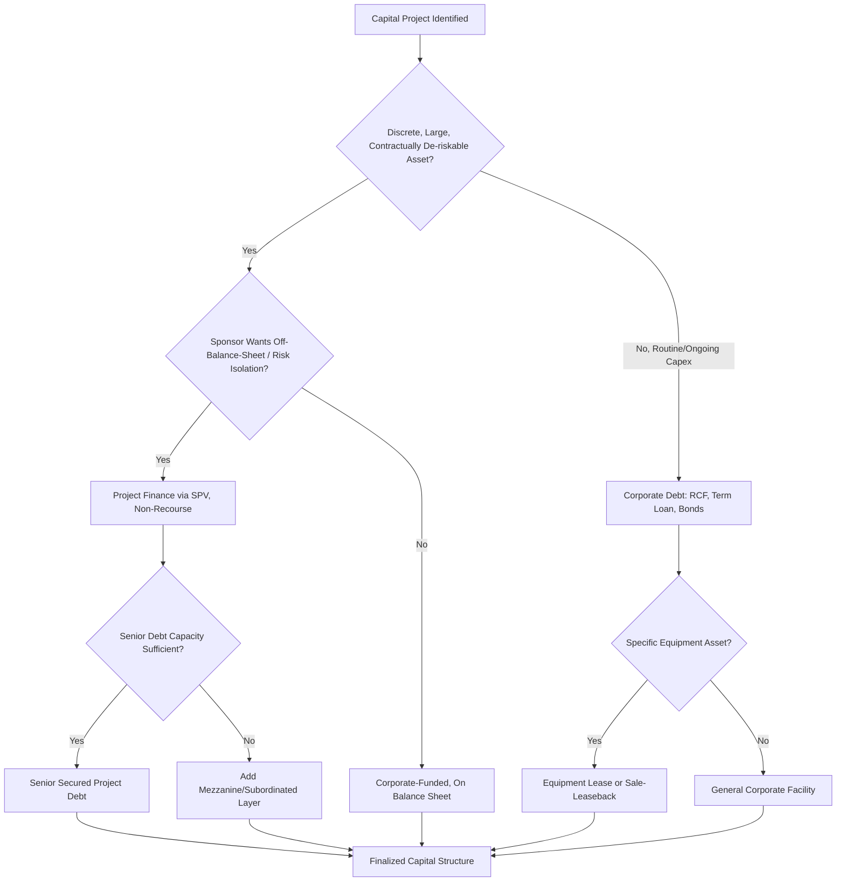

## Debt Financing Structures for Capital Projects

### Overview

Capital projects — whether a single large asset (a power plant, a pipeline, a manufacturing facility) or a broader multi-year capex program — are financed through a range of debt structures that differ in their security package, recourse to the sponsor, repayment profile, and risk allocation. The choice of debt structure materially affects a company's cost of capital, balance sheet presentation, covenant flexibility, and the degree to which project-specific risk is isolated from or borne by the broader corporate entity. Understanding these structures is essential for equity analysts assessing how a company funds its capex program and the associated credit and dilution implications for equity holders.

### Corporate (Balance Sheet) Debt Financing

The most common financing approach for routine, ongoing capex is drawing on general corporate debt facilities rather than arranging bespoke financing for each project.

**Key instruments:**

- **Revolving credit facilities (RCFs)**: flexible, typically used for short-term or bridge funding of capex ahead of permanent financing, or for capex programs too small to justify dedicated financing.
- **Term loans**: fixed or floating-rate loans with a defined amortization schedule, often used to fund a specific capex tranche or a broader multi-year program, syndicated among a bank group.
- **Corporate bonds (senior unsecured or senior secured notes)**: public or private placement debt issued against the general creditworthiness of the corporate entity, commonly used by investment-grade issuers to fund large but not project-isolated capex programs.
- **Commercial paper**: short-term unsecured debt used by investment-grade issuers for working capital and near-term capex bridge funding, typically rolled over or refinanced with longer-term debt.

**Characteristics:**

- Full recourse to the parent company's balance sheet and cash flows; lenders are not limited to the cash flows of the specific asset being funded.
- Generally lower cost of debt than project-specific financing for investment-grade issuers, since diversified corporate cash flow is viewed as lower risk than a single asset's performance.
- Covenants typically apply at the consolidated corporate level (leverage ratios, interest coverage ratios, negative pledges) rather than being tied to a specific project's performance.
- Capex funded this way sits on the consolidated balance sheet, and associated debt increases consolidated leverage metrics used in corporate credit ratings and equity valuation leverage screens.

### Project Finance

Project finance is a structure used predominantly for large, discrete, capital-intensive assets — power generation, infrastructure, pipelines, mining developments, and large-scale renewable energy projects — where the project itself, rather than the sponsor's general balance sheet, is the primary source of debt repayment.

**Defining characteristics:**

- **Non-recourse or limited-recourse to the sponsor**: lenders' claims are limited to the project's assets and cash flows, with only limited (often construction-period only) recourse to the sponsoring company's broader balance sheet.
- **Special purpose vehicle (SPV)**: the project is typically held in a legally separate entity, ring-fencing project-specific risk (and, from the lender's perspective, ring-fencing project assets from the sponsor's other creditors).
- **Cash flow waterfall structure**: project cash flows are distributed according to a strict contractual priority (operating costs, debt service, reserve accounts, then equity distributions), governed by the financing documents rather than corporate discretion.
- **Extensive contractual risk allocation**: construction risk is typically allocated to an EPC (engineering, procurement, construction) contractor via a fixed-price, date-certain contract; offtake/revenue risk is often mitigated via long-term power purchase agreements (PPAs), take-or-pay contracts, or similar offtake arrangements that provide revenue visibility to lenders.
- **High leverage relative to corporate norms**: project finance structures frequently support debt-to-total-capitalization ratios of 60–80% or higher, since the contractual cash flow certainty (rather than sponsor creditworthiness) underpins lender comfort. [Inference] The specific leverage level achievable depends heavily on offtake contract quality, counterparty credit, and sector-specific risk, and varies significantly by project.

**Why equity analysts care:**

- Project finance debt is typically **not consolidated onto the sponsor's balance sheet** if the SPV is not controlled/consolidated under applicable accounting rules (or is consolidated but ring-fenced/non-recourse, which credit analysts and equity analysts still generally treat differently from corporate debt in leverage analysis), which affects how analysts should interpret consolidated leverage ratios.
- A sponsor's exposure is generally limited to its equity investment in the project (plus any limited guarantees), meaning project-level underperformance or default has a capped downside to the parent's equity value, distinct from the potentially unlimited exposure of corporate-level debt-funded capex.
- Multiple projects financed this way allow a sponsor to pursue a much larger aggregate capex program than its own balance sheet could support on a fully consolidated, recourse basis — relevant when modeling growth capacity for capital-intensive growth companies (e.g., independent power producers, renewable energy developers, midstream energy infrastructure).

### Asset-Based and Equipment Financing

- **Equipment finance leases / capital leases**: financing structures where the lender retains a security interest in (or legal title to) the specific equipment financed, common for aircraft, rolling stock, heavy machinery, and vehicle fleets.
- **Sale-and-leaseback arrangements**: a company sells an owned asset to a financial buyer/lessor and simultaneously leases it back, monetizing the asset's value while retaining operational use; often used to fund new capex or delever without a traditional debt issuance. Under current lease accounting standards (ASC 842 / IFRS 16), most leases are recognized on-balance-sheet as a right-of-use asset and lease liability, altering the historical "off-balance-sheet financing" appeal of these structures relative to pre-2019 practice.
- **Vendor/OEM financing**: manufacturers of capital equipment (aircraft manufacturers, industrial equipment makers) sometimes provide or arrange financing directly to purchasers as a sales incentive, common in aviation and heavy equipment sectors.

### Mezzanine and Hybrid Debt Structures

For capital projects where senior debt capacity is insufficient or sponsors wish to limit equity dilution, mezzanine and hybrid instruments bridge the gap:

- **Subordinated/mezzanine debt**: ranks below senior secured debt in the capital structure, carries higher coupons to compensate for increased risk, and sometimes includes warrants or equity conversion features (equity kickers) to enhance lender returns.
- **Convertible notes**: debt that converts into equity under specified conditions, used to fund capex while deferring dilution and often carrying a lower coupon than straight debt in exchange for the conversion option.
- **Preferred equity (economically debt-like)**: while legally equity, preferred instruments with fixed dividend/redemption features are frequently used in project and infrastructure financing as a layer between senior debt and common equity, and are analyzed by credit and equity analysts with debt-like characteristics in mind despite their equity classification.

### Government and Concessional Financing

- **Export credit agency (ECA) financing**: government-backed export credit agencies (e.g., in the buyer's or seller's home country) provide guarantees or direct loans to support capital equipment purchases, common in aviation, large infrastructure, and energy projects with cross-border equipment procurement.
- **Multilateral development bank financing**: institutions such as the World Bank Group (including IFC for private-sector projects) and regional development banks provide project financing, often at concessional terms, for infrastructure and development-oriented capital projects, particularly in emerging markets.
- **Green bonds and sustainability-linked loans**: debt instruments where proceeds are earmarked for environmentally beneficial capex (renewable energy, energy efficiency, decarbonization projects) or where the interest rate is contractually tied to the achievement of specified sustainability KPIs; this category has grown substantially as a capex financing source for ESG-related capital programs. [Unverified: market size and growth-rate figures for green/sustainability-linked debt evolve rapidly and specific current figures should be checked against current market data rather than assumed static.]

### Comparative Structure Summary

| Structure | Recourse | Typical Leverage | Balance Sheet Treatment | Common Use Case |
| --- | --- | --- | --- | --- |
| Corporate term loan/bonds | Full recourse to sponsor | Governed by corporate credit rating | Consolidated | Routine, diversified capex programs |
| Project finance (non-recourse) | Limited to project SPV | High (60-80%+) if contracted cash flows | Often ring-fenced / non-recourse | Large discrete infrastructure/energy assets |
| Equipment/capital lease | Secured by specific asset | Asset-specific | On-balance-sheet (post ASC 842/IFRS 16) | Aircraft, machinery, vehicle fleets |
| Mezzanine/subordinated debt | Subordinated to senior debt | Fills gap above senior debt capacity | Consolidated, often classified as debt | Bridging senior debt and equity capacity |
| ECA/multilateral financing | Varies; often partially guaranteed | Favorable terms vs. market | Consolidated (if sponsor-level) | Cross-border equipment, emerging market infrastructure |
| Green bonds/sustainability-linked loans | Typically full recourse (corporate) | Governed by issuer credit profile | Consolidated | Earmarked ESG/decarbonization capex |

### Analytical Implications for Equity Research

- **Leverage screening**: analysts must determine whether project-level debt is consolidated, and if so, whether standard corporate leverage ratios (net debt/EBITDA) appropriately capture the risk profile of ring-fenced, non-recourse project debt, or whether a look-through/adjusted leverage metric is more appropriate.
- **Cost of capital implications**: a company funding growth capex substantially through non-recourse project finance may support a higher blended growth rate for a given corporate credit risk profile than one relying entirely on corporate balance sheet debt, since project-level risk is contractually isolated.
- **Dilution and financing mix forecasting**: DCF and financing forecasts should reflect management's stated capital structure strategy (e.g., a stated target of funding X% of growth capex via project finance or joint-venture partner co-investment) rather than assuming all capex is corporate-balance-sheet funded, since financing mix affects both interest expense forecasts and per-share equity value through differing dilution paths.
- **Contingent liability assessment**: even nominally non-recourse project debt sometimes carries limited sponsor guarantees (completion guarantees, cost overrun support, minimum revenue guarantees) that create contingent balance sheet exposure not visible in headline consolidated debt figures, requiring careful footnote review.

### Capital Project Financing Structure Decision Tree (Mermaid)

### Capital Structure Layering for a Project-Financed Asset (svg_diagram)

<svg xmlns="http://www.w3.org/2000/svg" viewBox="0 0 700 380">
\<style\>
.box{stroke:#333;stroke-width:1.5;}
.txt{font-family:Arial,Helvetica,sans-serif;font-size:13px;fill:#fff;font-weight:bold;}
.lbl{font-family:Arial,Helvetica,sans-serif;font-size:11px;fill:#333;}
\</style\>
<text x="350" y="24" text-anchor="middle" font-family="Arial" font-size="15" font-weight="bold" fill="#111">Project Finance Capital Structure Waterfall (svg_diagram)</text>
<rect x="150" y="50" width="400" height="60" fill="#1a5276" class="box" />
<text x="350" y="85" text-anchor="middle" class="txt">Senior Secured Project Debt (60-70%)</text>
<rect x="150" y="110" width="400" height="45" fill="#2874a6" class="box" />
<text x="350" y="138" text-anchor="middle" class="txt">Mezzanine / Subordinated Debt (10-15%)</text>
<rect x="150" y="155" width="400" height="45" fill="#5499c7" class="box" />
<text x="350" y="183" text-anchor="middle" class="txt">Preferred Equity (5-10%)</text>
<rect x="150" y="200" width="400" height="60" fill="#aed6f1" class="box" />
<text x="350" y="235" text-anchor="middle" fill="#111" font-family="Arial" font-size="13" font-weight="bold">Sponsor Common Equity (15-25%)</text>
<line x1="600" y1="50" x2="620" y2="50" stroke="#333" />
<line x1="600" y1="260" x2="620" y2="260" stroke="#333" />
<line x1="620" y1="50" x2="620" y2="260" stroke="#333" marker-end="url(#arr)" />
<text x="660" y="60" class="lbl">Repayment</text>
<text x="660" y="75" class="lbl">priority</text>
<text x="660" y="90" class="lbl">(highest</text>
<text x="660" y="105" class="lbl">claim)</text>
<text x="660" y="240" class="lbl">Residual</text>
<text x="660" y="255" class="lbl">/ upside</text>
<rect x="150" y="290" width="400" height="70" fill="#f4f6f8" class="box" />
<text x="350" y="315" text-anchor="middle" fill="#111" font-family="Arial" font-size="12" font-weight="bold">Cash Flow Waterfall (contractual priority):</text>
<text x="350" y="335" text-anchor="middle" fill="#111" font-family="Arial" font-size="11">Opex → Debt Service Reserve → Senior Debt Service</text>
<text x="350" y="350" text-anchor="middle" fill="#111" font-family="Arial" font-size="11">→ Mezzanine/Preferred → Equity Distributions</text>
</svg>

**Related Topics:**

- Capex assumptions in discounted cash flow models
- Weighted average cost of capital (WACC) implications of financing mix
- Lease accounting standards (ASC 842 / IFRS 16) and their impact on capex-related financing analysis
- Credit rating agency treatment of project finance and non-recourse debt
- Joint venture and partner co-funding structures for large capital projects
- Green bonds and sustainability-linked loan structuring
- Covenant analysis in capex-heavy credit agreements
- Equity vs. debt financing trade-offs for capital-intensive growth companies