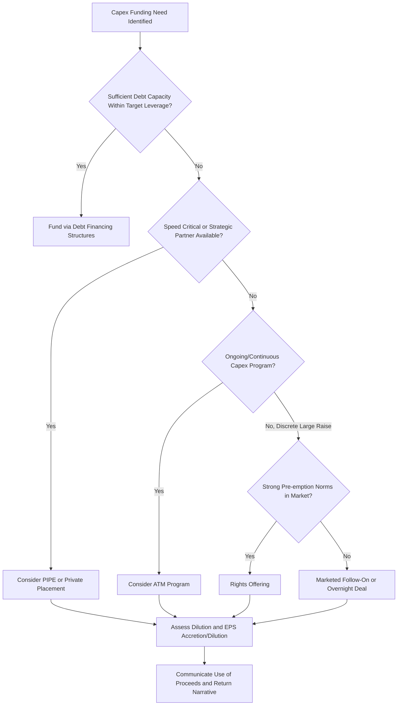

## Equity Financing and Capital Raises

### Overview

Equity financing funds capital expenditure and other corporate needs by issuing ownership interests rather than incurring repayment obligations, distinguishing it fundamentally from debt financing structures in its risk allocation, cost, and impact on existing shareholders. For capital-intensive companies or those pursuing large discrete capex programs beyond what internally generated cash flow and prudent debt capacity can support, equity capital raises are a primary funding lever, carrying distinct implications for per-share value, ownership dilution, and signaling to the market.

### Core Equity Financing Instruments

**1. Follow-On/Secondary Public Offerings**

Public companies raise additional equity capital by issuing new shares to the market, typically through:

- **Marketed follow-on offerings**: a formal, underwritten offering with a roadshow, typically launched after market close and priced before the next trading session, used for larger capital raises where price discovery and investor education matter.
- **Overnight/bought deals**: a rapidly executed offering, often priced and completed within a single evening, used when speed and reduced market risk (avoiding a multi-day marketing period) are prioritized, typically for well-known issuers with established institutional investor bases.
- **At-the-market (ATM) offerings**: a program allowing a company to sell shares incrementally into the existing trading market over time (rather than in one discrete transaction), providing flexibility to raise capital opportunistically as market conditions and share price permit, common among REITs and utilities funding ongoing capex programs.

**2. Rights Offerings**

Existing shareholders are granted the right (not obligation) to purchase additional shares, typically at a discount to the current market price, in proportion to their existing holdings. Rights offerings are structured to allow existing shareholders to maintain their proportional ownership (avoiding dilution) if they choose to participate, and are more common in jurisdictions and markets (e.g., certain European and Asian markets) where pre-emption rights are a stronger legal or governance norm than in the U.S.

**3. Private Placements (PIPEs)**

Private Investment in Public Equity transactions involve a company selling shares (or convertible securities) directly to a select group of institutional or strategic investors, outside the public offering process. PIPEs are often used when:

- Speed of execution is critical and a full marketed public offering process is impractical.
- A strategic investor (e.g., an industry partner, sovereign wealth fund, or private equity sponsor) is willing to provide capital alongside a broader strategic relationship (supply agreements, board representation, technology partnerships).
- Market conditions or company-specific circumstances (e.g., elevated volatility, a company below a market capitalization threshold attractive to broad institutional demand) make a public offering less viable.

**4. Convertible Securities**

- **Convertible preferred stock**: equity with fixed dividend features and conversion rights into common stock, often used to fund large capex programs while providing investors downside protection (liquidation preference, fixed dividend) relative to common equity, common in growth-stage capital-intensive companies (e.g., early-stage clean energy, biotech manufacturing buildouts).
- **Convertible bonds/notes**: debt instruments convertible into equity, discussed in the debt financing context but functionally a hybrid instrument that defers dilution until conversion, often used specifically to fund capex at a lower initial cash cost (coupon) than straight debt in exchange for the potential future dilution.

**5. Initial Public Offerings (IPOs)**

For private companies, an IPO itself often serves as a primary capital-raising event explicitly earmarked in part for capex — common in capital-intensive sectors (semiconductor manufacturing, biotech manufacturing facilities, infrastructure) where use-of-proceeds disclosures specifically identify planned capital projects to be funded from IPO proceeds.

### Dilution Mechanics

Every equity issuance dilutes existing shareholders' proportional ownership and, absent value-accretive deployment of the proceeds, can dilute per-share metrics:

$$New\ Shares\ Outstanding = Existing\ Shares + \frac{Capital\ Raised}{Issue\ Price\ per\ Share}$$

$$Dilution\ \% = \frac{New\ Shares\ Issued}{New\ Shares\ Outstanding}$$

**Accretion/dilution analysis for capex-funding raises:**

$$EPS_{pro forma} = \frac{Net\ Income + Incremental\ NOPAT\ from\ Capex\ Project - Foregone\ Interest\ Income\ on\ Proceeds}{Shares\ Outstanding_{pro forma}}$$

A capex-funding equity raise is EPS-accretive only if the return generated by the funded project exceeds the "cost" of the dilution (approximately the inverse of the P/E multiple at which shares were issued, adjusted for the project's ramp-up timeline). This is a standard sell-side analytical exercise following any announced capital raise tied to a specific capex program, since the market's reaction to a raise often hinges on whether the funded project's expected returns justify the near-term dilution.

### Cost of Equity vs. Cost of Debt Considerations

Equity capital is generally more expensive than debt capital for a given issuer, reflecting equity holders' subordinate claim (residual claimant status) and the absence of a contractual, tax-deductible return (unlike interest expense). This cost differential is central to capital structure and capex financing decisions:

$$WACC = \frac{E}{V}r_e + \frac{D}{V}r_d(1-t)$$

Where a higher proportion of equity financing ($E/V$) raises the blended cost of capital relative to debt financing, all else equal, but also reduces financial risk (lower leverage, more covenant flexibility, no mandatory repayment obligation) — a trade-off analysts must weigh when assessing whether a company's chosen capex financing mix is value-optimal given its growth profile, cash flow volatility, and existing leverage.

### When Equity Financing Is Favored Over Debt for Capex

- **High business/cash flow volatility**: cyclical or early-stage companies with uncertain near-term cash flows may be unable to support additional debt service without materially increasing financial distress risk, making equity a more prudent (if more dilutive) source of capex funding.
- **Already elevated leverage**: companies near or above target/covenant leverage thresholds may need to fund incremental capex with equity to avoid a credit rating downgrade or covenant breach.
- **Large, transformational capex programs**: capex programs that materially exceed the company's existing debt capacity or that represent a step-change in the business (e.g., a major new plant, a large acquisition-cum-capex program) sometimes require equity to maintain a prudent capital structure through the investment and ramp-up period.
- **Strategic signaling and alignment**: bringing in a strategic equity investor alongside capital can provide non-financial benefits (technology access, customer relationships, credibility) that a pure debt raise would not.
- **Regulatory or rating agency capital structure targets**: regulated utilities, in particular, often maintain target equity layers in their regulatory capital structure (the equity component of the rate base used to calculate allowed returns), requiring periodic equity issuance to fund capex while maintaining the regulator-approved capital structure ratio.

### Market Reaction and Signaling Considerations

Equity issuance announcements, particularly unexpected ones, frequently trigger negative short-term share price reactions, a well-documented pattern in corporate finance literature often attributed to:

- **Information asymmetry / adverse selection**: the market may interpret a decision to raise equity (rather than debt) as a signal that management believes the company's shares are currently overvalued relative to management's own view of intrinsic value (the "pecking order" theory of capital structure, which posits firms prefer internal financing, then debt, then equity as a last resort).
- **Dilution mechanics**: the immediate, mechanical dilutive impact on per-share metrics, independent of the funded project's eventual returns, can weigh on the share price before the market has visibility into whether the capex program will generate accretive returns.

[Inference] The magnitude and persistence of negative market reaction to equity issuance vary substantially based on the perceived necessity and quality of the raise (e.g., a well-telegraphed, growth-funding raise with a credible return narrative typically reacts less negatively than an unexpected, balance-sheet-repair-motivated raise), and is not a uniform, mechanically predictable market response.

### Use-of-Proceeds Disclosure and Analytical Scrutiny

When a company raises equity explicitly to fund capex, equity analysts typically scrutinize:

- **Specificity of use-of-proceeds disclosure**: whether the raise is tied to a specific, previously guided capex program (higher credibility) or is a more general "general corporate purposes" raise (lower specificity, potentially signaling balance sheet stress or opportunistic timing rather than a specific value-accretive project).
- **Timing relative to the capex program's cash flow needs**: whether the raise is appropriately sized and timed to the capex program's actual funding requirements, or represents pre-emptive/precautionary over-funding that unnecessarily dilutes shareholders ahead of need.
- **Consistency with previously stated capital allocation framework**: whether the equity raise is consistent with management's previously articulated capital structure targets and financing hierarchy (as often disclosed at Capital Markets Days), or represents a departure that may warrant a reassessment of the broader capital allocation thesis.

### Comparative Summary of Equity Financing Instruments

| Instrument | Speed of Execution | Typical Discount to Market | Dilution Timing | Common Capex Use Case |
| --- | --- | --- | --- | --- |
| Marketed follow-on | Moderate (days, with roadshow) | Moderate discount | Immediate | Large, well-telegraphed capex programs |
| Overnight/bought deal | Fast (single evening) | Smaller discount | Immediate | Opportunistic, well-known issuers |
| ATM program | Ongoing/flexible | Minimal (market price) | Gradual, over time | Continuous capex programs (REITs, utilities) |
| Rights offering | Moderate (subscription period) | Larger discount | Immediate, pro-rata option | Markets with strong pre-emption norms |
| PIPE | Fast (privately negotiated) | Often larger discount | Immediate | Speed-critical or strategic-partner raises |
| Convertible preferred/notes | Moderate | N/A (coupon/conversion terms) | Deferred until conversion | Growth-stage capital-intensive buildouts |

### Equity Financing Decision Framework (Mermaid)

### Dilution and Accretion Sensitivity (svg_diagram)

<svg xmlns="http://www.w3.org/2000/svg" viewBox="0 0 700 340">
\<style\>
.axis{stroke:#333;stroke-width:1.5;}
.gridline{stroke:#e0e0e0;stroke-width:1;}
.line1{stroke:#c0392b;stroke-width:2.5;fill:none;}
.line2{stroke:#1a7a3c;stroke-width:2.5;fill:none;}
.txt{font-family:Arial,Helvetica,sans-serif;font-size:12px;fill:#111;}
\</style\>
<text x="350" y="24" text-anchor="middle" font-family="Arial" font-size="15" font-weight="bold" fill="#111">EPS Dilution vs Accretion Over Capex Ramp Period (svg_diagram)</text>
<line x1="70" y1="270" x2="650" y2="270" class="axis" />
<line x1="70" y1="270" x2="70" y2="50" class="axis" />
<line x1="70" y1="170" x2="650" y2="170" stroke="#999" stroke-dasharray="4,4" />
<text x="655" y="174" class="txt">Breakeven</text>
<text x="330" y="305" class="txt">Years Since Equity Raise</text>
<text x="20" y="60" class="txt">EPS Impact</text>
<path d="M100,170 L200,220 L300,235 L400,215 L500,185 L600,150" class="line1" />
<text x="610" y="145" class="txt" fill="#c0392b">Actual EPS Path</text>
<rect x="90" y="55" width="14" height="14" fill="#c0392b" />
<text x="110" y="66" class="txt">Dilutive near-term, accretive as project ramps</text>
</svg>

**Related Topics:**

- Debt financing structures for capital projects
- Weighted average cost of capital (WACC) and optimal capital structure
- EPS accretion/dilution analysis for capital raises and M&A
- Capital allocation frameworks and priority ranking (capex, dividends, buybacks, deleveraging)
- Regulated utility rate base and allowed equity layer mechanics
- Pecking order theory and capital structure signaling
- Convertible securities structuring and valuation
- IPO use-of-proceeds analysis for capital-intensive issuers