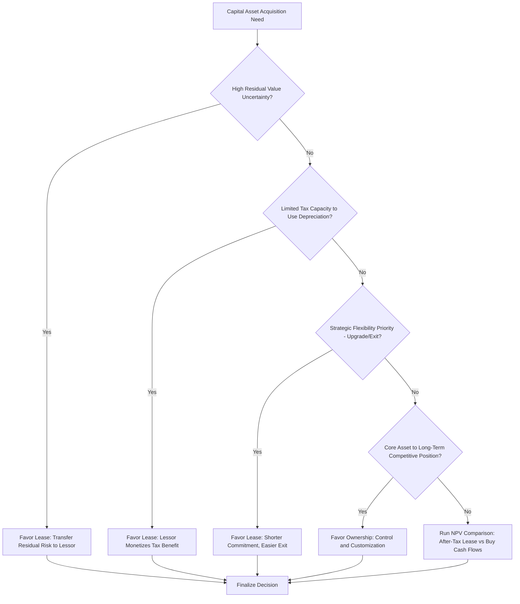

## Leasing Versus Owning Capital Assets

### Overview

The lease-versus-buy decision determines how a company acquires the use of a capital asset — through outright ownership (funded by cash, debt, or equity) or through a lease arrangement that grants usage rights without transferring full ownership. This decision affects cash flow timing, balance sheet presentation, tax treatment, residual value risk allocation, and operational flexibility, and is a recurring capital budgeting and capex financing decision across virtually every capital-intensive sector, from aviation and shipping to retail real estate and industrial equipment.

### Lease Classification Fundamentals

Under current accounting standards (ASC 842 in U.S. GAAP, IFRS 16 internationally), lease classification and balance sheet treatment differ in important ways:

**IFRS 16 (single-model approach):**

Virtually all leases (with limited exemptions for short-term leases under 12 months and low-value assets) are capitalized on the lessee's balance sheet as a right-of-use (ROU) asset and a corresponding lease liability, eliminating the historical operating/finance lease distinction for lessee accounting purposes.

**ASC 842 (dual-model approach):**

Leases are still classified as either:

- **Finance leases** (formerly capital leases): economically similar to a purchase financed by debt; the ROU asset is amortized separately from the lease liability, and interest expense is recognized on the liability, producing an expense pattern front-loaded similarly to debt-financed ownership.
- **Operating leases**: also capitalized on the balance sheet (a key change from pre-2019 standards) as an ROU asset and lease liability, but the income statement recognizes a single, typically straight-line lease expense rather than separate interest and amortization components.

Both standards required a substantial shift from the pre-2019 environment when operating leases were kept entirely off-balance-sheet, historically the primary accounting-driven motivation for structuring asset acquisitions as operating leases.

### Financial Statement and Ratio Impact

| Metric | Own (Debt-Financed) | Finance Lease | Operating Lease |
| --- | --- | --- | --- |
| Balance sheet asset | Owned PP&E | ROU asset | ROU asset |
| Balance sheet liability | Debt | Lease liability | Lease liability |
| Income statement | Depreciation + Interest | Amortization + Interest | Single lease expense (straight-line) |
| Cash flow statement | Capex (investing) + interest/principal (financing/operating) | Financing (principal) + operating (interest) | Operating (typically) |
| EBITDA impact | Depreciation excluded from EBITDA | Amortization/interest excluded | Full lease expense typically excluded from EBITDA (added back) |

Because operating lease expense is typically excluded from EBITDA (analysts commonly add back the straight-line lease expense in EBITDA reconciliations, treating it similarly to D&A), companies with substantial operating lease usage can show materially different EBITDA margins and EV/EBITDA multiples than economically similar owner-operators, requiring analyst adjustment for comparability — this is a direct, practical continuation of the capex intensity comparability issues discussed in cross-company benchmarking.

### Economic Drivers of the Lease vs. Buy Decision

**1. Cost of Capital and Financing Access**

$$NPV_{lease} = -\sum_{t=1}^{n} \frac{Lease\ Payment_t (1-t)}{(1+r)^t}$$

$$NPV_{buy} = -Purchase\ Price + \sum_{t=1}^{n}\frac{Depreciation\ Tax\ Shield_t + Residual\ Value_n}{(1+r)^t} - \sum \frac{Debt\ Service (if\ financed)}{(1+r)^t}$$

A rigorous lease-vs-buy analysis discounts the after-tax cash flow streams under each alternative at an appropriate discount rate (often the after-tax cost of debt, since both alternatives are frequently financed with debt-equivalent capital, making this a financing-mix-neutral comparison focused on the asset acquisition method itself) and selects the lower-cost (less negative NPV) alternative.

**2. Residual Value Risk Allocation**

Ownership exposes the company to residual value risk (the asset's value at the end of its useful life may be higher or lower than expected), whereas an operating lease typically transfers this risk to the lessor, who prices the lease payments to compensate for bearing that risk. This is particularly significant for assets with volatile or uncertain residual values (aircraft, where technology and fuel-efficiency shifts can materially affect used-aircraft values; specialized equipment tied to a specific technology generation).

**3. Tax Considerations**

- **Ownership** generates depreciation deductions (potentially accelerated under tax provisions such as bonus depreciation or accelerated depreciation schedules, subject to the applicable tax jurisdiction and current tax law) and, if debt-financed, interest expense deductions.
- **Leasing** generates a deduction for the lease payment itself (for true tax leases), and the tax benefit accrues to whichever party (lessor or lessee) is treated as the tax owner of the asset under applicable tax law — a determination that can differ from the accounting lease classification, since tax and accounting lease characterization rules are not identical.
- **Tax capacity mismatches** can make leasing more attractive than ownership: a lessee without sufficient taxable income to fully utilize accelerated depreciation deductions may prefer to lease from a lessor (often a well-capitalized financial institution or leasing company) that can fully monetize the tax depreciation benefit and pass some of that value back to the lessee through lower lease payments — a dynamic historically significant in aircraft, rail, and renewable energy equipment leasing markets. [Inference] The specific tax capacity dynamics and their attractiveness depend heavily on the current tax regime in the relevant jurisdiction and can shift materially with tax law changes.

**4. Operational and Strategic Flexibility**

- **Leasing** generally offers greater flexibility to upgrade, replace, or exit an asset before the end of its full useful life, valuable in industries facing rapid technological change or uncertain long-term demand (e.g., leasing rather than owning aircraft to adjust fleet size and composition more readily in response to demand cycles).
- **Ownership** provides greater long-term control over the asset, avoids potential lease renewal risk (rate increases, non-renewal) at the end of a lease term, and may be preferable for assets central to a company's long-term competitive positioning where control and customization matter.

**5. Capital Preservation and Liquidity**

Leasing can preserve upfront cash and existing credit capacity relative to an outright purchase (particularly a cash purchase), which can be valuable for companies prioritizing balance sheet liquidity or facing capital constraints, though this benefit should be weighed against the fact that both leasing and debt-financed ownership create ongoing fixed payment obligations with broadly similar credit implications under current lease accounting standards.

### Sector-Specific Lease vs. Buy Patterns

- **Aviation**: a substantial portion of the global commercial aircraft fleet is leased rather than owned by operating airlines, reflecting residual value risk transfer, fleet flexibility, and the specialized expertise of dedicated aircraft leasing companies in managing aircraft residual values and remarketing. [Unverified: the precise current global leased-fleet percentage shifts over time and should be checked against current industry data rather than assumed static.]
- **Retail real estate**: many retailers lease store locations rather than own them, preserving capital for inventory and other operating needs, and providing flexibility to adjust store footprint (openings, closures, relocations) in response to shifting consumer patterns and market conditions.
- **Shipping**: vessels are frequently chartered (a shipping-industry-specific lease structure, including time charters and bareboat charters) rather than owned outright, allowing operators to flex capacity with freight market cycles.
- **Data centers and IT equipment**: colocation and equipment leasing arrangements allow technology companies to access infrastructure capacity without the capital intensity of owning and building data centers directly, though large hyperscale cloud providers increasingly own significant data center infrastructure directly as part of vertically integrated capex strategies.
- **Heavy industrial equipment**: construction, mining, and manufacturing equipment is frequently leased or rented for project-specific or fluctuating utilization needs, reserving outright ownership for core, continuously utilized equipment.

### Sale-and-Leaseback as a Hybrid Strategy

A sale-and-leaseback transaction — where a company sells an owned asset to a buyer/lessor and simultaneously leases it back for continued operational use — combines elements of both ownership history and lease-based ongoing use:

- **Monetizes embedded asset value**: converts an illiquid owned asset into immediate cash proceeds, which can be redeployed to fund new capex, reduce debt, or return capital to shareholders.
- **Retains operational control**: the company continues using the asset under the leaseback without disruption to operations.
- **Accounting and tax treatment**: under current lease accounting standards, the leaseback is still generally capitalized as a right-of-use asset and lease liability (subject to sale-and-leaseback-specific accounting guidance determining whether the transaction qualifies as a true sale), meaning the balance-sheet-reduction benefit of this structure is more limited than in the pre-2019 accounting environment.

### Analytical Framework for Equity Research

When evaluating a company's lease-vs-buy mix and its implications:

- **Normalize capex and EBITDA comparisons** across peers with different lease/buy mixes, since a lease-heavy peer will show structurally lower reported capex and, in some EBITDA-add-back conventions, different EBITDA margins than an ownership-heavy peer with economically similar asset utilization.
- **Assess lease liability as debt-equivalent** in leverage analysis, since post-ASC 842/IFRS 16, lease liabilities are on-balance-sheet and are increasingly treated by credit analysts, rating agencies, and sophisticated equity analysts as a debt-like obligation for leverage ratio purposes (e.g., incorporating lease-adjusted net debt/EBITDAR metrics, particularly standard practice in airline and retail analysis).
- **Evaluate residual value and renewal risk embedded in lease-heavy strategies**, particularly lease maturity concentration that could expose the company to renewal rate risk in adverse market conditions.
- **Consider strategic rationale disclosed by management** for sale-and-leaseback or lease-heavy strategies (capital discipline, balance sheet flexibility, sector-specific risk management) rather than assuming a uniform "better" choice across all companies and asset types.

### Lease vs. Buy Decision Framework (Mermaid)

### Lease vs. Buy After-Tax Cash Flow Comparison (svg_diagram)

<svg xmlns="http://www.w3.org/2000/svg" viewBox="0 0 700 340">
\<style\>
.axis{stroke:#333;stroke-width:1.5;}
.gridline{stroke:#e0e0e0;stroke-width:1;}
.buyline{stroke:#c0392b;stroke-width:2.5;fill:none;}
.leaseline{stroke:#2874a6;stroke-width:2.5;stroke-dasharray:6,4;fill:none;}
.txt{font-family:Arial,Helvetica,sans-serif;font-size:12px;fill:#111;}
\</style\>
<text x="350" y="24" text-anchor="middle" font-family="Arial" font-size="15" font-weight="bold" fill="#111">Cumulative After-Tax Cost: Lease vs Buy (svg_diagram)</text>
<line x1="70" y1="60" x2="650" y2="60" stroke="#999" stroke-dasharray="3,3" />
<text x="655" y="64" class="txt">$0</text>
<line x1="70" y1="60" x2="70" y2="290" class="axis" />
<line x1="70" y1="290" x2="650" y2="290" class="axis" />
<text x="330" y="315" class="txt">Years</text>
<text x="20" y="70" class="txt">Cumulative Cost</text>
<path d="M100,90 L200,110 L300,160 L400,200 L500,225 L600,240" class="buyline" />
<path d="M100,150 L200,175 L300,195 L400,210 L500,220 L600,228" class="leaseline" />
<rect x="90" y="240" width="14" height="14" fill="#c0392b" />
<text x="110" y="251" class="txt">Buy: High upfront outlay, lower cumulative cost long-term</text>
<rect x="90" y="260" width="14" height="14" fill="#2874a6" />
<text x="110" y="271" class="txt">Lease: Lower upfront, converges/crosses over time</text>
</svg>

**Related Topics:**

- Debt financing structures for capital projects
- Lease accounting standards (ASC 842 / IFRS 16) implementation details
- EBITDAR and lease-adjusted leverage metrics in airline and retail credit analysis
- Sale-and-leaseback transaction structuring and accounting treatment
- Capex assumptions in discounted cash flow models
- Comparing capex intensity across comparable companies
- Depreciation methods and tax shield analysis
- Fleet and asset lifecycle management in capital-intensive industries