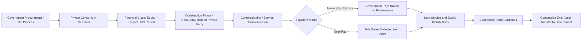

## Public-Private Partnerships for Infrastructure Capex

### Overview

Public-private partnerships (PPPs, sometimes rendered P3s) are long-term contractual arrangements between a government entity and a private sector consortium in which the private party finances, and typically designs, builds, and/or operates, infrastructure assets that would traditionally be procured and owned directly by the public sector. PPPs are a distinct financing and delivery mechanism for large infrastructure capex — roads, bridges, hospitals, water/wastewater systems, transit systems, and social infrastructure — combining elements of project finance with government contracting and risk-sharing frameworks. For equity research, PPPs are relevant both to companies that participate as private sponsors/operators and to the broader infrastructure investment ecosystem (infrastructure funds, engineering/construction firms, and specialized PPP operators).

### Core Rationale for PPP Structures

- **Off-government-balance-sheet capital**: PPPs allow governments to deliver infrastructure without immediately deploying public capital or increasing government debt in the same manner as traditional public procurement, subject to specific public-sector accounting rules governing whether a PPP asset and liability must be recognized on the government's own balance sheet.
- **Risk transfer to the private sector**: PPPs are structured to transfer specific risks (construction cost overrun, construction delay, and often long-term operating and maintenance performance risk) to the private consortium, which is generally viewed as being better positioned to manage and price these risks than a public sector entity.
- **Whole-of-life cost incentive alignment**: because the private consortium in many PPP structures (particularly Design-Build-Finance-Operate-Maintain, or DBFOM, models) is responsible for both construction and long-term operation/maintenance, it has a direct financial incentive to design and build the asset for efficient long-term maintenance costs, rather than optimizing solely for lowest initial construction cost.
- **Private sector innovation and efficiency**: proponents argue that competitive private bidding processes and private-sector project management discipline can deliver infrastructure projects more efficiently (on time, on budget) than traditional public procurement, though this claim has been subject to significant academic and policy debate and outcomes vary substantially by project and jurisdiction. [Unverified: comparative efficiency claims between PPP and traditional procurement are empirically contested and vary by study methodology, sector, and jurisdiction; no single universally accepted efficiency differential exists.]

### Common PPP Structural Models

**1. Design-Build-Finance-Operate-Maintain (DBFOM)**

The most comprehensive PPP structure: the private consortium designs, builds, finances, operates, and maintains the asset over a long-term concession period (often 25-99 years depending on jurisdiction and asset type), receiving payment either through:

- **Availability payments**: fixed or performance-adjusted payments from the government based on the asset being available and meeting specified performance standards, regardless of actual usage/demand (common for social infrastructure like schools, hospitals, and government buildings, and for some transportation assets where demand risk is retained by the government).
- **User-pay/demand-risk models**: the private consortium's revenue depends on actual usage (tolls, fares), meaning the private party bears demand/traffic risk in addition to construction and operating risk (common for toll roads and some transit concessions).

**2. Design-Build-Finance (DBF)**

The private party designs, builds, and finances the asset but hands over operations to the public sector (or a separate operator) upon completion, transferring construction and financing risk but not long-term operating risk to the private consortium.

**3. Build-Operate-Transfer (BOT) / Build-Own-Operate-Transfer (BOOT)**

Common internationally, particularly in emerging markets, where the private consortium builds and operates the asset for a defined concession period (recovering its investment and a return through user fees or availability payments) before transferring ownership/control back to the government at the end of the concession term.

**4. Concession Agreements for Existing Assets**

Rather than new-build infrastructure, some PPP-adjacent structures involve a government leasing or granting a long-term concession over an existing asset (e.g., an existing toll road, airport, or parking system) to a private operator in exchange for an upfront payment and/or ongoing revenue share, allowing the government to monetize an existing asset's value while transferring ongoing capex (renewal, expansion) and operating responsibility to the private concessionaire.

### Financing Structure of a Typical PPP

PPP projects are typically financed using a project finance structure (as covered in project finance and off-balance-sheet structures), with:

- **Private consortium equity**: sponsor equity from infrastructure funds, construction companies, and/or institutional investors, typically representing a modest proportion (often 10-20%) of total project capital given the relatively predictable, contracted cash flow profile of many PPPs.
- **Senior project debt**: bank loans, project bonds, or increasingly institutional private placement debt, sized against the contracted availability payment or demand-risk cash flow stream, similar in structure to the non-recourse project finance mechanics described previously.
- **Government contribution/milestone payments**: in some structures, the government makes partial payments during construction (reducing the amount of private financing required) or provides guarantees/support mechanisms to enhance project bankability.

### Risk Allocation Matrix

| Risk Category | Typically Allocated To | Rationale |
| --- | --- | --- |
| Construction cost overrun | Private consortium (via fixed-price EPC contract) | Private sector construction expertise and contractual risk-bearing capacity |
| Construction delay | Private consortium | Incentivizes on-time delivery via liquidated damages |
| Availability/performance | Private consortium | Directly tied to the operator's ongoing responsibility |
| Demand/usage (availability payment model) | Government | Removes demand forecasting risk from private bidders, typically lowering financing cost |
| Demand/usage (user-pay model) | Private consortium | Appropriate where private party has meaningful influence over demand (e.g., service quality, pricing) |
| Regulatory/political change | Often shared or government-retained | Private party generally cannot control government policy risk |
| Force majeure | Often shared via contractual mechanisms | Neither party can control, but contracts typically specify relief mechanisms |

### Government Accounting Treatment Considerations

Whether a PPP asset and associated liability appear on the government's own balance sheet depends on applicable public-sector accounting standards (which vary by jurisdiction, e.g., government accounting standards boards or equivalent bodies), generally turning on an assessment of which party bears the majority of risks and rewards associated with the underlying asset. [Inference] This determination is jurisdiction- and standard-specific; equity analysts assessing government counterparty risk or the broader PPP market in a given country should reference the applicable public-sector accounting framework rather than assume a uniform global treatment.

### Analytical Considerations for Equity Research

**For companies that sponsor/operate PPPs (infrastructure funds, construction/engineering firms with concession arms, specialized infrastructure operators):**

- **Contracted cash flow visibility**: availability-payment PPPs offer long-term, often inflation-linked, contracted cash flow streams with government counterparty credit risk, valued by investors similarly to a long-duration, government-backed annuity-like asset, generally supporting a lower required return/discount rate than merchant infrastructure exposed to full market risk.
- **Construction phase vs. operating phase risk profile**: equity value and risk profile shift materially once a PPP asset transitions from the construction phase (subject to cost overrun and delay risk) to the operating phase (subject primarily to performance/availability risk and, in user-pay models, demand risk), and analysts should differentiate valuation approaches accordingly.
- **Portfolio diversification benefits**: companies or funds holding a portfolio of PPP concessions across multiple projects, sectors, and government counterparties benefit from diversification of individual project execution and counterparty risk.
- **Concession maturity and reinvestment**: as PPP concessions approach their contractual end date (transfer back to government), analysts must assess whether the sponsor has a pipeline of new PPP opportunities to replace maturing concession cash flows, similar to the analytical challenge of assessing reinvestment opportunities for any maturing asset base.

**For companies bidding on/constructing PPP infrastructure (engineering and construction firms):**

- **Bid and proposal cost risk**: PPP bidding processes are often lengthy and costly, with no guarantee of winning, requiring analysts to understand a company's win-rate track record and bid cost discipline when assessing the profitability of a PPP-focused construction business.
- **Balance sheet and guarantee exposure**: construction firms participating as equity sponsors in PPP consortiums (rather than purely as EPC contractors paid a fixed fee) take on project-level equity risk and potential parent guarantee exposure that should be assessed distinctly from their core construction/engineering services business.

**For assessing government/public-sector counterparty exposure:**

- **Sovereign or sub-sovereign credit risk**: availability-payment PPP cash flows are only as reliable as the contracting government entity's fiscal capacity and payment history, relevant when assessing PPP exposure in jurisdictions with weaker sovereign or municipal credit profiles.
- **Political and regulatory risk**: PPP contracts, particularly long-duration ones, can be subject to renegotiation risk, political pressure (especially for user-pay models where toll/fare increases become politically contentious), or, in some historical cases internationally, contract cancellation or nationalization risk in higher-risk jurisdictions.

### PPP Lifecycle and Cash Flow Structure (Mermaid)

### PPP Risk Allocation and Cash Flow Profile Over Project Life (svg_diagram)

<svg xmlns="http://www.w3.org/2000/svg" viewBox="0 0 700 360">
\<style\>
.box{stroke:#333;stroke-width:1.5;}
.txt{font-family:Arial,Helvetica,sans-serif;font-size:12px;fill:#111;}
.phase{font-family:Arial,Helvetica,sans-serif;font-size:13px;fill:#fff;font-weight:bold;}
\</style\>
<text x="350" y="24" text-anchor="middle" font-family="Arial" font-size="15" font-weight="bold" fill="#111">PPP Project Phases: Risk Profile and Cash Flow (svg_diagram)</text>
<rect x="50" y="60" width="180" height="60" fill="#c0392b" class="box" />
<text x="140" y="85" text-anchor="middle" class="phase">Construction Phase</text>
<text x="140" y="105" text-anchor="middle" class="phase" font-size="11">Cost/Delay Risk</text>
<rect x="260" y="60" width="180" height="60" fill="#d68910" class="box" />
<text x="350" y="85" text-anchor="middle" class="phase">Ramp-Up / Commissioning</text>
<text x="350" y="105" text-anchor="middle" class="phase" font-size="11">Performance Testing</text>
<rect x="470" y="60" width="180" height="60" fill="#1a7a3c" class="box" />
<text x="560" y="85" text-anchor="middle" class="phase">Operating Phase</text>
<text x="560" y="105" text-anchor="middle" class="phase" font-size="11">Availability / Demand Risk</text>
<line x1="50" y1="140" x2="650" y2="140" stroke="#333" stroke-width="1.5" />
<text x="30" y="145" class="txt">Cash Flow</text>
<path d="M50,200 L230,215 L260,200 L440,140 L470,120 L650,110" stroke="#2874a6" stroke-width="2.5" fill="none" />
<text x="30" y="150" class="txt">$</text>
<text x="450" y="150" class="txt">Stable contracted cash flow</text>
<text x="60" y="230" class="txt">Negative during construction (equity/debt draws)</text>
<rect x="50" y="260" width="600" height="80" fill="#f4f6f8" class="box" />
<text x="60" y="280" class="txt" font-weight="bold">Key Transition Points:</text>
<text x="60" y="300" class="txt">- Financial close: equity and debt committed</text>
<text x="60" y="315" class="txt">- Service commencement: risk shifts from construction to operating profile</text>
<text x="60" y="330" class="txt">- Concession end: asset transfers to government, cash flow stream terminates</text>
</svg>

**Related Topics:**

- Project finance and off-balance-sheet structures
- Debt financing structures for capital projects
- Government/sovereign counterparty credit risk assessment
- Infrastructure fund valuation and discount rate selection
- Availability-payment vs. demand-risk revenue model analysis
- Concession asset valuation and terminal transfer considerations
- Engineering and construction sector equity research methodology
- Sovereign and sub-sovereign fiscal capacity analysis