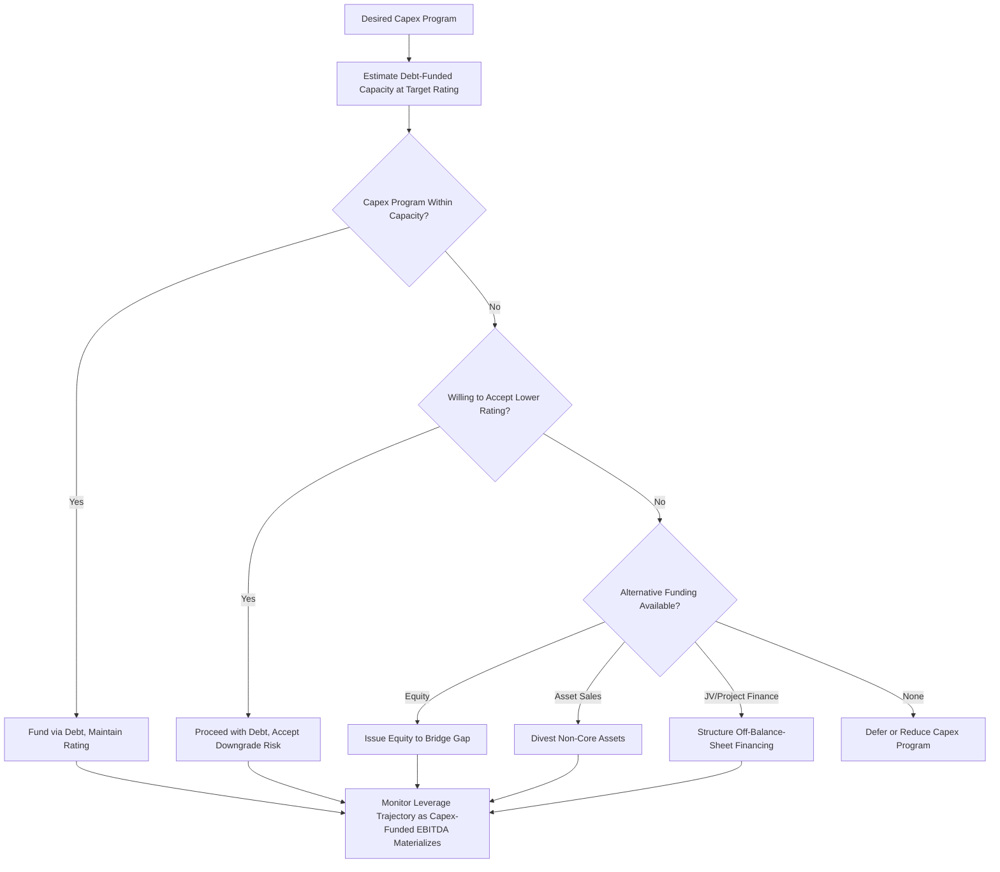

## Credit Ratings and Debt Capacity Constraints on Capex

### Overview

Credit ratings and the debt capacity they influence act as a structural constraint on how much capital expenditure a company can fund through debt financing without triggering a ratings downgrade, covenant breach, or an increase in its cost of capital that undermines the economics of the capex program itself. Equity analysts must understand this interaction because a company's capex ambitions are not solely a function of strategic desire or available investment opportunities — they are bounded by the credit capacity the company is willing and able to deploy while maintaining its target credit profile, and breaching that capacity has direct consequences for equity value through higher financing costs, reduced financial flexibility, and potential forced equity issuance or capex curtailment.

### How Credit Rating Agencies Assess Capex-Driven Leverage

Rating agencies (S&P Global Ratings, Moody's, Fitch, and others) evaluate the credit impact of a capex program through several core analytical lenses:

**1. Leverage Ratio Trajectory**

$$Net\ Debt / EBITDA_t$$

Agencies model the multi-year trajectory of leverage under a company's disclosed or inferred capex plan, assessing whether leverage temporarily rises during a heavy investment phase and then de-levers as the funded projects generate incremental EBITDA, versus a structural, non-reverting increase in leverage that would be viewed more negatively.

**2. Funds From Operations (FFO) to Debt**

$$FFO/Debt = \frac{Cash\ Flow\ from\ Operations\ (pre\text{-}capex\text{-}adjustments)}{Total\ Debt}$$

A widely used rating agency metric (particularly prominent in Moody's and S&P methodologies) that measures the cash-generating capacity of the business relative to its debt load, used to assess debt service capacity independent of accounting EBITDA adjustments.

**3. Free Cash Flow After Capex and Dividends**

Agencies specifically assess whether a company's capex program, combined with its dividend/shareholder return policy, leaves the company free-cash-flow negative for a sustained period, which increases reliance on external financing (debt or equity) and elevates credit risk relative to a company that can self-fund its capex program from internally generated cash flow.

**4. Capex Flexibility and Discretionary vs. Committed Spend**

Rating agencies distinguish between capex that is largely discretionary (growth capex that could be deferred or scaled back in a stress scenario without threatening the ongoing business) and capex that is essentially non-discretionary (maintenance capex required to sustain safe and compliant operations, or contractually committed capex under existing agreements). A company with a higher proportion of discretionary capex is generally viewed as having greater financial flexibility to preserve credit metrics in a downturn by curtailing spend, a factor explicitly considered in rating agency stress-testing and scenario analysis.

**5. Sector-Specific Capital Intensity Benchmarks**

Rating methodologies for capital-intensive sectors (utilities, telecom, midstream energy, transportation infrastructure) incorporate sector-specific leverage and coverage ratio thresholds calibrated to the typical capex intensity and cash flow stability of that sector, recognizing that a given leverage ratio may be appropriate for a stable, regulated utility with predictable capex-funded rate base growth but excessive for a more cyclical or competitively exposed capital-intensive business.

### Rating Impact Mechanics

**Downgrade risk from capex-driven leverage:**

If a company's capex program (whether from a single large project or a sustained multi-year growth investment cycle) pushes leverage metrics beyond the thresholds the rating agencies associate with the company's current rating category, a downgrade can result, with direct consequences:

- **Higher cost of debt**: lower-rated debt commands higher yields/spreads, directly increasing the cost of the capex program itself and of any future refinancing.
- **Reduced access to certain capital markets**: some institutional investors (insurance companies, pension funds) have investment-grade-only mandates; a downgrade below investment grade (a so-called "fallen angel" scenario) can materially reduce the pool of available debt investors and increase borrowing costs disproportionately.
- **Covenant and cross-default implications**: existing debt agreements may contain rating-triggered covenants (e.g., pricing grids that adjust interest rates based on rating, or in some cases rating-linked events of default), amplifying the financial impact of a downgrade beyond the new-issuance cost alone.
- **Equity market reaction**: rating downgrades, particularly unexpected ones or those crossing the investment-grade/high-yield threshold, often trigger negative equity market reactions reflecting increased financial risk and reduced strategic flexibility.

### Financial Covenants as a Capex Constraint

Beyond rating agency assessments, explicit financial covenants in credit agreements and bond indentures directly constrain capex capacity:

- **Leverage covenants** (maximum net debt/EBITDA): limit the amount of incremental debt a company can raise to fund capex without breaching the covenant, requiring equity funding or internally generated cash flow for any capex beyond the covenant-implied debt capacity.
- **Interest coverage covenants** (minimum EBITDA/interest expense): constrain how much incremental interest expense (from capex-funding debt) a company can absorb while remaining in compliance.
- **Capex baskets/caps**: some credit agreements, particularly in leveraged finance and project finance contexts, include explicit maximum permitted capex levels or require lender consent above a specified threshold, directly capping the capex a company can undertake without additional negotiation.
- **Restricted payments covenants**: can indirectly affect capex capacity by limiting the cash available for capital allocation more broadly, forcing trade-offs between capex, dividends, and buybacks within a covenant-constrained cash flow envelope.

### Target Credit Rating as a Strategic Capital Allocation Anchor

Many companies, particularly in regulated and capital-intensive industries (utilities, midstream energy, investment-grade industrials), explicitly manage their capital allocation — including capex pacing — around maintaining a specific target credit rating, treating the rating as a strategic constraint disclosed to investors:

- Management may explicitly state a target rating (e.g., "maintain a solid investment-grade BBB rating") and size the capex program, dividend policy, and equity issuance plan to be consistent with that target over a multi-year horizon.
- This creates a predictable analytical framework for equity analysts: given a disclosed target rating and the associated leverage ceiling, the maximum debt-funded capex capacity can be estimated, with any capex beyond that capacity implying either equity issuance, capex deferral, or a deliberate (and typically explicitly communicated) decision to temporarily operate outside the target rating range during a defined investment cycle.

### Analytical Framework: Estimating Debt-Funded Capex Capacity

A simplified approach to estimating incremental debt capacity available for capex funding while maintaining a target leverage ratio:

$$Max\ Incremental\ Debt = (Target\ Leverage\ Ratio \times Projected\ EBITDA) - Current\ Net\ Debt$$

$$Max\ Debt\text{-}Funded\ Capex \approx Max\ Incremental\ Debt + Internally\ Generated\ FCF\ available\ for\ capex$$

This calculation should be performed dynamically across the forecast period, since projected EBITDA itself changes as capex-funded projects come online, creating a feedback loop between the capex program's success and the debt capacity available to fund subsequent phases of that same program — a key reason why credit-constrained capex modeling should be iterative/dynamic rather than static.

### Credit Rating and Debt Capacity Considerations by Sector

| Sector | Typical Rating Sensitivity | Key Constraint |
| --- | --- | --- |
| Regulated utilities | Moderate — regulatory framework provides cash flow visibility, supporting higher sustainable leverage | Regulatory equity layer requirements often necessitate periodic equity issuance alongside debt |
| Oil & gas E&P | High — commodity price volatility drives cash flow and leverage volatility | Capex flexibility (ability to cut growth capex) is a key credit mitigant in downturns |
| Telecom | Moderate-High — heavy network capex intensity, competitive pressure on cash flow | Multi-year technology transition capex cycles (e.g., network upgrades) can pressure leverage |
| Industrials/manufacturing | Moderate — cyclical but generally more capex flexibility than regulated/infrastructure sectors | Discretionary growth capex typically first to be curtailed in a downturn |
| Infrastructure/project finance | Assessed largely at the project level (see project finance) | Structured, contracted cash flows support higher leverage than corporate norms |

### Consequences of Breaching Debt Capacity Constraints

When a company's desired capex program exceeds its sustainable debt capacity at the target rating, several outcomes are possible, each with distinct equity implications:

1. **Capex deferral or reduction**: management scales back or delays growth capex to remain within credit constraints, potentially slowing revenue growth relative to prior guidance/expectations.
2. **Equity issuance**: as discussed in equity financing and capital raises, the company raises equity to fund the capex gap, diluting existing shareholders but preserving the credit profile.
3. **Accepting a rating downgrade**: management proceeds with the capex program despite exceeding the current rating's leverage thresholds, accepting a lower rating (and higher financing costs) as a trade-off against continued growth investment — a strategic choice that should be explicitly evaluated against the capex program's expected returns.
4. **Divestiture of non-core assets**: proceeds from asset sales fund capex without incremental debt, preserving leverage metrics while still pursuing the capital program, though this reduces the ongoing cash flow base going forward.
5. **Joint venture or project finance structuring**: as discussed in project finance and off-balance-sheet structures, bringing in a partner or structuring the specific project as non-recourse project finance can allow the capex program to proceed without fully burdening the parent's own credit metrics.

### Capex-Credit Capacity Feedback Loop (Mermaid)

### Leverage Trajectory Under Capex Program vs. Rating Threshold (svg_diagram)

<svg xmlns="http://www.w3.org/2000/svg" viewBox="0 0 700 340">
\<style\>
.axis{stroke:#333;stroke-width:1.5;}
.gridline{stroke:#e0e0e0;stroke-width:1;}
.leverageline{stroke:#c0392b;stroke-width:2.5;fill:none;}
.thresholdline{stroke:#333;stroke-width:2;stroke-dasharray:6,4;fill:none;}
.txt{font-family:Arial,Helvetica,sans-serif;font-size:12px;fill:#111;}
\</style\>
<text x="350" y="24" text-anchor="middle" font-family="Arial" font-size="15" font-weight="bold" fill="#111">Leverage Trajectory During Capex Cycle vs Rating Threshold (svg_diagram)</text>
<line x1="70" y1="270" x2="650" y2="270" class="axis" />
<line x1="70" y1="270" x2="70" y2="50" class="axis" />
<text x="330" y="305" class="txt">Year (Capex Investment Cycle)</text>
<text x="20" y="60" class="txt">Net Debt/EBITDA</text>
<line x1="70" y1="130" x2="650" y2="130" class="thresholdline" />
<text x="580" y="125" class="txt">Rating Downgrade Threshold (e.g. 3.5x)</text>
<path d="M100,220 L200,180 L300,140 L400,120 L500,150 L600,190" class="leverageline" />
<circle cx="400" cy="120" r="5" fill="#c0392b" />
<text x="410" y="110" class="txt" fill="#c0392b">Peak leverage during construction phase</text>
<rect x="90" y="60" width="14" height="14" fill="#c0392b" />
<text x="110" y="71" class="txt">Actual Leverage Path</text>
</svg>

**Related Topics:**

- Debt financing structures for capital projects
- Equity financing and capital raises
- Project finance and off-balance-sheet structures
- Weighted average cost of capital (WACC) and capital structure optimization
- Covenant analysis in capex-heavy credit agreements
- Regulated utility capital structure and allowed equity layer mechanics
- Free cash flow forecasting and capital allocation frameworks
- Rating agency methodology comparison (S&P, Moody's, Fitch) for capital-intensive sectors