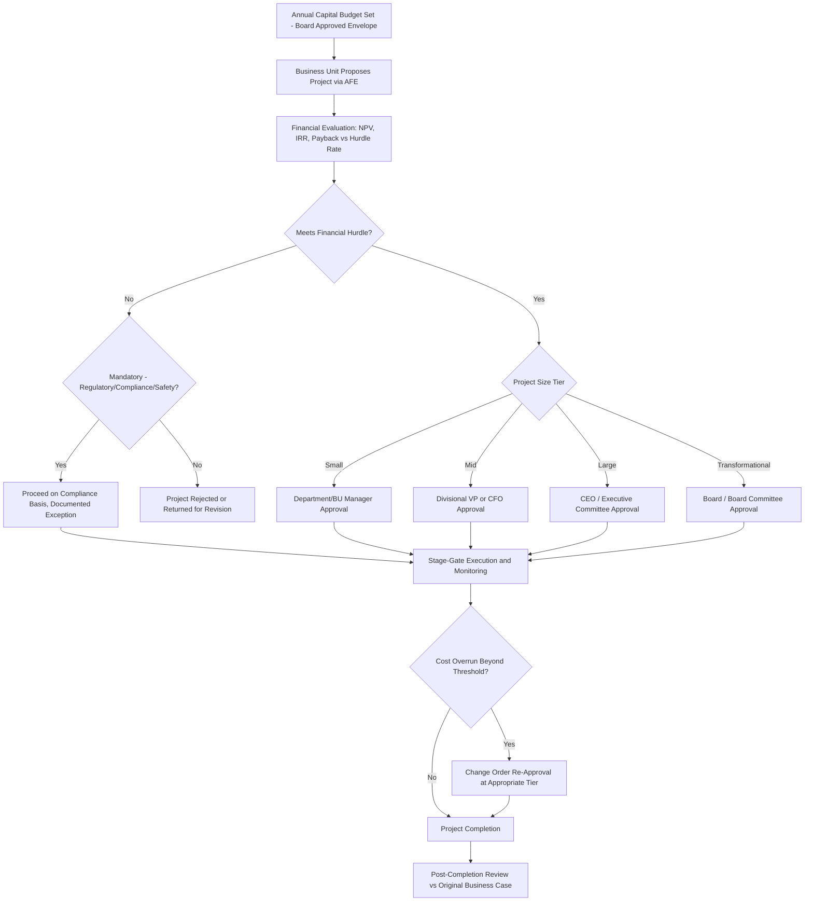

## Capital Expenditure Approval Processes and Authorization Limits

### Overview

Capital expenditure approval processes are the internal governance mechanisms — policies, authorization hierarchies, and review procedures — that companies use to evaluate, sanction, and control capital spending decisions before funds are committed. These processes exist to ensure capital is allocated to value-accretive projects, to maintain financial discipline consistent with the company's overall capital allocation strategy and credit profile, and to provide the internal controls and audit trail that boards, auditors, and (for public companies) regulators expect around a company's largest and most consequential cash outflows. For equity analysts, understanding a company's capex governance framework provides insight into capital allocation discipline, a qualitative factor that complements the purely quantitative capex forecasting and normalization techniques covered elsewhere in this chapter.

### Core Elements of a Capex Approval Framework

**1. Authorization for Expenditure (AFE) Process**

Most companies with meaningful capital programs use a formal Authorization for Expenditure (AFE) document (terminology varies by company and industry — "capital appropriation request," "capital expenditure request," or similar) as the standard mechanism for proposing and approving individual capital projects. A typical AFE includes:

- Project description, strategic rationale, and alignment with corporate strategy
- Detailed cost estimate, often broken into contingency, base scope, and escalation components
- Expected financial returns (NPV, IRR, payback period) and the discount rate/hurdle rate applied
- Risk assessment (execution, market, regulatory, technology risk)
- Alternatives considered, including a "do nothing" or deferral option
- Funding source and impact on the company's overall capital budget and financing plan

**2. Tiered Authorization Limits**

Companies structure approval authority in a tiered hierarchy, with higher-value or higher-risk projects requiring approval from progressively more senior levels of management or the board:

| Approval Level | Typical Authorization Range | Rationale |
| --- | --- | --- |
| Department/Business Unit Manager | Smaller, routine/recurring capex | Operational efficiency for day-to-day maintenance spend |
| Divisional/Regional VP | Mid-size projects | Balances speed with appropriate oversight |
| CFO / Executive Committee | Larger projects | Cross-functional financial and strategic review |
| CEO | Major strategic projects | Alignment with overall corporate strategy |
| Board of Directors (often via a Board Finance or Capital Committee) | Largest, transformational, or highest-risk projects | Fiduciary oversight of the company's most consequential capital commitments |

[Inference] The specific dollar thresholds at each tier vary enormously by company size, industry capital intensity, and risk appetite; a large-cap industrial company's board-level threshold could be many multiples of a mid-cap company's entire approval hierarchy, so authorization limits should always be assessed relative to the specific company's scale rather than treated as a universal benchmark.

**3. Annual Capital Budget and Multi-Year Capital Planning**

Most companies establish an overall capital budget as part of the annual planning cycle, typically approved by the board, which sets the aggregate envelope within which individual project-level AFEs are subsequently approved throughout the year. This top-down budget is usually informed by:

- Strategic planning outputs (multi-year strategic plan, often 3-5 years)
- Available cash flow generation and desired capital structure/leverage targets (directly connecting to credit ratings and debt capacity constraints)
- A bottom-up aggregation of proposed projects from business units, screened and prioritized against the top-down envelope

### Investment Evaluation Criteria in the Approval Process

Formal capex approval processes typically require projects to meet or exceed specified financial hurdles before proceeding:

**Hurdle rate / required return:**

$$IRR_{project} \geq WACC + Risk\ Premium$$

Companies frequently apply a risk-adjusted hurdle rate above the company's blended WACC for higher-risk project categories (e.g., new market entry, unproven technology) relative to lower-risk categories (e.g., maintenance capex, capacity expansion in an established, proven business line), reflecting the different risk profiles even within a single company's capital program.

**Payback period:**

$$Payback\ Period = \frac{Initial\ Investment}{Annual\ Cash\ Flow}$$

Often used as a simpler, supplementary screening criterion alongside NPV/IRR, particularly for smaller or more operationally-focused capex decisions where a full discounted cash flow analysis may be disproportionate to the project's scale.

**Strategic fit and non-financial criteria:**

Beyond pure financial return, approval processes often incorporate qualitative or strategic criteria — regulatory compliance requirements (capex that must be undertaken regardless of standalone financial return, e.g., safety or environmental compliance capex), competitive necessity, or alignment with disclosed ESG/sustainability commitments — which can justify approval of projects that would not independently clear a standard financial hurdle rate.

### Capex Categorization Within Approval Frameworks

Many companies formally categorize capex requests within their approval systems, which affects both the required approval level and the evaluation criteria applied:

- **Sustaining/maintenance capex**: often subject to a streamlined approval process (sometimes pre-approved within an annual maintenance capital budget) given its non-discretionary, recurring nature.
- **Growth/expansion capex**: typically subject to the most rigorous financial evaluation, given its discretionary nature and direct link to the company's growth strategy and expected incremental returns.
- **Regulatory/compliance capex**: evaluated primarily for cost-effectiveness in meeting the compliance requirement rather than for standalone financial return, since the spending is often mandatory.
- **Strategic/transformational capex**: large, often multi-year projects (new plants, major technology transitions, market entry) requiring the highest level of approval and the most extensive due diligence, often including external advisory input and board-level strategic review.

### Post-Approval Controls: Monitoring and Variance Management

Approval is typically not a one-time event for larger projects; ongoing governance includes:

- **Stage-gate reviews**: for large or multi-year projects, approval may be structured in stages (e.g., feasibility study approval, followed by front-end engineering design approval, followed by full construction sanction), allowing the company to commit capital incrementally as project definition and cost certainty improve, reducing the risk of large capital commitments based on early-stage, less-certain estimates.
- **Cost overrun/change order authorization**: significant cost increases beyond the originally approved AFE (typically defined as a percentage threshold, e.g., 10-15% over budget) usually require re-approval, sometimes at a higher authorization tier than the original approval, ensuring management and board visibility into projects experiencing cost escalation.
- **Post-completion/post-investment reviews**: some companies formally review completed capital projects against their original approved business case (actual returns vs. projected returns) to improve the quality of future capital allocation decisions and to hold project sponsors accountable for the accuracy of their original projections — a practice viewed favorably by investors focused on capital allocation discipline, though disclosure of these reviews to external stakeholders varies widely and is not universal practice.

### Board Governance and Disclosure Considerations

- **Audit committee and board oversight**: boards typically receive periodic reporting on capital expenditure versus budget, major project status updates, and any material capex-related risk factors, as part of standard board governance practice for capital-intensive businesses.
- **Delegation of authority (DOA) policies**: formal, board-approved delegation of authority documents specify exactly which capital decisions can be made by management without board approval and which require board sign-off, forming the legal and governance basis for the tiered authorization framework described above.
- **Related-party and conflict-of-interest considerations**: capex decisions involving related parties (e.g., a capital project awarded to a contractor with board or executive connections) typically trigger additional governance scrutiny and disclosure requirements under applicable corporate governance and securities regulations.

### Why This Matters for Equity Analysts

- **Capital allocation discipline signal**: a company with a rigorous, well-documented approval process — including credible hurdle rates, stage-gating for large projects, and post-investment review practices — provides greater confidence that disclosed capex guidance reflects disciplined, return-focused capital allocation rather than unconstrained spending.
- **Cost overrun risk assessment**: understanding a company's stage-gate and change-order approval practices helps analysts assess the reliability of early-stage cost guidance for large announced projects (e.g., a project only through an initial feasibility-stage approval carries materially more cost and scope uncertainty than one that has cleared full construction sanction).
- **Governance red flags**: a history of capex projects proceeding significantly over original approved budgets without adequate change-order governance, or capex decisions that appear disconnected from a disciplined hurdle-rate framework, can be a qualitative red flag warranting closer scrutiny of management's broader capital allocation credibility — directly relevant to the capex guidance credibility assessment covered in analyzing management capex guidance and capital markets days.

### Capex Approval Process Governance Framework (Mermaid)

### Tiered Authorization Hierarchy (svg_diagram)

<svg xmlns="http://www.w3.org/2000/svg" viewBox="0 0 700 380">
\<style\>
.box{stroke:#333;stroke-width:1.5;}
.txt{font-family:Arial,Helvetica,sans-serif;font-size:13px;fill:#fff;font-weight:bold;}
.lbl{font-family:Arial,Helvetica,sans-serif;font-size:11px;fill:#333;}
\</style\>
<text x="350" y="24" text-anchor="middle" font-family="Arial" font-size="15" font-weight="bold" fill="#111">Capex Authorization Pyramid (svg_diagram)</text>
<polygon points="350,50 420,110 280,110" fill="#1a5276" class="box" />
<text x="350" y="95" text-anchor="middle" class="txt" font-size="11">Board</text>
<polygon points="280,110 420,110 460,170 240,170" fill="#2874a6" class="box" />
<text x="350" y="145" text-anchor="middle" class="txt" font-size="11">CEO / Exec Committee</text>
<polygon points="240,170 460,170 500,230 200,230" fill="#5499c7" class="box" />
<text x="350" y="205" text-anchor="middle" class="txt" font-size="11">CFO / Divisional VP</text>
<polygon points="200,230 500,230 540,290 160,290" fill="#aed6f1" class="box" />
<text x="350" y="265" text-anchor="middle" fill="#111" font-family="Arial" font-size="11" font-weight="bold">Department / BU Manager</text>

<text x="450" y="90" class="lbl">Transformational,</text>

<text x="450" y="103" class="lbl">highest $ threshold</text>

<text x="550" y="260" class="lbl">Routine, recurring,</text>

<text x="550" y="273" class="lbl">smallest $ threshold</text>

<line x1="150" y1="310" x2="550" y2="310" stroke="#333" stroke-dasharray="4,4" />
<text x="350" y="330" text-anchor="middle" fill="#111" font-family="Arial" font-size="12">Increasing Authorization Value / Strategic Significance ↑</text>
</svg>

**Related Topics:**

- Analyzing management capex guidance and capital markets days
- Credit ratings and debt capacity constraints on capex
- Capex assumptions in discounted cash flow models
- Capital allocation frameworks and priority ranking
- Board governance and delegation of authority policies
- Post-investment review and capital allocation accountability practices
- NPV, IRR, and payback period methodology in capital budgeting
- Stage-gate project management for large capital projects