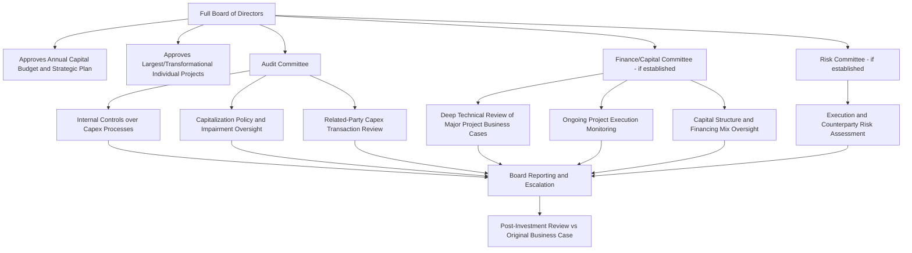

## Board and Audit Committee Oversight of Capital Plans

### Overview

Board and audit committee oversight of capital plans refers to the governance structures through which a company's board of directors — often working through specialized committees — reviews, challenges, approves, and monitors capital expenditure strategy on behalf of shareholders. This oversight function sits above the internal management approval hierarchy and serves as the fiduciary check that capital allocation decisions, particularly the largest and most consequential ones, are aligned with shareholder value creation, appropriately risk-assessed, and consistent with the company's disclosed strategy and financial capacity. For equity analysts, the quality and rigor of board oversight is a qualitative governance factor that informs confidence in management's capital allocation discipline and the credibility of long-term capex guidance.

### Board-Level Structures Involved in Capital Plan Oversight

**1. Full Board of Directors**

The full board typically retains ultimate authority over the company's overall strategic direction and the largest capital commitments, including:

- Approval of the annual capital budget as part of the broader annual operating and financial plan.
- Approval of the multi-year strategic plan, which typically embeds a multi-year capital investment outlook.
- Direct approval of the largest, most transformational individual capital projects (major acquisitions with significant capex components, greenfield facility construction, large-scale technology transitions) that exceed the authorization limits delegated to management.

**2. Audit Committee**

While the audit committee's core mandate centers on financial reporting integrity, internal controls, and external auditor oversight, its remit frequently extends into capital expenditure oversight in several specific ways:

- **Internal controls over capital expenditure processes**: reviewing the design and operating effectiveness of internal controls governing capex approval, authorization, and spend tracking, particularly relevant given that capex represents one of the largest and most judgment-intensive categories of company spending (asset capitalization vs. expense classification decisions, useful life and depreciation method judgments, and impairment assessment triggers all fall within the audit committee's financial reporting oversight purview).
- **Capitalization policy oversight**: reviewing management's capitalization policies (what qualifies as capex vs. operating expense, threshold amounts for capitalization) to ensure consistent application and appropriate accounting judgment, since capitalization policy choices directly affect reported earnings, EBITDA, and balance sheet presentation.
- **Impairment and asset valuation oversight**: reviewing management's processes for assessing whether capitalized assets (including capital projects in progress) have become impaired, particularly relevant for large, long-duration capital projects where cost overruns, delays, or changed market conditions can trigger impairment considerations.
- **Related-party transaction review**: scrutinizing any capital expenditure decisions involving related parties (contractors, suppliers, or joint venture partners with board or executive connections) as part of the committee's broader related-party oversight mandate.

**3. Finance Committee / Capital Committee (where established)**

Some boards, particularly at capital-intensive companies, establish a dedicated finance or capital committee (distinct from the audit committee) with a specific mandate to provide deeper, more frequent oversight of capital allocation, capital structure, and major capital project execution than the full board's typically less frequent meeting cadence allows. Such committees often:

- Conduct deeper technical review of major project business cases, including independent assessment of cost estimates, schedule, and return projections.
- Monitor major project execution status between full board meetings, providing an escalation path for emerging cost overrun or schedule risk.
- Review the company's overall capital structure strategy and its interaction with the capital plan, including financing mix decisions (debt, equity, project finance) covered elsewhere in this chapter.

**4. Risk Committee (where established)**

At companies with a dedicated risk committee (common in financial institutions and increasingly in other capital-intensive sectors), capital project risk — execution risk, counterparty risk in project finance structures, and concentration risk from large single-project commitments — may fall within this committee's oversight remit, working alongside the audit and finance committees.

### Key Oversight Activities and Board Information Flow

**1. Strategic Plan and Capital Budget Review**

Boards typically review and approve the company's multi-year strategic plan (often annually), which includes the capital investment thesis underlying the company's growth strategy. This review typically involves management presenting:

- The strategic rationale for major capital investment categories
- Expected returns and how they compare to the company's cost of capital and historical project performance
- Sensitivity analysis under different scenarios (demand, commodity price, execution risk)
- The capital plan's implications for the company's capital structure, credit rating, and dividend/buyback capacity

**2. Major Project Sanctioning**

For individual projects exceeding board-level authorization thresholds, the board typically receives a detailed business case, often including:

- Independent or third-party validation of cost estimates and technical feasibility for very large or technically complex projects
- Comparison against alternative capital allocation uses (competing internal projects, M&A alternatives, or capital return to shareholders)
- Risk register and mitigation plans
- Recommendation from the executive team and, often, from a finance or capital committee's preliminary review

**3. Ongoing Project Monitoring and Escalation**

Boards typically receive periodic (often quarterly) updates on major capital project status, including:

- Actual spend versus budget and schedule versus plan
- Material variances requiring explanation and, if significant, requiring board re-approval of an increased budget
- Emerging risks (regulatory, supply chain, labor, technology) that could affect project cost or timeline

**4. Post-Investment Review**

Some boards institute formal post-completion reviews of major capital projects against their original approved business case, examining actual returns achieved versus projected returns, to hold management accountable and to improve the quality of future capital allocation decisions and board challenge — a practice viewed favorably in governance assessments, though the rigor and external disclosure of such reviews varies considerably across companies. [Inference] The extent to which individual companies actually conduct rigorous post-investment reviews, versus merely stating that they do so, is difficult for external analysts to verify directly and is typically inferred from indirect evidence such as disclosed changes in capital allocation practice following identified project underperformance.

### Board Composition and Capital Allocation Expertise

The effectiveness of board oversight of complex capital plans is influenced by director expertise:

- **Financial expertise**: audit committee members are typically required (under stock exchange listing standards and corporate governance codes) to have financial literacy, with at least one member often designated as a financial expert, relevant to the committee's capitalization policy and financial reporting oversight role.
- **Industry/technical expertise**: for highly technical or capital-intensive industries (energy, mining, utilities, industrials), boards often seek directors with specific sector or engineering/project execution expertise to provide more informed challenge on major project business cases than a purely financially-oriented board might provide.
- **Independent director majority**: governance codes and listing standards in most major markets require a majority-independent board (and often fully independent audit committees), intended to ensure capital allocation oversight is not unduly influenced by management's own incentives or biases.

### Disclosure of Board Capex Oversight to Investors

Public companies typically disclose elements of their board capex governance framework through:

- **Proxy statements/annual reports**: describing board committee structures, mandates, and (in varying degrees of detail) the board's role in capital allocation and major project approval.
- **Corporate governance guidelines**: publicly disclosed documents outlining delegation of authority frameworks and board/committee oversight responsibilities.
- **Capital Markets Day presentations**: sometimes explicitly referencing board-level review and endorsement of multi-year capital plans, lending additional credibility to management's guidance (connecting directly to the guidance credibility assessment covered in analyzing management capex guidance).
- **Sustainability/ESG reports**: for capex tied to decarbonization, safety, or other ESG-linked capital programs, board oversight of these specific capital allocations is increasingly disclosed as part of broader ESG governance reporting.

### Why This Matters for Equity Analysts

- **Governance quality as a qualitative risk factor**: robust, well-resourced board oversight of capital plans — evidenced by relevant director expertise, active committee engagement, and disclosed post-investment review practices — provides incremental confidence in the discipline underlying a company's capex program, complementing the purely quantitative capex forecasting and normalization analysis.
- **Red flag identification**: a pattern of major capital projects experiencing significant cost overruns or strategic reversals without apparent board-level escalation, challenge, or accountability can signal weaker governance oversight, warranting a more skeptical view of future capex guidance and management's capital allocation credibility.
- **M&A and major capex approval signal**: board approval (and associated public disclosure) of a major capital project or capital plan provides a signal of formal governance endorsement, distinct from and generally more credible than management commentary alone, particularly for the largest, most consequential capital commitments a company can make.

### Board Capex Oversight Governance Structure (Mermaid)

### Board Oversight Information Flow (svg_diagram)

<svg xmlns="http://www.w3.org/2000/svg" viewBox="0 0 700 360">
\<style\>
.box{stroke:#333;stroke-width:1.5;}
.txt{font-family:Arial,Helvetica,sans-serif;font-size:12px;fill:#111;}
.hdrtxt{font-family:Arial,Helvetica,sans-serif;font-size:13px;fill:#fff;font-weight:bold;}
.arrow{stroke:#333;stroke-width:1.5;marker-end:url(#arr3);fill:none;}
\</style\>
<text x="350" y="22" text-anchor="middle" font-family="Arial" font-size="15" font-weight="bold" fill="#111">Capital Plan Oversight Information Flow (svg_diagram)</text>
<rect x="30" y="50" width="160" height="50" fill="#1a5276" class="box" />
<text x="110" y="80" text-anchor="middle" class="hdrtxt">Management</text>
<rect x="270" y="50" width="160" height="50" fill="#2874a6" class="box" />
<text x="350" y="72" text-anchor="middle" class="hdrtxt">Audit Committee</text>
<text x="350" y="88" text-anchor="middle" class="hdrtxt" font-size="10">Controls, Capitalization</text>
<rect x="510" y="50" width="160" height="50" fill="#2874a6" class="box" />
<text x="590" y="72" text-anchor="middle" class="hdrtxt">Finance Committee</text>
<text x="590" y="88" text-anchor="middle" class="hdrtxt" font-size="10">Project Execution Review</text>
<rect x="270" y="150" width="400" height="50" fill="#1a5276" class="box" />
<text x="470" y="180" text-anchor="middle" class="hdrtxt">Full Board of Directors</text>
<rect x="270" y="250" width="400" height="60" fill="#f4f6f8" class="box" />
<text x="470" y="275" text-anchor="middle" fill="#111" font-family="Arial" font-size="12" font-weight="bold">Approval Outcomes:</text>
<text x="470" y="295" text-anchor="middle" fill="#111" font-family="Arial" font-size="11">Capital Budget, Major Project Sanction, Strategic Plan</text>
<path d="M190,75 L270,75" class="arrow" />
<path d="M190,85 L510,85" class="arrow" />
<path d="M350,100 L400,150" class="arrow" />
<path d="M590,100 L540,150" class="arrow" />
<path d="M470,200 L470,250" class="arrow" />
</svg>

**Related Topics:**

- Capital expenditure approval processes and authorization limits
- Analyzing management capex guidance and capital markets days
- Credit ratings and debt capacity constraints on capex
- Corporate governance codes and listing standards for board composition
- Impairment testing and asset valuation under GAAP/IFRS
- Related-party transaction disclosure and oversight
- ESG governance and decarbonization capital allocation oversight
- Post-investment review practices and capital allocation accountability