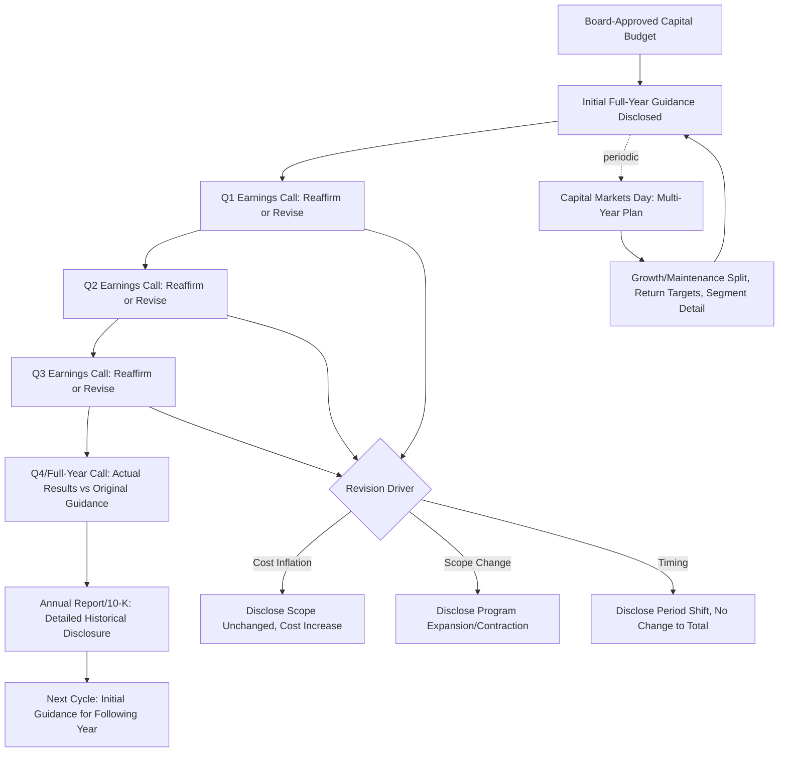

## Capex Guidance in Investor Communications

### Overview

Capex guidance in investor communications refers to the disclosure practices, formats, and strategic considerations companies use when communicating current-year and multi-year capital expenditure expectations to the investment community. Unlike the analytical process of evaluating guidance credibility once issued (covered in analyzing management capex guidance and capital markets days), this topic addresses the communication side: how companies structure, present, and manage capex disclosure across various investor-facing channels, and the strategic and regulatory considerations that shape those choices.

### Primary Channels for Capex Guidance Disclosure

**1. Quarterly Earnings Releases and Calls**

The most frequent and regular venue for capex guidance, typically including:

- Current-quarter or year-to-date actual capex versus prior guidance
- Updated full-year guidance (reaffirmed, raised, or lowered) with explanation for any change
- Forward commentary on capex pacing for subsequent quarters, particularly relevant for companies with seasonal or lumpy capex patterns

**2. Annual Reports and 10-K/Annual Filings**

Regulatory filings provide more detailed, and legally more carefully vetted, capex disclosure, including:

- Historical capex by category (often by segment or by growth/maintenance classification, where disclosed)
- MD&A (Management's Discussion and Analysis) forward-looking capex commentary, subject to safe harbor provisions for forward-looking statements under applicable securities law
- Contracted purchase obligations and capital commitments (typically in the commitments and contingencies footnote), providing a legally binding floor on near-term capex independent of qualitative guidance

**3. Capital Markets Days / Investor Days**

As covered in analyzing management capex guidance, these dedicated events typically provide the most comprehensive multi-year capex disclosure, often the only venue where companies break out growth versus maintenance capex, provide segment-level multi-year plans, or disclose explicit return targets tied to the capital program.

**4. Sell-Side and Investor Conference Presentations**

Companies often use industry conferences and sell-side-hosted investor events to reiterate or refine capex guidance in a more informal setting than a formal earnings call, sometimes providing incremental color (e.g., responding to specific analyst questions about project timing or cost trends) not available in the formal disclosure documents.

**5. Supplemental Financial Disclosures and Investor Presentation Decks**

Many companies, particularly in capital-intensive sectors (REITs, utilities, midstream energy), publish supplemental packages or standing investor presentation decks containing more granular capex detail (by project, by quarter, by segment) than appears in standard earnings materials, updated periodically and often available on the company's investor relations website.

### Common Guidance Formats

| Format | Description | Typical Use Case |
| --- | --- | --- |
| Absolute dollar range | e.g., "$450-475 million" | Most common; balances precision with acknowledged uncertainty |
| Percent of revenue | e.g., "8-9% of revenue" | Common where capex scales predictably with revenue |
| Point estimate | e.g., "approximately $500 million" | Used when management has high confidence, often for near-term/committed spend |
| Multi-year cumulative envelope | e.g., "$2.5-3.0 billion over 2027-2030" | Common at Capital Markets Days for strategic, multi-year programs |
| Growth vs. maintenance split | e.g., "$300mm maintenance, $150-200mm growth" | Provided by companies emphasizing capital discipline and return-focused growth investment |
| Net capex (after credits/proceeds) | e.g., net of tax credits, asset sale proceeds, or partner co-funding | Increasingly common where government incentives (e.g., decarbonization tax credits) materially affect net cash outlay |

### Strategic Considerations in Guidance Communication

**1. Balancing Precision with Flexibility**

Companies must balance the market's desire for precise, decision-useful guidance against the risk of appearing to miss guidance if actual capex diverges from a narrow stated range — particularly relevant for capex, which (unlike revenue or EPS) is substantially within management's own discretionary control, making a "miss" on capex guidance potentially reflect either poor forecasting or a deliberate, value-accretive decision to adjust spending pace in response to changing conditions. Companies often use wider ranges for capex guidance than for revenue/EPS guidance specifically to accommodate this discretionary, execution-dependent nature.

**2. Framing Capex as Investment vs. Cost**

Management commentary accompanying capex guidance frequently emphasizes the expected returns and strategic rationale for the spending, framing capex increases as value-accretive investment rather than simply a cash outflow, particularly important when guiding to capex levels above near-term free cash flow generation (i.e., when the capex program will be free-cash-flow dilutive in the near term, requiring the market to underwrite a longer-term return thesis).

**3. Consistency and Credibility Management**

Given the guidance-accuracy track record analysis that analysts routinely perform (as detailed in analyzing management capex guidance and capital markets days), companies with a history of guidance misses face credibility costs that can affect how the market prices subsequent guidance (a "trust discount"), creating an incentive for management to calibrate guidance conservatively enough to be achievable, while still providing decision-useful forward information.

**4. Handling Guidance Revisions**

When capex guidance is revised mid-year, companies typically provide explanatory context distinguishing:

- **Cost inflation-driven revisions**: scope unchanged, but nominal cost has increased (construction, equipment, or labor cost inflation), which analysts should interpret differently than a scope expansion.
- **Scope-driven revisions**: the underlying capital program itself has expanded or contracted (new projects added, existing projects delayed/cancelled), which has different implications for future revenue/earnings expectations than a pure cost revision.
- **Timing-driven revisions**: capex shifted between fiscal periods without a change to the total program (e.g., a project delayed from Q4 into the following fiscal year), which affects near-term free cash flow timing without changing the longer-term capital or return thesis.

Clear disclosure distinguishing these drivers is considered a communication best practice, since conflating them can lead analysts to draw incorrect conclusions about the underlying capital program's health or cost discipline.

### Regulatory and Legal Considerations

**Forward-looking statement safe harbor**

In the United States, capex guidance disclosed in earnings releases, calls, and filings is generally accompanied by safe harbor language under the Private Securities Litigation Reform Act, identifying the guidance as a forward-looking statement subject to risks and uncertainties, and typically pointing investors to the risk factors section of the company's SEC filings for a fuller discussion of factors that could cause actual results to differ from guidance. [Inference] The specific legal protections and disclosure practices required vary by jurisdiction; companies listed outside the U.S. operate under their own local securities regulations and disclosure regimes, which may differ materially from U.S. practice.

**Regulation FD (Fair Disclosure) considerations**

In the U.S., material non-public capex guidance updates generally cannot be selectively disclosed to certain analysts or investors without broader public dissemination, which is why capex guidance changes are typically communicated through broadly accessible channels (press releases, 8-K filings, public earnings calls) rather than through private analyst conversations alone.

**Segment and geographic disclosure requirements**

Applicable accounting standards (ASC 280 for segment reporting under U.S. GAAP, IFRS 8 internationally) can require disclosure of capital expenditure by reportable segment in annual financial statements, providing a baseline level of granularity beyond what management might voluntarily choose to disclose in guidance commentary alone.

### Capex Guidance Presentation Across the Investor Communication Calendar

| Timing | Typical Disclosure |
| --- | --- |
| Q4/full-year earnings call | Initial full-year guidance for the upcoming fiscal year |
| Subsequent quarterly calls | Guidance reaffirmation or revision based on year-to-date actuals |
| Annual report/10-K filing | Detailed historical capex disclosure, segment breakout, forward MD&A commentary, contracted obligations |
| Capital Markets Day (periodic, e.g., every 1-3 years) | Comprehensive multi-year capital plan, often with growth/maintenance split and return targets |
| Ad hoc (project sanctioning, M&A) | Incremental capex disclosure tied to specific announced projects or transactions |

### Analyst and Investor Use of Capex Guidance Communications

Sell-side analysts typically incorporate management's most recently disclosed capex guidance directly into near-term financial models (as detailed in incorporating guidance into the DCF), while independently assessing:

- Whether the guidance format (range width, growth/maintenance disclosure) has changed over time in ways that signal changing management confidence or strategic emphasis
- Whether the cadence and detail of capex disclosure is consistent with, better than, or worse than sector peers, which can itself be a governance and transparency signal
- Whether guidance revisions are being clearly explained (cost inflation vs. scope vs. timing) or are presented with limited explanatory context, the latter warranting closer independent investigation

### Capex Guidance Communication Flow (Mermaid)

### Capex Guidance Range Evolution Over a Fiscal Year (svg_diagram)

<svg xmlns="http://www.w3.org/2000/svg" viewBox="0 0 700 340">
\<style\>
.axis{stroke:#333;stroke-width:1.5;}
.gridline{stroke:#e0e0e0;stroke-width:1;}
.rangebar{stroke:#333;stroke-width:1;}
.txt{font-family:Arial,Helvetica,sans-serif;font-size:12px;fill:#111;}
\</style\>
<text x="350" y="24" text-anchor="middle" font-family="Arial" font-size="15" font-weight="bold" fill="#111">Capex Guidance Range Narrowing Through the Year (svg_diagram)</text>
<line x1="70" y1="280" x2="650" y2="280" class="axis" />
<line x1="70" y1="280" x2="70" y2="50" class="axis" />
<text x="20" y="60" class="txt">$ mm</text>
<line x1="70" y1="230" x2="650" y2="230" class="gridline" />
<line x1="70" y1="180" x2="650" y2="180" class="gridline" />
<line x1="70" y1="130" x2="650" y2="130" class="gridline" />
<line x1="70" y1="80" x2="650" y2="80" class="gridline" />
<rect x="120" y="130" width="40" height="100" fill="#5499c7" class="rangebar" />
<text x="140" y="300" text-anchor="middle" class="txt">Initial (Q4 call)</text>
<text x="140" y="120" text-anchor="middle" class="txt">450-550</text>
<rect x="240" y="150" width="40" height="60" fill="#2874a6" class="rangebar" />
<text x="260" y="300" text-anchor="middle" class="txt">After Q1</text>
<text x="260" y="140" text-anchor="middle" class="txt">470-530</text>
<rect x="360" y="160" width="40" height="40" fill="#1a5276" class="rangebar" />
<text x="380" y="300" text-anchor="middle" class="txt">After Q2</text>
<text x="380" y="150" text-anchor="middle" class="txt">480-520</text>
<rect x="480" y="170" width="40" height="20" fill="#0d2c40" class="rangebar" />
<text x="500" y="300" text-anchor="middle" class="txt">After Q3</text>
<text x="500" y="160" text-anchor="middle" class="txt">495-515</text>
<rect x="600" y="178" width="20" height="4" fill="#000" class="rangebar" />
<text x="610" y="300" text-anchor="middle" class="txt">Actual</text>
<text x="610" y="168" text-anchor="middle" class="txt">505</text>
</svg>

**Related Topics:**

- Analyzing management capex guidance and capital markets days
- Board and audit committee oversight of capital plans
- Capital expenditure approval processes and authorization limits
- Regulation FD and forward-looking statement disclosure practices
- Segment reporting requirements under ASC 280 / IFRS 8
- Sell-side model construction and consensus estimate formation
- Capex intensity as a quality-of-earnings signal
- ESG and decarbonization capex disclosure practices