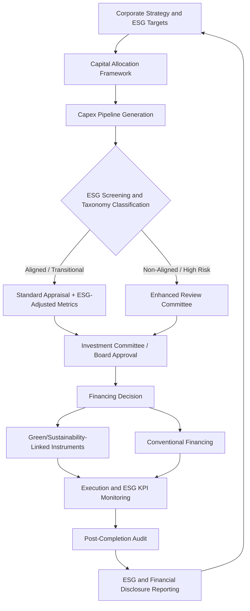

## ESG and Sustainability Considerations in Capital Planning

### Overview

Environmental, Social, and Governance (ESG) considerations have moved from a peripheral compliance concern to a core input in capital allocation decisions. Capital planning that incorporates ESG factors systematically evaluates how capital expenditure (capex) decisions affect, and are affected by, environmental impact, social license to operate, and governance quality. This integration changes how projects are screened, appraised, financed, monitored, and reported.

The shift is driven by three converging forces: regulatory mandates (climate disclosure rules, carbon pricing, taxonomy regulations), capital market pressure (ESG-linked financing, investor screening, credit rating adjustments), and physical/transition risk exposure (asset stranding, resource scarcity, changing demand patterns). A capex governance framework that ignores these forces risks misallocating capital toward assets that carry elevated regulatory, financial, or reputational risk over their useful life.

### Why ESG Belongs in Capital Planning

**Key Points**

- Capex decisions typically lock in operational characteristics (emissions intensity, resource consumption, labor practices, safety profiles) for 10–40 year asset lives, making early-stage ESG screening far more effective than retrofitting.
- Capital providers increasingly price ESG risk directly into the cost of capital, through green bond spreads, sustainability-linked loan margins, and ESG-adjusted discount rates used internally by some firms.
- Asset stranding risk — where an asset's economic life is cut short by regulation, carbon pricing, or demand shifts — is fundamentally a capital planning problem, not just an environmental one.
- Governance quality (board oversight of capex, internal controls, conflict-of-interest management) directly affects capital allocation efficiency and is itself an ESG pillar.

### The Three ESG Pillars in a Capex Context

#### Environmental

- **Carbon intensity of the asset**: expected scope 1 (direct) and scope 2 (purchased energy) emissions per unit of output over the asset's operating life.
- **Physical climate risk exposure**: flood, drought, extreme heat, and sea-level exposure at the asset's location, which affects insurability and operational continuity.
- **Resource efficiency**: water usage, raw material intensity, and waste generation designed into the asset from inception.
- **Transition risk**: exposure to future carbon pricing, emissions caps, or technology substitution (e.g., internal combustion vs. electric drivetrains, fossil vs. renewable generation assets).

#### Social

- **Community and labor impact**: workforce safety design, local employment effects, and community displacement or benefit.
- **Supply chain considerations**: labor standards and human rights exposure in the capex supply chain (equipment vendors, EPC contractors, raw material sourcing).
- **Health and safety capex**: investments specifically directed at reducing injury/fatality risk, often tracked as a distinct capex sub-category.
- **Social license to operate**: stakeholder and community consent, particularly for extractive, infrastructure, and land-intensive projects.

#### Governance

- **Capital allocation oversight**: board- and committee-level review of large capex commitments, including ESG risk sign-off thresholds.
- **Internal controls**: segregation of duties in capex approval, anti-corruption controls in procurement and contractor selection.
- **Disclosure integrity**: accuracy and completeness of ESG-related capex reporting to regulators, lenders, and investors.
- **Executive accountability**: linkage between capex outcomes (including ESG metrics) and executive compensation structures.

### Integrating ESG into the Capital Planning Lifecycle

#### 1. Strategic Planning and Capital Budgeting

ESG factors should enter at the portfolio-shaping stage, not just at individual project appraisal. This typically means:

- Setting **capital allocation targets** by ESG category (e.g., percentage of capex directed to decarbonization, maintenance vs. growth vs. transition capex).
- Screening the capex pipeline against a **taxonomy** (such as the EU Taxonomy for Sustainable Activities or an internal equivalent) to classify projects as sustainable, transitional, or non-aligned.
- Applying **exclusion criteria** or enhanced review thresholds for projects with material ESG risk (e.g., new fossil fuel infrastructure, high water-stress locations).

#### 2. Project Appraisal and Business Case Development

Standard capex appraisal tools (NPV, IRR, payback period) can be extended with ESG-adjusted inputs:

- **Shadow carbon pricing**: applying an internal carbon price to projected emissions to test project viability under future regulatory scenarios, even where no external carbon price yet applies.
- **ESG-adjusted discount rates**: some organizations apply a risk premium or discount to the cost of capital based on a project's ESG risk profile, though this practice is not universally standardized and the magnitude of adjustment varies by firm. [Inference: the specific adjustment methodology is firm-specific and not governed by a single accepted standard.]
- **Scenario and sensitivity analysis**: stress-testing project economics against multiple climate and policy pathways (e.g., aligned with NGFS or IEA scenarios) rather than a single base case.
- **Multi-criteria decision analysis (MCDA)**: scoring projects on financial return alongside weighted ESG criteria, useful when ESG impacts are not easily monetized.

$$\text{ESG-Adjusted NPV} = \sum_{t=0}^{n} \frac{CF_t - C_t^{carbon}}{(1 + r_{esg})^t}$$

Where $C_t^{carbon}$ represents the shadow carbon cost in period $t$ and $r_{esg}$ is the ESG-adjusted discount rate.

#### 3. Financing and Capital Structure

ESG considerations increasingly shape how capex is funded:

- **Green bonds and green loans**: proceeds ring-fenced for eligible green projects, typically requiring adherence to frameworks such as the ICMA Green Bond Principles.
- **Sustainability-linked loans/bonds (SLLs/SLBs)**: financing where the interest margin is tied to achievement of predefined ESG KPIs (e.g., emissions reduction targets), applicable to general corporate capex rather than ring-fenced projects.
- **Transition finance**: instruments designed to fund the shift of carbon-intensive assets toward lower-carbon operation, distinct from pure-play green finance.
- **Blended finance and concessional capital**: development finance institutions or green funds co-financing capex in emerging markets to de-risk ESG-aligned projects.

#### 4. Execution and Monitoring

- Tracking actual vs. planned ESG performance metrics alongside traditional cost/schedule variance during project execution.
- Contractor and supplier ESG compliance monitoring (safety incidents, labor practice audits) as part of capex program governance.
- Post-completion ESG audits to validate that delivered assets meet the environmental and social specifications used to justify the original capital allocation.

#### 5. Reporting and Disclosure

- Mapping capex to recognized disclosure frameworks: **TCFD** (now largely absorbed into **ISSB IFRS S2**), **GRI**, **SASB**, and jurisdiction-specific rules such as the **EU Corporate Sustainability Reporting Directive (CSRD)**.
- Disclosing **"green capex"** or **"capex aligned to taxonomy"** as a distinct metric, often expressed as a percentage of total capex.
- Reporting **capital expenditure plans consistent with a Paris Agreement-aligned trajectory**, where applicable, including forward-looking capex allocation to transition activities.

### Capital Planning Governance Structure for ESG Integration

### Key Metrics Used in ESG-Aware Capital Planning

| Metric | Description | Typical Use |
| --- | --- | --- |
| Green capex ratio | Green/taxonomy-aligned capex ÷ total capex | Portfolio-level disclosure and target tracking |
| Carbon intensity of new assets | Projected tCO2e per unit output | Project screening and comparison |
| Weighted average cost of capital (ESG-adjusted) | WACC incorporating ESG risk premium | Discounting project cash flows |
| Stranded asset exposure | Capex value at risk under adverse transition scenarios | Portfolio risk management |
| Capex-to-target alignment | Percentage of planned capex consistent with stated decarbonization pathway | Investor and regulator reporting |
| Safety capex ratio | Capex directed to health/safety ÷ total capex | Social pillar tracking |

### Worked Example

A utility company is evaluating two options to meet forecast electricity demand growth: (1) a new 500 MW natural gas combined-cycle plant, capex $450 million, 30-year asset life; or (2) a 400 MW solar-plus-storage facility, capex $520 million, 25-year asset life with likely repowering.

**Conventional appraisal** (unadjusted NPV/IRR) may favor the gas plant due to lower upfront capex and higher, more predictable capacity factor.

**ESG-adjusted appraisal** would incorporate:

- A shadow carbon price of, say, $75/tCO2e rising over time, applied to the gas plant's projected emissions stream, reducing its risk-adjusted NPV.
- Scenario testing against a 1.5°C-aligned policy pathway, under which the gas plant faces elevated probability of early retirement (stranded asset risk) before the end of its 30-year design life.
- Access to green financing (e.g., a green bond) for the solar-plus-storage option, potentially lowering its effective cost of capital relative to conventional financing for the gas plant.
- Taxonomy classification: the solar-plus-storage asset likely qualifies as "aligned," supporting the company's sustainable capex disclosure targets, while the gas plant may be classified as non-aligned or transitional depending on jurisdiction.

The ESG-adjusted comparison can reverse the conventional ranking, particularly when carbon pricing trajectories and financing cost differentials are material. [Inference: the direction and magnitude of any reversal depends on the specific carbon price path, discount rate assumptions, and financing terms used, which vary by jurisdiction and point in time.]

### Common Frameworks and Standards Referenced in Practice

- **TCFD / ISSB IFRS S2**: climate-related financial disclosure, including capital deployment metrics.
- **EU Taxonomy for Sustainable Activities**: classification system determining which capex qualifies as environmentally sustainable.
- **ICMA Green Bond Principles / Green Loan Principles**: use-of-proceeds standards for green capex financing.
- **Sustainability-Linked Loan Principles (SLLP)**: KPI-based financing structures applicable to general capex programs.
- **GRI Standards**: broader sustainability reporting, including some capex-adjacent disclosures (e.g., environmental expenditure).
- **SASB Standards**: industry-specific ESG metrics, several of which directly reference capital expenditure (e.g., capex for emissions reduction in extractive industries).

### Common Pitfalls

- **Greenwashing risk**: labeling capex "green" or "sustainable" without rigorous taxonomy alignment, which exposes the organization to regulatory and reputational risk as disclosure scrutiny increases.
- **Inconsistent internal carbon pricing**: applying a shadow carbon price in appraisal but not consistently across all competing projects, distorting capital allocation decisions.
- **Siloed ESG function**: treating ESG capex screening as a separate compliance exercise disconnected from the core capital budgeting process, leading to late-stage rework or project rejection.
- **Short asset-life bias**: appraisal models that fail to capture long-horizon transition risk may systematically undervalue low-carbon alternatives with higher upfront capex but lower lifecycle risk.
- **Data quality gaps**: emissions and social impact data for new capex projects is often estimated rather than measured, introducing uncertainty into ESG-adjusted metrics. [Unverified: data quality varies significantly by industry, geography, and project maturity, and no universal benchmark exists for acceptable estimation error.]

### Related Topics

- Internal carbon pricing methodologies in capital budgeting
- EU Taxonomy and other sustainable finance classification systems
- Green bonds, sustainability-linked loans, and transition finance instruments
- TCFD/ISSB climate disclosure and capex-linked reporting
- Stranded asset risk assessment and scenario analysis
- Capex governance structures and investment committee design
- ESG-adjusted weighted average cost of capital (WACC) methodologies
- Supply chain and contractor ESG due diligence in capital projects