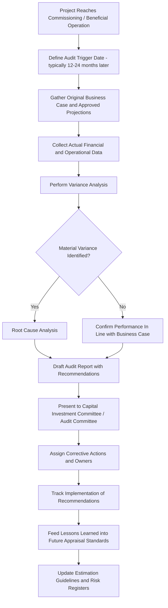

## Post-Completion Audits and Capital Project Reviews

### Overview

A post-completion audit (PCA), also called a post-implementation review (PIR) or post-investment appraisal, is a structured evaluation conducted after a capital project has been completed and operated for a defined period, comparing actual outcomes against the projections used to justify the original investment decision. Its purpose is threefold: to verify that the capital was deployed effectively, to hold decision-makers accountable for forecast accuracy, and to feed lessons learned back into the organization's capital planning and appraisal process.

Unlike project closeout (which focuses on administrative completion — final cost settlement, contract closure, asset handover), a post-completion audit is fundamentally a governance and learning exercise. It asks not "did we finish the project?" but "was this a good investment, and what should we do differently next time?"

### Objectives of Post-Completion Audits

**Key Points**

- **Accountability**: verify that capital was spent as approved and that sponsors/managers are held responsible for the accuracy of their original business case.
- **Performance measurement**: compare actual financial and operational results against the approved business case (NPV, IRR, payback, output/capacity targets).
- **Forecasting discipline**: identify systematic biases in estimation (optimism bias, strategic misrepresentation) to improve future appraisal quality.
- **Organizational learning**: capture lessons on project execution, risk management, and vendor/contractor performance for reuse in future projects.
- **Control validation**: confirm that capital authorization, procurement, and expenditure controls operated as designed throughout the project.
- **Asset verification**: confirm the asset exists, is correctly capitalized, and is recorded accurately in the fixed asset register for depreciation and tax purposes.

### Timing and Scope

Post-completion audits are typically conducted at a defined interval after commissioning or beneficial operation date, commonly **12 to 24 months** post-completion, allowing enough operating history to assess actual performance against forecast. [Inference: the specific timing window varies by organization, industry, and project size; there is no single universal standard interval.]

Scope typically includes:

- **Full audits**: applied to large, strategic, or high-risk capital projects above a materiality threshold (e.g., projects exceeding a defined capex value or board-approval tier).
- **Light-touch reviews**: applied to smaller or routine capex (maintenance capex, replacement capex) where a full audit would not be cost-effective relative to the project size.
- **Sample-based audits**: internal audit function selects a representative sample of completed projects across business units for periodic review, rather than auditing every project.

### The Post-Completion Audit Process

#### 1. Data Gathering

- Retrieve the original approved business case, including all financial projections (NPV, IRR, payback period), assumptions, and risk register.
- Collect actual financial data: final capitalized cost, cost variance against budget, financing costs incurred.
- Collect actual operational data: output/capacity achieved, utilization rates, quality metrics, revenue or cost savings realized.
- Gather qualitative input from project sponsors, operations managers, and end users on execution issues and unanticipated impacts.

#### 2. Variance Analysis

Comparing actual to planned performance across multiple dimensions:

| Dimension | Planned (Business Case) | Actual | Variance | Root Cause |
| --- | --- | --- | --- | --- |
| Total capex | Approved budget | Final capitalized cost | $ and % variance | Scope change, estimation error, market pricing |
| Schedule | Planned commissioning date | Actual commissioning date | Days/months variance | Permitting delay, contractor performance |
| Revenue/output | Forecast annual output | Actual annual output | $ and % variance | Demand forecast error, ramp-up delay |
| Operating cost | Forecast opex | Actual opex | $ and % variance | Maintenance underestimation, energy pricing |
| NPV/IRR | Approved hurdle-rate-based projection | Recalculated using actuals | $ and % variance | Compounding effect of above variances |

A simplified variance recalculation for financial performance:

$$\text{NPV}_{actual} = \sum_{t=0}^{n} \frac{CF_t^{actual}}{(1 + r)^t} - C_0^{actual}$$

$$\text{Variance} = \frac{\text{NPV}_{actual} - \text{NPV}_{planned}}{|\text{NPV}_{planned}|} \times 100\%$$

#### 3. Root Cause Analysis

For material variances, the audit investigates underlying causes rather than simply reporting the numbers. Common categories:

- **Estimation error**: flawed initial cost or benefit assumptions, often traceable to optimism bias or insufficient due diligence at the appraisal stage.
- **Scope change**: approved changes during execution that were not reflected in an updated business case.
- **External factors**: market price movements, regulatory changes, macroeconomic shifts outside management control.
- **Execution issues**: contractor performance, project management quality, resourcing constraints.
- **Strategic misrepresentation**: in some cases, deliberately optimistic projections used to secure approval — a governance red flag requiring escalation.

#### 4. Reporting and Recommendations

The audit report typically includes:

- Executive summary of overall project performance against the business case.
- Detailed variance analysis with root causes.
- Assessment of whether capital controls and approval processes were followed.
- Specific, actionable recommendations for future projects (e.g., "increase contingency allowance for projects involving this contractor category by X%").
- Distribution to the capital investment committee, audit committee, and relevant business unit leadership.

#### 5. Follow-Up and Closure

- Tracking implementation of audit recommendations, often through a formal action-tracking register.
- Escalation procedures where recommendations are not implemented within an agreed timeframe.
- Periodic aggregation of findings across multiple audits to identify systemic patterns (e.g., a chronic tendency to underestimate commissioning timelines across all projects of a certain type).

### Post-Completion Audit Process Flow

### Distinguishing Post-Completion Audit from Related Activities

| Activity | Timing | Primary Focus |
| --- | --- | --- |
| Project closeout | Immediately after completion | Administrative and contractual closure, final cost settlement |
| Commissioning review | At handover to operations | Technical verification that asset meets design specifications |
| Post-completion audit | 12–24 months after completion | Financial and strategic performance vs. original business case |
| Asset performance review | Ongoing, periodic | Continuous operational performance monitoring across asset lifecycle |
| Internal audit of capex controls | Periodic, risk-based | Compliance with authorization and procurement policy, independent of individual project outcomes |

### Worked Example

A manufacturing company approved a $12 million capex project to install a new automated production line, with a business case projecting:

- Payback period: 3.5 years
- IRR: 18%
- Annual output increase: 25%
- Annual opex savings: $1.8 million

Eighteen months after commissioning, the post-completion audit finds:

- Final capitalized cost: $13.6 million (13.3% over budget), driven by unforeseen electrical infrastructure upgrades not scoped in the original estimate.
- Actual output increase: 19%, below the 25% target, due to a longer-than-expected operator training and ramp-up period.
- Actual annual opex savings: $1.5 million, below forecast due to higher-than-expected maintenance costs on the new equipment.
- Recalculated IRR: approximately 12%, versus the original 18% projection.

**Root cause analysis** attributes the majority of the variance to two factors: (1) insufficient site survey work at the appraisal stage, which missed the electrical infrastructure requirement, and (2) an overly optimistic ramp-up curve that did not adequately account for operator training time on unfamiliar automated equipment.

**Recommendations** arising from the audit: require a mandatory detailed site survey for all automation capex above $5 million prior to business case approval, and apply a standardized ramp-up discount curve (e.g., 70% of rated output in month one, scaling to 100% by month six) rather than assuming immediate full-capacity output in future business cases of this type.

### Common Pitfalls

- **Audit fatigue and low priority**: post-completion audits are frequently deprioritized once a project is complete and attention shifts to new initiatives, leading to inconsistent or skipped reviews. [Inference: the degree of deprioritization varies significantly by organizational culture and audit committee enforcement.]
- **No consequence for poor forecasting**: if audit findings are not linked back to individual accountability or future business case scrutiny, the exercise becomes a reporting formality rather than a genuine control.
- **Survivorship bias in project selection**: sample-based audit programs that disproportionately review "safe" or successful projects understate the organization's true forecasting error rate.
- **Blame-oriented framing**: audits conducted punitively can discourage honest reporting of issues by project sponsors, undermining the learning objective.
- **Weak linkage to future appraisal standards**: findings that are not systematically incorporated into updated estimation guidelines, contingency policies, or risk registers fail to prevent recurrence of the same errors.
- **Data availability gaps**: operational systems not designed to track project-specific actuals (e.g., output attributable to a specific new asset vs. existing production) can make accurate variance analysis difficult.

### Related Topics

- Business case development and capital appraisal methodologies (NPV, IRR, payback)
- Optimism bias and reference class forecasting in capital budgeting
- Capital project governance and investment committee structures
- Fixed asset capitalization and depreciation policy
- Internal audit frameworks for capex controls
- Lessons-learned processes and organizational knowledge management
- Contingency and risk allowance methodologies in project estimation
- Benefits realization management for capital investments