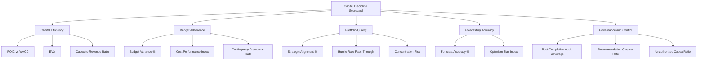

## Key Performance Indicators for Capital Discipline

### Overview

Capital discipline refers to an organization's ability to allocate, deploy, and manage capital expenditure in a manner that consistently generates returns above the cost of capital while avoiding overspending, scope creep, and misallocation toward low-return projects. Key performance indicators (KPIs) for capital discipline provide the quantitative backbone for governance, allowing boards, investment committees, and management to monitor whether capital allocation behavior is aligned with strategic and financial objectives.

These KPIs span multiple categories: capital efficiency (how well capital generates returns), budget adherence (how accurately spending tracks approvals), portfolio quality (how well the project mix aligns with strategy and risk appetite), and forecasting accuracy (how reliable the organization's estimation process is over time). No single metric captures capital discipline in isolation; a balanced scorecard approach is standard practice.

### Categories of Capital Discipline KPIs

#### 1. Capital Efficiency and Return Metrics

**Return on Invested Capital (ROIC)**

$$\text{ROIC} = \frac{\text{NOPAT}}{\text{Invested Capital}}$$

Where NOPAT is Net Operating Profit After Tax and Invested Capital represents total capital deployed (debt + equity, or net working capital + net fixed assets). ROIC is typically benchmarked against the weighted average cost of capital (WACC); a sustained ROIC below WACC signals value-destructive capital allocation.

**Economic Value Added (EVA)**

$$\text{EVA} = \text{NOPAT} - (\text{Invested Capital} \times \text{WACC})$$

Positive EVA indicates capital is generating returns in excess of its cost; this metric is often tracked at the business-unit or project-cohort level to identify where capital discipline is weakest.

**Capex-to-depreciation ratio**

$$\text{Capex-to-Depreciation} = \frac{\text{Total Capex}}{\text{Depreciation Expense}}$$

A ratio consistently and substantially above 1.0 suggests the asset base is expanding faster than it is being consumed, which may be appropriate for a growth phase but warrants scrutiny if not aligned with strategic intent. A ratio persistently below 1.0 may indicate underinvestment and aging infrastructure.

**Capex-to-revenue ratio (capital intensity)**

$$\text{Capex Intensity} = \frac{\text{Total Capex}}{\text{Total Revenue}} \times 100\%$$

Used to benchmark capital intensity against industry peers and to track whether capital intensity is trending in line with strategic plans (e.g., declining capital intensity in a maturing business, or rising intensity during a capacity expansion phase).

#### 2. Budget Adherence and Cost Control Metrics

**Capex budget variance**

$$\text{Budget Variance \%} = \frac{\text{Actual Capex} - \text{Approved Budget}}{\text{Approved Budget}} \times 100\%$$

Tracked both at the individual project level and aggregated across the capital program. Organizations with strong capital discipline typically target variance within a narrow band (commonly cited informally as within 5–10%), though acceptable thresholds vary by industry, project complexity, and risk tolerance. [Inference: specific variance thresholds are organization- and industry-specific rather than governed by a universal standard.]

**Cost Performance Index (CPI)** — adapted from project management (Earned Value Management)

$$\text{CPI} = \frac{\text{Earned Value (EV)}}{\text{Actual Cost (AC)}}$$

A CPI below 1.0 indicates the project is over budget relative to work completed; a CPI above 1.0 indicates under-budget performance.

**Schedule Performance Index (SPI)**

$$\text{SPI} = \frac{\text{Earned Value (EV)}}{\text{Planned Value (PV)}}$$

Used alongside CPI to assess whether schedule slippage is contributing to cost overrun (delayed projects frequently incur cost escalation through extended overhead, financing costs, and price inflation exposure).

**Contingency drawdown rate**

Tracks the percentage of approved project contingency that has been consumed relative to percentage of project completion, providing an early warning indicator for potential budget overrun before final cost is known.

#### 3. Portfolio Quality and Strategic Alignment Metrics

- **Percentage of capex aligned to strategic priorities**: proportion of total capex directed toward pre-defined strategic categories (growth, maintenance, regulatory/compliance, ESG/transition), used to verify the portfolio mix matches the approved capital allocation strategy.
- **Hurdle rate pass-through ratio**: percentage of approved projects that met or exceeded the organization's minimum required IRR or NPV threshold at approval, tracking whether the appraisal/approval gate is functioning as an effective filter.
- **Stage-gate conversion rate**: percentage of projects that progress from concept/feasibility stage through to full approval, indicating whether early screening is effectively filtering out weak business cases before significant sunk cost is incurred.
- **Project concentration risk**: percentage of total capex committed to the largest single project or top-N projects, used to monitor concentration risk within the capital portfolio.

#### 4. Forecasting Accuracy Metrics

**Forecast accuracy (business case vs. actual)**

$$\text{Forecast Accuracy \%} = \left(1 - \frac{|\text{Actual} - \text{Forecast}|}{\text{Forecast}}\right) \times 100\%$$

Tracked over time and typically segmented by project type, size, and sponsoring business unit to identify systematic biases (e.g., a specific division consistently underestimating costs by a predictable margin).

**Optimism bias index**

A derived metric comparing the historical average variance between approved business case projections and actual post-completion audit results, used to calibrate forward-looking contingency and uplift factors in future appraisals.

#### 5. Governance and Control Metrics

- **Approval cycle time**: average time from capex request submission to final approval, used to monitor process efficiency without compromising diligence.
- **Post-completion audit coverage**: percentage of eligible capital projects (typically those above a materiality threshold) that received a formal post-completion audit within the defined review window.
- **Recommendation closure rate**: percentage of post-completion audit recommendations implemented within the agreed timeframe, indicating whether lessons learned translate into actual process improvement.
- **Unauthorized/off-cycle capex ratio**: percentage of total capex spent outside the formal approval process or added via change orders without re-approval, a red flag for control weakness.

### Capital Discipline KPI Dashboard Structure

### Sample KPI Reporting Table

| KPI | Formula/Basis | Target Range | Reporting Frequency |
| --- | --- | --- | --- |
| ROIC vs. WACC spread | ROIC − WACC | Positive, trending stable/improving | Quarterly |
| Capex budget variance | (Actual − Budget) / Budget | Within ±5–10% (organization-specific) | Quarterly / project milestone |
| Hurdle rate pass-through | Approved projects meeting hurdle ÷ total approved | High (organization-defined threshold) | Annually / at each approval cycle |
| Forecast accuracy | 1 − | Actual − Forecast | / Forecast |
| Post-completion audit coverage | Audited projects ÷ eligible projects | 100% for projects above materiality threshold | Annually |
| Unauthorized capex ratio | Off-cycle capex ÷ total capex | Near zero | Quarterly |

### Worked Example

A mid-cap industrial company reports the following capital discipline scorecard for the fiscal year:

- ROIC: 11.2%; WACC: 8.5% → positive spread of 2.7 percentage points, indicating capital is generating returns above its cost.
- Total capex: $85 million against an approved budget of $80 million → budget variance of +6.25%, within the organization's informal 10% tolerance band but flagged for review given three consecutive quarters of overrun.
- Hurdle rate pass-through: 92% of approved projects met the 12% minimum IRR threshold at approval — indicating the appraisal gate is functioning reasonably well.
- Forecast accuracy (from post-completion audits of prior-year projects): 87%, down from 91% the prior year, suggesting estimation quality may be deteriorating and warranting a review of the underlying estimation methodology.
- Post-completion audit coverage: 78% of eligible projects, below the internal target of 100%, indicating a governance gap in audit execution.

This combination suggests the organization maintains reasonably strong capital efficiency and appraisal discipline, but has two areas requiring management attention: a persistent (though currently tolerable) budget overrun trend, and incomplete post-completion audit coverage that limits visibility into the true accuracy of the capital appraisal process.

### Common Pitfalls

- **Over-reliance on a single metric**: focusing exclusively on ROIC or budget variance without considering portfolio quality or forecasting accuracy can mask underlying capital discipline weaknesses.
- **Lagging indicator bias**: many capital discipline KPIs (ROIC, EVA, forecast accuracy from post-completion audits) are inherently backward-looking, limiting their usefulness for real-time course correction; leading indicators (contingency drawdown rate, CPI/SPI during execution) are needed to complement them.
- **Gaming through project structuring**: sponsors may split large projects into smaller ones to avoid enhanced review thresholds, or set deliberately conservative business case targets to ensure the project "passes" post-completion review — both undermine the integrity of the KPI system.
- **Inconsistent WACC application**: using a single corporate-wide WACC for ROIC/EVA calculations across business units or geographies with materially different risk profiles can distort capital discipline signals. [Inference: best practice generally favors risk-adjusted or business-unit-specific discount rates, though many organizations still use a single blended rate in practice due to complexity.]
- **Threshold rigidity**: static hurdle rates and variance tolerances that are not periodically recalibrated against changing cost of capital and market conditions can become poor discriminators of good vs. poor capital decisions over time.

### Next Steps

- Weighted average cost of capital (WACC) estimation and application in capex appraisal
- Earned Value Management (EVM) techniques for capital project cost control
- Stage-gate capital approval processes and governance thresholds
- Post-completion audits and capital project reviews (see related chapter item)
- Capital allocation frameworks and portfolio optimization
- Board and audit committee reporting structures for capex oversight
- Benchmarking capital intensity and efficiency against industry peers