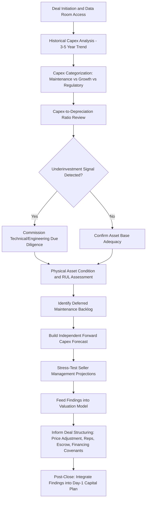

## Capex Diligence in Mergers and Acquisitions

### Overview

Capex diligence is the workstream within M&A due diligence focused specifically on evaluating a target company's historical capital expenditure patterns, the condition and remaining useful life of its physical assets, and the forward-looking capital investment requirements needed to sustain or grow the acquired business. Unlike routine financial due diligence, which largely validates historical results, capex diligence is inherently forward-looking: it directly shapes the buyer's valuation model, post-close capital plan, and financing structure.

Poor capex diligence is one of the more common sources of post-acquisition value erosion, because deferred maintenance, underinvestment, or hidden capital needs are often not fully visible in standard financial statements — capex is a balance sheet and cash flow item, and historical underspending can flatter reported earnings while quietly building a backlog of required investment that the buyer inherits.

### Objectives of Capex Diligence

**Key Points**

- Validate that historical capex levels were sufficient to maintain the asset base ("maintenance capex" adequacy), distinguishing this from growth capex.
- Identify deferred maintenance or capital backlog not visible in the income statement or standard balance sheet disclosures.
- Assess the remaining useful life and condition of core physical assets (plant, equipment, IT infrastructure, real estate).
- Build an independent forward capex forecast to stress-test the seller's projections and inform the buyer's valuation and post-close capital plan.
- Identify capex-related risks that affect deal structure: purchase price adjustments, escrow provisions, representations and warranties, or earn-out mechanics.

### Scope of Capex Diligence

#### 1. Historical Capex Analysis

- **Trend analysis**: capex as a percentage of revenue over a 3–5 year lookback period, benchmarked against industry norms and the target's own historical growth trajectory.
- **Capex categorization**: disaggregating reported capex into maintenance capex (sustaining existing operations), growth capex (capacity expansion, new products/markets), and regulatory/compliance capex, since the mix has very different implications for post-close cash flow.
- **Capex-to-depreciation ratio trend**: a ratio persistently below 1.0x over multiple years is a classic red flag for underinvestment, suggesting the asset base may be depreciating faster than it is being replenished.
- **Capitalization policy review**: assessing whether the target's capitalization threshold and policy are consistent with the buyer's accounting standards, since some targets aggressively capitalize costs that should be expensed (inflating EBITDA) or vice versa.

$$\text{Capex-to-Depreciation Ratio} = \frac{\text{Annual Capex}}{\text{Annual Depreciation Expense}}$$

A ratio well below 1.0x sustained over several years typically signals asset base erosion; a ratio well above 1.0x may indicate an active growth or replacement cycle, which needs to be understood in context.

#### 2. Physical Asset Condition Assessment

- **Technical/engineering due diligence**: third-party engineering firms often physically inspect major assets (production lines, buildings, infrastructure) to assess condition independent of book value, which can significantly diverge from physical reality.
- **Remaining useful life (RUL) analysis**: comparing accounting-based useful life assumptions (used for depreciation) against engineering-based physical condition assessments; a material gap between the two is a key diligence finding.
- **Environmental and regulatory compliance capex**: identifying capex required to bring assets into compliance with environmental, health, and safety regulations, which may not have been budgeted by the seller and represents a hidden liability.
- **IT and technology infrastructure**: assessing technical debt, system obsolescence, and cybersecurity infrastructure gaps, which increasingly represent a material capex category often under-scrutinized relative to physical/industrial assets.

#### 3. Forward Capex Forecast Development

- Building an independent capex model for the 3–5 years post-close, incorporating:
  - Required maintenance capex to sustain current operating capacity.
  - Identified deferred maintenance backlog requiring near-term catch-up investment.
  - Growth capex required to achieve the buyer's post-close business plan and synergy targets.
  - Any capex embedded in identified synergies (e.g., capex required to integrate systems, consolidate facilities, or achieve cost synergies).
- Stress-testing the seller's management projections, which frequently understate forward capex requirements to present a more favorable EBITDA and free cash flow picture.

#### 4. Deal Structuring Implications

- **Purchase price adjustment mechanisms**: net working capital and capex-related adjustments at closing to true-up for any identified capital backlog.
- **Representations and warranties**: specific reps regarding the condition of material assets, compliance with capex-related regulatory requirements, and absence of undisclosed capital commitments.
- **Escrow and indemnification provisions**: holdback amounts specifically tied to identified deferred maintenance or environmental capex exposure.
- **Earn-out structuring**: in some structures, forward capex commitments may be linked to earn-out payment triggers, particularly where growth capex is required to achieve post-close performance targets.
- **Financing structure implications**: lenders in leveraged transactions typically require independent capex diligence findings to size maintenance capex reserves and covenant structures (e.g., capex covenants limiting or requiring minimum annual capital spend).

### Capex Diligence Process Flow

### Key Red Flags in Capex Diligence

| Red Flag | Implication |
| --- | --- |
| Capex-to-depreciation ratio below 1.0x for 3+ consecutive years | Likely asset base underinvestment; buyer should expect catch-up capex post-close |
| Rising maintenance capex as % of revenue with flat/declining capacity | Aging asset base requiring increasing spend just to sustain current output |
| Large gap between accounting useful life and engineering-assessed condition | Book values overstate remaining asset life; depreciation schedule understates true asset consumption |
| Growth capex classified as maintenance capex (or vice versa) | Distorts understanding of true sustaining capital requirement; may inflate normalized EBITDA |
| Recent capex spike immediately pre-sale | Possible "dress-up" spending to mask prior underinvestment, or genuine catch-up requiring further scrutiny of remaining backlog |
| Undisclosed environmental or regulatory compliance requirements | Hidden forward capex liability not reflected in seller's projections |
| Heavy reliance on operating leases for equipment | May mask true capital intensity of the business model if not properly normalized in valuation |

### Worked Example

A private equity firm is evaluating the acquisition of a mid-market manufacturing company with reported EBITDA of $40 million and historical average capex of $8 million per year (20% of EBITDA) over the past three years.

**Diligence findings**:

- Capex-to-depreciation ratio averaged 0.65x over the same period, indicating the company has been spending significantly less than the rate at which its assets are being depreciated.
- Third-party engineering assessment identifies two production lines nearing the end of practical operating life, with replacement cost estimated at $15 million, not reflected in any near-term capital plan provided by the seller.
- Management's forward projections assume maintenance capex continuing at the historical $8 million/year level, with no allowance for the identified production line replacement.

**Diligence impact**: the buyer's independent forecast revises expected Year 1–2 post-close capex upward by approximately $15 million (the production line replacement) plus an increase in ongoing maintenance capex to approximately $11–12 million/year (closer to a 1.0x capex-to-depreciation ratio) to prevent further asset base erosion. This finding is incorporated into the valuation model as a reduction to projected free cash flow, directly lowering the buyer's maximum supportable purchase price, and is also used to negotiate a purchase price adjustment and specific representations regarding asset condition in the purchase agreement.

### Common Pitfalls

- **Relying solely on seller-provided capex projections**: management projections in a sale process are prepared by a party with an incentive to present favorable forward cash flow; independent verification is essential.
- **Treating capex diligence as a standalone workstream**: capex findings must be integrated with financial, commercial, and legal diligence, since capital requirements interact directly with EBITDA quality, working capital, and contractual obligations (e.g., customer contracts requiring specific capacity commitments).
- **Underestimating IT and technology capex**: physical asset diligence (plant, equipment) is often more rigorously performed than technology infrastructure diligence, despite technology capex representing an increasingly material and risk-laden category in many industries.
- **Ignoring capitalization policy differences**: failing to normalize the target's capitalization threshold to the buyer's accounting policy can distort both historical EBITDA comparability and the baseline for forward capex modeling.
- **Insufficient time allocated for engineering diligence**: physical asset condition assessments often require site visits and specialist expertise that take longer than standard financial diligence timelines allow, creating pressure to rely on desktop review alone. [Inference: the adequacy of diligence timelines is deal- and buyer-specific, and no universal standard governs minimum diligence duration.]

### Related Topics

- Maintenance capex vs. growth capex classification methodologies
- Quality of earnings (QoE) analysis and its interaction with capex normalization
- Technical and engineering due diligence processes
- Purchase price adjustment mechanisms and working capital true-ups
- Leveraged buyout financing structures and capex covenants
- Post-merger integration capital planning
- Representations, warranties, and indemnification structures in M&A agreements
- Synergy capex estimation in acquisition business cases