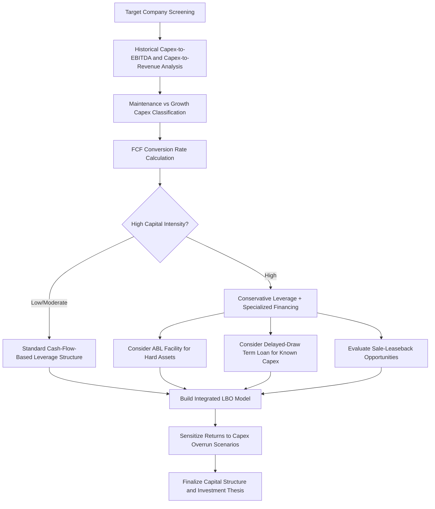

## Capital Intensity Considerations in Leveraged Buyouts

### Overview

Capital intensity — the level of capex required relative to revenue or earnings to sustain and grow a business — is a central determinant of whether a company is a suitable leveraged buyout (LBO) candidate and how the transaction should be structured. LBOs rely on predictable free cash flow to service acquisition debt; high capital intensity directly competes with debt service capacity by consuming cash that would otherwise be available for interest and principal repayment. Understanding and correctly modeling capital intensity is therefore not a peripheral diligence item in private equity transactions but a first-order driver of deal feasibility, capital structure, and expected returns.

### Why Capital Intensity Matters in LBO Structuring

**Key Points**

- Free cash flow available for debt service is a direct function of EBITDA minus capex minus working capital investment minus taxes and interest; high capex structurally compresses this figure regardless of EBITDA strength.
- Traditional LBO targets are historically characterized by low capital intensity, stable/predictable cash flows, and limited need for reinvestment — capital-light business models (services, certain software, branded consumer products) have historically been preferred for this reason. [Inference: preference patterns vary by fund strategy, sector focus, and market cycle; some PE strategies specifically target capital-intensive turnaround or infrastructure-like assets.]
- High capital intensity does not necessarily disqualify a company as an LBO candidate, but it typically requires a more conservative leverage structure, different debt instruments (e.g., asset-based lending), and closer alignment between capex financing and asset life.
- Sponsors must distinguish maintenance capex (unavoidable, competes directly with debt service) from growth capex (discretionary, can in principle be deferred or financed separately) when assessing debt capacity.

### Capital Intensity's Role in the LBO Financial Model

#### Free Cash Flow for Debt Service

$$\text{FCF for Debt Service} = \text{EBITDA} - \text{Maintenance Capex} - \Delta\text{Working Capital} - \text{Cash Taxes} - \text{Cash Interest}$$

In a highly capital-intensive business, maintenance capex can represent a large percentage of EBITDA, materially reducing the cash flow cushion available to service the debt load layered on in the transaction.

#### Leverage Capacity and Capital Intensity

Lenders and sponsors typically size acceptable leverage (expressed as Debt/EBITDA) partly as a function of the free cash flow conversion rate — the proportion of EBITDA that actually converts to distributable/debt-service-available cash after capex and working capital needs.

$$\text{FCF Conversion Rate} = \frac{\text{EBITDA} - \text{Maintenance Capex} - \Delta\text{Working Capital}}{\text{EBITDA}}$$

A business with a low FCF conversion rate (high capital intensity relative to EBITDA) generally supports lower leverage multiples than a business with a high conversion rate, all else equal, because a smaller share of each EBITDA dollar is actually available to pay down debt.

#### Capex Financing Structure

In capital-intensive LBOs, capex is often financed through mechanisms distinct from the core acquisition debt facility:

- **Delayed-draw term loans (DDTLs)**: committed but undrawn facilities specifically earmarked for known, near-term capex requirements, avoiding the need to fund large capex from day-one leverage.
- **Asset-based lending (ABL) facilities**: revolving credit secured against specific hard assets (equipment, inventory, receivables), commonly used in capital-intensive sectors (manufacturing, transportation, energy services) to separate working capital and equipment financing from the core cash-flow-based leverage.
- **Equipment financing/leasing**: off-balance-sheet or asset-secured financing for specific capital equipment, reducing the capex burden on the core credit facility.
- **Sale-and-leaseback transactions**: monetizing owned real estate or equipment post-acquisition to fund capex needs or reduce initial leverage, a common technique in capital-intensive LBOs with significant owned hard assets.

### LBO Capital Intensity Assessment Framework

### Sector Capital Intensity Comparison (Illustrative)

| Sector | Typical Capex-to-Revenue | LBO Suitability Considerations |
| --- | --- | --- |
| Business/professional services | Low (<2%) | Classic low-capital-intensity LBO profile; high leverage capacity |
| Software (SaaS) | Low-Moderate (<5%, though R&D/capitalized software varies) | High leverage capacity if cash flow is recurring/predictable; capitalized software development costs require careful normalization |
| Branded consumer products | Low-Moderate | Generally favorable; capex often tied to manufacturing/distribution scale |
| Healthcare services | Moderate | Facility and equipment capex can be material; varies significantly by sub-sector |
| Manufacturing/industrials | Moderate-High | Often requires ABL structures and lower cash-flow leverage multiples |
| Telecommunications/infrastructure | High | Typically requires specialized project-finance-style structures rather than traditional cash-flow LBO leverage |
| Energy/utilities | High | Often unsuitable for traditional LBO leverage; alternative structures (infrastructure funds, project finance) more common |

[Inference: the figures above are illustrative and directional, intended to convey relative capital intensity patterns across sectors; actual capex-to-revenue ratios vary significantly by specific company, geography, and business model within each sector.]

### Impact on Returns Modeling

Capital intensity affects LBO returns through multiple channels that sponsors must model explicitly:

- **Reduced deleveraging speed**: high maintenance capex slows the rate at which acquisition debt is paid down over the hold period, directly reducing equity value creation from deleveraging (one of the three classic LBO return drivers alongside EBITDA growth and multiple expansion).
- **Distribution constraints**: capital-intensive businesses generate less free cash flow available for dividend recapitalizations or other interim distributions to the sponsor during the hold period.
- **Exit multiple sensitivity**: capital-intensive businesses may command lower exit multiples if capital intensity is perceived by future buyers as a structural drag on cash generation, independent of EBITDA growth achieved during the hold.
- **Capex overrun risk**: because capex forecasts embedded in the original LBO model are often based on limited diligence visibility (see capex diligence in M&A), capital-intensive targets carry elevated risk of the realized capex burden exceeding underwritten assumptions, directly compressing the cash available for debt paydown.

$$\text{Equity Value Creation} \approx \Delta(\text{EBITDA} \times \text{Exit Multiple}) + \text{Debt Paydown} - \text{Entry Equity Check}$$

Where "Debt Paydown" is directly constrained by cumulative free cash flow after capex over the hold period — making capital intensity assumptions one of the most consequential inputs in the return-bridge analysis.

### Worked Example

A private equity fund is evaluating an LBO of a specialty manufacturing business with $100 million EBITDA and historical capex averaging $18 million per year (18% of EBITDA), of which diligence estimates approximately $14 million is true maintenance capex and $4 million is discretionary growth capex.

**FCF conversion analysis**: after maintenance capex, working capital investment (estimated at 2% of EBITDA), and normalized cash taxes, the sponsor estimates FCF conversion of approximately 58% of EBITDA — meaning only about $58 million of the $100 million EBITDA is available annually to service acquisition debt and interest before any consideration of growth capex or distributions.

**Structuring implications**: given this conversion rate, the sponsor's credit committee limits core cash-flow-based leverage to 4.5x EBITDA (versus a potential 6x+ that might be underwritten for a lower-capital-intensity target with comparable EBITDA), and structures a separate $20 million delayed-draw term loan specifically earmarked for a known equipment replacement cycle occurring in years 2–3 of the hold period, keeping that capex outside the base leverage calculation used to size day-one acquisition debt.

**Return sensitivity**: the sponsor's model shows that a 20% overrun in maintenance capex (from $14 million to $16.8 million annually) reduces cumulative debt paydown over a 5-year hold by approximately $14 million, which — absent offsetting EBITDA growth or multiple expansion — reduces projected equity IRR by roughly 150–250 basis points, illustrating the outsized sensitivity of LBO returns to capital intensity assumptions in this type of target.

### Common Pitfalls

- **Underestimating true maintenance capex at entry**: sponsors under time pressure during a competitive auction process may rely on seller-provided capex figures without independent engineering or technical diligence, carrying forward the same risks discussed in capex diligence for M&A generally.
- **Overleveraging capital-intensive targets using standard multiples**: applying leverage multiples benchmarked to capital-light comparables without adjusting for lower FCF conversion can result in an unsustainable capital structure.
- **Failing to separate maintenance and growth capex in the model**: treating all capex as a single line item obscures the true debt service constraint and can lead to inaccurate covenant headroom projections.
- **Ignoring capex timing and lumpiness**: capital-intensive businesses often have "lumpy" capex cycles (e.g., major equipment replacement every 5–7 years) rather than smooth annual spend; models using a flat annual average can misrepresent debt service capacity in specific years.
- **Insufficient covenant flexibility for capex**: credit agreements that do not appropriately carve out or flex for known, necessary capex cycles can create technical covenant breach risk even when the underlying business is performing as underwritten.

### Related Topics

- Capex diligence in mergers and acquisitions
- Free cash flow conversion analysis and debt capacity modeling
- Asset-based lending (ABL) structures in capital-intensive sectors
- Delayed-draw term loans and capex-specific financing instruments
- Sale-and-leaseback transaction structuring
- LBO returns attribution: EBITDA growth, multiple expansion, and deleveraging
- Covenant structuring for capex flexibility in leveraged credit agreements
- Maintenance capex vs. growth capex classification methodologies