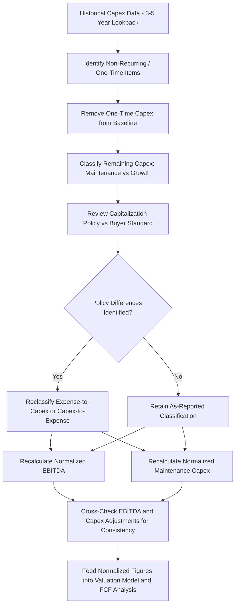

## Capex Normalization in EBITDA Add-Back Adjustments

### Overview

Capex normalization is the process of adjusting a target company's historical capital expenditure figures to reflect a "normal" or representative level of spend, removing the distorting effects of one-time, non-recurring, or discretionary capex from the baseline used in valuation and cash flow analysis. This is distinct from — but closely related to — EBITDA add-back adjustments, where analysts adjust reported EBITDA for non-recurring or non-operational items to arrive at a "normalized" or "adjusted EBITDA" figure used as the basis for valuation multiples.

The two processes intersect because capex normalization directly affects the calculation of free cash flow and, in some adjustment frameworks, certain capitalized costs are added back to EBITDA (or conversely, expensed costs are reclassified as capex) as part of the quality-of-earnings and valuation normalization process. Getting this wrong in either direction — overstating normalized EBITDA while understating normalized capex, or vice versa — can materially distort deal valuation and post-close cash flow expectations.

### Why Capex Normalization Matters

**Key Points**

- Buyers pay for a multiple of normalized EBITDA, but service acquisition debt and fund growth from normalized free cash flow (EBITDA minus capex); inconsistency between the two normalization exercises creates valuation risk.
- Sellers have an incentive to present historical capex as unusually high (implying a lower "true" ongoing requirement) while simultaneously presenting historical EBITDA add-backs generously (implying higher "true" underlying earnings) — buyers must scrutinize both directions independently.
- Capitalization policy differences between the target and buyer (what gets capitalized vs. expensed) can materially distort both reported EBITDA and reported capex, requiring adjustment before either figure is comparable or usable in a valuation model.
- Capex normalization feeds directly into maintenance capex estimates used in LBO debt capacity modeling and DCF-based valuation, making it a high-leverage diligence item.

### Categories of Capex Normalization Adjustments

#### 1. Removing Non-Recurring or One-Time Capex

- **Discretionary/one-off projects**: large capex events unlikely to recur at the same frequency (e.g., a facility relocation, a major ERP system implementation, a one-time capacity expansion tied to a specific contract win).
- **Catch-up capex**: spending that reflects a temporary acceleration to address previously deferred maintenance, which should not be extrapolated forward as the new steady-state run rate (though its existence is itself a diligence signal about prior underinvestment — see related capex diligence topic).
- **M&A-related or integration capex**: capex incurred to integrate a prior acquisition made by the target, not representative of organic ongoing capital needs.

#### 2. Reclassifying Growth vs. Maintenance Capex

- Separating historical capex into maintenance (required to sustain current revenue/capacity) and growth (incremental capacity or new revenue streams) components, since only maintenance capex is typically used as the baseline for normalized free cash flow in a steady-state valuation model.
- Growth capex is often modeled separately, tied explicitly to a forward revenue growth assumption, rather than embedded in the "normalized" baseline figure.

$$\text{Maintenance Capex \%} = \frac{\text{Maintenance Capex}}{\text{Total Historical Capex}} \times 100\%$$

#### 3. Capitalization Policy Adjustments

- **Expense-to-capex reclassification**: costs the target expensed that would be capitalized under the buyer's accounting policy (or under a more conservative/consistent policy), which increases reported historical capex and correspondingly increases historical EBITDA (since the cost is removed from the income statement).
- **Capex-to-expense reclassification**: the reverse adjustment, where costs the target capitalized should properly be expensed, decreasing normalized EBITDA and decreasing normalized capex.
- **Capitalized software and R&D**: a particularly common area of divergence, especially in technology and software targets, where the treatment of internally developed software costs (capitalized development costs vs. expensed R&D) can materially shift both EBITDA and capex figures depending on policy applied.

#### 4. Timing and Lumpiness Normalization

- Using a multi-year average (typically 3–5 years) rather than a single most-recent year to smooth out lumpy capex cycles common in capital-intensive or asset-heavy businesses, avoiding both understatement (if the lookback year was unusually low) and overstatement (if it coincided with a major replacement cycle).
- Adjusting for known upcoming capex cycles not fully reflected in the historical average (e.g., an equipment fleet approaching a known replacement age simultaneously).

### The Normalization Process Flow

### Illustrative Normalization Table

| Item | As Reported | Adjustment | Normalized | Rationale |
| --- | --- | --- | --- | --- |
| Total historical capex (avg. 3yr) | $12.0M | — | $12.0M | Baseline |
| Less: one-time facility relocation | — | −$2.5M | $9.5M | Non-recurring event |
| Less: growth capex (new product line) | — | −$1.8M | $7.7M | Discretionary, modeled separately |
| Plus: reclassified capitalized software (expensed by target) | — | +$1.2M | $8.9M | Buyer policy capitalizes this cost category |
| **Normalized maintenance capex** |  |  | **$8.9M** | Used as FCF baseline |
| Reported EBITDA | $45.0M | — | $45.0M | Baseline |
| Plus: reclassified capitalized software costs removed from expense | — | +$1.2M | $46.2M | Consistent with capex reclassification above |
| **Normalized EBITDA** |  |  | **$46.2M** | Used for valuation multiple |

Note in this example that the $1.2 million capitalization policy reclassification increases **both** normalized EBITDA and normalized capex by the same amount — this consistency check is essential, since an adjustment that increases EBITDA without a corresponding capex adjustment (or vice versa) indicates an error or an intentionally one-sided normalization.

### Worked Example

A buyer is evaluating a business services target reporting EBITDA of $30 million and average historical capex of $4.5 million (15% of EBITDA) over the trailing three years.

**Diligence findings**:

- Year 2 of the lookback period included a one-time $1.5 million capex item for a new headquarters build-out, not expected to recur.
- The target has historically expensed approximately $600,000 per year in internally developed software costs that, under the buyer's standard capitalization policy, would be capitalized and amortized over three years.
- Of the remaining normalized capex, diligence estimates roughly 70% represents true maintenance capex, with the balance tied to a recent, discretionary branch expansion initiative.

**Normalization calculation**:

- Remove one-time HQ build-out: $4.5M average is recalculated excluding the $1.5M one-time item spread across the 3-year average, reducing the average by $0.5M/year → $4.0M.
- Reclassify software costs: add back $0.6M/year to capex (moving from expense to capitalized), increasing normalized capex to $4.6M, and correspondingly increasing normalized EBITDA by the same $0.6M (from $30.0M to $30.6M) since the cost is removed from operating expense.
- Split maintenance vs. growth: apply the 70% maintenance estimate to the $4.6M normalized figure, yielding normalized **maintenance capex of approximately $3.2M**, with the remaining ~$1.4M treated as growth capex modeled separately against forward revenue assumptions.

**Impact**: the buyer's valuation model now uses normalized EBITDA of $30.6 million (a modest increase from reported $30.0 million) alongside a normalized maintenance capex baseline of $3.2 million (materially lower than the unadjusted $4.5 million historical average), producing a more accurate view of steady-state free cash flow than either the raw reported figures or a naive average would have provided.

### Common Pitfalls

- **One-sided normalization**: adjusting EBITDA upward for add-backs without making the corresponding, consistent adjustment to capex (or vice versa), which is one of the most common sources of valuation error in sell-side-prepared materials and requires independent buy-side scrutiny.
- **Treating all "unusual" capex as non-recurring**: some capex that appears unusual in a single year (e.g., major equipment replacement) may actually represent a recurring, cyclical pattern that should be captured in a longer averaging period rather than excluded entirely.
- **Ignoring forward-looking capex cycles**: normalization based purely on historical averages can miss known upcoming capital requirements (e.g., a regulatory deadline, an aging asset base) not reflected in the lookback period.
- **Inconsistent capitalization policy application across the diligence team**: financial and technical/engineering diligence workstreams applying different capitalization assumptions can produce inconsistent normalized figures that are not reconciled before feeding into the valuation model.
- **Overreliance on seller-provided classification**: accepting the target's own maintenance vs. growth capex categorization without independent verification, since sellers may have an incentive to classify capex as "growth" (implying discretionary, non-essential spend) to present a more favorable normalized maintenance capex figure.

### Related Topics

- Capex diligence in mergers and acquisitions
- Quality of earnings (QoE) analysis and EBITDA add-back methodologies
- Maintenance capex vs. growth capex classification
- Capital intensity considerations in leveraged buyouts
- Capitalization policy and its impact on reported financial metrics
- Discounted cash flow (DCF) valuation and terminal value capex assumptions
- Purchase price adjustment mechanisms in M&A transactions