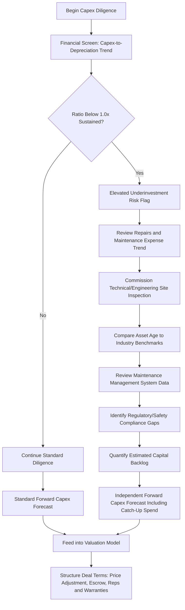

## Deferred Capex and Underinvestment Red Flags

### Overview

Deferred capex — sometimes called capital backlog, deferred maintenance, or underinvestment — occurs when a company postpones necessary capital spending beyond what is required to sustain its asset base in good operating condition. In an M&A or private equity context, identifying deferred capex is one of the highest-value diligence exercises, because underinvestment is a classic technique (intentional or not) for temporarily inflating reported free cash flow and EBITDA margins in the periods leading up to a sale process, at the cost of a hidden liability the buyer inherits post-close.

Unlike overt liabilities that appear on the balance sheet, deferred capex is fundamentally an **absence** — the absence of spending that should have occurred — making it inherently harder to detect through standard financial statement review alone and requiring a combination of trend analysis, physical inspection, and benchmarking to surface reliably.

### Why Deferred Capex Is a Critical Red Flag

**Key Points**

- Underinvestment allows a seller to present artificially strong historical free cash flow and margins in the periods immediately preceding a sale, precisely when buyers are most focused on recent performance trends.
- The buyer inherits the accumulated capital backlog post-close, typically requiring a "catch-up" capex cycle that was not reflected in the price paid or the post-close operating model, directly compressing near-term free cash flow after acquisition.
- Deferred capex often correlates with elevated operational risk: aging equipment increases unplanned downtime, safety incidents, quality defects, and regulatory compliance exposure — risks that may not fully manifest until after the buyer has taken ownership.
- In leveraged transactions, an underestimated capital backlog directly threatens the sponsor's assumed free cash flow available for debt service, potentially triggering covenant stress in the years immediately following close.

### Common Red Flags Signaling Deferred Capex

#### 1. Financial Statement Indicators

- **Capex-to-depreciation ratio persistently below 1.0x**: the single most commonly cited quantitative screen; a ratio sustained below 1.0x over multiple years suggests the asset base is being consumed (via depreciation) faster than it is being replenished (via capex).

$$\text{Capex-to-Depreciation Ratio} = \frac{\text{Annual Capex}}{\text{Annual Depreciation Expense}}$$

- **Declining capex-to-revenue trend without a corresponding strategic rationale**: a falling ratio that isn't explained by genuine operating leverage or a maturing, asset-light business model transition warrants further investigation.
- **Rising maintenance costs (repairs and maintenance expense) alongside flat or declining capex**: increased spend on keeping existing assets running (an operating expense) while capital replacement spend stagnates is a classic substitution pattern — spending on repairs instead of replacement.
- **Improving EBITDA margins concurrent with declining capex-to-revenue ratio**: while not conclusive on its own, this combination in the periods immediately preceding a sale process should prompt closer scrutiny of whether margin improvement is genuine operational efficiency or partly an artifact of reduced reinvestment.
- **Capex spike in the final year before sale**: a sudden increase in capex in the year immediately preceding the sale process can represent genuine catch-up investment (a positive signal if the backlog has been meaningfully addressed) or "window dressing" that only partially addresses a larger accumulated backlog — both interpretations require independent verification rather than face-value acceptance.

#### 2. Operational and Physical Indicators

- **Aging asset base relative to industry norms**: average equipment/fleet age significantly above sector benchmarks, verifiable through asset registers and physical inspection.
- **Rising unplanned downtime or maintenance incident frequency**: operational data showing an increasing trend in equipment failures or unplanned outages, often available from maintenance management systems (CMMS data).
- **Deferred regulatory or safety-related capex**: identified gaps between current asset condition and applicable regulatory/safety standards, which represent a specific and often quantifiable category of hidden forward liability.
- **Visible physical deterioration during site visits**: condition issues identifiable through direct inspection (corrosion, outdated technology, visibly aged infrastructure) that may not be apparent from financial data alone.

#### 3. Management and Documentation Indicators

- **Absence of a documented forward capital plan**: a target lacking a coherent multi-year capital plan, or presenting only a high-level placeholder figure, often signals that capital planning has not been a management priority — frequently correlating with underinvestment.
- **Management turnover in operations or engineering roles**: frequent turnover in roles responsible for asset management can both cause and be a symptom of deferred maintenance, as institutional knowledge of asset condition is lost.
- **Inconsistent or evasive responses to capex-related diligence questions**: management reluctance to provide detailed asset condition data, maintenance records, or a granular capex history can itself be an informative signal.

### Deferred Capex Detection Framework

### Red Flag Severity Matrix

| Indicator | Severity if Present | Verification Method |
| --- | --- | --- |
| Capex-to-depreciation <0.7x for 3+ years | High | Financial statement trend analysis |
| Rising repairs/maintenance expense, flat capex | Moderate-High | Financial statement analysis, CMMS data review |
| No documented forward capital plan | Moderate | Management interviews, data room review |
| Asset age exceeding sector benchmark | Moderate-High | Asset register review, technical due diligence |
| Undisclosed regulatory compliance gaps | High | Environmental/regulatory diligence, site inspection |
| Sudden pre-sale capex spike | Variable — requires investigation | Detailed capex breakdown, engineering assessment of backlog remaining |
| Management evasiveness on asset condition | Moderate (qualitative signal) | Management interviews, cross-reference with technical findings |

### Quantifying the Capital Backlog

Once red flags are identified, diligence typically aims to produce a quantified estimate of the deferred capex backlog:

$$\text{Estimated Backlog} = \sum (\text{Required Replacement/Upgrade Cost per Asset}) - \text{Budgeted/Planned Spend}$$

This is typically built bottom-up from an asset-by-asset or asset-category condition assessment (often performed by third-party engineering consultants), rather than estimated top-down from financial ratios alone, since financial ratios are useful as a screening signal but insufficiently precise to quantify the dollar magnitude of the backlog for negotiation purposes.

### Worked Example

A buyer is diligencing a regional logistics and warehousing company reporting stable EBITDA margins of approximately 22% over the past four years, with capex averaging $3.2 million annually against depreciation of $5.1 million annually — a capex-to-depreciation ratio of approximately 0.63x.

**Investigation findings**:

- Repairs and maintenance expense (an operating cost, not capitalized) has grown from $1.1 million to $2.4 million over the same four-year period, more than doubling, while capex remained roughly flat — a strong substitution signal.
- A third-party engineering assessment of the vehicle fleet and warehouse material handling equipment finds average fleet age of 8.5 years against an industry benchmark of 5–6 years for comparable operations, with several forklifts and conveyor systems flagged as approaching end-of-life.
- The assessment quantifies an estimated $6.5 million capital backlog required to bring the fleet and equipment to a condition consistent with industry-standard reliability and safety benchmarks.
- No documented forward capital plan exists in the data room; when asked directly, the CFO acknowledges capex decisions have been made "reactively" rather than through a formal planning process.

**Diligence conclusion**: the seemingly stable 22% EBITDA margin is assessed as partly attributable to deferred capital spending rather than purely operational efficiency, since a portion of the avoided capex cost has effectively been substituted with (smaller, but rising) repair spending, while the larger replacement need has been pushed into the future. The buyer incorporates the $6.5 million estimated backlog into the valuation model as a reduction to effective purchase price capacity, and separately negotiates specific representations regarding equipment condition and a partial escrow holdback tied to post-close verification of the estimated backlog figure.

### Common Pitfalls

- **Relying on capex-to-depreciation ratio alone**: this ratio is a useful screening tool but can be misleading in isolation — a business genuinely transitioning to a less capital-intensive model, or one that recently completed a major capex cycle, may show a temporarily low ratio without indicating true underinvestment; corroborating operational and physical evidence is essential.
- **Insufficient time for physical/technical diligence**: deal timelines often compress the window available for site visits and engineering assessments, the diligence methods most capable of directly verifying (rather than merely inferring) deferred capex. [Inference: the degree of compression and its practical impact on diligence quality vary by deal process and buyer resourcing.]
- **Treating a pre-sale capex spike as fully resolving the concern**: a spike in the final year(s) before sale may address only a fraction of a larger accumulated backlog; independent quantification (rather than assuming the spike is sufficient) is necessary.
- **Failing to distinguish backlog from ongoing run-rate increase**: the corrective action for a one-time accumulated backlog (a catch-up capital program) differs from the corrective action for a structurally higher ongoing maintenance capex requirement (a permanently revised run-rate assumption); conflating the two can lead to an inaccurate post-close capital plan.
- **Underweighting qualitative management signals**: evasiveness or lack of documentation around capital planning is sometimes dismissed as immaterial "soft" evidence, despite frequently correlating with the quantitative and physical red flags identified elsewhere in diligence.

### Related Topics

- Capex diligence in mergers and acquisitions
- Capex normalization in EBITDA add-back adjustments
- Technical and engineering due diligence methodologies
- Post-completion audits and capital project reviews
- Capital intensity considerations in leveraged buyouts
- Asset useful life and remaining useful life (RUL) assessment
- Purchase price adjustment mechanisms and escrow structuring in M&A