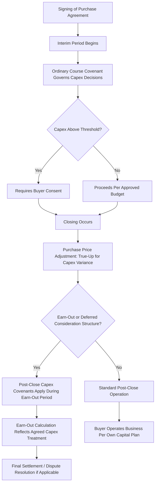

## Capital Expenditure Commitments in Transaction Agreements

### Overview

Capital expenditure commitments in transaction agreements are the contractual provisions governing how capex is treated before, at, and after the closing of an M&A transaction. These provisions address a fundamental timing problem inherent in any deal process: a gap typically exists between signing (when the purchase agreement is executed) and closing (when ownership actually transfers), and the target company continues operating — and potentially making capital decisions — throughout that period. Beyond the signing-to-closing gap, well-structured agreements also address post-closing capex-related obligations, particularly in earn-out structures, carve-out transactions, and seller-financed deals where capital spending directly affects deferred consideration calculations.

Poorly drafted or negotiated capex provisions can create significant post-close disputes, misaligned incentives during the interim period, or unintended constraints on the buyer's ability to operate the business as planned immediately after taking ownership.

### Key Contractual Mechanisms Addressing Capex

**Key Points**

- **Interim operating covenants** restrict the seller's ability to make (or avoid) capital decisions between signing and closing without buyer consent, protecting the buyer from value erosion or unexpected capital commitments during a period when it does not yet control the business.
- **Purchase price adjustment mechanisms** true up the final purchase price for capex-related variances between an estimated closing balance sheet and the actual closing balance sheet.
- **Representations and warranties** regarding capex-related matters (asset condition, absence of undisclosed capital commitments, compliance with capex-related regulatory requirements) allocate risk for the accuracy of information relied upon in valuation.
- **Earn-out and deferred consideration provisions** may explicitly address how post-close capex decisions affect the calculation of contingent payments, since capex timing can be manipulated to influence earn-out metrics.
- **Covenant and consent thresholds** define dollar levels above which specific capex decisions require counterparty approval during the interim period or, in minority investment structures, on an ongoing basis.

### Interim Period (Signing-to-Closing) Capex Covenants

#### Ordinary Course of Business Covenants

Most purchase agreements require the target to operate "in the ordinary course of business consistent with past practice" during the interim period, which typically extends to capex behavior:

- **Prohibition on capex outside ordinary course**: preventing the seller from initiating major new capital projects, canceling planned/budgeted capex, or materially deviating from the historical capex pattern without buyer consent.
- **Specific capex threshold covenants**: agreements frequently include an explicit dollar threshold (e.g., capex commitments exceeding $500,000 or $1 million individually, or in aggregate) above which seller must obtain buyer consent before proceeding.
- **Prohibition on deferring budgeted capex**: equally important is a covenant preventing the seller from *avoiding* previously planned/budgeted capex during the interim period purely to preserve cash or inflate the closing financial metrics — addressing the deferred capex risk discussed in the related diligence topic.

#### Sample Covenant Structure (Illustrative Language Pattern)

A typical interim covenant might be structured along these lines: *"Seller shall not, and shall cause the Company not to, make or commit to make any capital expenditure in excess of $[threshold] individually or $[aggregate threshold] in the aggregate, other than capital expenditures set forth in the capital budget attached as Schedule [X], without the prior written consent of Buyer, which consent shall not be unreasonably withheld."*

[Inference: exact drafting conventions, thresholds, and consent standards vary considerably by deal size, jurisdiction, and negotiating leverage between parties; the above illustrates a common structural pattern rather than a fixed standard.]

### Purchase Price Adjustment Mechanisms

- **Net working capital adjustments**: while primarily focused on working capital, these mechanisms sometimes interact with capex if capitalized costs are inconsistently classified between the estimated and actual closing balance sheets.
- **Capex-specific true-up provisions**: less common than working capital adjustments but used in some transactions, particularly where a specific known capital project is in progress at signing, to true-up the purchase price based on the actual percentage of completion or actual cost incurred by closing.
- **Debt-like item treatment**: in many agreements, identified deferred capex or capital backlog (see related diligence topic) is negotiated as a "debt-like item" that reduces the purchase price dollar-for-dollar at closing, rather than being addressed through ongoing covenants.

### Representations and Warranties Related to Capex

| Rep/Warranty Category | Typical Coverage |
| --- | --- |
| Asset condition/sufficiency | Assets are in good operating condition, ordinary wear and tear excepted, and sufficient for the conduct of the business as currently conducted |
| Capital commitments disclosure | No undisclosed material capital expenditure commitments or contractual obligations to make future capex beyond what is disclosed in a schedule |
| Compliance with capex-related regulations | Assets comply with applicable environmental, health, safety, and other regulatory requirements as of closing |
| No material adverse capex deferrals | No material capital expenditures have been deferred or canceled outside the ordinary course since a specified reference date |
| Capital budget accuracy | Disclosed capital budgets and forward capex plans were prepared in good faith and are not materially misleading |

These representations are typically backed by indemnification provisions, subject to negotiated caps, baskets/deductibles, and survival periods, and increasingly may be supplemented or replaced by representation and warranty (R&W) insurance in mid-market and larger transactions.

### Post-Closing Capex Provisions

#### Earn-Out Interactions

Where a transaction includes an earn-out or other contingent consideration tied to future financial performance, capex decisions made by the buyer post-close can directly influence the earn-out calculation — creating a potential conflict of interest, since the buyer (now controlling the business) has an incentive to either accelerate or defer capex depending on how it affects the metric determining the earn-out payment owed to the seller.

- **Capex covenants during the earn-out period**: agreements often include specific covenants requiring the buyer to operate the business in a manner consistent with past practice regarding capital investment during the earn-out measurement period, preventing the buyer from starving the business of necessary capex to suppress earn-out-triggering metrics.
- **Capex carve-outs from earn-out calculations**: some structures explicitly exclude the impact of buyer-directed capex decisions from the earn-out metric calculation, or require specific capex levels to be maintained as a condition of full earn-out entitlement.

#### Seller Financing and Transition Services

- In transactions involving seller notes or transition services agreements, capex-related covenants may extend into the post-close period to protect seller's financial interest in the ongoing business performance underlying the note.

#### Carve-Out Transaction Considerations

- In carve-out transactions (where a business unit is separated from a larger parent), capex agreements frequently address **transition capex** — investment required to establish standalone infrastructure (IT systems, facilities, equipment) previously shared with the parent — often allocated through a Transition Services Agreement (TSA) with defined capex responsibilities and cost-sharing arrangements during the transition period.

### Transaction Capex Provision Structure

### Worked Example

A strategic buyer is acquiring a manufacturing subsidiary via a stock purchase agreement, with a signing-to-closing gap of approximately four months pending regulatory approval, and a two-year earn-out tied to EBITDA performance.

**Interim period provisions negotiated**:

- A capex threshold covenant requiring seller consent from buyer for any individual capex commitment exceeding $750,000, or $2 million in the aggregate, outside the previously disclosed and buyer-reviewed capital budget for the interim period.
- A specific carve-out permitting the seller to complete an already-in-progress $3.5 million equipment installation project that was disclosed and diligenced prior to signing, with a corresponding purchase price adjustment mechanism to true up for the actual percentage of completion and cost incurred by closing (versus the estimate used in signing-date valuation).

**Earn-out period provisions negotiated**:

- A covenant requiring the buyer to maintain capex spending during the two-year earn-out period at no less than 90% of the historical average maintenance capex level (as defined and agreed in a schedule to the agreement), specifically to prevent the buyer from suppressing near-term investment to reduce EBITDA-based costs and thereby lower the earn-out payment owed to the seller.
- An explicit exclusion providing that any capex directed by the buyer toward integration synergies (e.g., consolidating the acquired facility's function into an existing buyer facility) will be excluded from the earn-out EBITDA calculation, isolating the seller's earn-out entitlement from buyer-driven strategic decisions unrelated to the acquired business's standalone performance.

**Outcome**: these provisions collectively protect the buyer from value erosion via uncontrolled interim capex, protect the seller's earn-out interest from post-close capex manipulation by the now-controlling buyer, and provide a clear mechanism for equitably allocating cost and value for the in-progress capital project spanning the closing date.

### Common Pitfalls

- **Vague "ordinary course" language without specific thresholds**: relying solely on general ordinary-course covenants without explicit dollar thresholds for capex commitments can create ambiguity and dispute risk during the interim period, since "ordinary course consistent with past practice" is inherently open to interpretation for capital decisions that don't recur on a predictable schedule.
- **Failing to address capex-related earn-out manipulation risk**: earn-out structures that do not explicitly address how post-close capex decisions interact with the earn-out metric create a structural conflict of interest that can lead to disputes or litigation.
- **Inconsistent capex treatment between interim covenants and purchase price adjustment mechanisms**: covenants restricting interim capex decisions should be drafted consistently with how any resulting variance is trued up in the purchase price adjustment, to avoid double-counting or gaps in coverage.
- **Insufficient specificity in capital budget schedules**: agreements that reference an attached "capital budget" without sufficient granularity can create disputes about whether a specific expenditure was contemplated and pre-approved or requires separate consent.
- **Overlooking carve-out transition capex allocation**: in carve-out deals, failing to clearly allocate responsibility and cost-sharing for standalone infrastructure capex between parent (seller) and the divested business (buyer) during the transition period is a common source of post-close dispute. [Inference: the prevalence of this specific pitfall is based on general M&A practice patterns rather than a specific empirical study.]

### Related Topics

- Capex diligence in mergers and acquisitions
- Deferred capex and underinvestment red flags
- Purchase price adjustment mechanisms and net working capital true-ups
- Earn-out structuring and contingent consideration design
- Representation and warranty (R&W) insurance in M&A transactions
- Transition Services Agreements (TSAs) in carve-out transactions
- Capex normalization in EBITDA add-back adjustments